# GovGASTWD

_Woodward™ gas turbine governor. _

_[Footnote: Woodward gas turbines are an example of suitable products available commercially. This information is given for the convenience of users of this document and does not constitute an endorsement by IEC of these products.]_

**URI**: [cim:GovGASTWD](http://iec.ch/TC57/CIM100#GovGASTWD) 
**Type**: Class

```mermaid
 classDiagram
    class GovGASTWD
    click GovGASTWD href "../GovGASTWD"
      TurbineGovernorDynamics <|-- GovGASTWD
        click TurbineGovernorDynamics href "../TurbineGovernorDynamics"
      
      GovGASTWD : GovGASTWD.a
        
      GovGASTWD : GovGASTWD.af1
        
          GovGASTWD --> PU : GovGASTWD.af1
          click PU href "../PU"
        
      GovGASTWD : GovGASTWD.af2
        
          GovGASTWD --> PU : GovGASTWD.af2
          click PU href "../PU"
        
      GovGASTWD : TurbineGovernorDynamics.AsynchronousMachineDynamics
        
          GovGASTWD --> AsynchronousMachineDynamics : TurbineGovernorDynamics.AsynchronousMachineDynamics
          click AsynchronousMachineDynamics href "../AsynchronousMachineDynamics"
        
      GovGASTWD : GovGASTWD.b
        
      GovGASTWD : GovGASTWD.bf1
        
          GovGASTWD --> PU : GovGASTWD.bf1
          click PU href "../PU"
        
      GovGASTWD : GovGASTWD.bf2
        
          GovGASTWD --> PU : GovGASTWD.bf2
          click PU href "../PU"
        
      GovGASTWD : GovGASTWD.c
        
      GovGASTWD : GovGASTWD.cf2
        
          GovGASTWD --> PU : GovGASTWD.cf2
          click PU href "../PU"
        
      GovGASTWD : IdentifiedObject.description
        
      GovGASTWD : GovGASTWD.ecr
        
          GovGASTWD --> Seconds : GovGASTWD.ecr
          click Seconds href "../Seconds"
        
      GovGASTWD : DynamicsFunctionBlock.enabled
        
      GovGASTWD : GovGASTWD.etd
        
          GovGASTWD --> Seconds : GovGASTWD.etd
          click Seconds href "../Seconds"
        
      GovGASTWD : GovGASTWD.k3
        
          GovGASTWD --> PU : GovGASTWD.k3
          click PU href "../PU"
        
      GovGASTWD : GovGASTWD.k4
        
          GovGASTWD --> PU : GovGASTWD.k4
          click PU href "../PU"
        
      GovGASTWD : GovGASTWD.k5
        
          GovGASTWD --> PU : GovGASTWD.k5
          click PU href "../PU"
        
      GovGASTWD : GovGASTWD.k6
        
          GovGASTWD --> PU : GovGASTWD.k6
          click PU href "../PU"
        
      GovGASTWD : GovGASTWD.kd
        
          GovGASTWD --> PU : GovGASTWD.kd
          click PU href "../PU"
        
      GovGASTWD : GovGASTWD.kdroop
        
          GovGASTWD --> PU : GovGASTWD.kdroop
          click PU href "../PU"
        
      GovGASTWD : GovGASTWD.kf
        
          GovGASTWD --> PU : GovGASTWD.kf
          click PU href "../PU"
        
      GovGASTWD : GovGASTWD.ki
        
          GovGASTWD --> PU : GovGASTWD.ki
          click PU href "../PU"
        
      GovGASTWD : GovGASTWD.kp
        
          GovGASTWD --> PU : GovGASTWD.kp
          click PU href "../PU"
        
      GovGASTWD : IdentifiedObject.mRID
        
      GovGASTWD : GovGASTWD.mwbase
        
          GovGASTWD --> ActivePower : GovGASTWD.mwbase
          click ActivePower href "../ActivePower"
        
      GovGASTWD : IdentifiedObject.name
        
      GovGASTWD : TurbineGovernorDynamics.SynchronousMachineDynamics
        
          GovGASTWD --> SynchronousMachineDynamics : TurbineGovernorDynamics.SynchronousMachineDynamics
          click SynchronousMachineDynamics href "../SynchronousMachineDynamics"
        
      GovGASTWD : GovGASTWD.t
        
          GovGASTWD --> Seconds : GovGASTWD.t
          click Seconds href "../Seconds"
        
      GovGASTWD : GovGASTWD.t3
        
          GovGASTWD --> Seconds : GovGASTWD.t3
          click Seconds href "../Seconds"
        
      GovGASTWD : GovGASTWD.t4
        
          GovGASTWD --> Seconds : GovGASTWD.t4
          click Seconds href "../Seconds"
        
      GovGASTWD : GovGASTWD.t5
        
          GovGASTWD --> Seconds : GovGASTWD.t5
          click Seconds href "../Seconds"
        
      GovGASTWD : GovGASTWD.tc
        
          GovGASTWD --> Temperature : GovGASTWD.tc
          click Temperature href "../Temperature"
        
      GovGASTWD : GovGASTWD.tcd
        
          GovGASTWD --> Seconds : GovGASTWD.tcd
          click Seconds href "../Seconds"
        
      GovGASTWD : GovGASTWD.td
        
          GovGASTWD --> Seconds : GovGASTWD.td
          click Seconds href "../Seconds"
        
      GovGASTWD : GovGASTWD.tf
        
          GovGASTWD --> Seconds : GovGASTWD.tf
          click Seconds href "../Seconds"
        
      GovGASTWD : GovGASTWD.tmax
        
          GovGASTWD --> PU : GovGASTWD.tmax
          click PU href "../PU"
        
      GovGASTWD : GovGASTWD.tmin
        
          GovGASTWD --> PU : GovGASTWD.tmin
          click PU href "../PU"
        
      GovGASTWD : GovGASTWD.tr
        
          GovGASTWD --> Temperature : GovGASTWD.tr
          click Temperature href "../Temperature"
        
      GovGASTWD : GovGASTWD.trate
        
          GovGASTWD --> ActivePower : GovGASTWD.trate
          click ActivePower href "../ActivePower"
        
      GovGASTWD : GovGASTWD.tt
        
          GovGASTWD --> Seconds : GovGASTWD.tt
          click Seconds href "../Seconds"
        
      GovGASTWD : TurbineGovernorDynamics.TurbineLoadControllerDynamics
        
          GovGASTWD --> TurbineLoadControllerDynamics : TurbineGovernorDynamics.TurbineLoadControllerDynamics
          click TurbineLoadControllerDynamics href "../TurbineLoadControllerDynamics"
        
      
```

## Inheritance
* [IdentifiedObject](IdentifiedObject.md)
    * [DynamicsFunctionBlock](DynamicsFunctionBlock.md)
        * [TurbineGovernorDynamics](TurbineGovernorDynamics.md)
            * **GovGASTWD**

## Attributes

| Name | URI | Cardinality and Range | Description | Inheritance |
| ---  | --- | --- | --- | --- |
| mwbase | [cim:GovGASTWD.mwbase](http://iec.ch/TC57/CIM100#GovGASTWD.mwbase) | 1    [ActivePower](ActivePower.md)  | Base for power values (<i>MWbase</i>) (&gt; 0) | direct |
| kdroop | [cim:GovGASTWD.kdroop](http://iec.ch/TC57/CIM100#GovGASTWD.kdroop) | 1    [PU](PU.md)  | (<i>Kdroop</i>) (&gt;= 0) | direct |
| kp | [cim:GovGASTWD.kp](http://iec.ch/TC57/CIM100#GovGASTWD.kp) | 1    [PU](PU.md)  | PID proportional gain (<i>Kp</i>) | direct |
| ki | [cim:GovGASTWD.ki](http://iec.ch/TC57/CIM100#GovGASTWD.ki) | 1    [PU](PU.md)  | Isochronous Governor Gain (<i>Ki</i>) | direct |
| kd | [cim:GovGASTWD.kd](http://iec.ch/TC57/CIM100#GovGASTWD.kd) | 1    [PU](PU.md)  | Drop governor gain (<i>Kd</i>) | direct |
| etd | [cim:GovGASTWD.etd](http://iec.ch/TC57/CIM100#GovGASTWD.etd) | 1    [Seconds](Seconds.md)  | Turbine and exhaust delay (<i>Etd</i>) (&gt;= 0) | direct |
| tcd | [cim:GovGASTWD.tcd](http://iec.ch/TC57/CIM100#GovGASTWD.tcd) | 1    [Seconds](Seconds.md)  | Compressor discharge time constant (<i>Tcd</i>) (&gt;= 0) | direct |
| trate | [cim:GovGASTWD.trate](http://iec.ch/TC57/CIM100#GovGASTWD.trate) | 1    [ActivePower](ActivePower.md)  | Turbine rating (<i>Trate</i>) | direct |
| t | [cim:GovGASTWD.t](http://iec.ch/TC57/CIM100#GovGASTWD.t) | 1    [Seconds](Seconds.md)  | Fuel control time constant (<i>T</i>) (&gt;= 0) | direct |
| tmax | [cim:GovGASTWD.tmax](http://iec.ch/TC57/CIM100#GovGASTWD.tmax) | 1    [PU](PU.md)  | Maximum Turbine limit (<i>Tmax</i>) (&gt; GovGASTWD | direct |
| tmin | [cim:GovGASTWD.tmin](http://iec.ch/TC57/CIM100#GovGASTWD.tmin) | 1    [PU](PU.md)  | Minimum turbine limit (<i>Tmin</i>) (&lt; GovGASTWD | direct |
| ecr | [cim:GovGASTWD.ecr](http://iec.ch/TC57/CIM100#GovGASTWD.ecr) | 1    [Seconds](Seconds.md)  | Combustion reaction time delay (<i>Ecr</i>) (&gt;= 0) | direct |
| k3 | [cim:GovGASTWD.k3](http://iec.ch/TC57/CIM100#GovGASTWD.k3) | 1    [PU](PU.md)  | Ratio of fuel adjustment (<i>K3</i>) | direct |
| a | [cim:GovGASTWD.a](http://iec.ch/TC57/CIM100#GovGASTWD.a) | 1    float  | Valve positioner (<i>A</i>) | direct |
| b | [cim:GovGASTWD.b](http://iec.ch/TC57/CIM100#GovGASTWD.b) | 1    float  | Valve positioner (<i>B</i>) | direct |
| c | [cim:GovGASTWD.c](http://iec.ch/TC57/CIM100#GovGASTWD.c) | 1    float  | Valve positioner (<i>C</i>) | direct |
| tf | [cim:GovGASTWD.tf](http://iec.ch/TC57/CIM100#GovGASTWD.tf) | 1    [Seconds](Seconds.md)  | Fuel system time constant (<i>Tf</i>) (&gt;= 0) | direct |
| kf | [cim:GovGASTWD.kf](http://iec.ch/TC57/CIM100#GovGASTWD.kf) | 1    [PU](PU.md)  | Fuel system feedback (<i>Kf</i>) | direct |
| k5 | [cim:GovGASTWD.k5](http://iec.ch/TC57/CIM100#GovGASTWD.k5) | 1    [PU](PU.md)  | Gain of radiation shield (<i>K5</i>) | direct |
| k4 | [cim:GovGASTWD.k4](http://iec.ch/TC57/CIM100#GovGASTWD.k4) | 1    [PU](PU.md)  | Gain of radiation shield (<i>K4</i>) | direct |
| t3 | [cim:GovGASTWD.t3](http://iec.ch/TC57/CIM100#GovGASTWD.t3) | 1    [Seconds](Seconds.md)  | Radiation shield time constant (<i>T3</i>) (&gt;= 0) | direct |
| t4 | [cim:GovGASTWD.t4](http://iec.ch/TC57/CIM100#GovGASTWD.t4) | 1    [Seconds](Seconds.md)  | Thermocouple time constant (<i>T4</i>) (&gt;= 0) | direct |
| tt | [cim:GovGASTWD.tt](http://iec.ch/TC57/CIM100#GovGASTWD.tt) | 1    [Seconds](Seconds.md)  | Temperature controller integration rate (<i>Tt</i>) (&gt;= 0) | direct |
| t5 | [cim:GovGASTWD.t5](http://iec.ch/TC57/CIM100#GovGASTWD.t5) | 1    [Seconds](Seconds.md)  | Temperature control time constant (<i>T5</i>) (&gt;= 0) | direct |
| af1 | [cim:GovGASTWD.af1](http://iec.ch/TC57/CIM100#GovGASTWD.af1) | 1    [PU](PU.md)  | Exhaust temperature parameter (<i>Af1</i>) | direct |
| bf1 | [cim:GovGASTWD.bf1](http://iec.ch/TC57/CIM100#GovGASTWD.bf1) | 1    [PU](PU.md)  | (<i>Bf1</i>) | direct |
| af2 | [cim:GovGASTWD.af2](http://iec.ch/TC57/CIM100#GovGASTWD.af2) | 1    [PU](PU.md)  | Coefficient equal to 0,5(1-speed) (<i>Af2</i>) | direct |
| bf2 | [cim:GovGASTWD.bf2](http://iec.ch/TC57/CIM100#GovGASTWD.bf2) | 1    [PU](PU.md)  | Turbine torque coefficient Khhv (depends on heating value of fuel ... | direct |
| cf2 | [cim:GovGASTWD.cf2](http://iec.ch/TC57/CIM100#GovGASTWD.cf2) | 1    [PU](PU.md)  | Coefficient defining fuel flow where power output is 0 % (<i>Cf2</i>) | direct |
| tr | [cim:GovGASTWD.tr](http://iec.ch/TC57/CIM100#GovGASTWD.tr) | 1    [Temperature](Temperature.md)  | Rated temperature (<i>Tr</i>) | direct |
| k6 | [cim:GovGASTWD.k6](http://iec.ch/TC57/CIM100#GovGASTWD.k6) | 1    [PU](PU.md)  | Minimum fuel flow (<i>K6</i>) | direct |
| tc | [cim:GovGASTWD.tc](http://iec.ch/TC57/CIM100#GovGASTWD.tc) | 1    [Temperature](Temperature.md)  | Temperature control (<i>Tc</i>) | direct |
| td | [cim:GovGASTWD.td](http://iec.ch/TC57/CIM100#GovGASTWD.td) | 1    [Seconds](Seconds.md)  | Power transducer time constant (<i>Td</i>) (&gt;= 0) | direct |
| SynchronousMachineDynamics | [cim:TurbineGovernorDynamics.SynchronousMachineDynamics](http://iec.ch/TC57/CIM100#TurbineGovernorDynamics.SynchronousMachineDynamics) | 0..1    [SynchronousMachineDynamics](SynchronousMachineDynamics.md)  | Synchronous machine model with which this turbine-governor model is associate... | [TurbineGovernorDynamics](TurbineGovernorDynamics.md) |
| AsynchronousMachineDynamics | [cim:TurbineGovernorDynamics.AsynchronousMachineDynamics](http://iec.ch/TC57/CIM100#TurbineGovernorDynamics.AsynchronousMachineDynamics) | 0..1    [AsynchronousMachineDynamics](AsynchronousMachineDynamics.md)  | Asynchronous machine model with which this turbine-governor model is associat... | [TurbineGovernorDynamics](TurbineGovernorDynamics.md) |
| TurbineLoadControllerDynamics | [cim:TurbineGovernorDynamics.TurbineLoadControllerDynamics](http://iec.ch/TC57/CIM100#TurbineGovernorDynamics.TurbineLoadControllerDynamics) | 0..1    [TurbineLoadControllerDynamics](TurbineLoadControllerDynamics.md)  | Turbine load controller providing input to this turbine-governor | [TurbineGovernorDynamics](TurbineGovernorDynamics.md) |
| enabled | [cim:DynamicsFunctionBlock.enabled](http://iec.ch/TC57/CIM100#DynamicsFunctionBlock.enabled) | 1    boolean  | Function block used indicator | [DynamicsFunctionBlock](DynamicsFunctionBlock.md) |
| description | [cim:IdentifiedObject.description](http://iec.ch/TC57/CIM100#IdentifiedObject.description) | 0..1    string  | The description is a free human readable text describing or naming the object | [IdentifiedObject](IdentifiedObject.md) |
| mRID | [cim:IdentifiedObject.mRID](http://iec.ch/TC57/CIM100#IdentifiedObject.mRID) | 1    string  | Master resource identifier issued by a model authority | [IdentifiedObject](IdentifiedObject.md) |
| name | [cim:IdentifiedObject.name](http://iec.ch/TC57/CIM100#IdentifiedObject.name) | 0..1    string  | The name is any free human readable and possibly non unique text naming the o... | [IdentifiedObject](IdentifiedObject.md) |

## Identifier and Mapping Information

### Schema Source

* from schema: http://iec.ch/TC57/ns/CIM/Dynamics-EU#Package_DynamicsProfile

## Mappings

| Mapping Type | Mapped Value |
| ---  | ---  |
| self | cim:GovGASTWD |
| native | this:GovGASTWD |

