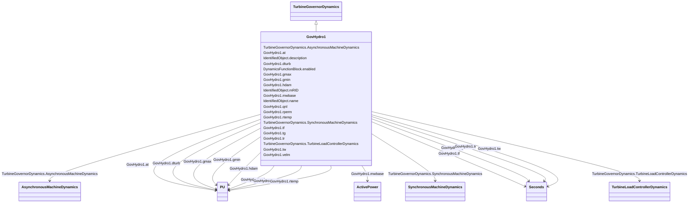

# GovHydro1

_Basic hydro turbine governor._

**URI**: [cim:GovHydro1](http://iec.ch/TC57/CIM100#GovHydro1) 
**Type**: Class

## Inheritance
* [IdentifiedObject](IdentifiedObject.md)
    * [DynamicsFunctionBlock](DynamicsFunctionBlock.md)
        * [TurbineGovernorDynamics](TurbineGovernorDynamics.md)
            * **GovHydro1**

## Attributes

| Name | URI | Cardinality and Range | Description | Inheritance |
| ---  | --- | --- | --- | --- |
| mwbase | [cim:GovHydro1.mwbase](http://iec.ch/TC57/CIM100#GovHydro1.mwbase) | 1..1    [ActivePower](ActivePower.md)  | Base for power values (<i>MWbase</i>) (&gt; 0) | direct |
| rperm | [cim:GovHydro1.rperm](http://iec.ch/TC57/CIM100#GovHydro1.rperm) | 1..1    [PU](PU.md)  | Permanent droop (<i>R</i>) (&gt; 0) | direct |
| rtemp | [cim:GovHydro1.rtemp](http://iec.ch/TC57/CIM100#GovHydro1.rtemp) | 1..1    [PU](PU.md)  | Temporary droop (<i>r</i>) (&gt; GovHydro1 | direct |
| tr | [cim:GovHydro1.tr](http://iec.ch/TC57/CIM100#GovHydro1.tr) | 1..1    [Seconds](Seconds.md)  | Washout time constant (<i>Tr</i>) (&gt; 0) | direct |
| tf | [cim:GovHydro1.tf](http://iec.ch/TC57/CIM100#GovHydro1.tf) | 1..1    [Seconds](Seconds.md)  | Filter time constant (<i>Tf</i>) (&gt; 0) | direct |
| tg | [cim:GovHydro1.tg](http://iec.ch/TC57/CIM100#GovHydro1.tg) | 1..1    [Seconds](Seconds.md)  | Gate servo time constant (<i>Tg</i>) (&gt; 0) | direct |
| velm | [cim:GovHydro1.velm](http://iec.ch/TC57/CIM100#GovHydro1.velm) | 1..1    float  | Maximum gate velocity (<i>Vlem</i>) (&gt; 0) | direct |
| gmax | [cim:GovHydro1.gmax](http://iec.ch/TC57/CIM100#GovHydro1.gmax) | 1..1    [PU](PU.md)  | Maximum gate opening (<i>Gmax</i>) (&gt; 0 and &gt; GovHydro | direct |
| gmin | [cim:GovHydro1.gmin](http://iec.ch/TC57/CIM100#GovHydro1.gmin) | 1..1    [PU](PU.md)  | Minimum gate opening (<i>Gmin</i>) (&gt;= 0 and &lt; GovHydro1 | direct |
| tw | [cim:GovHydro1.tw](http://iec.ch/TC57/CIM100#GovHydro1.tw) | 1..1    [Seconds](Seconds.md)  | Water inertia time constant (<i>Tw</i>) (&gt; 0) | direct |
| at | [cim:GovHydro1.at](http://iec.ch/TC57/CIM100#GovHydro1.at) | 1..1    [PU](PU.md)  | Turbine gain (<i>At</i>) (&gt; 0) | direct |
| dturb | [cim:GovHydro1.dturb](http://iec.ch/TC57/CIM100#GovHydro1.dturb) | 1..1    [PU](PU.md)  | Turbine damping factor (<i>Dturb</i>) (&gt;= 0) | direct |
| qnl | [cim:GovHydro1.qnl](http://iec.ch/TC57/CIM100#GovHydro1.qnl) | 1..1    [PU](PU.md)  | No-load flow at nominal head (<i>qnl</i>) (&gt;= 0) | direct |
| hdam | [cim:GovHydro1.hdam](http://iec.ch/TC57/CIM100#GovHydro1.hdam) | 1..1    [PU](PU.md)  | Turbine nominal head (<i>hdam</i>) | direct |
| SynchronousMachineDynamics | [cim:TurbineGovernorDynamics.SynchronousMachineDynamics](http://iec.ch/TC57/CIM100#TurbineGovernorDynamics.SynchronousMachineDynamics) | 0..1    [SynchronousMachineDynamics](SynchronousMachineDynamics.md)  | Synchronous machine model with which this turbine-governor model is associate... | [TurbineGovernorDynamics](TurbineGovernorDynamics.md) |
| AsynchronousMachineDynamics | [cim:TurbineGovernorDynamics.AsynchronousMachineDynamics](http://iec.ch/TC57/CIM100#TurbineGovernorDynamics.AsynchronousMachineDynamics) | 0..1    [AsynchronousMachineDynamics](AsynchronousMachineDynamics.md)  | Asynchronous machine model with which this turbine-governor model is associat... | [TurbineGovernorDynamics](TurbineGovernorDynamics.md) |
| TurbineLoadControllerDynamics | [cim:TurbineGovernorDynamics.TurbineLoadControllerDynamics](http://iec.ch/TC57/CIM100#TurbineGovernorDynamics.TurbineLoadControllerDynamics) | 0..1    [TurbineLoadControllerDynamics](TurbineLoadControllerDynamics.md)  | Turbine load controller providing input to this turbine-governor | [TurbineGovernorDynamics](TurbineGovernorDynamics.md) |
| enabled | [cim:DynamicsFunctionBlock.enabled](http://iec.ch/TC57/CIM100#DynamicsFunctionBlock.enabled) | 1..1    boolean  | Function block used indicator | [DynamicsFunctionBlock](DynamicsFunctionBlock.md) |
| description | [cim:IdentifiedObject.description](http://iec.ch/TC57/CIM100#IdentifiedObject.description) | 0..1    string  | The description is a free human readable text describing or naming the object | [IdentifiedObject](IdentifiedObject.md) |
| mRID | [cim:IdentifiedObject.mRID](http://iec.ch/TC57/CIM100#IdentifiedObject.mRID) | 1..1    string  | Master resource identifier issued by a model authority | [IdentifiedObject](IdentifiedObject.md) |
| name | [cim:IdentifiedObject.name](http://iec.ch/TC57/CIM100#IdentifiedObject.name) | 0..1    string  | The name is any free human readable and possibly non unique text naming the o... | [IdentifiedObject](IdentifiedObject.md) |

## Identifier and Mapping Information

### Schema Source

* from schema: http://iec.ch/TC57/ns/CIM/Dynamics-EU#Package_DynamicsProfile

## Mappings

| Mapping Type | Mapped Value |
| ---  | ---  |
| self | cim:GovHydro1 |
| native | this:GovHydro1 |

