# GovHydro3

_Modified IEEE hydro governor-turbine. This model differs from that defined in the IEEE modelling guideline paper in that the limits on gate position and velocity do not permit "wind up" of the upstream signals._

**URI**: [cim:GovHydro3](http://iec.ch/TC57/CIM100#GovHydro3) 
**Type**: Class

```mermaid
 classDiagram
    class GovHydro3
      TurbineGovernorDynamics <|-- GovHydro3
      
      GovHydro3 : TurbineGovernorDynamics.AsynchronousMachineDynamics
        
          GovHydro3 --> AsynchronousMachineDynamics : TurbineGovernorDynamics.AsynchronousMachineDynamics
        
      GovHydro3 : GovHydro3.at
        
          GovHydro3 --> PU : GovHydro3.at
        
      GovHydro3 : GovHydro3.db1
        
          GovHydro3 --> Frequency : GovHydro3.db1
        
      GovHydro3 : GovHydro3.db2
        
          GovHydro3 --> ActivePower : GovHydro3.db2
        
      GovHydro3 : IdentifiedObject.description
        
      GovHydro3 : GovHydro3.dturb
        
          GovHydro3 --> PU : GovHydro3.dturb
        
      GovHydro3 : DynamicsFunctionBlock.enabled
        
      GovHydro3 : GovHydro3.eps
        
          GovHydro3 --> Frequency : GovHydro3.eps
        
      GovHydro3 : GovHydro3.governorControl
        
      GovHydro3 : GovHydro3.gv1
        
          GovHydro3 --> PU : GovHydro3.gv1
        
      GovHydro3 : GovHydro3.gv2
        
          GovHydro3 --> PU : GovHydro3.gv2
        
      GovHydro3 : GovHydro3.gv3
        
          GovHydro3 --> PU : GovHydro3.gv3
        
      GovHydro3 : GovHydro3.gv4
        
          GovHydro3 --> PU : GovHydro3.gv4
        
      GovHydro3 : GovHydro3.gv5
        
          GovHydro3 --> PU : GovHydro3.gv5
        
      GovHydro3 : GovHydro3.gv6
        
          GovHydro3 --> PU : GovHydro3.gv6
        
      GovHydro3 : GovHydro3.h0
        
          GovHydro3 --> PU : GovHydro3.h0
        
      GovHydro3 : GovHydro3.k1
        
          GovHydro3 --> PU : GovHydro3.k1
        
      GovHydro3 : GovHydro3.k2
        
          GovHydro3 --> PU : GovHydro3.k2
        
      GovHydro3 : GovHydro3.kg
        
          GovHydro3 --> PU : GovHydro3.kg
        
      GovHydro3 : GovHydro3.ki
        
          GovHydro3 --> PU : GovHydro3.ki
        
      GovHydro3 : IdentifiedObject.mRID
        
      GovHydro3 : GovHydro3.mwbase
        
          GovHydro3 --> ActivePower : GovHydro3.mwbase
        
      GovHydro3 : IdentifiedObject.name
        
      GovHydro3 : GovHydro3.pgv1
        
          GovHydro3 --> PU : GovHydro3.pgv1
        
      GovHydro3 : GovHydro3.pgv2
        
          GovHydro3 --> PU : GovHydro3.pgv2
        
      GovHydro3 : GovHydro3.pgv3
        
          GovHydro3 --> PU : GovHydro3.pgv3
        
      GovHydro3 : GovHydro3.pgv4
        
          GovHydro3 --> PU : GovHydro3.pgv4
        
      GovHydro3 : GovHydro3.pgv5
        
          GovHydro3 --> PU : GovHydro3.pgv5
        
      GovHydro3 : GovHydro3.pgv6
        
          GovHydro3 --> PU : GovHydro3.pgv6
        
      GovHydro3 : GovHydro3.pmax
        
          GovHydro3 --> PU : GovHydro3.pmax
        
      GovHydro3 : GovHydro3.pmin
        
          GovHydro3 --> PU : GovHydro3.pmin
        
      GovHydro3 : GovHydro3.qnl
        
          GovHydro3 --> PU : GovHydro3.qnl
        
      GovHydro3 : GovHydro3.relec
        
          GovHydro3 --> PU : GovHydro3.relec
        
      GovHydro3 : GovHydro3.rgate
        
          GovHydro3 --> PU : GovHydro3.rgate
        
      GovHydro3 : TurbineGovernorDynamics.SynchronousMachineDynamics
        
          GovHydro3 --> SynchronousMachineDynamics : TurbineGovernorDynamics.SynchronousMachineDynamics
        
      GovHydro3 : GovHydro3.td
        
          GovHydro3 --> Seconds : GovHydro3.td
        
      GovHydro3 : GovHydro3.tf
        
          GovHydro3 --> Seconds : GovHydro3.tf
        
      GovHydro3 : GovHydro3.tp
        
          GovHydro3 --> Seconds : GovHydro3.tp
        
      GovHydro3 : GovHydro3.tt
        
          GovHydro3 --> Seconds : GovHydro3.tt
        
      GovHydro3 : TurbineGovernorDynamics.TurbineLoadControllerDynamics
        
          GovHydro3 --> TurbineLoadControllerDynamics : TurbineGovernorDynamics.TurbineLoadControllerDynamics
        
      GovHydro3 : GovHydro3.tw
        
          GovHydro3 --> Seconds : GovHydro3.tw
        
      GovHydro3 : GovHydro3.velcl
        
      GovHydro3 : GovHydro3.velop
        
      
```

## Inheritance
* [IdentifiedObject](IdentifiedObject.md)
    * [DynamicsFunctionBlock](DynamicsFunctionBlock.md)
        * [TurbineGovernorDynamics](TurbineGovernorDynamics.md)
            * **GovHydro3**

## Attributes

| Name | URI | Cardinality and Range | Description | Inheritance |
| ---  | --- | --- | --- | --- |
| mwbase | [cim:GovHydro3.mwbase](http://iec.ch/TC57/CIM100#GovHydro3.mwbase) | 1..1    [ActivePower](ActivePower.md)  | Base for power values (<i>MWbase</i>) (&gt; 0) | direct |
| pmax | [cim:GovHydro3.pmax](http://iec.ch/TC57/CIM100#GovHydro3.pmax) | 1..1    [PU](PU.md)  | Maximum gate opening, PU of MWbase (<i>Pmax</i>) (&gt; GovHydro3 | direct |
| pmin | [cim:GovHydro3.pmin](http://iec.ch/TC57/CIM100#GovHydro3.pmin) | 1..1    [PU](PU.md)  | Minimum gate opening, PU of <i>MWbase</i> (<i>Pmin</i>) (&lt; GovHydro3 | direct |
| governorControl | [cim:GovHydro3.governorControl](http://iec.ch/TC57/CIM100#GovHydro3.governorControl) | 1..1    boolean  | Governor control flag (<i>Cflag</i>) | direct |
| rgate | [cim:GovHydro3.rgate](http://iec.ch/TC57/CIM100#GovHydro3.rgate) | 1..1    [PU](PU.md)  | Steady-state droop, PU, for governor output feedback (<i>Rgate</i>) | direct |
| relec | [cim:GovHydro3.relec](http://iec.ch/TC57/CIM100#GovHydro3.relec) | 1..1    [PU](PU.md)  | Steady-state droop, PU, for electrical power feedback (<i>Relec</i>) | direct |
| td | [cim:GovHydro3.td](http://iec.ch/TC57/CIM100#GovHydro3.td) | 1..1    [Seconds](Seconds.md)  | Input filter time constant (<i>Td</i>) (&gt;= 0) | direct |
| tf | [cim:GovHydro3.tf](http://iec.ch/TC57/CIM100#GovHydro3.tf) | 1..1    [Seconds](Seconds.md)  | Washout time constant (<i>Tf</i>) (&gt;= 0) | direct |
| tp | [cim:GovHydro3.tp](http://iec.ch/TC57/CIM100#GovHydro3.tp) | 1..1    [Seconds](Seconds.md)  | Gate servo time constant (<i>Tp</i>) (&gt;= 0) | direct |
| velop | [cim:GovHydro3.velop](http://iec.ch/TC57/CIM100#GovHydro3.velop) | 1..1    float  | Maximum gate opening velocity (<i>Velop</i>) | direct |
| velcl | [cim:GovHydro3.velcl](http://iec.ch/TC57/CIM100#GovHydro3.velcl) | 1..1    float  | Maximum gate closing velocity (<i>Velcl</i>) | direct |
| k1 | [cim:GovHydro3.k1](http://iec.ch/TC57/CIM100#GovHydro3.k1) | 1..1    [PU](PU.md)  | Derivative gain (<i>K1</i>) | direct |
| k2 | [cim:GovHydro3.k2](http://iec.ch/TC57/CIM100#GovHydro3.k2) | 1..1    [PU](PU.md)  | Double derivative gain, if <i>Cflag</i> = -1 (<i>K2</i>) | direct |
| ki | [cim:GovHydro3.ki](http://iec.ch/TC57/CIM100#GovHydro3.ki) | 1..1    [PU](PU.md)  | Integral gain (<i>Ki</i>) | direct |
| kg | [cim:GovHydro3.kg](http://iec.ch/TC57/CIM100#GovHydro3.kg) | 1..1    [PU](PU.md)  | Gate servo gain (<i>Kg</i>) | direct |
| tt | [cim:GovHydro3.tt](http://iec.ch/TC57/CIM100#GovHydro3.tt) | 1..1    [Seconds](Seconds.md)  | Power feedback time constant (<i>Tt</i>) (&gt;= 0) | direct |
| db1 | [cim:GovHydro3.db1](http://iec.ch/TC57/CIM100#GovHydro3.db1) | 1..1    [Frequency](Frequency.md)  | Intentional dead-band width (<i>db1</i>) | direct |
| eps | [cim:GovHydro3.eps](http://iec.ch/TC57/CIM100#GovHydro3.eps) | 1..1    [Frequency](Frequency.md)  | Intentional db hysteresis (<i>eps</i>) | direct |
| db2 | [cim:GovHydro3.db2](http://iec.ch/TC57/CIM100#GovHydro3.db2) | 1..1    [ActivePower](ActivePower.md)  | Unintentional dead-band (<i>db2</i>) | direct |
| tw | [cim:GovHydro3.tw](http://iec.ch/TC57/CIM100#GovHydro3.tw) | 1..1    [Seconds](Seconds.md)  | Water inertia time constant (<i>Tw</i>) (&gt;= 0) | direct |
| at | [cim:GovHydro3.at](http://iec.ch/TC57/CIM100#GovHydro3.at) | 1..1    [PU](PU.md)  | Turbine gain (<i>At</i>) (&gt;0) | direct |
| dturb | [cim:GovHydro3.dturb](http://iec.ch/TC57/CIM100#GovHydro3.dturb) | 1..1    [PU](PU.md)  | Turbine damping factor (<i>Dturb</i>) | direct |
| qnl | [cim:GovHydro3.qnl](http://iec.ch/TC57/CIM100#GovHydro3.qnl) | 1..1    [PU](PU.md)  | No-load turbine flow at nominal head (<i>Qnl</i>) | direct |
| h0 | [cim:GovHydro3.h0](http://iec.ch/TC57/CIM100#GovHydro3.h0) | 1..1    [PU](PU.md)  | Turbine nominal head (<i>H0</i>) | direct |
| gv1 | [cim:GovHydro3.gv1](http://iec.ch/TC57/CIM100#GovHydro3.gv1) | 1..1    [PU](PU.md)  | Nonlinear gain point 1, PU gv (<i>Gv1</i>) | direct |
| pgv1 | [cim:GovHydro3.pgv1](http://iec.ch/TC57/CIM100#GovHydro3.pgv1) | 1..1    [PU](PU.md)  | Nonlinear gain point 1, PU power (<i>Pgv1</i>) | direct |
| gv2 | [cim:GovHydro3.gv2](http://iec.ch/TC57/CIM100#GovHydro3.gv2) | 1..1    [PU](PU.md)  | Nonlinear gain point 2, PU gv (<i>Gv2</i>) | direct |
| pgv2 | [cim:GovHydro3.pgv2](http://iec.ch/TC57/CIM100#GovHydro3.pgv2) | 1..1    [PU](PU.md)  | Nonlinear gain point 2, PU power (<i>Pgv2</i>) | direct |
| gv3 | [cim:GovHydro3.gv3](http://iec.ch/TC57/CIM100#GovHydro3.gv3) | 1..1    [PU](PU.md)  | Nonlinear gain point 3, PU gv (<i>Gv3</i>) | direct |
| pgv3 | [cim:GovHydro3.pgv3](http://iec.ch/TC57/CIM100#GovHydro3.pgv3) | 1..1    [PU](PU.md)  | Nonlinear gain point 3, PU power (<i>Pgv3</i>) | direct |
| gv4 | [cim:GovHydro3.gv4](http://iec.ch/TC57/CIM100#GovHydro3.gv4) | 1..1    [PU](PU.md)  | Nonlinear gain point 4, PU gv (<i>Gv4</i>) | direct |
| pgv4 | [cim:GovHydro3.pgv4](http://iec.ch/TC57/CIM100#GovHydro3.pgv4) | 1..1    [PU](PU.md)  | Nonlinear gain point 4, PU power (<i>Pgv4</i>) | direct |
| gv5 | [cim:GovHydro3.gv5](http://iec.ch/TC57/CIM100#GovHydro3.gv5) | 1..1    [PU](PU.md)  | Nonlinear gain point 5, PU gv (<i>Gv5</i>) | direct |
| pgv5 | [cim:GovHydro3.pgv5](http://iec.ch/TC57/CIM100#GovHydro3.pgv5) | 1..1    [PU](PU.md)  | Nonlinear gain point 5, PU power (<i>Pgv5</i>) | direct |
| gv6 | [cim:GovHydro3.gv6](http://iec.ch/TC57/CIM100#GovHydro3.gv6) | 1..1    [PU](PU.md)  | Nonlinear gain point 6, PU gv (<i>Gv6</i>) | direct |
| pgv6 | [cim:GovHydro3.pgv6](http://iec.ch/TC57/CIM100#GovHydro3.pgv6) | 1..1    [PU](PU.md)  | Nonlinear gain point 6, PU power (<i>Pgv6</i>) | direct |
| SynchronousMachineDynamics | [cim:TurbineGovernorDynamics.SynchronousMachineDynamics](http://iec.ch/TC57/CIM100#TurbineGovernorDynamics.SynchronousMachineDynamics) | 0..1    [SynchronousMachineDynamics](SynchronousMachineDynamics.md)  | Synchronous machine model with which this turbine-governor model is associate... | [TurbineGovernorDynamics](TurbineGovernorDynamics.md) |
| AsynchronousMachineDynamics | [cim:TurbineGovernorDynamics.AsynchronousMachineDynamics](http://iec.ch/TC57/CIM100#TurbineGovernorDynamics.AsynchronousMachineDynamics) | 0..1    [AsynchronousMachineDynamics](AsynchronousMachineDynamics.md)  | Asynchronous machine model with which this turbine-governor model is associat... | [TurbineGovernorDynamics](TurbineGovernorDynamics.md) |
| TurbineLoadControllerDynamics | [cim:TurbineGovernorDynamics.TurbineLoadControllerDynamics](http://iec.ch/TC57/CIM100#TurbineGovernorDynamics.TurbineLoadControllerDynamics) | 0..1    [TurbineLoadControllerDynamics](TurbineLoadControllerDynamics.md)  | Turbine load controller providing input to this turbine-governor | [TurbineGovernorDynamics](TurbineGovernorDynamics.md) |
| enabled | [cim:DynamicsFunctionBlock.enabled](http://iec.ch/TC57/CIM100#DynamicsFunctionBlock.enabled) | 1..1    boolean  | Function block used indicator | [DynamicsFunctionBlock](DynamicsFunctionBlock.md) |
| description | [cim:IdentifiedObject.description](http://iec.ch/TC57/CIM100#IdentifiedObject.description) | 0..1    string  | The description is a free human readable text describing or naming the object | [IdentifiedObject](IdentifiedObject.md) |
| mRID | [cim:IdentifiedObject.mRID](http://iec.ch/TC57/CIM100#IdentifiedObject.mRID) | 1..1    string  | Master resource identifier issued by a model authority | [IdentifiedObject](IdentifiedObject.md) |
| name | [cim:IdentifiedObject.name](http://iec.ch/TC57/CIM100#IdentifiedObject.name) | 0..1    string  | The name is any free human readable and possibly non unique text naming the o... | [IdentifiedObject](IdentifiedObject.md) |

## Identifier and Mapping Information

### Schema Source

* from schema: http://iec.ch/TC57/ns/CIM/Dynamics-EU#Package_DynamicsProfile

## Mappings

| Mapping Type | Mapped Value |
| ---  | ---  |
| self | cim:GovHydro3 |
| native | this:GovHydro3 |

