# GovHydro4

_Hydro turbine and governor. Represents plants with straight-forward penstock configurations and hydraulic governors of the traditional 'dashpot' type.  This model can be used to represent simple, Francis/Pelton or Kaplan turbines._

**URI**: [cim:GovHydro4](http://iec.ch/TC57/CIM100#GovHydro4) 
**Type**: Class

```mermaid
 classDiagram
    class GovHydro4
      TurbineGovernorDynamics <|-- GovHydro4
      
      GovHydro4 : TurbineGovernorDynamics.AsynchronousMachineDynamics
        
          GovHydro4 --> AsynchronousMachineDynamics : TurbineGovernorDynamics.AsynchronousMachineDynamics
        
      GovHydro4 : GovHydro4.at
        
          GovHydro4 --> PU : GovHydro4.at
        
      GovHydro4 : GovHydro4.bgv0
        
          GovHydro4 --> PU : GovHydro4.bgv0
        
      GovHydro4 : GovHydro4.bgv1
        
          GovHydro4 --> PU : GovHydro4.bgv1
        
      GovHydro4 : GovHydro4.bgv2
        
          GovHydro4 --> PU : GovHydro4.bgv2
        
      GovHydro4 : GovHydro4.bgv3
        
          GovHydro4 --> PU : GovHydro4.bgv3
        
      GovHydro4 : GovHydro4.bgv4
        
          GovHydro4 --> PU : GovHydro4.bgv4
        
      GovHydro4 : GovHydro4.bgv5
        
          GovHydro4 --> PU : GovHydro4.bgv5
        
      GovHydro4 : GovHydro4.bmax
        
      GovHydro4 : GovHydro4.db1
        
          GovHydro4 --> Frequency : GovHydro4.db1
        
      GovHydro4 : GovHydro4.db2
        
          GovHydro4 --> ActivePower : GovHydro4.db2
        
      GovHydro4 : IdentifiedObject.description
        
      GovHydro4 : GovHydro4.dturb
        
          GovHydro4 --> PU : GovHydro4.dturb
        
      GovHydro4 : DynamicsFunctionBlock.enabled
        
      GovHydro4 : GovHydro4.eps
        
          GovHydro4 --> Frequency : GovHydro4.eps
        
      GovHydro4 : GovHydro4.gmax
        
          GovHydro4 --> PU : GovHydro4.gmax
        
      GovHydro4 : GovHydro4.gmin
        
          GovHydro4 --> PU : GovHydro4.gmin
        
      GovHydro4 : GovHydro4.gv0
        
          GovHydro4 --> PU : GovHydro4.gv0
        
      GovHydro4 : GovHydro4.gv1
        
          GovHydro4 --> PU : GovHydro4.gv1
        
      GovHydro4 : GovHydro4.gv2
        
          GovHydro4 --> PU : GovHydro4.gv2
        
      GovHydro4 : GovHydro4.gv3
        
          GovHydro4 --> PU : GovHydro4.gv3
        
      GovHydro4 : GovHydro4.gv4
        
          GovHydro4 --> PU : GovHydro4.gv4
        
      GovHydro4 : GovHydro4.gv5
        
          GovHydro4 --> PU : GovHydro4.gv5
        
      GovHydro4 : GovHydro4.hdam
        
          GovHydro4 --> PU : GovHydro4.hdam
        
      GovHydro4 : GovHydro4.model
        
          GovHydro4 --> GovHydro4ModelKind : GovHydro4.model
        
      GovHydro4 : IdentifiedObject.mRID
        
      GovHydro4 : GovHydro4.mwbase
        
          GovHydro4 --> ActivePower : GovHydro4.mwbase
        
      GovHydro4 : IdentifiedObject.name
        
      GovHydro4 : GovHydro4.pgv0
        
          GovHydro4 --> PU : GovHydro4.pgv0
        
      GovHydro4 : GovHydro4.pgv1
        
          GovHydro4 --> PU : GovHydro4.pgv1
        
      GovHydro4 : GovHydro4.pgv2
        
          GovHydro4 --> PU : GovHydro4.pgv2
        
      GovHydro4 : GovHydro4.pgv3
        
          GovHydro4 --> PU : GovHydro4.pgv3
        
      GovHydro4 : GovHydro4.pgv4
        
          GovHydro4 --> PU : GovHydro4.pgv4
        
      GovHydro4 : GovHydro4.pgv5
        
          GovHydro4 --> PU : GovHydro4.pgv5
        
      GovHydro4 : GovHydro4.qnl
        
          GovHydro4 --> PU : GovHydro4.qnl
        
      GovHydro4 : GovHydro4.rperm
        
          GovHydro4 --> Seconds : GovHydro4.rperm
        
      GovHydro4 : GovHydro4.rtemp
        
          GovHydro4 --> Seconds : GovHydro4.rtemp
        
      GovHydro4 : TurbineGovernorDynamics.SynchronousMachineDynamics
        
          GovHydro4 --> SynchronousMachineDynamics : TurbineGovernorDynamics.SynchronousMachineDynamics
        
      GovHydro4 : GovHydro4.tblade
        
          GovHydro4 --> Seconds : GovHydro4.tblade
        
      GovHydro4 : GovHydro4.tg
        
          GovHydro4 --> Seconds : GovHydro4.tg
        
      GovHydro4 : GovHydro4.tp
        
          GovHydro4 --> Seconds : GovHydro4.tp
        
      GovHydro4 : GovHydro4.tr
        
          GovHydro4 --> Seconds : GovHydro4.tr
        
      GovHydro4 : TurbineGovernorDynamics.TurbineLoadControllerDynamics
        
          GovHydro4 --> TurbineLoadControllerDynamics : TurbineGovernorDynamics.TurbineLoadControllerDynamics
        
      GovHydro4 : GovHydro4.tw
        
          GovHydro4 --> Seconds : GovHydro4.tw
        
      GovHydro4 : GovHydro4.uc
        
      GovHydro4 : GovHydro4.uo
        
      
```

## Inheritance
* [IdentifiedObject](IdentifiedObject.md)
    * [DynamicsFunctionBlock](DynamicsFunctionBlock.md)
        * [TurbineGovernorDynamics](TurbineGovernorDynamics.md)
            * **GovHydro4**

## Attributes

| Name | URI | Cardinality and Range | Description | Inheritance |
| ---  | --- | --- | --- | --- |
| mwbase | [cim:GovHydro4.mwbase](http://iec.ch/TC57/CIM100#GovHydro4.mwbase) | 1..1    [ActivePower](ActivePower.md)  | Base for power values (<i>MWbase</i>) (&gt; 0) | direct |
| tg | [cim:GovHydro4.tg](http://iec.ch/TC57/CIM100#GovHydro4.tg) | 1..1    [Seconds](Seconds.md)  | Gate servo time constant (<i>Tg</i>) (&gt; 0) | direct |
| tp | [cim:GovHydro4.tp](http://iec.ch/TC57/CIM100#GovHydro4.tp) | 1..1    [Seconds](Seconds.md)  | Pilot servo time constant (<i>Tp</i>) (&gt;= 0) | direct |
| uo | [cim:GovHydro4.uo](http://iec.ch/TC57/CIM100#GovHydro4.uo) | 1..1    float  | Max gate opening velocity (<i>Uo</i>) | direct |
| uc | [cim:GovHydro4.uc](http://iec.ch/TC57/CIM100#GovHydro4.uc) | 1..1    float  | Max gate closing velocity (<i>Uc</i>) | direct |
| gmax | [cim:GovHydro4.gmax](http://iec.ch/TC57/CIM100#GovHydro4.gmax) | 1..1    [PU](PU.md)  | Maximum gate opening, PU of <i>MWbase</i> (<i>Gmax</i>) (&gt; GovHydro4 | direct |
| gmin | [cim:GovHydro4.gmin](http://iec.ch/TC57/CIM100#GovHydro4.gmin) | 1..1    [PU](PU.md)  | Minimum gate opening, PU of <i>MWbase</i> (<i>Gmin</i>) (&lt; GovHydro4 | direct |
| rperm | [cim:GovHydro4.rperm](http://iec.ch/TC57/CIM100#GovHydro4.rperm) | 1..1    [Seconds](Seconds.md)  | Permanent droop (<i>Rperm</i>) (&gt;= 0) | direct |
| rtemp | [cim:GovHydro4.rtemp](http://iec.ch/TC57/CIM100#GovHydro4.rtemp) | 1..1    [Seconds](Seconds.md)  | Temporary droop (<i>Rtemp</i>) (&gt;= 0) | direct |
| tr | [cim:GovHydro4.tr](http://iec.ch/TC57/CIM100#GovHydro4.tr) | 1..1    [Seconds](Seconds.md)  | Dashpot time constant (<i>Tr</i>) (&gt;= 0) | direct |
| tw | [cim:GovHydro4.tw](http://iec.ch/TC57/CIM100#GovHydro4.tw) | 1..1    [Seconds](Seconds.md)  | Water inertia time constant (<i>Tw</i>) (&gt; 0) | direct |
| at | [cim:GovHydro4.at](http://iec.ch/TC57/CIM100#GovHydro4.at) | 1..1    [PU](PU.md)  | Turbine gain (<i>At</i>) | direct |
| dturb | [cim:GovHydro4.dturb](http://iec.ch/TC57/CIM100#GovHydro4.dturb) | 1..1    [PU](PU.md)  | Turbine damping factor (<i>Dturb</i>) | direct |
| hdam | [cim:GovHydro4.hdam](http://iec.ch/TC57/CIM100#GovHydro4.hdam) | 1..1    [PU](PU.md)  | Head available at dam (<i>hdam</i>) | direct |
| qnl | [cim:GovHydro4.qnl](http://iec.ch/TC57/CIM100#GovHydro4.qnl) | 1..1    [PU](PU.md)  | No-load flow at nominal head (<i>Qnl</i>) | direct |
| db1 | [cim:GovHydro4.db1](http://iec.ch/TC57/CIM100#GovHydro4.db1) | 1..1    [Frequency](Frequency.md)  | Intentional deadband width (<i>db1</i>) | direct |
| eps | [cim:GovHydro4.eps](http://iec.ch/TC57/CIM100#GovHydro4.eps) | 1..1    [Frequency](Frequency.md)  | Intentional db hysteresis (<i>eps</i>) | direct |
| db2 | [cim:GovHydro4.db2](http://iec.ch/TC57/CIM100#GovHydro4.db2) | 1..1    [ActivePower](ActivePower.md)  | Unintentional dead-band (<i>db2</i>) | direct |
| gv0 | [cim:GovHydro4.gv0](http://iec.ch/TC57/CIM100#GovHydro4.gv0) | 1..1    [PU](PU.md)  | Nonlinear gain point 0, PU gv (<i>Gv0</i>) (= 0 for simple) | direct |
| pgv0 | [cim:GovHydro4.pgv0](http://iec.ch/TC57/CIM100#GovHydro4.pgv0) | 1..1    [PU](PU.md)  | Nonlinear gain point 0, PU power (<i>Pgv0</i>) (= 0 for simple) | direct |
| gv1 | [cim:GovHydro4.gv1](http://iec.ch/TC57/CIM100#GovHydro4.gv1) | 1..1    [PU](PU.md)  | Nonlinear gain point 1, PU gv (<i>Gv1</i>) (= 0 for simple, &gt; GovHydro4 | direct |
| pgv1 | [cim:GovHydro4.pgv1](http://iec.ch/TC57/CIM100#GovHydro4.pgv1) | 1..1    [PU](PU.md)  | Nonlinear gain point 1, PU power (<i>Pgv1</i>) (= 0 for simple) | direct |
| gv2 | [cim:GovHydro4.gv2](http://iec.ch/TC57/CIM100#GovHydro4.gv2) | 1..1    [PU](PU.md)  | Nonlinear gain point 2, PU gv (<i>Gv2</i>) (= 0 for simple, &gt; GovHydro4 | direct |
| pgv2 | [cim:GovHydro4.pgv2](http://iec.ch/TC57/CIM100#GovHydro4.pgv2) | 1..1    [PU](PU.md)  | Nonlinear gain point 2, PU power (<i>Pgv2</i>) (= 0 for simple) | direct |
| gv3 | [cim:GovHydro4.gv3](http://iec.ch/TC57/CIM100#GovHydro4.gv3) | 1..1    [PU](PU.md)  | Nonlinear gain point 3, PU gv (<i>Gv3</i>)  (= 0 for simple, &gt; GovHydro4 | direct |
| pgv3 | [cim:GovHydro4.pgv3](http://iec.ch/TC57/CIM100#GovHydro4.pgv3) | 1..1    [PU](PU.md)  | Nonlinear gain point 3, PU power (<i>Pgv3</i>) (= 0 for simple) | direct |
| gv4 | [cim:GovHydro4.gv4](http://iec.ch/TC57/CIM100#GovHydro4.gv4) | 1..1    [PU](PU.md)  | Nonlinear gain point 4, PU gv (<i>Gv4</i>)  (= 0 for simple, &gt; GovHydro4 | direct |
| pgv4 | [cim:GovHydro4.pgv4](http://iec.ch/TC57/CIM100#GovHydro4.pgv4) | 1..1    [PU](PU.md)  | Nonlinear gain point 4, PU power (<i>Pgv4</i>) (= 0 for simple) | direct |
| gv5 | [cim:GovHydro4.gv5](http://iec.ch/TC57/CIM100#GovHydro4.gv5) | 1..1    [PU](PU.md)  | Nonlinear gain point 5, PU gv (<i>Gv5</i>)  (= 0 for simple, &lt; 1 and &gt; ... | direct |
| pgv5 | [cim:GovHydro4.pgv5](http://iec.ch/TC57/CIM100#GovHydro4.pgv5) | 1..1    [PU](PU.md)  | Nonlinear gain point 5, PU power (<i>Pgv5</i>) (= 0 for simple) | direct |
| bgv0 | [cim:GovHydro4.bgv0](http://iec.ch/TC57/CIM100#GovHydro4.bgv0) | 1..1    [PU](PU.md)  | Kaplan blade servo point 0 (<i>Bgv0</i>) (= 0 for simple, = 0 for Francis/Pel... | direct |
| bgv1 | [cim:GovHydro4.bgv1](http://iec.ch/TC57/CIM100#GovHydro4.bgv1) | 1..1    [PU](PU.md)  | Kaplan blade servo point 1 (<i>Bgv1</i>) (= 0 for simple, = 0 for Francis/Pel... | direct |
| bgv2 | [cim:GovHydro4.bgv2](http://iec.ch/TC57/CIM100#GovHydro4.bgv2) | 1..1    [PU](PU.md)  | Kaplan blade servo point 2 (<i>Bgv2</i>) (= 0 for simple, = 0 for Francis/Pel... | direct |
| bgv3 | [cim:GovHydro4.bgv3](http://iec.ch/TC57/CIM100#GovHydro4.bgv3) | 1..1    [PU](PU.md)  | Kaplan blade servo point 3 (<i>Bgv3</i>) (= 0 for simple, = 0 for Francis/Pel... | direct |
| bgv4 | [cim:GovHydro4.bgv4](http://iec.ch/TC57/CIM100#GovHydro4.bgv4) | 1..1    [PU](PU.md)  | Kaplan blade servo point 4 (<i>Bgv4</i>) (= 0 for simple, = 0 for Francis/Pel... | direct |
| bgv5 | [cim:GovHydro4.bgv5](http://iec.ch/TC57/CIM100#GovHydro4.bgv5) | 1..1    [PU](PU.md)  | Kaplan blade servo point 5 (<i>Bgv5</i>) (= 0 for simple, = 0 for Francis/Pel... | direct |
| bmax | [cim:GovHydro4.bmax](http://iec.ch/TC57/CIM100#GovHydro4.bmax) | 1..1    float  | Maximum blade adjustment factor (<i>Bmax</i>)  (= 0 for simple, = 0 for Franc... | direct |
| tblade | [cim:GovHydro4.tblade](http://iec.ch/TC57/CIM100#GovHydro4.tblade) | 1..1    [Seconds](Seconds.md)  | Blade servo time constant (<i>Tblade</i>) (&gt;= 0) | direct |
| model | [cim:GovHydro4.model](http://iec.ch/TC57/CIM100#GovHydro4.model) | 1..1    [GovHydro4ModelKind](GovHydro4ModelKind.md)  | The kind of model being represented (simple, Francis/Pelton or Kaplan) | direct |
| SynchronousMachineDynamics | [cim:TurbineGovernorDynamics.SynchronousMachineDynamics](http://iec.ch/TC57/CIM100#TurbineGovernorDynamics.SynchronousMachineDynamics) | 0..1    [SynchronousMachineDynamics](SynchronousMachineDynamics.md)  | Synchronous machine model with which this turbine-governor model is associate... | [TurbineGovernorDynamics](TurbineGovernorDynamics.md) |
| AsynchronousMachineDynamics | [cim:TurbineGovernorDynamics.AsynchronousMachineDynamics](http://iec.ch/TC57/CIM100#TurbineGovernorDynamics.AsynchronousMachineDynamics) | 0..1    [AsynchronousMachineDynamics](AsynchronousMachineDynamics.md)  | Asynchronous machine model with which this turbine-governor model is associat... | [TurbineGovernorDynamics](TurbineGovernorDynamics.md) |
| TurbineLoadControllerDynamics | [cim:TurbineGovernorDynamics.TurbineLoadControllerDynamics](http://iec.ch/TC57/CIM100#TurbineGovernorDynamics.TurbineLoadControllerDynamics) | 0..1    [TurbineLoadControllerDynamics](TurbineLoadControllerDynamics.md)  | Turbine load controller providing input to this turbine-governor | [TurbineGovernorDynamics](TurbineGovernorDynamics.md) |
| enabled | [cim:DynamicsFunctionBlock.enabled](http://iec.ch/TC57/CIM100#DynamicsFunctionBlock.enabled) | 1..1    boolean  | Function block used indicator | [DynamicsFunctionBlock](DynamicsFunctionBlock.md) |
| description | [cim:IdentifiedObject.description](http://iec.ch/TC57/CIM100#IdentifiedObject.description) | 0..1    string  | The description is a free human readable text describing or naming the object | [IdentifiedObject](IdentifiedObject.md) |
| mRID | [cim:IdentifiedObject.mRID](http://iec.ch/TC57/CIM100#IdentifiedObject.mRID) | 1..1    string  | Master resource identifier issued by a model authority | [IdentifiedObject](IdentifiedObject.md) |
| name | [cim:IdentifiedObject.name](http://iec.ch/TC57/CIM100#IdentifiedObject.name) | 0..1    string  | The name is any free human readable and possibly non unique text naming the o... | [IdentifiedObject](IdentifiedObject.md) |

## Identifier and Mapping Information

### Schema Source

* from schema: http://iec.ch/TC57/ns/CIM/Dynamics-EU#Package_DynamicsProfile

## Mappings

| Mapping Type | Mapped Value |
| ---  | ---  |
| self | cim:GovHydro4 |
| native | this:GovHydro4 |

