# GovHydroDD

_Double derivative hydro governor and turbine._

**URI**: [cim:GovHydroDD](http://iec.ch/TC57/CIM100#GovHydroDD) 
**Type**: Class

```mermaid
 classDiagram
    class GovHydroDD
    click GovHydroDD href "../GovHydroDD"
      TurbineGovernorDynamics <|-- GovHydroDD
        click TurbineGovernorDynamics href "../TurbineGovernorDynamics"
      
      GovHydroDD : TurbineGovernorDynamics.AsynchronousMachineDynamics
        
          GovHydroDD --> AsynchronousMachineDynamics : TurbineGovernorDynamics.AsynchronousMachineDynamics
          click AsynchronousMachineDynamics href "../AsynchronousMachineDynamics"
        
      GovHydroDD : GovHydroDD.aturb
        
          GovHydroDD --> PU : GovHydroDD.aturb
          click PU href "../PU"
        
      GovHydroDD : GovHydroDD.bturb
        
          GovHydroDD --> PU : GovHydroDD.bturb
          click PU href "../PU"
        
      GovHydroDD : GovHydroDD.db1
        
          GovHydroDD --> Frequency : GovHydroDD.db1
          click Frequency href "../Frequency"
        
      GovHydroDD : GovHydroDD.db2
        
          GovHydroDD --> ActivePower : GovHydroDD.db2
          click ActivePower href "../ActivePower"
        
      GovHydroDD : IdentifiedObject.description
        
      GovHydroDD : DynamicsFunctionBlock.enabled
        
      GovHydroDD : GovHydroDD.eps
        
          GovHydroDD --> Frequency : GovHydroDD.eps
          click Frequency href "../Frequency"
        
      GovHydroDD : GovHydroDD.gmax
        
          GovHydroDD --> PU : GovHydroDD.gmax
          click PU href "../PU"
        
      GovHydroDD : GovHydroDD.gmin
        
          GovHydroDD --> PU : GovHydroDD.gmin
          click PU href "../PU"
        
      GovHydroDD : GovHydroDD.gv1
        
          GovHydroDD --> PU : GovHydroDD.gv1
          click PU href "../PU"
        
      GovHydroDD : GovHydroDD.gv2
        
          GovHydroDD --> PU : GovHydroDD.gv2
          click PU href "../PU"
        
      GovHydroDD : GovHydroDD.gv3
        
          GovHydroDD --> PU : GovHydroDD.gv3
          click PU href "../PU"
        
      GovHydroDD : GovHydroDD.gv4
        
          GovHydroDD --> PU : GovHydroDD.gv4
          click PU href "../PU"
        
      GovHydroDD : GovHydroDD.gv5
        
          GovHydroDD --> PU : GovHydroDD.gv5
          click PU href "../PU"
        
      GovHydroDD : GovHydroDD.gv6
        
          GovHydroDD --> PU : GovHydroDD.gv6
          click PU href "../PU"
        
      GovHydroDD : GovHydroDD.inputSignal
        
      GovHydroDD : GovHydroDD.k1
        
          GovHydroDD --> PU : GovHydroDD.k1
          click PU href "../PU"
        
      GovHydroDD : GovHydroDD.k2
        
          GovHydroDD --> PU : GovHydroDD.k2
          click PU href "../PU"
        
      GovHydroDD : GovHydroDD.kg
        
          GovHydroDD --> PU : GovHydroDD.kg
          click PU href "../PU"
        
      GovHydroDD : GovHydroDD.ki
        
          GovHydroDD --> PU : GovHydroDD.ki
          click PU href "../PU"
        
      GovHydroDD : IdentifiedObject.mRID
        
      GovHydroDD : GovHydroDD.mwbase
        
          GovHydroDD --> ActivePower : GovHydroDD.mwbase
          click ActivePower href "../ActivePower"
        
      GovHydroDD : IdentifiedObject.name
        
      GovHydroDD : GovHydroDD.pgv1
        
          GovHydroDD --> PU : GovHydroDD.pgv1
          click PU href "../PU"
        
      GovHydroDD : GovHydroDD.pgv2
        
          GovHydroDD --> PU : GovHydroDD.pgv2
          click PU href "../PU"
        
      GovHydroDD : GovHydroDD.pgv3
        
          GovHydroDD --> PU : GovHydroDD.pgv3
          click PU href "../PU"
        
      GovHydroDD : GovHydroDD.pgv4
        
          GovHydroDD --> PU : GovHydroDD.pgv4
          click PU href "../PU"
        
      GovHydroDD : GovHydroDD.pgv5
        
          GovHydroDD --> PU : GovHydroDD.pgv5
          click PU href "../PU"
        
      GovHydroDD : GovHydroDD.pgv6
        
          GovHydroDD --> PU : GovHydroDD.pgv6
          click PU href "../PU"
        
      GovHydroDD : GovHydroDD.pmax
        
          GovHydroDD --> PU : GovHydroDD.pmax
          click PU href "../PU"
        
      GovHydroDD : GovHydroDD.pmin
        
          GovHydroDD --> PU : GovHydroDD.pmin
          click PU href "../PU"
        
      GovHydroDD : GovHydroDD.r
        
          GovHydroDD --> PU : GovHydroDD.r
          click PU href "../PU"
        
      GovHydroDD : TurbineGovernorDynamics.SynchronousMachineDynamics
        
          GovHydroDD --> SynchronousMachineDynamics : TurbineGovernorDynamics.SynchronousMachineDynamics
          click SynchronousMachineDynamics href "../SynchronousMachineDynamics"
        
      GovHydroDD : GovHydroDD.td
        
          GovHydroDD --> Seconds : GovHydroDD.td
          click Seconds href "../Seconds"
        
      GovHydroDD : GovHydroDD.tf
        
          GovHydroDD --> Seconds : GovHydroDD.tf
          click Seconds href "../Seconds"
        
      GovHydroDD : GovHydroDD.tp
        
          GovHydroDD --> Seconds : GovHydroDD.tp
          click Seconds href "../Seconds"
        
      GovHydroDD : GovHydroDD.tt
        
          GovHydroDD --> Seconds : GovHydroDD.tt
          click Seconds href "../Seconds"
        
      GovHydroDD : GovHydroDD.tturb
        
          GovHydroDD --> Seconds : GovHydroDD.tturb
          click Seconds href "../Seconds"
        
      GovHydroDD : TurbineGovernorDynamics.TurbineLoadControllerDynamics
        
          GovHydroDD --> TurbineLoadControllerDynamics : TurbineGovernorDynamics.TurbineLoadControllerDynamics
          click TurbineLoadControllerDynamics href "../TurbineLoadControllerDynamics"
        
      GovHydroDD : GovHydroDD.velcl
        
      GovHydroDD : GovHydroDD.velop
        
      
```

## Inheritance
* [IdentifiedObject](IdentifiedObject.md)
    * [DynamicsFunctionBlock](DynamicsFunctionBlock.md)
        * [TurbineGovernorDynamics](TurbineGovernorDynamics.md)
            * **GovHydroDD**

## Attributes

| Name | URI | Cardinality and Range | Description | Inheritance |
| ---  | --- | --- | --- | --- |
| mwbase | [cim:GovHydroDD.mwbase](http://iec.ch/TC57/CIM100#GovHydroDD.mwbase) | 1    [ActivePower](ActivePower.md)  | Base for power values (<i>MWbase</i>) (&gt;0) | direct |
| pmax | [cim:GovHydroDD.pmax](http://iec.ch/TC57/CIM100#GovHydroDD.pmax) | 1    [PU](PU.md)  | Maximum gate opening, PU of <i>MWbase</i> (<i>Pmax</i>) (&gt; GovHydroDD | direct |
| pmin | [cim:GovHydroDD.pmin](http://iec.ch/TC57/CIM100#GovHydroDD.pmin) | 1    [PU](PU.md)  | Minimum gate opening, PU of <i>MWbase</i> (<i>Pmin</i>) (&gt; GovHydroDD | direct |
| r | [cim:GovHydroDD.r](http://iec.ch/TC57/CIM100#GovHydroDD.r) | 1    [PU](PU.md)  | Steady state droop (<i>R</i>) | direct |
| td | [cim:GovHydroDD.td](http://iec.ch/TC57/CIM100#GovHydroDD.td) | 1    [Seconds](Seconds.md)  | Input filter time constant (<i>Td</i>) (&gt;= 0) | direct |
| tf | [cim:GovHydroDD.tf](http://iec.ch/TC57/CIM100#GovHydroDD.tf) | 1    [Seconds](Seconds.md)  | Washout time constant (<i>Tf</i>) (&gt;= 0) | direct |
| tp | [cim:GovHydroDD.tp](http://iec.ch/TC57/CIM100#GovHydroDD.tp) | 1    [Seconds](Seconds.md)  | Gate servo time constant (<i>Tp</i>) (&gt;= 0) | direct |
| velop | [cim:GovHydroDD.velop](http://iec.ch/TC57/CIM100#GovHydroDD.velop) | 1    float  | Maximum gate opening velocity (<i>Velop</i>) | direct |
| velcl | [cim:GovHydroDD.velcl](http://iec.ch/TC57/CIM100#GovHydroDD.velcl) | 1    float  | Maximum gate closing velocity (<i>Velcl</i>) | direct |
| k1 | [cim:GovHydroDD.k1](http://iec.ch/TC57/CIM100#GovHydroDD.k1) | 1    [PU](PU.md)  | Single derivative gain (<i>K1</i>) | direct |
| k2 | [cim:GovHydroDD.k2](http://iec.ch/TC57/CIM100#GovHydroDD.k2) | 1    [PU](PU.md)  | Double derivative gain (<i>K2</i>) | direct |
| ki | [cim:GovHydroDD.ki](http://iec.ch/TC57/CIM100#GovHydroDD.ki) | 1    [PU](PU.md)  | Integral gain (<i>Ki</i>) | direct |
| kg | [cim:GovHydroDD.kg](http://iec.ch/TC57/CIM100#GovHydroDD.kg) | 1    [PU](PU.md)  | Gate servo gain (<i>Kg</i>) | direct |
| tturb | [cim:GovHydroDD.tturb](http://iec.ch/TC57/CIM100#GovHydroDD.tturb) | 1    [Seconds](Seconds.md)  | Turbine time constant (<i>Tturb</i>)  (&gt;= 0) | direct |
| aturb | [cim:GovHydroDD.aturb](http://iec.ch/TC57/CIM100#GovHydroDD.aturb) | 1    [PU](PU.md)  | Turbine numerator multiplier (<i>Aturb</i>) (see parameter detail 3) | direct |
| bturb | [cim:GovHydroDD.bturb](http://iec.ch/TC57/CIM100#GovHydroDD.bturb) | 1    [PU](PU.md)  | Turbine denominator multiplier (<i>Bturb</i>) (see parameter detail 3) | direct |
| tt | [cim:GovHydroDD.tt](http://iec.ch/TC57/CIM100#GovHydroDD.tt) | 1    [Seconds](Seconds.md)  | Power feedback time constant (<i>Tt</i>) (&gt;= 0) | direct |
| db1 | [cim:GovHydroDD.db1](http://iec.ch/TC57/CIM100#GovHydroDD.db1) | 1    [Frequency](Frequency.md)  | Intentional dead-band width (<i>db1</i>) | direct |
| eps | [cim:GovHydroDD.eps](http://iec.ch/TC57/CIM100#GovHydroDD.eps) | 1    [Frequency](Frequency.md)  | Intentional db hysteresis (<i>eps</i>) | direct |
| db2 | [cim:GovHydroDD.db2](http://iec.ch/TC57/CIM100#GovHydroDD.db2) | 1    [ActivePower](ActivePower.md)  | Unintentional dead-band (<i>db2</i>) | direct |
| gv1 | [cim:GovHydroDD.gv1](http://iec.ch/TC57/CIM100#GovHydroDD.gv1) | 1    [PU](PU.md)  | Nonlinear gain point 1, PU gv (<i>Gv1</i>) | direct |
| pgv1 | [cim:GovHydroDD.pgv1](http://iec.ch/TC57/CIM100#GovHydroDD.pgv1) | 1    [PU](PU.md)  | Nonlinear gain point 1, PU power (<i>Pgv1</i>) | direct |
| gv2 | [cim:GovHydroDD.gv2](http://iec.ch/TC57/CIM100#GovHydroDD.gv2) | 1    [PU](PU.md)  | Nonlinear gain point 2, PU gv (<i>Gv2</i>) | direct |
| pgv2 | [cim:GovHydroDD.pgv2](http://iec.ch/TC57/CIM100#GovHydroDD.pgv2) | 1    [PU](PU.md)  | Nonlinear gain point 2, PU power (<i>Pgv2</i>) | direct |
| gv3 | [cim:GovHydroDD.gv3](http://iec.ch/TC57/CIM100#GovHydroDD.gv3) | 1    [PU](PU.md)  | Nonlinear gain point 3, PU gv (<i>Gv3</i>) | direct |
| pgv3 | [cim:GovHydroDD.pgv3](http://iec.ch/TC57/CIM100#GovHydroDD.pgv3) | 1    [PU](PU.md)  | Nonlinear gain point 3, PU power (<i>Pgv3</i>) | direct |
| gv4 | [cim:GovHydroDD.gv4](http://iec.ch/TC57/CIM100#GovHydroDD.gv4) | 1    [PU](PU.md)  | Nonlinear gain point 4, PU gv (<i>Gv4</i>) | direct |
| pgv4 | [cim:GovHydroDD.pgv4](http://iec.ch/TC57/CIM100#GovHydroDD.pgv4) | 1    [PU](PU.md)  | Nonlinear gain point 4, PU power (<i>Pgv4</i>) | direct |
| gv5 | [cim:GovHydroDD.gv5](http://iec.ch/TC57/CIM100#GovHydroDD.gv5) | 1    [PU](PU.md)  | Nonlinear gain point 5, PU gv (<i>Gv5</i>) | direct |
| pgv5 | [cim:GovHydroDD.pgv5](http://iec.ch/TC57/CIM100#GovHydroDD.pgv5) | 1    [PU](PU.md)  | Nonlinear gain point 5, PU power (<i>Pgv5</i>) | direct |
| gv6 | [cim:GovHydroDD.gv6](http://iec.ch/TC57/CIM100#GovHydroDD.gv6) | 1    [PU](PU.md)  | Nonlinear gain point 6, PU gv (<i>Gv6</i>) | direct |
| pgv6 | [cim:GovHydroDD.pgv6](http://iec.ch/TC57/CIM100#GovHydroDD.pgv6) | 1    [PU](PU.md)  | Nonlinear gain point 6, PU power (<i>Pgv6</i>) | direct |
| gmax | [cim:GovHydroDD.gmax](http://iec.ch/TC57/CIM100#GovHydroDD.gmax) | 1    [PU](PU.md)  | Maximum gate opening (<i>Gmax</i>) (&gt; GovHydroDD | direct |
| gmin | [cim:GovHydroDD.gmin](http://iec.ch/TC57/CIM100#GovHydroDD.gmin) | 1    [PU](PU.md)  | Minimum gate opening (<i>Gmin</i>) (&lt; GovHydroDD | direct |
| inputSignal | [cim:GovHydroDD.inputSignal](http://iec.ch/TC57/CIM100#GovHydroDD.inputSignal) | 1    boolean  | Input signal switch (<i>Flag</i>) | direct |
| SynchronousMachineDynamics | [cim:TurbineGovernorDynamics.SynchronousMachineDynamics](http://iec.ch/TC57/CIM100#TurbineGovernorDynamics.SynchronousMachineDynamics) | 0..1    [SynchronousMachineDynamics](SynchronousMachineDynamics.md)  | Synchronous machine model with which this turbine-governor model is associate... | [TurbineGovernorDynamics](TurbineGovernorDynamics.md) |
| AsynchronousMachineDynamics | [cim:TurbineGovernorDynamics.AsynchronousMachineDynamics](http://iec.ch/TC57/CIM100#TurbineGovernorDynamics.AsynchronousMachineDynamics) | 0..1    [AsynchronousMachineDynamics](AsynchronousMachineDynamics.md)  | Asynchronous machine model with which this turbine-governor model is associat... | [TurbineGovernorDynamics](TurbineGovernorDynamics.md) |
| TurbineLoadControllerDynamics | [cim:TurbineGovernorDynamics.TurbineLoadControllerDynamics](http://iec.ch/TC57/CIM100#TurbineGovernorDynamics.TurbineLoadControllerDynamics) | 0..1    [TurbineLoadControllerDynamics](TurbineLoadControllerDynamics.md)  | Turbine load controller providing input to this turbine-governor | [TurbineGovernorDynamics](TurbineGovernorDynamics.md) |
| enabled | [cim:DynamicsFunctionBlock.enabled](http://iec.ch/TC57/CIM100#DynamicsFunctionBlock.enabled) | 1    boolean  | Function block used indicator | [DynamicsFunctionBlock](DynamicsFunctionBlock.md) |
| description | [cim:IdentifiedObject.description](http://iec.ch/TC57/CIM100#IdentifiedObject.description) | 0..1    string  | The description is a free human readable text describing or naming the object | [IdentifiedObject](IdentifiedObject.md) |
| mRID | [cim:IdentifiedObject.mRID](http://iec.ch/TC57/CIM100#IdentifiedObject.mRID) | 1    string  | Master resource identifier issued by a model authority | [IdentifiedObject](IdentifiedObject.md) |
| name | [cim:IdentifiedObject.name](http://iec.ch/TC57/CIM100#IdentifiedObject.name) | 0..1    string  | The name is any free human readable and possibly non unique text naming the o... | [IdentifiedObject](IdentifiedObject.md) |

## Identifier and Mapping Information

### Schema Source

* from schema: http://iec.ch/TC57/ns/CIM/Dynamics-EU#Package_DynamicsProfile

## Mappings

| Mapping Type | Mapped Value |
| ---  | ---  |
| self | cim:GovHydroDD |
| native | this:GovHydroDD |

