# GovHydroFrancis

_Detailed hydro unit - Francis model.  This model can be used to represent three types of governors._

_A schematic of the hydraulic system of detailed hydro unit models, such as Francis and Pelton, is provided in the DetailedHydroModelHydraulicSystem diagram._

**URI**: [cim:GovHydroFrancis](http://iec.ch/TC57/CIM100#GovHydroFrancis) 
**Type**: Class

```mermaid
 classDiagram
    class GovHydroFrancis
      TurbineGovernorDynamics <|-- GovHydroFrancis
      
      GovHydroFrancis : GovHydroFrancis.am
        
          GovHydroFrancis --> PU : GovHydroFrancis.am
        
      GovHydroFrancis : TurbineGovernorDynamics.AsynchronousMachineDynamics
        
          GovHydroFrancis --> AsynchronousMachineDynamics : TurbineGovernorDynamics.AsynchronousMachineDynamics
        
      GovHydroFrancis : GovHydroFrancis.av0
        
          GovHydroFrancis --> Area : GovHydroFrancis.av0
        
      GovHydroFrancis : GovHydroFrancis.av1
        
          GovHydroFrancis --> Area : GovHydroFrancis.av1
        
      GovHydroFrancis : GovHydroFrancis.bp
        
          GovHydroFrancis --> PU : GovHydroFrancis.bp
        
      GovHydroFrancis : GovHydroFrancis.db1
        
          GovHydroFrancis --> Frequency : GovHydroFrancis.db1
        
      GovHydroFrancis : IdentifiedObject.description
        
      GovHydroFrancis : DynamicsFunctionBlock.enabled
        
      GovHydroFrancis : GovHydroFrancis.etamax
        
          GovHydroFrancis --> PU : GovHydroFrancis.etamax
        
      GovHydroFrancis : GovHydroFrancis.governorControl
        
          GovHydroFrancis --> FrancisGovernorControlKind : GovHydroFrancis.governorControl
        
      GovHydroFrancis : GovHydroFrancis.h1
        
          GovHydroFrancis --> Length : GovHydroFrancis.h1
        
      GovHydroFrancis : GovHydroFrancis.h2
        
          GovHydroFrancis --> Length : GovHydroFrancis.h2
        
      GovHydroFrancis : GovHydroFrancis.hn
        
          GovHydroFrancis --> Length : GovHydroFrancis.hn
        
      GovHydroFrancis : GovHydroFrancis.kc
        
          GovHydroFrancis --> PU : GovHydroFrancis.kc
        
      GovHydroFrancis : GovHydroFrancis.kg
        
          GovHydroFrancis --> PU : GovHydroFrancis.kg
        
      GovHydroFrancis : GovHydroFrancis.kt
        
          GovHydroFrancis --> PU : GovHydroFrancis.kt
        
      GovHydroFrancis : IdentifiedObject.mRID
        
      GovHydroFrancis : IdentifiedObject.name
        
      GovHydroFrancis : GovHydroFrancis.qc0
        
          GovHydroFrancis --> PU : GovHydroFrancis.qc0
        
      GovHydroFrancis : GovHydroFrancis.qn
        
          GovHydroFrancis --> VolumeFlowRate : GovHydroFrancis.qn
        
      GovHydroFrancis : TurbineGovernorDynamics.SynchronousMachineDynamics
        
          GovHydroFrancis --> SynchronousMachineDynamics : TurbineGovernorDynamics.SynchronousMachineDynamics
        
      GovHydroFrancis : GovHydroFrancis.ta
        
          GovHydroFrancis --> Seconds : GovHydroFrancis.ta
        
      GovHydroFrancis : GovHydroFrancis.td
        
          GovHydroFrancis --> Seconds : GovHydroFrancis.td
        
      GovHydroFrancis : GovHydroFrancis.ts
        
          GovHydroFrancis --> Seconds : GovHydroFrancis.ts
        
      GovHydroFrancis : TurbineGovernorDynamics.TurbineLoadControllerDynamics
        
          GovHydroFrancis --> TurbineLoadControllerDynamics : TurbineGovernorDynamics.TurbineLoadControllerDynamics
        
      GovHydroFrancis : GovHydroFrancis.twnc
        
          GovHydroFrancis --> Seconds : GovHydroFrancis.twnc
        
      GovHydroFrancis : GovHydroFrancis.twng
        
          GovHydroFrancis --> Seconds : GovHydroFrancis.twng
        
      GovHydroFrancis : GovHydroFrancis.tx
        
          GovHydroFrancis --> Seconds : GovHydroFrancis.tx
        
      GovHydroFrancis : GovHydroFrancis.va
        
      GovHydroFrancis : GovHydroFrancis.valvmax
        
          GovHydroFrancis --> PU : GovHydroFrancis.valvmax
        
      GovHydroFrancis : GovHydroFrancis.valvmin
        
          GovHydroFrancis --> PU : GovHydroFrancis.valvmin
        
      GovHydroFrancis : GovHydroFrancis.vc
        
      GovHydroFrancis : GovHydroFrancis.waterTunnelSurgeChamberSimulation
        
      GovHydroFrancis : GovHydroFrancis.zsfc
        
          GovHydroFrancis --> Length : GovHydroFrancis.zsfc
        
      
```

## Inheritance
* [IdentifiedObject](IdentifiedObject.md)
    * [DynamicsFunctionBlock](DynamicsFunctionBlock.md)
        * [TurbineGovernorDynamics](TurbineGovernorDynamics.md)
            * **GovHydroFrancis**

## Attributes

| Name | URI | Cardinality and Range | Description | Inheritance |
| ---  | --- | --- | --- | --- |
| am | [cim:GovHydroFrancis.am](http://iec.ch/TC57/CIM100#GovHydroFrancis.am) | 1..1    [PU](PU.md)  | Opening section <i>S</i><i>EFF</i> at the maximum efficiency (<i>A... | direct |
| av0 | [cim:GovHydroFrancis.av0](http://iec.ch/TC57/CIM100#GovHydroFrancis.av0) | 1..1    [Area](Area.md)  | Area of the surge tank (<i>A</i><i>V0</i>) | direct |
| av1 | [cim:GovHydroFrancis.av1](http://iec.ch/TC57/CIM100#GovHydroFrancis.av1) | 1..1    [Area](Area.md)  | Area of the compensation tank (<i>A</i><i>V1</i>) | direct |
| bp | [cim:GovHydroFrancis.bp](http://iec.ch/TC57/CIM100#GovHydroFrancis.bp) | 1..1    [PU](PU.md)  | Droop (<i>Bp</i>) | direct |
| db1 | [cim:GovHydroFrancis.db1](http://iec.ch/TC57/CIM100#GovHydroFrancis.db1) | 1..1    [Frequency](Frequency.md)  | Intentional dead-band width (<i>DB1</i>) | direct |
| etamax | [cim:GovHydroFrancis.etamax](http://iec.ch/TC57/CIM100#GovHydroFrancis.etamax) | 1..1    [PU](PU.md)  | Maximum efficiency (<i>EtaMax</i>) | direct |
| governorControl | [cim:GovHydroFrancis.governorControl](http://iec.ch/TC57/CIM100#GovHydroFrancis.governorControl) | 1..1    [FrancisGovernorControlKind](FrancisGovernorControlKind.md)  | Governor control flag (<i>Cflag</i>) | direct |
| h1 | [cim:GovHydroFrancis.h1](http://iec.ch/TC57/CIM100#GovHydroFrancis.h1) | 1..1    [Length](Length.md)  | Head of compensation chamber water level with respect to the level of penstoc... | direct |
| h2 | [cim:GovHydroFrancis.h2](http://iec.ch/TC57/CIM100#GovHydroFrancis.h2) | 1..1    [Length](Length.md)  | Head of surge tank water level with respect to the level of penstock (<i>H</i... | direct |
| hn | [cim:GovHydroFrancis.hn](http://iec.ch/TC57/CIM100#GovHydroFrancis.hn) | 1..1    [Length](Length.md)  | Rated hydraulic head (<i>H</i><i>n</i>) | direct |
| kc | [cim:GovHydroFrancis.kc](http://iec.ch/TC57/CIM100#GovHydroFrancis.kc) | 1..1    [PU](PU.md)  | Penstock loss coefficient (due to friction) (<i>Kc</i>) | direct |
| kg | [cim:GovHydroFrancis.kg](http://iec.ch/TC57/CIM100#GovHydroFrancis.kg) | 1..1    [PU](PU.md)  | Water tunnel and surge chamber loss coefficient (due to friction) (<i>Kg</i>) | direct |
| kt | [cim:GovHydroFrancis.kt](http://iec.ch/TC57/CIM100#GovHydroFrancis.kt) | 1..1    [PU](PU.md)  | Washout gain (<i>Kt</i>) | direct |
| qc0 | [cim:GovHydroFrancis.qc0](http://iec.ch/TC57/CIM100#GovHydroFrancis.qc0) | 1..1    [PU](PU.md)  | No-load turbine flow at nominal head (<i>Qc0</i>) | direct |
| qn | [cim:GovHydroFrancis.qn](http://iec.ch/TC57/CIM100#GovHydroFrancis.qn) | 1..1    [VolumeFlowRate](VolumeFlowRate.md)  | Rated flow (<i>Q</i><i>n</i>) | direct |
| ta | [cim:GovHydroFrancis.ta](http://iec.ch/TC57/CIM100#GovHydroFrancis.ta) | 1..1    [Seconds](Seconds.md)  | Derivative gain (<i>Ta</i>) (&gt;= 0) | direct |
| td | [cim:GovHydroFrancis.td](http://iec.ch/TC57/CIM100#GovHydroFrancis.td) | 1..1    [Seconds](Seconds.md)  | Washout time constant (<i>Td</i>) (&gt;= 0) | direct |
| ts | [cim:GovHydroFrancis.ts](http://iec.ch/TC57/CIM100#GovHydroFrancis.ts) | 1..1    [Seconds](Seconds.md)  | Gate servo time constant (<i>Ts</i>) (&gt;= 0) | direct |
| twnc | [cim:GovHydroFrancis.twnc](http://iec.ch/TC57/CIM100#GovHydroFrancis.twnc) | 1..1    [Seconds](Seconds.md)  | Water inertia time constant (<i>Twnc</i>) (&gt;= 0) | direct |
| twng | [cim:GovHydroFrancis.twng](http://iec.ch/TC57/CIM100#GovHydroFrancis.twng) | 1..1    [Seconds](Seconds.md)  | Water tunnel and surge chamber inertia time constant (<i>Twng</i>) (&gt;= 0) | direct |
| tx | [cim:GovHydroFrancis.tx](http://iec.ch/TC57/CIM100#GovHydroFrancis.tx) | 1..1    [Seconds](Seconds.md)  | Derivative feedback gain (<i>Tx</i>) (&gt;= 0) | direct |
| va | [cim:GovHydroFrancis.va](http://iec.ch/TC57/CIM100#GovHydroFrancis.va) | 1..1    float  | Maximum gate opening velocity (<i>Va</i>) | direct |
| valvmax | [cim:GovHydroFrancis.valvmax](http://iec.ch/TC57/CIM100#GovHydroFrancis.valvmax) | 1..1    [PU](PU.md)  | Maximum gate opening (<i>ValvMax</i>) (&gt; GovHydroFrancis | direct |
| valvmin | [cim:GovHydroFrancis.valvmin](http://iec.ch/TC57/CIM100#GovHydroFrancis.valvmin) | 1..1    [PU](PU.md)  | Minimum gate opening (<i>ValvMin</i>) (&lt; GovHydroFrancis | direct |
| vc | [cim:GovHydroFrancis.vc](http://iec.ch/TC57/CIM100#GovHydroFrancis.vc) | 1..1    float  | Maximum gate closing velocity (<i>Vc</i>) | direct |
| waterTunnelSurgeChamberSimulation | [cim:GovHydroFrancis.waterTunnelSurgeChamberSimulation](http://iec.ch/TC57/CIM100#GovHydroFrancis.waterTunnelSurgeChamberSimulation) | 1..1    boolean  | Water tunnel and surge chamber simulation (<i>Tflag</i>) | direct |
| zsfc | [cim:GovHydroFrancis.zsfc](http://iec.ch/TC57/CIM100#GovHydroFrancis.zsfc) | 1..1    [Length](Length.md)  | Head of upper water level with respect to the level of penstock (<i>Zsfc</i>) | direct |
| SynchronousMachineDynamics | [cim:TurbineGovernorDynamics.SynchronousMachineDynamics](http://iec.ch/TC57/CIM100#TurbineGovernorDynamics.SynchronousMachineDynamics) | 0..1    [SynchronousMachineDynamics](SynchronousMachineDynamics.md)  | Synchronous machine model with which this turbine-governor model is associate... | [TurbineGovernorDynamics](TurbineGovernorDynamics.md) |
| AsynchronousMachineDynamics | [cim:TurbineGovernorDynamics.AsynchronousMachineDynamics](http://iec.ch/TC57/CIM100#TurbineGovernorDynamics.AsynchronousMachineDynamics) | 0..1    [AsynchronousMachineDynamics](AsynchronousMachineDynamics.md)  | Asynchronous machine model with which this turbine-governor model is associat... | [TurbineGovernorDynamics](TurbineGovernorDynamics.md) |
| TurbineLoadControllerDynamics | [cim:TurbineGovernorDynamics.TurbineLoadControllerDynamics](http://iec.ch/TC57/CIM100#TurbineGovernorDynamics.TurbineLoadControllerDynamics) | 0..1    [TurbineLoadControllerDynamics](TurbineLoadControllerDynamics.md)  | Turbine load controller providing input to this turbine-governor | [TurbineGovernorDynamics](TurbineGovernorDynamics.md) |
| enabled | [cim:DynamicsFunctionBlock.enabled](http://iec.ch/TC57/CIM100#DynamicsFunctionBlock.enabled) | 1..1    boolean  | Function block used indicator | [DynamicsFunctionBlock](DynamicsFunctionBlock.md) |
| description | [cim:IdentifiedObject.description](http://iec.ch/TC57/CIM100#IdentifiedObject.description) | 0..1    string  | The description is a free human readable text describing or naming the object | [IdentifiedObject](IdentifiedObject.md) |
| mRID | [cim:IdentifiedObject.mRID](http://iec.ch/TC57/CIM100#IdentifiedObject.mRID) | 1..1    string  | Master resource identifier issued by a model authority | [IdentifiedObject](IdentifiedObject.md) |
| name | [cim:IdentifiedObject.name](http://iec.ch/TC57/CIM100#IdentifiedObject.name) | 0..1    string  | The name is any free human readable and possibly non unique text naming the o... | [IdentifiedObject](IdentifiedObject.md) |

## Identifier and Mapping Information

### Schema Source

* from schema: http://iec.ch/TC57/ns/CIM/Dynamics-EU#Package_DynamicsProfile

## Mappings

| Mapping Type | Mapped Value |
| ---  | ---  |
| self | cim:GovHydroFrancis |
| native | this:GovHydroFrancis |

