# GovHydroIEEE2

_IEEE hydro turbine governor model represents plants with straightforward penstock configurations and hydraulic-dashpot governors._

_Reference: IEEE Transactions on Power Apparatus and Systems, November/December 1973, Volume PAS-92, Number 6, <i><u>Dynamic Models for Steam and Hydro Turbines in Power System Studies</u></i>, page 1904._

**URI**: [cim:GovHydroIEEE2](http://iec.ch/TC57/CIM100#GovHydroIEEE2) 
**Type**: Class

```mermaid
 classDiagram
    class GovHydroIEEE2
    click GovHydroIEEE2 href "../GovHydroIEEE2"
      TurbineGovernorDynamics <|-- GovHydroIEEE2
        click TurbineGovernorDynamics href "../TurbineGovernorDynamics"
      
      GovHydroIEEE2 : TurbineGovernorDynamics.AsynchronousMachineDynamics
        
          GovHydroIEEE2 --> AsynchronousMachineDynamics : TurbineGovernorDynamics.AsynchronousMachineDynamics
          click AsynchronousMachineDynamics href "../AsynchronousMachineDynamics"
        
      GovHydroIEEE2 : GovHydroIEEE2.aturb
        
          GovHydroIEEE2 --> PU : GovHydroIEEE2.aturb
          click PU href "../PU"
        
      GovHydroIEEE2 : GovHydroIEEE2.bturb
        
          GovHydroIEEE2 --> PU : GovHydroIEEE2.bturb
          click PU href "../PU"
        
      GovHydroIEEE2 : IdentifiedObject.description
        
      GovHydroIEEE2 : DynamicsFunctionBlock.enabled
        
      GovHydroIEEE2 : GovHydroIEEE2.gv1
        
          GovHydroIEEE2 --> PU : GovHydroIEEE2.gv1
          click PU href "../PU"
        
      GovHydroIEEE2 : GovHydroIEEE2.gv2
        
          GovHydroIEEE2 --> PU : GovHydroIEEE2.gv2
          click PU href "../PU"
        
      GovHydroIEEE2 : GovHydroIEEE2.gv3
        
          GovHydroIEEE2 --> PU : GovHydroIEEE2.gv3
          click PU href "../PU"
        
      GovHydroIEEE2 : GovHydroIEEE2.gv4
        
          GovHydroIEEE2 --> PU : GovHydroIEEE2.gv4
          click PU href "../PU"
        
      GovHydroIEEE2 : GovHydroIEEE2.gv5
        
          GovHydroIEEE2 --> PU : GovHydroIEEE2.gv5
          click PU href "../PU"
        
      GovHydroIEEE2 : GovHydroIEEE2.gv6
        
          GovHydroIEEE2 --> PU : GovHydroIEEE2.gv6
          click PU href "../PU"
        
      GovHydroIEEE2 : GovHydroIEEE2.kturb
        
          GovHydroIEEE2 --> PU : GovHydroIEEE2.kturb
          click PU href "../PU"
        
      GovHydroIEEE2 : IdentifiedObject.mRID
        
      GovHydroIEEE2 : GovHydroIEEE2.mwbase
        
          GovHydroIEEE2 --> ActivePower : GovHydroIEEE2.mwbase
          click ActivePower href "../ActivePower"
        
      GovHydroIEEE2 : IdentifiedObject.name
        
      GovHydroIEEE2 : GovHydroIEEE2.pgv1
        
          GovHydroIEEE2 --> PU : GovHydroIEEE2.pgv1
          click PU href "../PU"
        
      GovHydroIEEE2 : GovHydroIEEE2.pgv2
        
          GovHydroIEEE2 --> PU : GovHydroIEEE2.pgv2
          click PU href "../PU"
        
      GovHydroIEEE2 : GovHydroIEEE2.pgv3
        
          GovHydroIEEE2 --> PU : GovHydroIEEE2.pgv3
          click PU href "../PU"
        
      GovHydroIEEE2 : GovHydroIEEE2.pgv4
        
          GovHydroIEEE2 --> PU : GovHydroIEEE2.pgv4
          click PU href "../PU"
        
      GovHydroIEEE2 : GovHydroIEEE2.pgv5
        
          GovHydroIEEE2 --> PU : GovHydroIEEE2.pgv5
          click PU href "../PU"
        
      GovHydroIEEE2 : GovHydroIEEE2.pgv6
        
          GovHydroIEEE2 --> PU : GovHydroIEEE2.pgv6
          click PU href "../PU"
        
      GovHydroIEEE2 : GovHydroIEEE2.pmax
        
          GovHydroIEEE2 --> PU : GovHydroIEEE2.pmax
          click PU href "../PU"
        
      GovHydroIEEE2 : GovHydroIEEE2.pmin
        
          GovHydroIEEE2 --> PU : GovHydroIEEE2.pmin
          click PU href "../PU"
        
      GovHydroIEEE2 : GovHydroIEEE2.rperm
        
          GovHydroIEEE2 --> PU : GovHydroIEEE2.rperm
          click PU href "../PU"
        
      GovHydroIEEE2 : GovHydroIEEE2.rtemp
        
          GovHydroIEEE2 --> PU : GovHydroIEEE2.rtemp
          click PU href "../PU"
        
      GovHydroIEEE2 : TurbineGovernorDynamics.SynchronousMachineDynamics
        
          GovHydroIEEE2 --> SynchronousMachineDynamics : TurbineGovernorDynamics.SynchronousMachineDynamics
          click SynchronousMachineDynamics href "../SynchronousMachineDynamics"
        
      GovHydroIEEE2 : GovHydroIEEE2.tg
        
          GovHydroIEEE2 --> Seconds : GovHydroIEEE2.tg
          click Seconds href "../Seconds"
        
      GovHydroIEEE2 : GovHydroIEEE2.tp
        
          GovHydroIEEE2 --> Seconds : GovHydroIEEE2.tp
          click Seconds href "../Seconds"
        
      GovHydroIEEE2 : GovHydroIEEE2.tr
        
          GovHydroIEEE2 --> Seconds : GovHydroIEEE2.tr
          click Seconds href "../Seconds"
        
      GovHydroIEEE2 : TurbineGovernorDynamics.TurbineLoadControllerDynamics
        
          GovHydroIEEE2 --> TurbineLoadControllerDynamics : TurbineGovernorDynamics.TurbineLoadControllerDynamics
          click TurbineLoadControllerDynamics href "../TurbineLoadControllerDynamics"
        
      GovHydroIEEE2 : GovHydroIEEE2.tw
        
          GovHydroIEEE2 --> Seconds : GovHydroIEEE2.tw
          click Seconds href "../Seconds"
        
      GovHydroIEEE2 : GovHydroIEEE2.uc
        
      GovHydroIEEE2 : GovHydroIEEE2.uo
        
      
```

## Inheritance
* [IdentifiedObject](IdentifiedObject.md)
    * [DynamicsFunctionBlock](DynamicsFunctionBlock.md)
        * [TurbineGovernorDynamics](TurbineGovernorDynamics.md)
            * **GovHydroIEEE2**

## Attributes

| Name | URI | Cardinality and Range | Description | Inheritance |
| ---  | --- | --- | --- | --- |
| mwbase | [cim:GovHydroIEEE2.mwbase](http://iec.ch/TC57/CIM100#GovHydroIEEE2.mwbase) | 1    [ActivePower](ActivePower.md)  | Base for power values (<i>MWbase</i>) (&gt; 0) | direct |
| tg | [cim:GovHydroIEEE2.tg](http://iec.ch/TC57/CIM100#GovHydroIEEE2.tg) | 1    [Seconds](Seconds.md)  | Gate servo time constant (<i>Tg</i>) (&gt;= 0) | direct |
| tp | [cim:GovHydroIEEE2.tp](http://iec.ch/TC57/CIM100#GovHydroIEEE2.tp) | 1    [Seconds](Seconds.md)  | Pilot servo valve time constant (<i>Tp</i>) (&gt;= 0) | direct |
| uo | [cim:GovHydroIEEE2.uo](http://iec.ch/TC57/CIM100#GovHydroIEEE2.uo) | 1    float  | Maximum gate opening velocity (<i>Uo</i>) | direct |
| uc | [cim:GovHydroIEEE2.uc](http://iec.ch/TC57/CIM100#GovHydroIEEE2.uc) | 1    float  | Maximum gate closing velocity (<i>Uc</i>) (&lt;0) | direct |
| pmax | [cim:GovHydroIEEE2.pmax](http://iec.ch/TC57/CIM100#GovHydroIEEE2.pmax) | 1    [PU](PU.md)  | Maximum gate opening (<i>Pmax</i>) (&gt; GovHydroIEEE2 | direct |
| pmin | [cim:GovHydroIEEE2.pmin](http://iec.ch/TC57/CIM100#GovHydroIEEE2.pmin) | 1    [PU](PU.md)  | Minimum gate opening (<i>Pmin</i>) (&lt;GovHydroIEEE2 | direct |
| rperm | [cim:GovHydroIEEE2.rperm](http://iec.ch/TC57/CIM100#GovHydroIEEE2.rperm) | 1    [PU](PU.md)  | Permanent droop (<i>Rperm</i>) | direct |
| rtemp | [cim:GovHydroIEEE2.rtemp](http://iec.ch/TC57/CIM100#GovHydroIEEE2.rtemp) | 1    [PU](PU.md)  | Temporary droop (<i>Rtemp</i>) | direct |
| tr | [cim:GovHydroIEEE2.tr](http://iec.ch/TC57/CIM100#GovHydroIEEE2.tr) | 1    [Seconds](Seconds.md)  | Dashpot time constant (<i>Tr</i>) (&gt;= 0) | direct |
| tw | [cim:GovHydroIEEE2.tw](http://iec.ch/TC57/CIM100#GovHydroIEEE2.tw) | 1    [Seconds](Seconds.md)  | Water inertia time constant (<i>Tw</i>) (&gt;= 0) | direct |
| kturb | [cim:GovHydroIEEE2.kturb](http://iec.ch/TC57/CIM100#GovHydroIEEE2.kturb) | 1    [PU](PU.md)  | Turbine gain (<i>Kturb</i>) | direct |
| aturb | [cim:GovHydroIEEE2.aturb](http://iec.ch/TC57/CIM100#GovHydroIEEE2.aturb) | 1    [PU](PU.md)  | Turbine numerator multiplier (<i>Aturb</i>) | direct |
| bturb | [cim:GovHydroIEEE2.bturb](http://iec.ch/TC57/CIM100#GovHydroIEEE2.bturb) | 1    [PU](PU.md)  | Turbine denominator multiplier (<i>Bturb</i>) (&gt; 0) | direct |
| gv1 | [cim:GovHydroIEEE2.gv1](http://iec.ch/TC57/CIM100#GovHydroIEEE2.gv1) | 1    [PU](PU.md)  | Nonlinear gain point 1, PU gv (<i>Gv1</i>) | direct |
| pgv1 | [cim:GovHydroIEEE2.pgv1](http://iec.ch/TC57/CIM100#GovHydroIEEE2.pgv1) | 1    [PU](PU.md)  | Nonlinear gain point 1, PU power (<i>Pgv1</i>) | direct |
| gv2 | [cim:GovHydroIEEE2.gv2](http://iec.ch/TC57/CIM100#GovHydroIEEE2.gv2) | 1    [PU](PU.md)  | Nonlinear gain point 2, PU gv (<i>Gv2</i>) | direct |
| pgv2 | [cim:GovHydroIEEE2.pgv2](http://iec.ch/TC57/CIM100#GovHydroIEEE2.pgv2) | 1    [PU](PU.md)  | Nonlinear gain point 2, PU power (<i>Pgv2</i>) | direct |
| gv3 | [cim:GovHydroIEEE2.gv3](http://iec.ch/TC57/CIM100#GovHydroIEEE2.gv3) | 1    [PU](PU.md)  | Nonlinear gain point 3, PU gv (<i>Gv3</i>) | direct |
| pgv3 | [cim:GovHydroIEEE2.pgv3](http://iec.ch/TC57/CIM100#GovHydroIEEE2.pgv3) | 1    [PU](PU.md)  | Nonlinear gain point 3, PU power (<i>Pgv3</i>) | direct |
| gv4 | [cim:GovHydroIEEE2.gv4](http://iec.ch/TC57/CIM100#GovHydroIEEE2.gv4) | 1    [PU](PU.md)  | Nonlinear gain point 4, PU gv (<i>Gv4</i>) | direct |
| pgv4 | [cim:GovHydroIEEE2.pgv4](http://iec.ch/TC57/CIM100#GovHydroIEEE2.pgv4) | 1    [PU](PU.md)  | Nonlinear gain point 4, PU power (<i>Pgv4</i>) | direct |
| gv5 | [cim:GovHydroIEEE2.gv5](http://iec.ch/TC57/CIM100#GovHydroIEEE2.gv5) | 1    [PU](PU.md)  | Nonlinear gain point 5, PU gv (<i>Gv5</i>) | direct |
| pgv5 | [cim:GovHydroIEEE2.pgv5](http://iec.ch/TC57/CIM100#GovHydroIEEE2.pgv5) | 1    [PU](PU.md)  | Nonlinear gain point 5, PU power (<i>Pgv5</i>) | direct |
| gv6 | [cim:GovHydroIEEE2.gv6](http://iec.ch/TC57/CIM100#GovHydroIEEE2.gv6) | 1    [PU](PU.md)  | Nonlinear gain point 6, PU gv (<i>Gv6</i>) | direct |
| pgv6 | [cim:GovHydroIEEE2.pgv6](http://iec.ch/TC57/CIM100#GovHydroIEEE2.pgv6) | 1    [PU](PU.md)  | Nonlinear gain point 6, PU power (<i>Pgv6</i>) | direct |
| SynchronousMachineDynamics | [cim:TurbineGovernorDynamics.SynchronousMachineDynamics](http://iec.ch/TC57/CIM100#TurbineGovernorDynamics.SynchronousMachineDynamics) | 0..1    [SynchronousMachineDynamics](SynchronousMachineDynamics.md)  | Synchronous machine model with which this turbine-governor model is associate... | [TurbineGovernorDynamics](TurbineGovernorDynamics.md) |
| AsynchronousMachineDynamics | [cim:TurbineGovernorDynamics.AsynchronousMachineDynamics](http://iec.ch/TC57/CIM100#TurbineGovernorDynamics.AsynchronousMachineDynamics) | 0..1    [AsynchronousMachineDynamics](AsynchronousMachineDynamics.md)  | Asynchronous machine model with which this turbine-governor model is associat... | [TurbineGovernorDynamics](TurbineGovernorDynamics.md) |
| TurbineLoadControllerDynamics | [cim:TurbineGovernorDynamics.TurbineLoadControllerDynamics](http://iec.ch/TC57/CIM100#TurbineGovernorDynamics.TurbineLoadControllerDynamics) | 0..1    [TurbineLoadControllerDynamics](TurbineLoadControllerDynamics.md)  | Turbine load controller providing input to this turbine-governor | [TurbineGovernorDynamics](TurbineGovernorDynamics.md) |
| enabled | [cim:DynamicsFunctionBlock.enabled](http://iec.ch/TC57/CIM100#DynamicsFunctionBlock.enabled) | 1    boolean  | Function block used indicator | [DynamicsFunctionBlock](DynamicsFunctionBlock.md) |
| description | [cim:IdentifiedObject.description](http://iec.ch/TC57/CIM100#IdentifiedObject.description) | 0..1    string  | The description is a free human readable text describing or naming the object | [IdentifiedObject](IdentifiedObject.md) |
| mRID | [cim:IdentifiedObject.mRID](http://iec.ch/TC57/CIM100#IdentifiedObject.mRID) | 1    string  | Master resource identifier issued by a model authority | [IdentifiedObject](IdentifiedObject.md) |
| name | [cim:IdentifiedObject.name](http://iec.ch/TC57/CIM100#IdentifiedObject.name) | 0..1    string  | The name is any free human readable and possibly non unique text naming the o... | [IdentifiedObject](IdentifiedObject.md) |

## Identifier and Mapping Information

### Schema Source

* from schema: http://iec.ch/TC57/ns/CIM/Dynamics-EU#Package_DynamicsProfile

## Mappings

| Mapping Type | Mapped Value |
| ---  | ---  |
| self | cim:GovHydroIEEE2 |
| native | this:GovHydroIEEE2 |

