# GovHydroPID

_PID governor and turbine._

**URI**: [cim:GovHydroPID](http://iec.ch/TC57/CIM100#GovHydroPID) 
**Type**: Class

```mermaid
 classDiagram
    class GovHydroPID
    click GovHydroPID href "../GovHydroPID"
      TurbineGovernorDynamics <|-- GovHydroPID
        click TurbineGovernorDynamics href "../TurbineGovernorDynamics"
      
      GovHydroPID : TurbineGovernorDynamics.AsynchronousMachineDynamics
        
          GovHydroPID --> AsynchronousMachineDynamics : TurbineGovernorDynamics.AsynchronousMachineDynamics
          click AsynchronousMachineDynamics href "../AsynchronousMachineDynamics"
        
      GovHydroPID : GovHydroPID.aturb
        
          GovHydroPID --> PU : GovHydroPID.aturb
          click PU href "../PU"
        
      GovHydroPID : GovHydroPID.bturb
        
          GovHydroPID --> PU : GovHydroPID.bturb
          click PU href "../PU"
        
      GovHydroPID : GovHydroPID.db1
        
          GovHydroPID --> Frequency : GovHydroPID.db1
          click Frequency href "../Frequency"
        
      GovHydroPID : GovHydroPID.db2
        
          GovHydroPID --> ActivePower : GovHydroPID.db2
          click ActivePower href "../ActivePower"
        
      GovHydroPID : IdentifiedObject.description
        
      GovHydroPID : DynamicsFunctionBlock.enabled
        
      GovHydroPID : GovHydroPID.eps
        
          GovHydroPID --> Frequency : GovHydroPID.eps
          click Frequency href "../Frequency"
        
      GovHydroPID : GovHydroPID.gv1
        
          GovHydroPID --> PU : GovHydroPID.gv1
          click PU href "../PU"
        
      GovHydroPID : GovHydroPID.gv2
        
          GovHydroPID --> PU : GovHydroPID.gv2
          click PU href "../PU"
        
      GovHydroPID : GovHydroPID.gv3
        
          GovHydroPID --> PU : GovHydroPID.gv3
          click PU href "../PU"
        
      GovHydroPID : GovHydroPID.gv4
        
          GovHydroPID --> PU : GovHydroPID.gv4
          click PU href "../PU"
        
      GovHydroPID : GovHydroPID.gv5
        
          GovHydroPID --> PU : GovHydroPID.gv5
          click PU href "../PU"
        
      GovHydroPID : GovHydroPID.gv6
        
          GovHydroPID --> PU : GovHydroPID.gv6
          click PU href "../PU"
        
      GovHydroPID : GovHydroPID.inputSignal
        
      GovHydroPID : GovHydroPID.kd
        
          GovHydroPID --> PU : GovHydroPID.kd
          click PU href "../PU"
        
      GovHydroPID : GovHydroPID.kg
        
          GovHydroPID --> PU : GovHydroPID.kg
          click PU href "../PU"
        
      GovHydroPID : GovHydroPID.ki
        
          GovHydroPID --> PU : GovHydroPID.ki
          click PU href "../PU"
        
      GovHydroPID : GovHydroPID.kp
        
          GovHydroPID --> PU : GovHydroPID.kp
          click PU href "../PU"
        
      GovHydroPID : IdentifiedObject.mRID
        
      GovHydroPID : GovHydroPID.mwbase
        
          GovHydroPID --> ActivePower : GovHydroPID.mwbase
          click ActivePower href "../ActivePower"
        
      GovHydroPID : IdentifiedObject.name
        
      GovHydroPID : GovHydroPID.pgv1
        
          GovHydroPID --> PU : GovHydroPID.pgv1
          click PU href "../PU"
        
      GovHydroPID : GovHydroPID.pgv2
        
          GovHydroPID --> PU : GovHydroPID.pgv2
          click PU href "../PU"
        
      GovHydroPID : GovHydroPID.pgv3
        
          GovHydroPID --> PU : GovHydroPID.pgv3
          click PU href "../PU"
        
      GovHydroPID : GovHydroPID.pgv4
        
          GovHydroPID --> PU : GovHydroPID.pgv4
          click PU href "../PU"
        
      GovHydroPID : GovHydroPID.pgv5
        
          GovHydroPID --> PU : GovHydroPID.pgv5
          click PU href "../PU"
        
      GovHydroPID : GovHydroPID.pgv6
        
          GovHydroPID --> PU : GovHydroPID.pgv6
          click PU href "../PU"
        
      GovHydroPID : GovHydroPID.pmax
        
          GovHydroPID --> PU : GovHydroPID.pmax
          click PU href "../PU"
        
      GovHydroPID : GovHydroPID.pmin
        
          GovHydroPID --> PU : GovHydroPID.pmin
          click PU href "../PU"
        
      GovHydroPID : GovHydroPID.r
        
          GovHydroPID --> PU : GovHydroPID.r
          click PU href "../PU"
        
      GovHydroPID : TurbineGovernorDynamics.SynchronousMachineDynamics
        
          GovHydroPID --> SynchronousMachineDynamics : TurbineGovernorDynamics.SynchronousMachineDynamics
          click SynchronousMachineDynamics href "../SynchronousMachineDynamics"
        
      GovHydroPID : GovHydroPID.td
        
          GovHydroPID --> Seconds : GovHydroPID.td
          click Seconds href "../Seconds"
        
      GovHydroPID : GovHydroPID.tf
        
          GovHydroPID --> Seconds : GovHydroPID.tf
          click Seconds href "../Seconds"
        
      GovHydroPID : GovHydroPID.tp
        
          GovHydroPID --> Seconds : GovHydroPID.tp
          click Seconds href "../Seconds"
        
      GovHydroPID : GovHydroPID.tt
        
          GovHydroPID --> Seconds : GovHydroPID.tt
          click Seconds href "../Seconds"
        
      GovHydroPID : GovHydroPID.tturb
        
          GovHydroPID --> Seconds : GovHydroPID.tturb
          click Seconds href "../Seconds"
        
      GovHydroPID : TurbineGovernorDynamics.TurbineLoadControllerDynamics
        
          GovHydroPID --> TurbineLoadControllerDynamics : TurbineGovernorDynamics.TurbineLoadControllerDynamics
          click TurbineLoadControllerDynamics href "../TurbineLoadControllerDynamics"
        
      GovHydroPID : GovHydroPID.velcl
        
      GovHydroPID : GovHydroPID.velop
        
      
```

## Inheritance
* [IdentifiedObject](IdentifiedObject.md)
    * [DynamicsFunctionBlock](DynamicsFunctionBlock.md)
        * [TurbineGovernorDynamics](TurbineGovernorDynamics.md)
            * **GovHydroPID**

## Attributes

| Name | URI | Cardinality and Range | Description | Inheritance |
| ---  | --- | --- | --- | --- |
| mwbase | [cim:GovHydroPID.mwbase](http://iec.ch/TC57/CIM100#GovHydroPID.mwbase) | 1    [ActivePower](ActivePower.md)  | Base for power values (<i>MWbase</i>) (&gt; 0) | direct |
| pmax | [cim:GovHydroPID.pmax](http://iec.ch/TC57/CIM100#GovHydroPID.pmax) | 1    [PU](PU.md)  | Maximum gate opening, PU of MWbase (<i>Pmax</i>) (&gt; GovHydroPID | direct |
| pmin | [cim:GovHydroPID.pmin](http://iec.ch/TC57/CIM100#GovHydroPID.pmin) | 1    [PU](PU.md)  | Minimum gate opening, PU of MWbase (<i>Pmin</i>) (&lt; GovHydroPID | direct |
| r | [cim:GovHydroPID.r](http://iec.ch/TC57/CIM100#GovHydroPID.r) | 1    [PU](PU.md)  | Steady state droop (<i>R</i>) | direct |
| td | [cim:GovHydroPID.td](http://iec.ch/TC57/CIM100#GovHydroPID.td) | 1    [Seconds](Seconds.md)  | Input filter time constant (<i>Td</i>) (&gt;= 0) | direct |
| tf | [cim:GovHydroPID.tf](http://iec.ch/TC57/CIM100#GovHydroPID.tf) | 1    [Seconds](Seconds.md)  | Washout time constant (<i>Tf</i>) (&gt;= 0) | direct |
| tp | [cim:GovHydroPID.tp](http://iec.ch/TC57/CIM100#GovHydroPID.tp) | 1    [Seconds](Seconds.md)  | Gate servo time constant (<i>Tp</i>) (&gt;= 0) | direct |
| velop | [cim:GovHydroPID.velop](http://iec.ch/TC57/CIM100#GovHydroPID.velop) | 1    float  | Maximum gate opening velocity (<i>Velop</i>) | direct |
| velcl | [cim:GovHydroPID.velcl](http://iec.ch/TC57/CIM100#GovHydroPID.velcl) | 1    float  | Maximum gate closing velocity (<i>Velcl</i>) | direct |
| kd | [cim:GovHydroPID.kd](http://iec.ch/TC57/CIM100#GovHydroPID.kd) | 1    [PU](PU.md)  | Derivative gain (<i>Kd</i>) | direct |
| kp | [cim:GovHydroPID.kp](http://iec.ch/TC57/CIM100#GovHydroPID.kp) | 1    [PU](PU.md)  | Proportional gain (<i>Kp</i>) | direct |
| ki | [cim:GovHydroPID.ki](http://iec.ch/TC57/CIM100#GovHydroPID.ki) | 1    [PU](PU.md)  | Integral gain (<i>Ki</i>) | direct |
| kg | [cim:GovHydroPID.kg](http://iec.ch/TC57/CIM100#GovHydroPID.kg) | 1    [PU](PU.md)  | Gate servo gain (<i>Kg</i>) | direct |
| tturb | [cim:GovHydroPID.tturb](http://iec.ch/TC57/CIM100#GovHydroPID.tturb) | 1    [Seconds](Seconds.md)  | Turbine time constant (<i>Tturb</i>) (&gt;= 0) | direct |
| aturb | [cim:GovHydroPID.aturb](http://iec.ch/TC57/CIM100#GovHydroPID.aturb) | 1    [PU](PU.md)  | Turbine numerator multiplier (<i>Aturb</i>) (see parameter detail 3) | direct |
| bturb | [cim:GovHydroPID.bturb](http://iec.ch/TC57/CIM100#GovHydroPID.bturb) | 1    [PU](PU.md)  | Turbine denominator multiplier (<i>Bturb</i>) (see parameter detail 3) | direct |
| tt | [cim:GovHydroPID.tt](http://iec.ch/TC57/CIM100#GovHydroPID.tt) | 1    [Seconds](Seconds.md)  | Power feedback time constant (<i>Tt</i>) (&gt;= 0) | direct |
| db1 | [cim:GovHydroPID.db1](http://iec.ch/TC57/CIM100#GovHydroPID.db1) | 1    [Frequency](Frequency.md)  | Intentional dead-band width (<i>db1</i>) | direct |
| inputSignal | [cim:GovHydroPID.inputSignal](http://iec.ch/TC57/CIM100#GovHydroPID.inputSignal) | 1    boolean  | Input signal switch (<i>Flag</i>) | direct |
| eps | [cim:GovHydroPID.eps](http://iec.ch/TC57/CIM100#GovHydroPID.eps) | 1    [Frequency](Frequency.md)  | Intentional db hysteresis (<i>eps</i>) | direct |
| db2 | [cim:GovHydroPID.db2](http://iec.ch/TC57/CIM100#GovHydroPID.db2) | 1    [ActivePower](ActivePower.md)  | Unintentional dead-band (<i>db2</i>) | direct |
| gv1 | [cim:GovHydroPID.gv1](http://iec.ch/TC57/CIM100#GovHydroPID.gv1) | 1    [PU](PU.md)  | Nonlinear gain point 1, PU gv (<i>Gv1</i>) | direct |
| pgv1 | [cim:GovHydroPID.pgv1](http://iec.ch/TC57/CIM100#GovHydroPID.pgv1) | 1    [PU](PU.md)  | Nonlinear gain point 1, PU power (<i>Pgv1</i>) | direct |
| gv2 | [cim:GovHydroPID.gv2](http://iec.ch/TC57/CIM100#GovHydroPID.gv2) | 1    [PU](PU.md)  | Nonlinear gain point 2, PU gv (<i>Gv2</i>) | direct |
| pgv2 | [cim:GovHydroPID.pgv2](http://iec.ch/TC57/CIM100#GovHydroPID.pgv2) | 1    [PU](PU.md)  | Nonlinear gain point 2, PU power (<i>Pgv2</i>) | direct |
| gv3 | [cim:GovHydroPID.gv3](http://iec.ch/TC57/CIM100#GovHydroPID.gv3) | 1    [PU](PU.md)  | Nonlinear gain point 3, PU gv (<i>Gv3</i>) | direct |
| pgv3 | [cim:GovHydroPID.pgv3](http://iec.ch/TC57/CIM100#GovHydroPID.pgv3) | 1    [PU](PU.md)  | Nonlinear gain point 3, PU power (<i>Pgv3</i>) | direct |
| gv4 | [cim:GovHydroPID.gv4](http://iec.ch/TC57/CIM100#GovHydroPID.gv4) | 1    [PU](PU.md)  | Nonlinear gain point 4, PU gv (<i>Gv4</i>) | direct |
| pgv4 | [cim:GovHydroPID.pgv4](http://iec.ch/TC57/CIM100#GovHydroPID.pgv4) | 1    [PU](PU.md)  | Nonlinear gain point 4, PU power (<i>Pgv4</i>) | direct |
| gv5 | [cim:GovHydroPID.gv5](http://iec.ch/TC57/CIM100#GovHydroPID.gv5) | 1    [PU](PU.md)  | Nonlinear gain point 5, PU gv (<i>Gv5</i>) | direct |
| pgv5 | [cim:GovHydroPID.pgv5](http://iec.ch/TC57/CIM100#GovHydroPID.pgv5) | 1    [PU](PU.md)  | Nonlinear gain point 5, PU power (<i>Pgv5</i>) | direct |
| gv6 | [cim:GovHydroPID.gv6](http://iec.ch/TC57/CIM100#GovHydroPID.gv6) | 1    [PU](PU.md)  | Nonlinear gain point 6, PU gv (<i>Gv6</i>) | direct |
| pgv6 | [cim:GovHydroPID.pgv6](http://iec.ch/TC57/CIM100#GovHydroPID.pgv6) | 1    [PU](PU.md)  | Nonlinear gain point 6, PU power (<i>Pgv6</i>) | direct |
| SynchronousMachineDynamics | [cim:TurbineGovernorDynamics.SynchronousMachineDynamics](http://iec.ch/TC57/CIM100#TurbineGovernorDynamics.SynchronousMachineDynamics) | 0..1    [SynchronousMachineDynamics](SynchronousMachineDynamics.md)  | Synchronous machine model with which this turbine-governor model is associate... | [TurbineGovernorDynamics](TurbineGovernorDynamics.md) |
| AsynchronousMachineDynamics | [cim:TurbineGovernorDynamics.AsynchronousMachineDynamics](http://iec.ch/TC57/CIM100#TurbineGovernorDynamics.AsynchronousMachineDynamics) | 0..1    [AsynchronousMachineDynamics](AsynchronousMachineDynamics.md)  | Asynchronous machine model with which this turbine-governor model is associat... | [TurbineGovernorDynamics](TurbineGovernorDynamics.md) |
| TurbineLoadControllerDynamics | [cim:TurbineGovernorDynamics.TurbineLoadControllerDynamics](http://iec.ch/TC57/CIM100#TurbineGovernorDynamics.TurbineLoadControllerDynamics) | 0..1    [TurbineLoadControllerDynamics](TurbineLoadControllerDynamics.md)  | Turbine load controller providing input to this turbine-governor | [TurbineGovernorDynamics](TurbineGovernorDynamics.md) |
| enabled | [cim:DynamicsFunctionBlock.enabled](http://iec.ch/TC57/CIM100#DynamicsFunctionBlock.enabled) | 1    boolean  | Function block used indicator | [DynamicsFunctionBlock](DynamicsFunctionBlock.md) |
| description | [cim:IdentifiedObject.description](http://iec.ch/TC57/CIM100#IdentifiedObject.description) | 0..1    string  | The description is a free human readable text describing or naming the object | [IdentifiedObject](IdentifiedObject.md) |
| mRID | [cim:IdentifiedObject.mRID](http://iec.ch/TC57/CIM100#IdentifiedObject.mRID) | 1    string  | Master resource identifier issued by a model authority | [IdentifiedObject](IdentifiedObject.md) |
| name | [cim:IdentifiedObject.name](http://iec.ch/TC57/CIM100#IdentifiedObject.name) | 0..1    string  | The name is any free human readable and possibly non unique text naming the o... | [IdentifiedObject](IdentifiedObject.md) |

## Identifier and Mapping Information

### Schema Source

* from schema: http://iec.ch/TC57/ns/CIM/Dynamics-EU#Package_DynamicsProfile

## Mappings

| Mapping Type | Mapped Value |
| ---  | ---  |
| self | cim:GovHydroPID |
| native | this:GovHydroPID |

