# GovHydroPID2

_Hydro turbine and governor. Represents plants with straightforward penstock configurations and "three term" electro-hydraulic governors (i.e. WoodwardTM electronic)._

_[Footnote: Woodward electronic governors are an example of suitable products available commercially. This information is given for the convenience of users of this document and does not constitute an endorsement by IEC of these products.]_

**URI**: [cim:GovHydroPID2](http://iec.ch/TC57/CIM100#GovHydroPID2) 
**Type**: Class

```mermaid
 classDiagram
    class GovHydroPID2
      TurbineGovernorDynamics <|-- GovHydroPID2
      
      GovHydroPID2 : TurbineGovernorDynamics.AsynchronousMachineDynamics
        
          GovHydroPID2 --> AsynchronousMachineDynamics : TurbineGovernorDynamics.AsynchronousMachineDynamics
        
      GovHydroPID2 : GovHydroPID2.atw
        
          GovHydroPID2 --> PU : GovHydroPID2.atw
        
      GovHydroPID2 : GovHydroPID2.d
        
          GovHydroPID2 --> PU : GovHydroPID2.d
        
      GovHydroPID2 : IdentifiedObject.description
        
      GovHydroPID2 : DynamicsFunctionBlock.enabled
        
      GovHydroPID2 : GovHydroPID2.feedbackSignal
        
      GovHydroPID2 : GovHydroPID2.g0
        
          GovHydroPID2 --> PU : GovHydroPID2.g0
        
      GovHydroPID2 : GovHydroPID2.g1
        
          GovHydroPID2 --> PU : GovHydroPID2.g1
        
      GovHydroPID2 : GovHydroPID2.g2
        
          GovHydroPID2 --> PU : GovHydroPID2.g2
        
      GovHydroPID2 : GovHydroPID2.gmax
        
          GovHydroPID2 --> PU : GovHydroPID2.gmax
        
      GovHydroPID2 : GovHydroPID2.gmin
        
          GovHydroPID2 --> PU : GovHydroPID2.gmin
        
      GovHydroPID2 : GovHydroPID2.kd
        
          GovHydroPID2 --> PU : GovHydroPID2.kd
        
      GovHydroPID2 : GovHydroPID2.ki
        
      GovHydroPID2 : GovHydroPID2.kp
        
          GovHydroPID2 --> PU : GovHydroPID2.kp
        
      GovHydroPID2 : IdentifiedObject.mRID
        
      GovHydroPID2 : GovHydroPID2.mwbase
        
          GovHydroPID2 --> ActivePower : GovHydroPID2.mwbase
        
      GovHydroPID2 : IdentifiedObject.name
        
      GovHydroPID2 : GovHydroPID2.p1
        
          GovHydroPID2 --> PU : GovHydroPID2.p1
        
      GovHydroPID2 : GovHydroPID2.p2
        
          GovHydroPID2 --> PU : GovHydroPID2.p2
        
      GovHydroPID2 : GovHydroPID2.p3
        
          GovHydroPID2 --> PU : GovHydroPID2.p3
        
      GovHydroPID2 : GovHydroPID2.rperm
        
          GovHydroPID2 --> PU : GovHydroPID2.rperm
        
      GovHydroPID2 : TurbineGovernorDynamics.SynchronousMachineDynamics
        
          GovHydroPID2 --> SynchronousMachineDynamics : TurbineGovernorDynamics.SynchronousMachineDynamics
        
      GovHydroPID2 : GovHydroPID2.ta
        
          GovHydroPID2 --> Seconds : GovHydroPID2.ta
        
      GovHydroPID2 : GovHydroPID2.tb
        
          GovHydroPID2 --> Seconds : GovHydroPID2.tb
        
      GovHydroPID2 : GovHydroPID2.treg
        
          GovHydroPID2 --> Seconds : GovHydroPID2.treg
        
      GovHydroPID2 : TurbineGovernorDynamics.TurbineLoadControllerDynamics
        
          GovHydroPID2 --> TurbineLoadControllerDynamics : TurbineGovernorDynamics.TurbineLoadControllerDynamics
        
      GovHydroPID2 : GovHydroPID2.tw
        
          GovHydroPID2 --> Seconds : GovHydroPID2.tw
        
      GovHydroPID2 : GovHydroPID2.velmax
        
      GovHydroPID2 : GovHydroPID2.velmin
        
      
```

## Inheritance
* [IdentifiedObject](IdentifiedObject.md)
    * [DynamicsFunctionBlock](DynamicsFunctionBlock.md)
        * [TurbineGovernorDynamics](TurbineGovernorDynamics.md)
            * **GovHydroPID2**

## Attributes

| Name | URI | Cardinality and Range | Description | Inheritance |
| ---  | --- | --- | --- | --- |
| mwbase | [cim:GovHydroPID2.mwbase](http://iec.ch/TC57/CIM100#GovHydroPID2.mwbase) | 1..1    [ActivePower](ActivePower.md)  | Base for power values (<i>MWbase</i>) (&gt;0) | direct |
| treg | [cim:GovHydroPID2.treg](http://iec.ch/TC57/CIM100#GovHydroPID2.treg) | 1..1    [Seconds](Seconds.md)  | Speed detector time constant (<i>Treg</i>) (&gt;= 0) | direct |
| rperm | [cim:GovHydroPID2.rperm](http://iec.ch/TC57/CIM100#GovHydroPID2.rperm) | 1..1    [PU](PU.md)  | Permanent drop (<i>Rperm</i>) | direct |
| kp | [cim:GovHydroPID2.kp](http://iec.ch/TC57/CIM100#GovHydroPID2.kp) | 1..1    [PU](PU.md)  | Proportional gain (<i>Kp</i>) | direct |
| ki | [cim:GovHydroPID2.ki](http://iec.ch/TC57/CIM100#GovHydroPID2.ki) | 1..1    float  | Reset gain (<i>Ki</i>) | direct |
| kd | [cim:GovHydroPID2.kd](http://iec.ch/TC57/CIM100#GovHydroPID2.kd) | 1..1    [PU](PU.md)  | Derivative gain (<i>Kd</i>) | direct |
| ta | [cim:GovHydroPID2.ta](http://iec.ch/TC57/CIM100#GovHydroPID2.ta) | 1..1    [Seconds](Seconds.md)  | Controller time constant (<i>Ta</i>) (&gt;= 0) | direct |
| tb | [cim:GovHydroPID2.tb](http://iec.ch/TC57/CIM100#GovHydroPID2.tb) | 1..1    [Seconds](Seconds.md)  | Gate servo time constant (<i>Tb</i>) (&gt; 0) | direct |
| velmax | [cim:GovHydroPID2.velmax](http://iec.ch/TC57/CIM100#GovHydroPID2.velmax) | 1..1    float  | Maximum gate opening velocity (<i>Velmax</i>) (&lt; GovHydroPID2 | direct |
| velmin | [cim:GovHydroPID2.velmin](http://iec.ch/TC57/CIM100#GovHydroPID2.velmin) | 1..1    float  | Maximum gate closing velocity (<i>Velmin</i>) (&gt; GovHydroPID2 | direct |
| gmax | [cim:GovHydroPID2.gmax](http://iec.ch/TC57/CIM100#GovHydroPID2.gmax) | 1..1    [PU](PU.md)  | Maximum gate opening (<i>Gmax</i>) (&gt; GovHydroPID2 | direct |
| gmin | [cim:GovHydroPID2.gmin](http://iec.ch/TC57/CIM100#GovHydroPID2.gmin) | 1..1    [PU](PU.md)  | Minimum gate opening (<i>Gmin</i>) (&gt; GovHydroPID2 | direct |
| tw | [cim:GovHydroPID2.tw](http://iec.ch/TC57/CIM100#GovHydroPID2.tw) | 1..1    [Seconds](Seconds.md)  | Water inertia time constant (<i>Tw</i>) (&gt;= 0) | direct |
| d | [cim:GovHydroPID2.d](http://iec.ch/TC57/CIM100#GovHydroPID2.d) | 1..1    [PU](PU.md)  | Turbine damping factor (<i>D</i>) | direct |
| g0 | [cim:GovHydroPID2.g0](http://iec.ch/TC57/CIM100#GovHydroPID2.g0) | 1..1    [PU](PU.md)  | Gate opening at speed no load (<i>G0</i>) | direct |
| g1 | [cim:GovHydroPID2.g1](http://iec.ch/TC57/CIM100#GovHydroPID2.g1) | 1..1    [PU](PU.md)  | Intermediate gate opening (<i>G1</i>) | direct |
| p1 | [cim:GovHydroPID2.p1](http://iec.ch/TC57/CIM100#GovHydroPID2.p1) | 1..1    [PU](PU.md)  | Power at gate opening <i>G1</i> (<i>P1</i>) | direct |
| g2 | [cim:GovHydroPID2.g2](http://iec.ch/TC57/CIM100#GovHydroPID2.g2) | 1..1    [PU](PU.md)  | Intermediate gate opening (<i>G2</i>) | direct |
| p2 | [cim:GovHydroPID2.p2](http://iec.ch/TC57/CIM100#GovHydroPID2.p2) | 1..1    [PU](PU.md)  | Power at gate opening G2 (<i>P2</i>) | direct |
| p3 | [cim:GovHydroPID2.p3](http://iec.ch/TC57/CIM100#GovHydroPID2.p3) | 1..1    [PU](PU.md)  | Power at full opened gate (<i>P3</i>) | direct |
| atw | [cim:GovHydroPID2.atw](http://iec.ch/TC57/CIM100#GovHydroPID2.atw) | 1..1    [PU](PU.md)  | Factor multiplying <i>Tw</i> (<i>Atw</i>) | direct |
| feedbackSignal | [cim:GovHydroPID2.feedbackSignal](http://iec.ch/TC57/CIM100#GovHydroPID2.feedbackSignal) | 1..1    boolean  | Feedback signal type flag (<i>Flag</i>) | direct |
| SynchronousMachineDynamics | [cim:TurbineGovernorDynamics.SynchronousMachineDynamics](http://iec.ch/TC57/CIM100#TurbineGovernorDynamics.SynchronousMachineDynamics) | 0..1    [SynchronousMachineDynamics](SynchronousMachineDynamics.md)  | Synchronous machine model with which this turbine-governor model is associate... | [TurbineGovernorDynamics](TurbineGovernorDynamics.md) |
| AsynchronousMachineDynamics | [cim:TurbineGovernorDynamics.AsynchronousMachineDynamics](http://iec.ch/TC57/CIM100#TurbineGovernorDynamics.AsynchronousMachineDynamics) | 0..1    [AsynchronousMachineDynamics](AsynchronousMachineDynamics.md)  | Asynchronous machine model with which this turbine-governor model is associat... | [TurbineGovernorDynamics](TurbineGovernorDynamics.md) |
| TurbineLoadControllerDynamics | [cim:TurbineGovernorDynamics.TurbineLoadControllerDynamics](http://iec.ch/TC57/CIM100#TurbineGovernorDynamics.TurbineLoadControllerDynamics) | 0..1    [TurbineLoadControllerDynamics](TurbineLoadControllerDynamics.md)  | Turbine load controller providing input to this turbine-governor | [TurbineGovernorDynamics](TurbineGovernorDynamics.md) |
| enabled | [cim:DynamicsFunctionBlock.enabled](http://iec.ch/TC57/CIM100#DynamicsFunctionBlock.enabled) | 1..1    boolean  | Function block used indicator | [DynamicsFunctionBlock](DynamicsFunctionBlock.md) |
| description | [cim:IdentifiedObject.description](http://iec.ch/TC57/CIM100#IdentifiedObject.description) | 0..1    string  | The description is a free human readable text describing or naming the object | [IdentifiedObject](IdentifiedObject.md) |
| mRID | [cim:IdentifiedObject.mRID](http://iec.ch/TC57/CIM100#IdentifiedObject.mRID) | 1..1    string  | Master resource identifier issued by a model authority | [IdentifiedObject](IdentifiedObject.md) |
| name | [cim:IdentifiedObject.name](http://iec.ch/TC57/CIM100#IdentifiedObject.name) | 0..1    string  | The name is any free human readable and possibly non unique text naming the o... | [IdentifiedObject](IdentifiedObject.md) |

## Identifier and Mapping Information

### Schema Source

* from schema: http://iec.ch/TC57/ns/CIM/Dynamics-EU#Package_DynamicsProfile

## Mappings

| Mapping Type | Mapped Value |
| ---  | ---  |
| self | cim:GovHydroPID2 |
| native | this:GovHydroPID2 |

