# GovHydroPelton

_Detailed hydro unit - Pelton model.  This model can be used to represent the dynamic related to water tunnel and surge chamber._

_The DetailedHydroModelHydraulicSystem diagram, located under the GovHydroFrancis class, provides a schematic of the hydraulic system of detailed hydro unit models, such as Francis and Pelton._

**URI**: [cim:GovHydroPelton](http://iec.ch/TC57/CIM100#GovHydroPelton) 
**Type**: Class

```mermaid
 classDiagram
    class GovHydroPelton
      TurbineGovernorDynamics <|-- GovHydroPelton
      
      GovHydroPelton : TurbineGovernorDynamics.AsynchronousMachineDynamics
        
          GovHydroPelton --> AsynchronousMachineDynamics : TurbineGovernorDynamics.AsynchronousMachineDynamics
        
      GovHydroPelton : GovHydroPelton.av0
        
          GovHydroPelton --> Area : GovHydroPelton.av0
        
      GovHydroPelton : GovHydroPelton.av1
        
          GovHydroPelton --> Area : GovHydroPelton.av1
        
      GovHydroPelton : GovHydroPelton.bp
        
          GovHydroPelton --> PU : GovHydroPelton.bp
        
      GovHydroPelton : GovHydroPelton.db1
        
          GovHydroPelton --> Frequency : GovHydroPelton.db1
        
      GovHydroPelton : GovHydroPelton.db2
        
          GovHydroPelton --> Frequency : GovHydroPelton.db2
        
      GovHydroPelton : IdentifiedObject.description
        
      GovHydroPelton : DynamicsFunctionBlock.enabled
        
      GovHydroPelton : GovHydroPelton.h1
        
          GovHydroPelton --> Length : GovHydroPelton.h1
        
      GovHydroPelton : GovHydroPelton.h2
        
          GovHydroPelton --> Length : GovHydroPelton.h2
        
      GovHydroPelton : GovHydroPelton.hn
        
          GovHydroPelton --> Length : GovHydroPelton.hn
        
      GovHydroPelton : GovHydroPelton.kc
        
          GovHydroPelton --> PU : GovHydroPelton.kc
        
      GovHydroPelton : GovHydroPelton.kg
        
          GovHydroPelton --> PU : GovHydroPelton.kg
        
      GovHydroPelton : IdentifiedObject.mRID
        
      GovHydroPelton : IdentifiedObject.name
        
      GovHydroPelton : GovHydroPelton.qc0
        
          GovHydroPelton --> PU : GovHydroPelton.qc0
        
      GovHydroPelton : GovHydroPelton.qn
        
          GovHydroPelton --> VolumeFlowRate : GovHydroPelton.qn
        
      GovHydroPelton : GovHydroPelton.simplifiedPelton
        
      GovHydroPelton : GovHydroPelton.staticCompensating
        
      GovHydroPelton : TurbineGovernorDynamics.SynchronousMachineDynamics
        
          GovHydroPelton --> SynchronousMachineDynamics : TurbineGovernorDynamics.SynchronousMachineDynamics
        
      GovHydroPelton : GovHydroPelton.ta
        
          GovHydroPelton --> Seconds : GovHydroPelton.ta
        
      GovHydroPelton : GovHydroPelton.ts
        
          GovHydroPelton --> Seconds : GovHydroPelton.ts
        
      GovHydroPelton : TurbineGovernorDynamics.TurbineLoadControllerDynamics
        
          GovHydroPelton --> TurbineLoadControllerDynamics : TurbineGovernorDynamics.TurbineLoadControllerDynamics
        
      GovHydroPelton : GovHydroPelton.tv
        
          GovHydroPelton --> Seconds : GovHydroPelton.tv
        
      GovHydroPelton : GovHydroPelton.twnc
        
          GovHydroPelton --> Seconds : GovHydroPelton.twnc
        
      GovHydroPelton : GovHydroPelton.twng
        
          GovHydroPelton --> Seconds : GovHydroPelton.twng
        
      GovHydroPelton : GovHydroPelton.tx
        
          GovHydroPelton --> Seconds : GovHydroPelton.tx
        
      GovHydroPelton : GovHydroPelton.va
        
      GovHydroPelton : GovHydroPelton.valvmax
        
          GovHydroPelton --> PU : GovHydroPelton.valvmax
        
      GovHydroPelton : GovHydroPelton.valvmin
        
          GovHydroPelton --> PU : GovHydroPelton.valvmin
        
      GovHydroPelton : GovHydroPelton.vav
        
          GovHydroPelton --> PU : GovHydroPelton.vav
        
      GovHydroPelton : GovHydroPelton.vc
        
      GovHydroPelton : GovHydroPelton.vcv
        
          GovHydroPelton --> PU : GovHydroPelton.vcv
        
      GovHydroPelton : GovHydroPelton.waterTunnelSurgeChamberSimulation
        
      GovHydroPelton : GovHydroPelton.zsfc
        
          GovHydroPelton --> Length : GovHydroPelton.zsfc
        
      
```

## Inheritance
* [IdentifiedObject](IdentifiedObject.md)
    * [DynamicsFunctionBlock](DynamicsFunctionBlock.md)
        * [TurbineGovernorDynamics](TurbineGovernorDynamics.md)
            * **GovHydroPelton**

## Attributes

| Name | URI | Cardinality and Range | Description | Inheritance |
| ---  | --- | --- | --- | --- |
| av0 | [cim:GovHydroPelton.av0](http://iec.ch/TC57/CIM100#GovHydroPelton.av0) | 1..1    [Area](Area.md)  | Area of the surge tank (<i>A</i><i>V0</i>) | direct |
| av1 | [cim:GovHydroPelton.av1](http://iec.ch/TC57/CIM100#GovHydroPelton.av1) | 1..1    [Area](Area.md)  | Area of the compensation tank (<i>A</i><i>V1</i>) | direct |
| bp | [cim:GovHydroPelton.bp](http://iec.ch/TC57/CIM100#GovHydroPelton.bp) | 1..1    [PU](PU.md)  | Droop (<i>bp</i>) | direct |
| db1 | [cim:GovHydroPelton.db1](http://iec.ch/TC57/CIM100#GovHydroPelton.db1) | 1..1    [Frequency](Frequency.md)  | Intentional dead-band width (<i>DB1</i>) | direct |
| db2 | [cim:GovHydroPelton.db2](http://iec.ch/TC57/CIM100#GovHydroPelton.db2) | 1..1    [Frequency](Frequency.md)  | Intentional dead-band width of valve opening error (<i>DB2</i>) | direct |
| h1 | [cim:GovHydroPelton.h1](http://iec.ch/TC57/CIM100#GovHydroPelton.h1) | 1..1    [Length](Length.md)  | Head of compensation chamber water level with respect to the level of penstoc... | direct |
| h2 | [cim:GovHydroPelton.h2](http://iec.ch/TC57/CIM100#GovHydroPelton.h2) | 1..1    [Length](Length.md)  | Head of surge tank water level with respect to the level of penstock (<i>H</i... | direct |
| hn | [cim:GovHydroPelton.hn](http://iec.ch/TC57/CIM100#GovHydroPelton.hn) | 1..1    [Length](Length.md)  | Rated hydraulic head (<i>H</i><i>n</i>) | direct |
| kc | [cim:GovHydroPelton.kc](http://iec.ch/TC57/CIM100#GovHydroPelton.kc) | 1..1    [PU](PU.md)  | Penstock loss coefficient (due to friction) (<i>Kc</i>) | direct |
| kg | [cim:GovHydroPelton.kg](http://iec.ch/TC57/CIM100#GovHydroPelton.kg) | 1..1    [PU](PU.md)  | Water tunnel and surge chamber loss coefficient (due to friction) (<i>Kg</i>) | direct |
| qc0 | [cim:GovHydroPelton.qc0](http://iec.ch/TC57/CIM100#GovHydroPelton.qc0) | 1..1    [PU](PU.md)  | No-load turbine flow at nominal head (<i>Qc0</i>) | direct |
| qn | [cim:GovHydroPelton.qn](http://iec.ch/TC57/CIM100#GovHydroPelton.qn) | 1..1    [VolumeFlowRate](VolumeFlowRate.md)  | Rated flow (<i>Q</i><i>n</i>) | direct |
| simplifiedPelton | [cim:GovHydroPelton.simplifiedPelton](http://iec.ch/TC57/CIM100#GovHydroPelton.simplifiedPelton) | 1..1    boolean  | Simplified Pelton model simulation (<i>Sflag</i>) | direct |
| staticCompensating | [cim:GovHydroPelton.staticCompensating](http://iec.ch/TC57/CIM100#GovHydroPelton.staticCompensating) | 1..1    boolean  | Static compensating characteristic (<i>Cflag</i>) | direct |
| ta | [cim:GovHydroPelton.ta](http://iec.ch/TC57/CIM100#GovHydroPelton.ta) | 1..1    [Seconds](Seconds.md)  | Derivative gain (accelerometer time constant) (<i>Ta</i>) (&gt;= 0) | direct |
| ts | [cim:GovHydroPelton.ts](http://iec.ch/TC57/CIM100#GovHydroPelton.ts) | 1..1    [Seconds](Seconds.md)  | Gate servo time constant (<i>Ts</i>) (&gt;= 0) | direct |
| tv | [cim:GovHydroPelton.tv](http://iec.ch/TC57/CIM100#GovHydroPelton.tv) | 1..1    [Seconds](Seconds.md)  | Servomotor integrator time constant (<i>Tv</i>) (&gt;= 0) | direct |
| twnc | [cim:GovHydroPelton.twnc](http://iec.ch/TC57/CIM100#GovHydroPelton.twnc) | 1..1    [Seconds](Seconds.md)  | Water inertia time constant (<i>Twnc</i>) (&gt;= 0) | direct |
| twng | [cim:GovHydroPelton.twng](http://iec.ch/TC57/CIM100#GovHydroPelton.twng) | 1..1    [Seconds](Seconds.md)  | Water tunnel and surge chamber inertia time constant (<i>Twng</i>) (&gt;= 0) | direct |
| tx | [cim:GovHydroPelton.tx](http://iec.ch/TC57/CIM100#GovHydroPelton.tx) | 1..1    [Seconds](Seconds.md)  | Electronic integrator time constant (<i>Tx</i>) (&gt;= 0) | direct |
| va | [cim:GovHydroPelton.va](http://iec.ch/TC57/CIM100#GovHydroPelton.va) | 1..1    float  | Maximum gate opening velocity (<i>Va</i>) | direct |
| valvmax | [cim:GovHydroPelton.valvmax](http://iec.ch/TC57/CIM100#GovHydroPelton.valvmax) | 1..1    [PU](PU.md)  | Maximum gate opening (<i>ValvMax</i>) (&gt; GovHydroPelton | direct |
| valvmin | [cim:GovHydroPelton.valvmin](http://iec.ch/TC57/CIM100#GovHydroPelton.valvmin) | 1..1    [PU](PU.md)  | Minimum gate opening (<i>ValvMin</i>) (&lt; GovHydroPelton | direct |
| vav | [cim:GovHydroPelton.vav](http://iec.ch/TC57/CIM100#GovHydroPelton.vav) | 1..1    [PU](PU.md)  | Maximum servomotor valve opening velocity (<i>Vav</i>) | direct |
| vc | [cim:GovHydroPelton.vc](http://iec.ch/TC57/CIM100#GovHydroPelton.vc) | 1..1    float  | Maximum gate closing velocity (<i>Vc</i>) | direct |
| vcv | [cim:GovHydroPelton.vcv](http://iec.ch/TC57/CIM100#GovHydroPelton.vcv) | 1..1    [PU](PU.md)  | Maximum servomotor valve closing velocity (<i>Vcv</i>) | direct |
| waterTunnelSurgeChamberSimulation | [cim:GovHydroPelton.waterTunnelSurgeChamberSimulation](http://iec.ch/TC57/CIM100#GovHydroPelton.waterTunnelSurgeChamberSimulation) | 1..1    boolean  | Water tunnel and surge chamber simulation (<i>Tflag</i>) | direct |
| zsfc | [cim:GovHydroPelton.zsfc](http://iec.ch/TC57/CIM100#GovHydroPelton.zsfc) | 1..1    [Length](Length.md)  | Head of upper water level with respect to the level of penstock (<i>Zsfc</i>) | direct |
| SynchronousMachineDynamics | [cim:TurbineGovernorDynamics.SynchronousMachineDynamics](http://iec.ch/TC57/CIM100#TurbineGovernorDynamics.SynchronousMachineDynamics) | 0..1    [SynchronousMachineDynamics](SynchronousMachineDynamics.md)  | Synchronous machine model with which this turbine-governor model is associate... | [TurbineGovernorDynamics](TurbineGovernorDynamics.md) |
| AsynchronousMachineDynamics | [cim:TurbineGovernorDynamics.AsynchronousMachineDynamics](http://iec.ch/TC57/CIM100#TurbineGovernorDynamics.AsynchronousMachineDynamics) | 0..1    [AsynchronousMachineDynamics](AsynchronousMachineDynamics.md)  | Asynchronous machine model with which this turbine-governor model is associat... | [TurbineGovernorDynamics](TurbineGovernorDynamics.md) |
| TurbineLoadControllerDynamics | [cim:TurbineGovernorDynamics.TurbineLoadControllerDynamics](http://iec.ch/TC57/CIM100#TurbineGovernorDynamics.TurbineLoadControllerDynamics) | 0..1    [TurbineLoadControllerDynamics](TurbineLoadControllerDynamics.md)  | Turbine load controller providing input to this turbine-governor | [TurbineGovernorDynamics](TurbineGovernorDynamics.md) |
| enabled | [cim:DynamicsFunctionBlock.enabled](http://iec.ch/TC57/CIM100#DynamicsFunctionBlock.enabled) | 1..1    boolean  | Function block used indicator | [DynamicsFunctionBlock](DynamicsFunctionBlock.md) |
| description | [cim:IdentifiedObject.description](http://iec.ch/TC57/CIM100#IdentifiedObject.description) | 0..1    string  | The description is a free human readable text describing or naming the object | [IdentifiedObject](IdentifiedObject.md) |
| mRID | [cim:IdentifiedObject.mRID](http://iec.ch/TC57/CIM100#IdentifiedObject.mRID) | 1..1    string  | Master resource identifier issued by a model authority | [IdentifiedObject](IdentifiedObject.md) |
| name | [cim:IdentifiedObject.name](http://iec.ch/TC57/CIM100#IdentifiedObject.name) | 0..1    string  | The name is any free human readable and possibly non unique text naming the o... | [IdentifiedObject](IdentifiedObject.md) |

## Identifier and Mapping Information

### Schema Source

* from schema: http://iec.ch/TC57/ns/CIM/Dynamics-EU#Package_DynamicsProfile

## Mappings

| Mapping Type | Mapped Value |
| ---  | ---  |
| self | cim:GovHydroPelton |
| native | this:GovHydroPelton |

