# GovHydroR

_Fourth order lead-lag governor and hydro turbine._

**URI**: [cim:GovHydroR](http://iec.ch/TC57/CIM100#GovHydroR) 
**Type**: Class

```mermaid
 classDiagram
    class GovHydroR
    click GovHydroR href "../GovHydroR"
      TurbineGovernorDynamics <|-- GovHydroR
        click TurbineGovernorDynamics href "../TurbineGovernorDynamics"
      
      GovHydroR : TurbineGovernorDynamics.AsynchronousMachineDynamics
        
          GovHydroR --> AsynchronousMachineDynamics : TurbineGovernorDynamics.AsynchronousMachineDynamics
          click AsynchronousMachineDynamics href "../AsynchronousMachineDynamics"
        
      GovHydroR : GovHydroR.at
        
          GovHydroR --> PU : GovHydroR.at
          click PU href "../PU"
        
      GovHydroR : GovHydroR.db1
        
          GovHydroR --> Frequency : GovHydroR.db1
          click Frequency href "../Frequency"
        
      GovHydroR : GovHydroR.db2
        
          GovHydroR --> ActivePower : GovHydroR.db2
          click ActivePower href "../ActivePower"
        
      GovHydroR : IdentifiedObject.description
        
      GovHydroR : GovHydroR.dturb
        
          GovHydroR --> PU : GovHydroR.dturb
          click PU href "../PU"
        
      GovHydroR : DynamicsFunctionBlock.enabled
        
      GovHydroR : GovHydroR.eps
        
          GovHydroR --> Frequency : GovHydroR.eps
          click Frequency href "../Frequency"
        
      GovHydroR : GovHydroR.gmax
        
          GovHydroR --> PU : GovHydroR.gmax
          click PU href "../PU"
        
      GovHydroR : GovHydroR.gmin
        
          GovHydroR --> PU : GovHydroR.gmin
          click PU href "../PU"
        
      GovHydroR : GovHydroR.gv1
        
          GovHydroR --> PU : GovHydroR.gv1
          click PU href "../PU"
        
      GovHydroR : GovHydroR.gv2
        
          GovHydroR --> PU : GovHydroR.gv2
          click PU href "../PU"
        
      GovHydroR : GovHydroR.gv3
        
          GovHydroR --> PU : GovHydroR.gv3
          click PU href "../PU"
        
      GovHydroR : GovHydroR.gv4
        
          GovHydroR --> PU : GovHydroR.gv4
          click PU href "../PU"
        
      GovHydroR : GovHydroR.gv5
        
          GovHydroR --> PU : GovHydroR.gv5
          click PU href "../PU"
        
      GovHydroR : GovHydroR.gv6
        
          GovHydroR --> PU : GovHydroR.gv6
          click PU href "../PU"
        
      GovHydroR : GovHydroR.h0
        
          GovHydroR --> PU : GovHydroR.h0
          click PU href "../PU"
        
      GovHydroR : GovHydroR.inputSignal
        
      GovHydroR : GovHydroR.kg
        
          GovHydroR --> PU : GovHydroR.kg
          click PU href "../PU"
        
      GovHydroR : GovHydroR.ki
        
          GovHydroR --> PU : GovHydroR.ki
          click PU href "../PU"
        
      GovHydroR : IdentifiedObject.mRID
        
      GovHydroR : GovHydroR.mwbase
        
          GovHydroR --> ActivePower : GovHydroR.mwbase
          click ActivePower href "../ActivePower"
        
      GovHydroR : IdentifiedObject.name
        
      GovHydroR : GovHydroR.pgv1
        
          GovHydroR --> PU : GovHydroR.pgv1
          click PU href "../PU"
        
      GovHydroR : GovHydroR.pgv2
        
          GovHydroR --> PU : GovHydroR.pgv2
          click PU href "../PU"
        
      GovHydroR : GovHydroR.pgv3
        
          GovHydroR --> PU : GovHydroR.pgv3
          click PU href "../PU"
        
      GovHydroR : GovHydroR.pgv4
        
          GovHydroR --> PU : GovHydroR.pgv4
          click PU href "../PU"
        
      GovHydroR : GovHydroR.pgv5
        
          GovHydroR --> PU : GovHydroR.pgv5
          click PU href "../PU"
        
      GovHydroR : GovHydroR.pgv6
        
          GovHydroR --> PU : GovHydroR.pgv6
          click PU href "../PU"
        
      GovHydroR : GovHydroR.pmax
        
          GovHydroR --> PU : GovHydroR.pmax
          click PU href "../PU"
        
      GovHydroR : GovHydroR.pmin
        
          GovHydroR --> PU : GovHydroR.pmin
          click PU href "../PU"
        
      GovHydroR : GovHydroR.qnl
        
          GovHydroR --> PU : GovHydroR.qnl
          click PU href "../PU"
        
      GovHydroR : GovHydroR.r
        
          GovHydroR --> PU : GovHydroR.r
          click PU href "../PU"
        
      GovHydroR : TurbineGovernorDynamics.SynchronousMachineDynamics
        
          GovHydroR --> SynchronousMachineDynamics : TurbineGovernorDynamics.SynchronousMachineDynamics
          click SynchronousMachineDynamics href "../SynchronousMachineDynamics"
        
      GovHydroR : GovHydroR.t1
        
          GovHydroR --> Seconds : GovHydroR.t1
          click Seconds href "../Seconds"
        
      GovHydroR : GovHydroR.t2
        
          GovHydroR --> Seconds : GovHydroR.t2
          click Seconds href "../Seconds"
        
      GovHydroR : GovHydroR.t3
        
          GovHydroR --> Seconds : GovHydroR.t3
          click Seconds href "../Seconds"
        
      GovHydroR : GovHydroR.t4
        
          GovHydroR --> Seconds : GovHydroR.t4
          click Seconds href "../Seconds"
        
      GovHydroR : GovHydroR.t5
        
          GovHydroR --> Seconds : GovHydroR.t5
          click Seconds href "../Seconds"
        
      GovHydroR : GovHydroR.t6
        
          GovHydroR --> Seconds : GovHydroR.t6
          click Seconds href "../Seconds"
        
      GovHydroR : GovHydroR.t7
        
          GovHydroR --> Seconds : GovHydroR.t7
          click Seconds href "../Seconds"
        
      GovHydroR : GovHydroR.t8
        
          GovHydroR --> Seconds : GovHydroR.t8
          click Seconds href "../Seconds"
        
      GovHydroR : GovHydroR.td
        
          GovHydroR --> Seconds : GovHydroR.td
          click Seconds href "../Seconds"
        
      GovHydroR : GovHydroR.tp
        
          GovHydroR --> Seconds : GovHydroR.tp
          click Seconds href "../Seconds"
        
      GovHydroR : GovHydroR.tt
        
          GovHydroR --> Seconds : GovHydroR.tt
          click Seconds href "../Seconds"
        
      GovHydroR : TurbineGovernorDynamics.TurbineLoadControllerDynamics
        
          GovHydroR --> TurbineLoadControllerDynamics : TurbineGovernorDynamics.TurbineLoadControllerDynamics
          click TurbineLoadControllerDynamics href "../TurbineLoadControllerDynamics"
        
      GovHydroR : GovHydroR.tw
        
          GovHydroR --> Seconds : GovHydroR.tw
          click Seconds href "../Seconds"
        
      GovHydroR : GovHydroR.velcl
        
      GovHydroR : GovHydroR.velop
        
      
```

## Inheritance
* [IdentifiedObject](IdentifiedObject.md)
    * [DynamicsFunctionBlock](DynamicsFunctionBlock.md)
        * [TurbineGovernorDynamics](TurbineGovernorDynamics.md)
            * **GovHydroR**

## Attributes

| Name | URI | Cardinality and Range | Description | Inheritance |
| ---  | --- | --- | --- | --- |
| mwbase | [cim:GovHydroR.mwbase](http://iec.ch/TC57/CIM100#GovHydroR.mwbase) | 1    [ActivePower](ActivePower.md)  | Base for power values (<i>MWbase</i>) (&gt; 0) | direct |
| pmax | [cim:GovHydroR.pmax](http://iec.ch/TC57/CIM100#GovHydroR.pmax) | 1    [PU](PU.md)  | Maximum gate opening, PU of <i>MWbase</i> (<i>Pmax</i>) (&gt; GovHydroR | direct |
| pmin | [cim:GovHydroR.pmin](http://iec.ch/TC57/CIM100#GovHydroR.pmin) | 1    [PU](PU.md)  | Minimum gate opening, PU of <i>MWbase</i> (<i>Pmin</i>) (&lt; GovHydroR | direct |
| r | [cim:GovHydroR.r](http://iec.ch/TC57/CIM100#GovHydroR.r) | 1    [PU](PU.md)  | Steady-state droop (<i>R</i>) | direct |
| td | [cim:GovHydroR.td](http://iec.ch/TC57/CIM100#GovHydroR.td) | 1    [Seconds](Seconds.md)  | Input filter time constant (<i>Td</i>) (&gt;= 0) | direct |
| t1 | [cim:GovHydroR.t1](http://iec.ch/TC57/CIM100#GovHydroR.t1) | 1    [Seconds](Seconds.md)  | Lead time constant 1 (<i>T1</i>) (&gt;= 0) | direct |
| t2 | [cim:GovHydroR.t2](http://iec.ch/TC57/CIM100#GovHydroR.t2) | 1    [Seconds](Seconds.md)  | Lag time constant 1 (<i>T2</i>) (&gt;= 0) | direct |
| t3 | [cim:GovHydroR.t3](http://iec.ch/TC57/CIM100#GovHydroR.t3) | 1    [Seconds](Seconds.md)  | Lead time constant 2 (<i>T3</i>) (&gt;= 0) | direct |
| t4 | [cim:GovHydroR.t4](http://iec.ch/TC57/CIM100#GovHydroR.t4) | 1    [Seconds](Seconds.md)  | Lag time constant 2 (<i>T4</i>) (&gt;= 0) | direct |
| t5 | [cim:GovHydroR.t5](http://iec.ch/TC57/CIM100#GovHydroR.t5) | 1    [Seconds](Seconds.md)  | Lead time constant 3 (<i>T5</i>) (&gt;= 0) | direct |
| t6 | [cim:GovHydroR.t6](http://iec.ch/TC57/CIM100#GovHydroR.t6) | 1    [Seconds](Seconds.md)  | Lag time constant 3 (<i>T6</i>) (&gt;= 0) | direct |
| t7 | [cim:GovHydroR.t7](http://iec.ch/TC57/CIM100#GovHydroR.t7) | 1    [Seconds](Seconds.md)  | Lead time constant 4 (<i>T7</i>) (&gt;= 0) | direct |
| t8 | [cim:GovHydroR.t8](http://iec.ch/TC57/CIM100#GovHydroR.t8) | 1    [Seconds](Seconds.md)  | Lag time constant 4 (<i>T8</i>) (&gt;= 0) | direct |
| tp | [cim:GovHydroR.tp](http://iec.ch/TC57/CIM100#GovHydroR.tp) | 1    [Seconds](Seconds.md)  | Gate servo time constant (<i>Tp</i>) (&gt;= 0) | direct |
| velop | [cim:GovHydroR.velop](http://iec.ch/TC57/CIM100#GovHydroR.velop) | 1    float  | Maximum gate opening velocity (<i>Velop</i>) | direct |
| velcl | [cim:GovHydroR.velcl](http://iec.ch/TC57/CIM100#GovHydroR.velcl) | 1    float  | Maximum gate closing velocity (<i>Velcl</i>) | direct |
| ki | [cim:GovHydroR.ki](http://iec.ch/TC57/CIM100#GovHydroR.ki) | 1    [PU](PU.md)  | Integral gain (<i>Ki</i>) | direct |
| kg | [cim:GovHydroR.kg](http://iec.ch/TC57/CIM100#GovHydroR.kg) | 1    [PU](PU.md)  | Gate servo gain (<i>Kg</i>) | direct |
| gmax | [cim:GovHydroR.gmax](http://iec.ch/TC57/CIM100#GovHydroR.gmax) | 1    [PU](PU.md)  | Maximum governor output (<i>Gmax</i>) (&gt; GovHydroR | direct |
| gmin | [cim:GovHydroR.gmin](http://iec.ch/TC57/CIM100#GovHydroR.gmin) | 1    [PU](PU.md)  | Minimum governor output (<i>Gmin</i>) (&lt; GovHydroR | direct |
| tt | [cim:GovHydroR.tt](http://iec.ch/TC57/CIM100#GovHydroR.tt) | 1    [Seconds](Seconds.md)  | Power feedback time constant (<i>Tt</i>) (&gt;= 0) | direct |
| inputSignal | [cim:GovHydroR.inputSignal](http://iec.ch/TC57/CIM100#GovHydroR.inputSignal) | 1    boolean  | Input signal switch (<i>Flag</i>) | direct |
| db1 | [cim:GovHydroR.db1](http://iec.ch/TC57/CIM100#GovHydroR.db1) | 1    [Frequency](Frequency.md)  | Intentional dead-band width (<i>db1</i>) | direct |
| eps | [cim:GovHydroR.eps](http://iec.ch/TC57/CIM100#GovHydroR.eps) | 1    [Frequency](Frequency.md)  | Intentional db hysteresis (<i>eps</i>) | direct |
| db2 | [cim:GovHydroR.db2](http://iec.ch/TC57/CIM100#GovHydroR.db2) | 1    [ActivePower](ActivePower.md)  | Unintentional dead-band (<i>db2</i>) | direct |
| tw | [cim:GovHydroR.tw](http://iec.ch/TC57/CIM100#GovHydroR.tw) | 1    [Seconds](Seconds.md)  | Water inertia time constant (<i>Tw</i>) (&gt; 0) | direct |
| at | [cim:GovHydroR.at](http://iec.ch/TC57/CIM100#GovHydroR.at) | 1    [PU](PU.md)  | Turbine gain (<i>At</i>) | direct |
| dturb | [cim:GovHydroR.dturb](http://iec.ch/TC57/CIM100#GovHydroR.dturb) | 1    [PU](PU.md)  | Turbine damping factor (<i>Dturb</i>) | direct |
| qnl | [cim:GovHydroR.qnl](http://iec.ch/TC57/CIM100#GovHydroR.qnl) | 1    [PU](PU.md)  | No-load turbine flow at nominal head (<i>Qnl</i>) | direct |
| h0 | [cim:GovHydroR.h0](http://iec.ch/TC57/CIM100#GovHydroR.h0) | 1    [PU](PU.md)  | Turbine nominal head (<i>H0</i>) | direct |
| gv1 | [cim:GovHydroR.gv1](http://iec.ch/TC57/CIM100#GovHydroR.gv1) | 1    [PU](PU.md)  | Nonlinear gain point 1, PU gv (<i>Gv1</i>) | direct |
| pgv1 | [cim:GovHydroR.pgv1](http://iec.ch/TC57/CIM100#GovHydroR.pgv1) | 1    [PU](PU.md)  | Nonlinear gain point 1, PU power (<i>Pgv1</i>) | direct |
| gv2 | [cim:GovHydroR.gv2](http://iec.ch/TC57/CIM100#GovHydroR.gv2) | 1    [PU](PU.md)  | Nonlinear gain point 2, PU gv (<i>Gv2</i>) | direct |
| pgv2 | [cim:GovHydroR.pgv2](http://iec.ch/TC57/CIM100#GovHydroR.pgv2) | 1    [PU](PU.md)  | Nonlinear gain point 2, PU power (<i>Pgv2</i>) | direct |
| gv3 | [cim:GovHydroR.gv3](http://iec.ch/TC57/CIM100#GovHydroR.gv3) | 1    [PU](PU.md)  | Nonlinear gain point 3, PU gv (<i>Gv3</i>) | direct |
| pgv3 | [cim:GovHydroR.pgv3](http://iec.ch/TC57/CIM100#GovHydroR.pgv3) | 1    [PU](PU.md)  | Nonlinear gain point 3, PU power (<i>Pgv3</i>) | direct |
| gv4 | [cim:GovHydroR.gv4](http://iec.ch/TC57/CIM100#GovHydroR.gv4) | 1    [PU](PU.md)  | Nonlinear gain point 4, PU gv (<i>Gv4</i>) | direct |
| pgv4 | [cim:GovHydroR.pgv4](http://iec.ch/TC57/CIM100#GovHydroR.pgv4) | 1    [PU](PU.md)  | Nonlinear gain point 4, PU power (<i>Pgv4</i>) | direct |
| gv5 | [cim:GovHydroR.gv5](http://iec.ch/TC57/CIM100#GovHydroR.gv5) | 1    [PU](PU.md)  | Nonlinear gain point 5, PU gv (<i>Gv5</i>) | direct |
| pgv5 | [cim:GovHydroR.pgv5](http://iec.ch/TC57/CIM100#GovHydroR.pgv5) | 1    [PU](PU.md)  | Nonlinear gain point 5, PU power (<i>Pgv5</i>) | direct |
| gv6 | [cim:GovHydroR.gv6](http://iec.ch/TC57/CIM100#GovHydroR.gv6) | 1    [PU](PU.md)  | Nonlinear gain point 6, PU gv (<i>Gv6</i>) | direct |
| pgv6 | [cim:GovHydroR.pgv6](http://iec.ch/TC57/CIM100#GovHydroR.pgv6) | 1    [PU](PU.md)  | Nonlinear gain point 6, PU power (<i>Pgv6</i>) | direct |
| SynchronousMachineDynamics | [cim:TurbineGovernorDynamics.SynchronousMachineDynamics](http://iec.ch/TC57/CIM100#TurbineGovernorDynamics.SynchronousMachineDynamics) | 0..1    [SynchronousMachineDynamics](SynchronousMachineDynamics.md)  | Synchronous machine model with which this turbine-governor model is associate... | [TurbineGovernorDynamics](TurbineGovernorDynamics.md) |
| AsynchronousMachineDynamics | [cim:TurbineGovernorDynamics.AsynchronousMachineDynamics](http://iec.ch/TC57/CIM100#TurbineGovernorDynamics.AsynchronousMachineDynamics) | 0..1    [AsynchronousMachineDynamics](AsynchronousMachineDynamics.md)  | Asynchronous machine model with which this turbine-governor model is associat... | [TurbineGovernorDynamics](TurbineGovernorDynamics.md) |
| TurbineLoadControllerDynamics | [cim:TurbineGovernorDynamics.TurbineLoadControllerDynamics](http://iec.ch/TC57/CIM100#TurbineGovernorDynamics.TurbineLoadControllerDynamics) | 0..1    [TurbineLoadControllerDynamics](TurbineLoadControllerDynamics.md)  | Turbine load controller providing input to this turbine-governor | [TurbineGovernorDynamics](TurbineGovernorDynamics.md) |
| enabled | [cim:DynamicsFunctionBlock.enabled](http://iec.ch/TC57/CIM100#DynamicsFunctionBlock.enabled) | 1    boolean  | Function block used indicator | [DynamicsFunctionBlock](DynamicsFunctionBlock.md) |
| description | [cim:IdentifiedObject.description](http://iec.ch/TC57/CIM100#IdentifiedObject.description) | 0..1    string  | The description is a free human readable text describing or naming the object | [IdentifiedObject](IdentifiedObject.md) |
| mRID | [cim:IdentifiedObject.mRID](http://iec.ch/TC57/CIM100#IdentifiedObject.mRID) | 1    string  | Master resource identifier issued by a model authority | [IdentifiedObject](IdentifiedObject.md) |
| name | [cim:IdentifiedObject.name](http://iec.ch/TC57/CIM100#IdentifiedObject.name) | 0..1    string  | The name is any free human readable and possibly non unique text naming the o... | [IdentifiedObject](IdentifiedObject.md) |

## Identifier and Mapping Information

### Schema Source

* from schema: http://iec.ch/TC57/ns/CIM/Dynamics-EU#Package_DynamicsProfile

## Mappings

| Mapping Type | Mapped Value |
| ---  | ---  |
| self | cim:GovHydroR |
| native | this:GovHydroR |

