# GovHydroWEH

_WoodwardTM electric hydro governor. _

_[Footnote: Woodward electric hydro governors are an example of suitable products available commercially. This information is given for the convenience of users of this document and does not constitute an endorsement by IEC of these products.]_

**URI**: [cim:GovHydroWEH](http://iec.ch/TC57/CIM100#GovHydroWEH) 
**Type**: Class

```mermaid
 classDiagram
    class GovHydroWEH
      TurbineGovernorDynamics <|-- GovHydroWEH
      
      GovHydroWEH : TurbineGovernorDynamics.AsynchronousMachineDynamics
        
          GovHydroWEH --> AsynchronousMachineDynamics : TurbineGovernorDynamics.AsynchronousMachineDynamics
        
      GovHydroWEH : GovHydroWEH.db
        
          GovHydroWEH --> PU : GovHydroWEH.db
        
      GovHydroWEH : IdentifiedObject.description
        
      GovHydroWEH : GovHydroWEH.dicn
        
          GovHydroWEH --> PU : GovHydroWEH.dicn
        
      GovHydroWEH : GovHydroWEH.dpv
        
          GovHydroWEH --> PU : GovHydroWEH.dpv
        
      GovHydroWEH : GovHydroWEH.dturb
        
          GovHydroWEH --> PU : GovHydroWEH.dturb
        
      GovHydroWEH : DynamicsFunctionBlock.enabled
        
      GovHydroWEH : GovHydroWEH.feedbackSignal
        
      GovHydroWEH : GovHydroWEH.fl1
        
          GovHydroWEH --> PU : GovHydroWEH.fl1
        
      GovHydroWEH : GovHydroWEH.fl2
        
          GovHydroWEH --> PU : GovHydroWEH.fl2
        
      GovHydroWEH : GovHydroWEH.fl3
        
          GovHydroWEH --> PU : GovHydroWEH.fl3
        
      GovHydroWEH : GovHydroWEH.fl4
        
          GovHydroWEH --> PU : GovHydroWEH.fl4
        
      GovHydroWEH : GovHydroWEH.fl5
        
          GovHydroWEH --> PU : GovHydroWEH.fl5
        
      GovHydroWEH : GovHydroWEH.fp1
        
          GovHydroWEH --> PU : GovHydroWEH.fp1
        
      GovHydroWEH : GovHydroWEH.fp10
        
          GovHydroWEH --> PU : GovHydroWEH.fp10
        
      GovHydroWEH : GovHydroWEH.fp2
        
          GovHydroWEH --> PU : GovHydroWEH.fp2
        
      GovHydroWEH : GovHydroWEH.fp3
        
          GovHydroWEH --> PU : GovHydroWEH.fp3
        
      GovHydroWEH : GovHydroWEH.fp4
        
          GovHydroWEH --> PU : GovHydroWEH.fp4
        
      GovHydroWEH : GovHydroWEH.fp5
        
          GovHydroWEH --> PU : GovHydroWEH.fp5
        
      GovHydroWEH : GovHydroWEH.fp6
        
          GovHydroWEH --> PU : GovHydroWEH.fp6
        
      GovHydroWEH : GovHydroWEH.fp7
        
          GovHydroWEH --> PU : GovHydroWEH.fp7
        
      GovHydroWEH : GovHydroWEH.fp8
        
          GovHydroWEH --> PU : GovHydroWEH.fp8
        
      GovHydroWEH : GovHydroWEH.fp9
        
          GovHydroWEH --> PU : GovHydroWEH.fp9
        
      GovHydroWEH : GovHydroWEH.gmax
        
          GovHydroWEH --> PU : GovHydroWEH.gmax
        
      GovHydroWEH : GovHydroWEH.gmin
        
          GovHydroWEH --> PU : GovHydroWEH.gmin
        
      GovHydroWEH : GovHydroWEH.gtmxcl
        
          GovHydroWEH --> PU : GovHydroWEH.gtmxcl
        
      GovHydroWEH : GovHydroWEH.gtmxop
        
          GovHydroWEH --> PU : GovHydroWEH.gtmxop
        
      GovHydroWEH : GovHydroWEH.gv1
        
          GovHydroWEH --> PU : GovHydroWEH.gv1
        
      GovHydroWEH : GovHydroWEH.gv2
        
          GovHydroWEH --> PU : GovHydroWEH.gv2
        
      GovHydroWEH : GovHydroWEH.gv3
        
          GovHydroWEH --> PU : GovHydroWEH.gv3
        
      GovHydroWEH : GovHydroWEH.gv4
        
          GovHydroWEH --> PU : GovHydroWEH.gv4
        
      GovHydroWEH : GovHydroWEH.gv5
        
          GovHydroWEH --> PU : GovHydroWEH.gv5
        
      GovHydroWEH : GovHydroWEH.kd
        
          GovHydroWEH --> PU : GovHydroWEH.kd
        
      GovHydroWEH : GovHydroWEH.ki
        
          GovHydroWEH --> PU : GovHydroWEH.ki
        
      GovHydroWEH : GovHydroWEH.kp
        
          GovHydroWEH --> PU : GovHydroWEH.kp
        
      GovHydroWEH : IdentifiedObject.mRID
        
      GovHydroWEH : GovHydroWEH.mwbase
        
          GovHydroWEH --> ActivePower : GovHydroWEH.mwbase
        
      GovHydroWEH : IdentifiedObject.name
        
      GovHydroWEH : GovHydroWEH.pmss1
        
          GovHydroWEH --> PU : GovHydroWEH.pmss1
        
      GovHydroWEH : GovHydroWEH.pmss10
        
          GovHydroWEH --> PU : GovHydroWEH.pmss10
        
      GovHydroWEH : GovHydroWEH.pmss2
        
          GovHydroWEH --> PU : GovHydroWEH.pmss2
        
      GovHydroWEH : GovHydroWEH.pmss3
        
          GovHydroWEH --> PU : GovHydroWEH.pmss3
        
      GovHydroWEH : GovHydroWEH.pmss4
        
          GovHydroWEH --> PU : GovHydroWEH.pmss4
        
      GovHydroWEH : GovHydroWEH.pmss5
        
          GovHydroWEH --> PU : GovHydroWEH.pmss5
        
      GovHydroWEH : GovHydroWEH.pmss6
        
          GovHydroWEH --> PU : GovHydroWEH.pmss6
        
      GovHydroWEH : GovHydroWEH.pmss7
        
          GovHydroWEH --> PU : GovHydroWEH.pmss7
        
      GovHydroWEH : GovHydroWEH.pmss8
        
          GovHydroWEH --> PU : GovHydroWEH.pmss8
        
      GovHydroWEH : GovHydroWEH.pmss9
        
          GovHydroWEH --> PU : GovHydroWEH.pmss9
        
      GovHydroWEH : GovHydroWEH.rpg
        
      GovHydroWEH : GovHydroWEH.rpp
        
      GovHydroWEH : TurbineGovernorDynamics.SynchronousMachineDynamics
        
          GovHydroWEH --> SynchronousMachineDynamics : TurbineGovernorDynamics.SynchronousMachineDynamics
        
      GovHydroWEH : GovHydroWEH.td
        
          GovHydroWEH --> Seconds : GovHydroWEH.td
        
      GovHydroWEH : GovHydroWEH.tdv
        
          GovHydroWEH --> Seconds : GovHydroWEH.tdv
        
      GovHydroWEH : GovHydroWEH.tg
        
          GovHydroWEH --> Seconds : GovHydroWEH.tg
        
      GovHydroWEH : GovHydroWEH.tp
        
          GovHydroWEH --> Seconds : GovHydroWEH.tp
        
      GovHydroWEH : GovHydroWEH.tpe
        
          GovHydroWEH --> Seconds : GovHydroWEH.tpe
        
      GovHydroWEH : TurbineGovernorDynamics.TurbineLoadControllerDynamics
        
          GovHydroWEH --> TurbineLoadControllerDynamics : TurbineGovernorDynamics.TurbineLoadControllerDynamics
        
      GovHydroWEH : GovHydroWEH.tw
        
          GovHydroWEH --> Seconds : GovHydroWEH.tw
        
      
```

## Inheritance
* [IdentifiedObject](IdentifiedObject.md)
    * [DynamicsFunctionBlock](DynamicsFunctionBlock.md)
        * [TurbineGovernorDynamics](TurbineGovernorDynamics.md)
            * **GovHydroWEH**

## Attributes

| Name | URI | Cardinality and Range | Description | Inheritance |
| ---  | --- | --- | --- | --- |
| mwbase | [cim:GovHydroWEH.mwbase](http://iec.ch/TC57/CIM100#GovHydroWEH.mwbase) | 1..1    [ActivePower](ActivePower.md)  | Base for power values (<i>MWbase</i>) (&gt; 0) | direct |
| rpg | [cim:GovHydroWEH.rpg](http://iec.ch/TC57/CIM100#GovHydroWEH.rpg) | 1..1    float  | Permanent droop for governor output feedback (<i>R-Perm-Gate</i>) | direct |
| rpp | [cim:GovHydroWEH.rpp](http://iec.ch/TC57/CIM100#GovHydroWEH.rpp) | 1..1    float  | Permanent droop for electrical power feedback (<i>R-Perm-Pe</i>) | direct |
| tpe | [cim:GovHydroWEH.tpe](http://iec.ch/TC57/CIM100#GovHydroWEH.tpe) | 1..1    [Seconds](Seconds.md)  | Electrical power droop time constant (<i>Tpe</i>) (&gt;= 0) | direct |
| kp | [cim:GovHydroWEH.kp](http://iec.ch/TC57/CIM100#GovHydroWEH.kp) | 1..1    [PU](PU.md)  | Derivative control gain (<i>Kp</i>) | direct |
| ki | [cim:GovHydroWEH.ki](http://iec.ch/TC57/CIM100#GovHydroWEH.ki) | 1..1    [PU](PU.md)  | Derivative controller Integral gain (<i>Ki</i>) | direct |
| kd | [cim:GovHydroWEH.kd](http://iec.ch/TC57/CIM100#GovHydroWEH.kd) | 1..1    [PU](PU.md)  | Derivative controller derivative gain (<i>Kd</i>) | direct |
| td | [cim:GovHydroWEH.td](http://iec.ch/TC57/CIM100#GovHydroWEH.td) | 1..1    [Seconds](Seconds.md)  | Derivative controller time constant (<i>Td</i>) (&gt;= 0) | direct |
| tp | [cim:GovHydroWEH.tp](http://iec.ch/TC57/CIM100#GovHydroWEH.tp) | 1..1    [Seconds](Seconds.md)  | Pilot valve time lag time constant (<i>Tp</i>) (&gt;= 0) | direct |
| tdv | [cim:GovHydroWEH.tdv](http://iec.ch/TC57/CIM100#GovHydroWEH.tdv) | 1..1    [Seconds](Seconds.md)  | Distributive valve time lag time constant (<i>Tdv</i>) (&gt;= 0) | direct |
| tg | [cim:GovHydroWEH.tg](http://iec.ch/TC57/CIM100#GovHydroWEH.tg) | 1..1    [Seconds](Seconds.md)  | Value to allow the distribution valve controller to advance beyond the gate m... | direct |
| gtmxop | [cim:GovHydroWEH.gtmxop](http://iec.ch/TC57/CIM100#GovHydroWEH.gtmxop) | 1..1    [PU](PU.md)  | Maximum gate opening rate (<i>Gtmxop</i>) | direct |
| gtmxcl | [cim:GovHydroWEH.gtmxcl](http://iec.ch/TC57/CIM100#GovHydroWEH.gtmxcl) | 1..1    [PU](PU.md)  | Maximum gate closing rate (<i>Gtmxcl</i>) | direct |
| gmax | [cim:GovHydroWEH.gmax](http://iec.ch/TC57/CIM100#GovHydroWEH.gmax) | 1..1    [PU](PU.md)  | Maximum gate position (<i>Gmax</i>) (&gt; GovHydroWEH | direct |
| gmin | [cim:GovHydroWEH.gmin](http://iec.ch/TC57/CIM100#GovHydroWEH.gmin) | 1..1    [PU](PU.md)  | Minimum gate position (<i>Gmin</i>) (&lt; GovHydroWEH | direct |
| dturb | [cim:GovHydroWEH.dturb](http://iec.ch/TC57/CIM100#GovHydroWEH.dturb) | 1..1    [PU](PU.md)  | Turbine damping factor (<i>Dturb</i>) | direct |
| tw | [cim:GovHydroWEH.tw](http://iec.ch/TC57/CIM100#GovHydroWEH.tw) | 1..1    [Seconds](Seconds.md)  | Water inertia time constant (<i>Tw</i>) (&gt; 0) | direct |
| db | [cim:GovHydroWEH.db](http://iec.ch/TC57/CIM100#GovHydroWEH.db) | 1..1    [PU](PU.md)  | Speed deadband (<i>db</i>) | direct |
| dpv | [cim:GovHydroWEH.dpv](http://iec.ch/TC57/CIM100#GovHydroWEH.dpv) | 1..1    [PU](PU.md)  | Value to allow the pilot valve controller to advance beyond the gate limits (... | direct |
| dicn | [cim:GovHydroWEH.dicn](http://iec.ch/TC57/CIM100#GovHydroWEH.dicn) | 1..1    [PU](PU.md)  | Value to allow the integral controller to advance beyond the gate limits (<i>... | direct |
| feedbackSignal | [cim:GovHydroWEH.feedbackSignal](http://iec.ch/TC57/CIM100#GovHydroWEH.feedbackSignal) | 1..1    boolean  | Feedback signal selection (<i>Sw</i>) | direct |
| gv1 | [cim:GovHydroWEH.gv1](http://iec.ch/TC57/CIM100#GovHydroWEH.gv1) | 1..1    [PU](PU.md)  | Gate 1 (<i>Gv1</i>) | direct |
| gv2 | [cim:GovHydroWEH.gv2](http://iec.ch/TC57/CIM100#GovHydroWEH.gv2) | 1..1    [PU](PU.md)  | Gate 2 (<i>Gv2</i>) | direct |
| gv3 | [cim:GovHydroWEH.gv3](http://iec.ch/TC57/CIM100#GovHydroWEH.gv3) | 1..1    [PU](PU.md)  | Gate 3 (<i>Gv3</i>) | direct |
| gv4 | [cim:GovHydroWEH.gv4](http://iec.ch/TC57/CIM100#GovHydroWEH.gv4) | 1..1    [PU](PU.md)  | Gate 4 (<i>Gv4</i>) | direct |
| gv5 | [cim:GovHydroWEH.gv5](http://iec.ch/TC57/CIM100#GovHydroWEH.gv5) | 1..1    [PU](PU.md)  | Gate 5 (<i>Gv5</i>) | direct |
| fl1 | [cim:GovHydroWEH.fl1](http://iec.ch/TC57/CIM100#GovHydroWEH.fl1) | 1..1    [PU](PU.md)  | Flowgate 1 (<i>Fl1</i>) | direct |
| fl2 | [cim:GovHydroWEH.fl2](http://iec.ch/TC57/CIM100#GovHydroWEH.fl2) | 1..1    [PU](PU.md)  | Flowgate 2 (<i>Fl2</i>) | direct |
| fl3 | [cim:GovHydroWEH.fl3](http://iec.ch/TC57/CIM100#GovHydroWEH.fl3) | 1..1    [PU](PU.md)  | Flowgate 3 (<i>Fl3</i>) | direct |
| fl4 | [cim:GovHydroWEH.fl4](http://iec.ch/TC57/CIM100#GovHydroWEH.fl4) | 1..1    [PU](PU.md)  | Flowgate 4 (<i>Fl4</i>) | direct |
| fl5 | [cim:GovHydroWEH.fl5](http://iec.ch/TC57/CIM100#GovHydroWEH.fl5) | 1..1    [PU](PU.md)  | Flowgate 5 (<i>Fl5</i>) | direct |
| fp1 | [cim:GovHydroWEH.fp1](http://iec.ch/TC57/CIM100#GovHydroWEH.fp1) | 1..1    [PU](PU.md)  | Flow P1 (<i>Fp1</i>) | direct |
| fp2 | [cim:GovHydroWEH.fp2](http://iec.ch/TC57/CIM100#GovHydroWEH.fp2) | 1..1    [PU](PU.md)  | Flow P2 (<i>Fp2</i>) | direct |
| fp3 | [cim:GovHydroWEH.fp3](http://iec.ch/TC57/CIM100#GovHydroWEH.fp3) | 1..1    [PU](PU.md)  | Flow P3 (<i>Fp3</i>) | direct |
| fp4 | [cim:GovHydroWEH.fp4](http://iec.ch/TC57/CIM100#GovHydroWEH.fp4) | 1..1    [PU](PU.md)  | Flow P4 (<i>Fp4</i>) | direct |
| fp5 | [cim:GovHydroWEH.fp5](http://iec.ch/TC57/CIM100#GovHydroWEH.fp5) | 1..1    [PU](PU.md)  | Flow P5 (<i>Fp5</i>) | direct |
| fp6 | [cim:GovHydroWEH.fp6](http://iec.ch/TC57/CIM100#GovHydroWEH.fp6) | 1..1    [PU](PU.md)  | Flow P6 (<i>Fp6</i>) | direct |
| fp7 | [cim:GovHydroWEH.fp7](http://iec.ch/TC57/CIM100#GovHydroWEH.fp7) | 1..1    [PU](PU.md)  | Flow P7 (<i>Fp7</i>) | direct |
| fp8 | [cim:GovHydroWEH.fp8](http://iec.ch/TC57/CIM100#GovHydroWEH.fp8) | 1..1    [PU](PU.md)  | Flow P8 (<i>Fp8</i>) | direct |
| fp9 | [cim:GovHydroWEH.fp9](http://iec.ch/TC57/CIM100#GovHydroWEH.fp9) | 1..1    [PU](PU.md)  | Flow P9 (<i>Fp9</i>) | direct |
| fp10 | [cim:GovHydroWEH.fp10](http://iec.ch/TC57/CIM100#GovHydroWEH.fp10) | 1..1    [PU](PU.md)  | Flow P10 (<i>Fp10</i>) | direct |
| pmss1 | [cim:GovHydroWEH.pmss1](http://iec.ch/TC57/CIM100#GovHydroWEH.pmss1) | 1..1    [PU](PU.md)  | Pmss flow P1 (<i>Pmss1</i>) | direct |
| pmss2 | [cim:GovHydroWEH.pmss2](http://iec.ch/TC57/CIM100#GovHydroWEH.pmss2) | 1..1    [PU](PU.md)  | Pmss flow P2 (<i>Pmss2</i>) | direct |
| pmss3 | [cim:GovHydroWEH.pmss3](http://iec.ch/TC57/CIM100#GovHydroWEH.pmss3) | 1..1    [PU](PU.md)  | Pmss flow P3 (<i>Pmss3</i>) | direct |
| pmss4 | [cim:GovHydroWEH.pmss4](http://iec.ch/TC57/CIM100#GovHydroWEH.pmss4) | 1..1    [PU](PU.md)  | Pmss flow P4 (<i>Pmss4</i>) | direct |
| pmss5 | [cim:GovHydroWEH.pmss5](http://iec.ch/TC57/CIM100#GovHydroWEH.pmss5) | 1..1    [PU](PU.md)  | Pmss flow P5 (<i>Pmss5</i>) | direct |
| pmss6 | [cim:GovHydroWEH.pmss6](http://iec.ch/TC57/CIM100#GovHydroWEH.pmss6) | 1..1    [PU](PU.md)  | Pmss flow P6 (<i>Pmss6</i>) | direct |
| pmss7 | [cim:GovHydroWEH.pmss7](http://iec.ch/TC57/CIM100#GovHydroWEH.pmss7) | 1..1    [PU](PU.md)  | Pmss flow P7 (<i>Pmss7</i>) | direct |
| pmss8 | [cim:GovHydroWEH.pmss8](http://iec.ch/TC57/CIM100#GovHydroWEH.pmss8) | 1..1    [PU](PU.md)  | Pmss flow P8 (<i>Pmss8</i>) | direct |
| pmss9 | [cim:GovHydroWEH.pmss9](http://iec.ch/TC57/CIM100#GovHydroWEH.pmss9) | 1..1    [PU](PU.md)  | Pmss flow P9 (<i>Pmss9</i>) | direct |
| pmss10 | [cim:GovHydroWEH.pmss10](http://iec.ch/TC57/CIM100#GovHydroWEH.pmss10) | 1..1    [PU](PU.md)  | Pmss flow P10 (<i>Pmss10</i>) | direct |
| SynchronousMachineDynamics | [cim:TurbineGovernorDynamics.SynchronousMachineDynamics](http://iec.ch/TC57/CIM100#TurbineGovernorDynamics.SynchronousMachineDynamics) | 0..1    [SynchronousMachineDynamics](SynchronousMachineDynamics.md)  | Synchronous machine model with which this turbine-governor model is associate... | [TurbineGovernorDynamics](TurbineGovernorDynamics.md) |
| AsynchronousMachineDynamics | [cim:TurbineGovernorDynamics.AsynchronousMachineDynamics](http://iec.ch/TC57/CIM100#TurbineGovernorDynamics.AsynchronousMachineDynamics) | 0..1    [AsynchronousMachineDynamics](AsynchronousMachineDynamics.md)  | Asynchronous machine model with which this turbine-governor model is associat... | [TurbineGovernorDynamics](TurbineGovernorDynamics.md) |
| TurbineLoadControllerDynamics | [cim:TurbineGovernorDynamics.TurbineLoadControllerDynamics](http://iec.ch/TC57/CIM100#TurbineGovernorDynamics.TurbineLoadControllerDynamics) | 0..1    [TurbineLoadControllerDynamics](TurbineLoadControllerDynamics.md)  | Turbine load controller providing input to this turbine-governor | [TurbineGovernorDynamics](TurbineGovernorDynamics.md) |
| enabled | [cim:DynamicsFunctionBlock.enabled](http://iec.ch/TC57/CIM100#DynamicsFunctionBlock.enabled) | 1..1    boolean  | Function block used indicator | [DynamicsFunctionBlock](DynamicsFunctionBlock.md) |
| description | [cim:IdentifiedObject.description](http://iec.ch/TC57/CIM100#IdentifiedObject.description) | 0..1    string  | The description is a free human readable text describing or naming the object | [IdentifiedObject](IdentifiedObject.md) |
| mRID | [cim:IdentifiedObject.mRID](http://iec.ch/TC57/CIM100#IdentifiedObject.mRID) | 1..1    string  | Master resource identifier issued by a model authority | [IdentifiedObject](IdentifiedObject.md) |
| name | [cim:IdentifiedObject.name](http://iec.ch/TC57/CIM100#IdentifiedObject.name) | 0..1    string  | The name is any free human readable and possibly non unique text naming the o... | [IdentifiedObject](IdentifiedObject.md) |

## Identifier and Mapping Information

### Schema Source

* from schema: http://iec.ch/TC57/ns/CIM/Dynamics-EU#Package_DynamicsProfile

## Mappings

| Mapping Type | Mapped Value |
| ---  | ---  |
| self | cim:GovHydroWEH |
| native | this:GovHydroWEH |

