# GovHydroWPID

_WoodwardTM PID hydro governor._

_[Footnote: Woodward PID hydro governors are an example of suitable products available commercially. This information is given for the convenience of users of this document and does not constitute an endorsement by IEC of these products.]_

**URI**: [cim:GovHydroWPID](http://iec.ch/TC57/CIM100#GovHydroWPID) 
**Type**: Class

```mermaid
 classDiagram
    class GovHydroWPID
      TurbineGovernorDynamics <|-- GovHydroWPID
      
      GovHydroWPID : TurbineGovernorDynamics.AsynchronousMachineDynamics
        
          GovHydroWPID --> AsynchronousMachineDynamics : TurbineGovernorDynamics.AsynchronousMachineDynamics
        
      GovHydroWPID : GovHydroWPID.d
        
          GovHydroWPID --> PU : GovHydroWPID.d
        
      GovHydroWPID : IdentifiedObject.description
        
      GovHydroWPID : DynamicsFunctionBlock.enabled
        
      GovHydroWPID : GovHydroWPID.gatmax
        
          GovHydroWPID --> PU : GovHydroWPID.gatmax
        
      GovHydroWPID : GovHydroWPID.gatmin
        
          GovHydroWPID --> PU : GovHydroWPID.gatmin
        
      GovHydroWPID : GovHydroWPID.gv1
        
          GovHydroWPID --> PU : GovHydroWPID.gv1
        
      GovHydroWPID : GovHydroWPID.gv2
        
          GovHydroWPID --> PU : GovHydroWPID.gv2
        
      GovHydroWPID : GovHydroWPID.gv3
        
          GovHydroWPID --> PU : GovHydroWPID.gv3
        
      GovHydroWPID : GovHydroWPID.kd
        
          GovHydroWPID --> PU : GovHydroWPID.kd
        
      GovHydroWPID : GovHydroWPID.ki
        
          GovHydroWPID --> PU : GovHydroWPID.ki
        
      GovHydroWPID : GovHydroWPID.kp
        
          GovHydroWPID --> PU : GovHydroWPID.kp
        
      GovHydroWPID : IdentifiedObject.mRID
        
      GovHydroWPID : GovHydroWPID.mwbase
        
          GovHydroWPID --> ActivePower : GovHydroWPID.mwbase
        
      GovHydroWPID : IdentifiedObject.name
        
      GovHydroWPID : GovHydroWPID.pgv1
        
          GovHydroWPID --> PU : GovHydroWPID.pgv1
        
      GovHydroWPID : GovHydroWPID.pgv2
        
          GovHydroWPID --> PU : GovHydroWPID.pgv2
        
      GovHydroWPID : GovHydroWPID.pgv3
        
          GovHydroWPID --> PU : GovHydroWPID.pgv3
        
      GovHydroWPID : GovHydroWPID.pmax
        
          GovHydroWPID --> PU : GovHydroWPID.pmax
        
      GovHydroWPID : GovHydroWPID.pmin
        
          GovHydroWPID --> PU : GovHydroWPID.pmin
        
      GovHydroWPID : GovHydroWPID.reg
        
          GovHydroWPID --> PU : GovHydroWPID.reg
        
      GovHydroWPID : TurbineGovernorDynamics.SynchronousMachineDynamics
        
          GovHydroWPID --> SynchronousMachineDynamics : TurbineGovernorDynamics.SynchronousMachineDynamics
        
      GovHydroWPID : GovHydroWPID.ta
        
          GovHydroWPID --> Seconds : GovHydroWPID.ta
        
      GovHydroWPID : GovHydroWPID.tb
        
          GovHydroWPID --> Seconds : GovHydroWPID.tb
        
      GovHydroWPID : GovHydroWPID.treg
        
          GovHydroWPID --> Seconds : GovHydroWPID.treg
        
      GovHydroWPID : TurbineGovernorDynamics.TurbineLoadControllerDynamics
        
          GovHydroWPID --> TurbineLoadControllerDynamics : TurbineGovernorDynamics.TurbineLoadControllerDynamics
        
      GovHydroWPID : GovHydroWPID.tw
        
          GovHydroWPID --> Seconds : GovHydroWPID.tw
        
      GovHydroWPID : GovHydroWPID.velmax
        
          GovHydroWPID --> PU : GovHydroWPID.velmax
        
      GovHydroWPID : GovHydroWPID.velmin
        
          GovHydroWPID --> PU : GovHydroWPID.velmin
        
      
```

## Inheritance
* [IdentifiedObject](IdentifiedObject.md)
    * [DynamicsFunctionBlock](DynamicsFunctionBlock.md)
        * [TurbineGovernorDynamics](TurbineGovernorDynamics.md)
            * **GovHydroWPID**

## Attributes

| Name | URI | Cardinality and Range | Description | Inheritance |
| ---  | --- | --- | --- | --- |
| mwbase | [cim:GovHydroWPID.mwbase](http://iec.ch/TC57/CIM100#GovHydroWPID.mwbase) | 1..1    [ActivePower](ActivePower.md)  | Base for power values  (<i>MWbase</i>) (&gt; 0) | direct |
| treg | [cim:GovHydroWPID.treg](http://iec.ch/TC57/CIM100#GovHydroWPID.treg) | 1..1    [Seconds](Seconds.md)  | Speed detector time constant (<i>Treg</i>) (&gt;= 0) | direct |
| reg | [cim:GovHydroWPID.reg](http://iec.ch/TC57/CIM100#GovHydroWPID.reg) | 1..1    [PU](PU.md)  | Permanent drop (<i>Reg</i>) | direct |
| kp | [cim:GovHydroWPID.kp](http://iec.ch/TC57/CIM100#GovHydroWPID.kp) | 1..1    [PU](PU.md)  | Proportional gain (<i>Kp</i>) | direct |
| ki | [cim:GovHydroWPID.ki](http://iec.ch/TC57/CIM100#GovHydroWPID.ki) | 1..1    [PU](PU.md)  | Reset gain (<i>Ki</i>) | direct |
| kd | [cim:GovHydroWPID.kd](http://iec.ch/TC57/CIM100#GovHydroWPID.kd) | 1..1    [PU](PU.md)  | Derivative gain (<i>Kd</i>) | direct |
| ta | [cim:GovHydroWPID.ta](http://iec.ch/TC57/CIM100#GovHydroWPID.ta) | 1..1    [Seconds](Seconds.md)  | Controller time constant (<i>Ta</i>) (&gt;= 0) | direct |
| tb | [cim:GovHydroWPID.tb](http://iec.ch/TC57/CIM100#GovHydroWPID.tb) | 1..1    [Seconds](Seconds.md)  | Gate servo time constant (<i>Tb</i>) (&gt;= 0) | direct |
| velmax | [cim:GovHydroWPID.velmax](http://iec.ch/TC57/CIM100#GovHydroWPID.velmax) | 1..1    [PU](PU.md)  | Maximum gate opening velocity (<i>Velmax</i>) (&gt; GovHydroWPID | direct |
| velmin | [cim:GovHydroWPID.velmin](http://iec.ch/TC57/CIM100#GovHydroWPID.velmin) | 1..1    [PU](PU.md)  | Maximum gate closing velocity (<i>Velmin</i>) (&lt; GovHydroWPID | direct |
| gatmax | [cim:GovHydroWPID.gatmax](http://iec.ch/TC57/CIM100#GovHydroWPID.gatmax) | 1..1    [PU](PU.md)  | Gate opening limit maximum (<i>Gatmax</i>) (&gt; GovHydroWPID | direct |
| gatmin | [cim:GovHydroWPID.gatmin](http://iec.ch/TC57/CIM100#GovHydroWPID.gatmin) | 1..1    [PU](PU.md)  | Gate opening limit minimum (<i>Gatmin</i>) (&lt; GovHydroWPID | direct |
| tw | [cim:GovHydroWPID.tw](http://iec.ch/TC57/CIM100#GovHydroWPID.tw) | 1..1    [Seconds](Seconds.md)  | Water inertia time constant (<i>Tw</i>) (&gt;= 0) | direct |
| pmax | [cim:GovHydroWPID.pmax](http://iec.ch/TC57/CIM100#GovHydroWPID.pmax) | 1..1    [PU](PU.md)  | Maximum power output (<i>Pmax</i>) (&gt; GovHydroWPID | direct |
| pmin | [cim:GovHydroWPID.pmin](http://iec.ch/TC57/CIM100#GovHydroWPID.pmin) | 1..1    [PU](PU.md)  | Minimum power output (<i>Pmin</i>) (&lt; GovHydroWPID | direct |
| d | [cim:GovHydroWPID.d](http://iec.ch/TC57/CIM100#GovHydroWPID.d) | 1..1    [PU](PU.md)  | Turbine damping factor (<i>D</i>) | direct |
| gv3 | [cim:GovHydroWPID.gv3](http://iec.ch/TC57/CIM100#GovHydroWPID.gv3) | 1..1    [PU](PU.md)  | Gate position 3 (<i>Gv3</i>) (= 1,0) | direct |
| gv1 | [cim:GovHydroWPID.gv1](http://iec.ch/TC57/CIM100#GovHydroWPID.gv1) | 1..1    [PU](PU.md)  | Gate position 1 (<i>Gv1</i>) | direct |
| pgv1 | [cim:GovHydroWPID.pgv1](http://iec.ch/TC57/CIM100#GovHydroWPID.pgv1) | 1..1    [PU](PU.md)  | Output at <i>Gv1</i> PU of <i>MWbase</i> (<i>Pgv1</i>) | direct |
| gv2 | [cim:GovHydroWPID.gv2](http://iec.ch/TC57/CIM100#GovHydroWPID.gv2) | 1..1    [PU](PU.md)  | Gate position 2 (<i>Gv2</i>) | direct |
| pgv2 | [cim:GovHydroWPID.pgv2](http://iec.ch/TC57/CIM100#GovHydroWPID.pgv2) | 1..1    [PU](PU.md)  | Output at <i>Gv2</i> PU of <i>MWbase</i> (<i>Pgv2</i>) | direct |
| pgv3 | [cim:GovHydroWPID.pgv3](http://iec.ch/TC57/CIM100#GovHydroWPID.pgv3) | 1..1    [PU](PU.md)  | Output at <i>Gv3</i> PU of <i>MWbase</i> (<i>Pgv3</i>) | direct |
| SynchronousMachineDynamics | [cim:TurbineGovernorDynamics.SynchronousMachineDynamics](http://iec.ch/TC57/CIM100#TurbineGovernorDynamics.SynchronousMachineDynamics) | 0..1    [SynchronousMachineDynamics](SynchronousMachineDynamics.md)  | Synchronous machine model with which this turbine-governor model is associate... | [TurbineGovernorDynamics](TurbineGovernorDynamics.md) |
| AsynchronousMachineDynamics | [cim:TurbineGovernorDynamics.AsynchronousMachineDynamics](http://iec.ch/TC57/CIM100#TurbineGovernorDynamics.AsynchronousMachineDynamics) | 0..1    [AsynchronousMachineDynamics](AsynchronousMachineDynamics.md)  | Asynchronous machine model with which this turbine-governor model is associat... | [TurbineGovernorDynamics](TurbineGovernorDynamics.md) |
| TurbineLoadControllerDynamics | [cim:TurbineGovernorDynamics.TurbineLoadControllerDynamics](http://iec.ch/TC57/CIM100#TurbineGovernorDynamics.TurbineLoadControllerDynamics) | 0..1    [TurbineLoadControllerDynamics](TurbineLoadControllerDynamics.md)  | Turbine load controller providing input to this turbine-governor | [TurbineGovernorDynamics](TurbineGovernorDynamics.md) |
| enabled | [cim:DynamicsFunctionBlock.enabled](http://iec.ch/TC57/CIM100#DynamicsFunctionBlock.enabled) | 1..1    boolean  | Function block used indicator | [DynamicsFunctionBlock](DynamicsFunctionBlock.md) |
| description | [cim:IdentifiedObject.description](http://iec.ch/TC57/CIM100#IdentifiedObject.description) | 0..1    string  | The description is a free human readable text describing or naming the object | [IdentifiedObject](IdentifiedObject.md) |
| mRID | [cim:IdentifiedObject.mRID](http://iec.ch/TC57/CIM100#IdentifiedObject.mRID) | 1..1    string  | Master resource identifier issued by a model authority | [IdentifiedObject](IdentifiedObject.md) |
| name | [cim:IdentifiedObject.name](http://iec.ch/TC57/CIM100#IdentifiedObject.name) | 0..1    string  | The name is any free human readable and possibly non unique text naming the o... | [IdentifiedObject](IdentifiedObject.md) |

## Identifier and Mapping Information

### Schema Source

* from schema: http://iec.ch/TC57/ns/CIM/Dynamics-EU#Package_DynamicsProfile

## Mappings

| Mapping Type | Mapped Value |
| ---  | ---  |
| self | cim:GovHydroWPID |
| native | this:GovHydroWPID |

