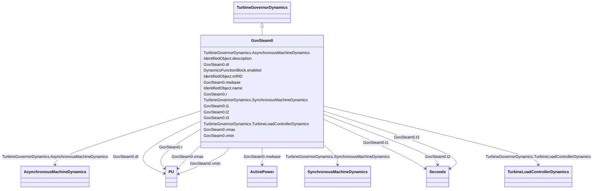

# GovSteam0

_A simplified steam turbine governor._

**URI**: [cim:GovSteam0](http://iec.ch/TC57/CIM100#GovSteam0) 
**Type**: Class

## Inheritance
* [IdentifiedObject](IdentifiedObject.md)
    * [DynamicsFunctionBlock](DynamicsFunctionBlock.md)
        * [TurbineGovernorDynamics](TurbineGovernorDynamics.md)
            * **GovSteam0**

## Attributes

| Name | URI | Cardinality and Range | Description | Inheritance |
| ---  | --- | --- | --- | --- |
| mwbase | [cim:GovSteam0.mwbase](http://iec.ch/TC57/CIM100#GovSteam0.mwbase) | 1..1    [ActivePower](ActivePower.md)  | Base for power values (<i>MWbase</i>) (&gt; 0) | direct |
| r | [cim:GovSteam0.r](http://iec.ch/TC57/CIM100#GovSteam0.r) | 1..1    [PU](PU.md)  | Permanent droop (<i>R</i>) | direct |
| t1 | [cim:GovSteam0.t1](http://iec.ch/TC57/CIM100#GovSteam0.t1) | 1..1    [Seconds](Seconds.md)  | Steam bowl time constant (<i>T1</i>) (&gt; 0) | direct |
| vmax | [cim:GovSteam0.vmax](http://iec.ch/TC57/CIM100#GovSteam0.vmax) | 1..1    [PU](PU.md)  | Maximum valve position, PU of <i>mwcap</i> (<i>Vmax</i>) (&gt; GovSteam0 | direct |
| vmin | [cim:GovSteam0.vmin](http://iec.ch/TC57/CIM100#GovSteam0.vmin) | 1..1    [PU](PU.md)  | Minimum valve position, PU of <i>mwcap</i> (<i>Vmin</i>) (&lt; GovSteam0 | direct |
| t2 | [cim:GovSteam0.t2](http://iec.ch/TC57/CIM100#GovSteam0.t2) | 1..1    [Seconds](Seconds.md)  | Numerator time constant of <i>T2</i>/<i>T3</i> block (<i>T2</i>) (&gt;= 0) | direct |
| t3 | [cim:GovSteam0.t3](http://iec.ch/TC57/CIM100#GovSteam0.t3) | 1..1    [Seconds](Seconds.md)  | Reheater time constant (<i>T3</i>) (&gt; 0) | direct |
| dt | [cim:GovSteam0.dt](http://iec.ch/TC57/CIM100#GovSteam0.dt) | 1..1    [PU](PU.md)  | Turbine damping coefficient (<i>Dt</i>) | direct |
| SynchronousMachineDynamics | [cim:TurbineGovernorDynamics.SynchronousMachineDynamics](http://iec.ch/TC57/CIM100#TurbineGovernorDynamics.SynchronousMachineDynamics) | 0..1    [SynchronousMachineDynamics](SynchronousMachineDynamics.md)  | Synchronous machine model with which this turbine-governor model is associate... | [TurbineGovernorDynamics](TurbineGovernorDynamics.md) |
| AsynchronousMachineDynamics | [cim:TurbineGovernorDynamics.AsynchronousMachineDynamics](http://iec.ch/TC57/CIM100#TurbineGovernorDynamics.AsynchronousMachineDynamics) | 0..1    [AsynchronousMachineDynamics](AsynchronousMachineDynamics.md)  | Asynchronous machine model with which this turbine-governor model is associat... | [TurbineGovernorDynamics](TurbineGovernorDynamics.md) |
| TurbineLoadControllerDynamics | [cim:TurbineGovernorDynamics.TurbineLoadControllerDynamics](http://iec.ch/TC57/CIM100#TurbineGovernorDynamics.TurbineLoadControllerDynamics) | 0..1    [TurbineLoadControllerDynamics](TurbineLoadControllerDynamics.md)  | Turbine load controller providing input to this turbine-governor | [TurbineGovernorDynamics](TurbineGovernorDynamics.md) |
| enabled | [cim:DynamicsFunctionBlock.enabled](http://iec.ch/TC57/CIM100#DynamicsFunctionBlock.enabled) | 1..1    boolean  | Function block used indicator | [DynamicsFunctionBlock](DynamicsFunctionBlock.md) |
| description | [cim:IdentifiedObject.description](http://iec.ch/TC57/CIM100#IdentifiedObject.description) | 0..1    string  | The description is a free human readable text describing or naming the object | [IdentifiedObject](IdentifiedObject.md) |
| mRID | [cim:IdentifiedObject.mRID](http://iec.ch/TC57/CIM100#IdentifiedObject.mRID) | 1..1    string  | Master resource identifier issued by a model authority | [IdentifiedObject](IdentifiedObject.md) |
| name | [cim:IdentifiedObject.name](http://iec.ch/TC57/CIM100#IdentifiedObject.name) | 0..1    string  | The name is any free human readable and possibly non unique text naming the o... | [IdentifiedObject](IdentifiedObject.md) |

## Identifier and Mapping Information

### Schema Source

* from schema: http://iec.ch/TC57/ns/CIM/Dynamics-EU#Package_DynamicsProfile

## Mappings

| Mapping Type | Mapped Value |
| ---  | ---  |
| self | cim:GovSteam0 |
| native | this:GovSteam0 |

