# GovSteam1

_Steam turbine governor, based on the GovSteamIEEE1 (with optional deadband and nonlinear valve gain added)._

**URI**: [cim:GovSteam1](http://iec.ch/TC57/CIM100#GovSteam1) 
**Type**: Class

```mermaid
 classDiagram
    class GovSteam1
      TurbineGovernorDynamics <|-- GovSteam1
      
      GovSteam1 : TurbineGovernorDynamics.AsynchronousMachineDynamics
        
          GovSteam1 --> AsynchronousMachineDynamics : TurbineGovernorDynamics.AsynchronousMachineDynamics
        
      GovSteam1 : GovSteam1.db1
        
          GovSteam1 --> Frequency : GovSteam1.db1
        
      GovSteam1 : GovSteam1.db2
        
          GovSteam1 --> ActivePower : GovSteam1.db2
        
      GovSteam1 : IdentifiedObject.description
        
      GovSteam1 : DynamicsFunctionBlock.enabled
        
      GovSteam1 : GovSteam1.eps
        
          GovSteam1 --> Frequency : GovSteam1.eps
        
      GovSteam1 : GovSteam1.gv1
        
          GovSteam1 --> PU : GovSteam1.gv1
        
      GovSteam1 : GovSteam1.gv2
        
          GovSteam1 --> PU : GovSteam1.gv2
        
      GovSteam1 : GovSteam1.gv3
        
          GovSteam1 --> PU : GovSteam1.gv3
        
      GovSteam1 : GovSteam1.gv4
        
          GovSteam1 --> PU : GovSteam1.gv4
        
      GovSteam1 : GovSteam1.gv5
        
          GovSteam1 --> PU : GovSteam1.gv5
        
      GovSteam1 : GovSteam1.gv6
        
          GovSteam1 --> PU : GovSteam1.gv6
        
      GovSteam1 : GovSteam1.k
        
          GovSteam1 --> PU : GovSteam1.k
        
      GovSteam1 : GovSteam1.k1
        
      GovSteam1 : GovSteam1.k2
        
      GovSteam1 : GovSteam1.k3
        
      GovSteam1 : GovSteam1.k4
        
      GovSteam1 : GovSteam1.k5
        
      GovSteam1 : GovSteam1.k6
        
      GovSteam1 : GovSteam1.k7
        
      GovSteam1 : GovSteam1.k8
        
      GovSteam1 : IdentifiedObject.mRID
        
      GovSteam1 : GovSteam1.mwbase
        
          GovSteam1 --> ActivePower : GovSteam1.mwbase
        
      GovSteam1 : IdentifiedObject.name
        
      GovSteam1 : GovSteam1.pgv1
        
          GovSteam1 --> PU : GovSteam1.pgv1
        
      GovSteam1 : GovSteam1.pgv2
        
          GovSteam1 --> PU : GovSteam1.pgv2
        
      GovSteam1 : GovSteam1.pgv3
        
          GovSteam1 --> PU : GovSteam1.pgv3
        
      GovSteam1 : GovSteam1.pgv4
        
          GovSteam1 --> PU : GovSteam1.pgv4
        
      GovSteam1 : GovSteam1.pgv5
        
          GovSteam1 --> PU : GovSteam1.pgv5
        
      GovSteam1 : GovSteam1.pgv6
        
          GovSteam1 --> PU : GovSteam1.pgv6
        
      GovSteam1 : GovSteam1.pmax
        
          GovSteam1 --> PU : GovSteam1.pmax
        
      GovSteam1 : GovSteam1.pmin
        
          GovSteam1 --> PU : GovSteam1.pmin
        
      GovSteam1 : GovSteam1.sdb1
        
      GovSteam1 : GovSteam1.sdb2
        
      GovSteam1 : TurbineGovernorDynamics.SynchronousMachineDynamics
        
          GovSteam1 --> SynchronousMachineDynamics : TurbineGovernorDynamics.SynchronousMachineDynamics
        
      GovSteam1 : GovSteam1.t1
        
          GovSteam1 --> Seconds : GovSteam1.t1
        
      GovSteam1 : GovSteam1.t2
        
          GovSteam1 --> Seconds : GovSteam1.t2
        
      GovSteam1 : GovSteam1.t3
        
          GovSteam1 --> Seconds : GovSteam1.t3
        
      GovSteam1 : GovSteam1.t4
        
          GovSteam1 --> Seconds : GovSteam1.t4
        
      GovSteam1 : GovSteam1.t5
        
          GovSteam1 --> Seconds : GovSteam1.t5
        
      GovSteam1 : GovSteam1.t6
        
          GovSteam1 --> Seconds : GovSteam1.t6
        
      GovSteam1 : GovSteam1.t7
        
          GovSteam1 --> Seconds : GovSteam1.t7
        
      GovSteam1 : TurbineGovernorDynamics.TurbineLoadControllerDynamics
        
          GovSteam1 --> TurbineLoadControllerDynamics : TurbineGovernorDynamics.TurbineLoadControllerDynamics
        
      GovSteam1 : GovSteam1.uc
        
      GovSteam1 : GovSteam1.uo
        
      GovSteam1 : GovSteam1.valve
        
      
```

## Inheritance
* [IdentifiedObject](IdentifiedObject.md)
    * [DynamicsFunctionBlock](DynamicsFunctionBlock.md)
        * [TurbineGovernorDynamics](TurbineGovernorDynamics.md)
            * **GovSteam1**

## Attributes

| Name | URI | Cardinality and Range | Description | Inheritance |
| ---  | --- | --- | --- | --- |
| mwbase | [cim:GovSteam1.mwbase](http://iec.ch/TC57/CIM100#GovSteam1.mwbase) | 1..1    [ActivePower](ActivePower.md)  | Base for power values (<i>MWbase</i>) (&gt; 0) | direct |
| k | [cim:GovSteam1.k](http://iec.ch/TC57/CIM100#GovSteam1.k) | 1..1    [PU](PU.md)  | Governor gain (reciprocal of droop) (<i>K</i>) (&gt; 0) | direct |
| t1 | [cim:GovSteam1.t1](http://iec.ch/TC57/CIM100#GovSteam1.t1) | 1..1    [Seconds](Seconds.md)  | Governor lag time constant (<i>T1</i>) (&gt;= 0) | direct |
| t2 | [cim:GovSteam1.t2](http://iec.ch/TC57/CIM100#GovSteam1.t2) | 1..1    [Seconds](Seconds.md)  | Governor lead time constant (<i>T2</i>) (&gt;= 0) | direct |
| t3 | [cim:GovSteam1.t3](http://iec.ch/TC57/CIM100#GovSteam1.t3) | 1..1    [Seconds](Seconds.md)  | Valve positioner time constant (<i>T3) </i>(&gt; 0) | direct |
| uo | [cim:GovSteam1.uo](http://iec.ch/TC57/CIM100#GovSteam1.uo) | 1..1    float  | Maximum valve opening velocity (<i>Uo</i>) (&gt; 0) | direct |
| uc | [cim:GovSteam1.uc](http://iec.ch/TC57/CIM100#GovSteam1.uc) | 1..1    float  | Maximum valve closing velocity (<i>Uc</i>) (&lt; 0) | direct |
| pmax | [cim:GovSteam1.pmax](http://iec.ch/TC57/CIM100#GovSteam1.pmax) | 1..1    [PU](PU.md)  | Maximum valve opening (<i>Pmax</i>) (&gt; GovSteam1 | direct |
| pmin | [cim:GovSteam1.pmin](http://iec.ch/TC57/CIM100#GovSteam1.pmin) | 1..1    [PU](PU.md)  | Minimum valve opening (<i>Pmin</i>) (&gt;= 0 and &lt; GovSteam1 | direct |
| t4 | [cim:GovSteam1.t4](http://iec.ch/TC57/CIM100#GovSteam1.t4) | 1..1    [Seconds](Seconds.md)  | Inlet piping/steam bowl time constant (<i>T4</i>) (&gt;= 0) | direct |
| k1 | [cim:GovSteam1.k1](http://iec.ch/TC57/CIM100#GovSteam1.k1) | 1..1    float  | Fraction of HP shaft power after first boiler pass (<i>K1</i>) | direct |
| k2 | [cim:GovSteam1.k2](http://iec.ch/TC57/CIM100#GovSteam1.k2) | 1..1    float  | Fraction of LP shaft power after first boiler pass (<i>K2</i>) | direct |
| t5 | [cim:GovSteam1.t5](http://iec.ch/TC57/CIM100#GovSteam1.t5) | 1..1    [Seconds](Seconds.md)  | Time constant of second boiler pass (<i>T5</i>) (&gt;= 0) | direct |
| k3 | [cim:GovSteam1.k3](http://iec.ch/TC57/CIM100#GovSteam1.k3) | 1..1    float  | Fraction of HP shaft power after second boiler pass (<i>K3</i>) | direct |
| k4 | [cim:GovSteam1.k4](http://iec.ch/TC57/CIM100#GovSteam1.k4) | 1..1    float  | Fraction of LP shaft power after second boiler pass (<i>K4</i>) | direct |
| t6 | [cim:GovSteam1.t6](http://iec.ch/TC57/CIM100#GovSteam1.t6) | 1..1    [Seconds](Seconds.md)  | Time constant of third boiler pass (<i>T6</i>) (&gt;= 0) | direct |
| k5 | [cim:GovSteam1.k5](http://iec.ch/TC57/CIM100#GovSteam1.k5) | 1..1    float  | Fraction of HP shaft power after third boiler pass (<i>K5</i>) | direct |
| k6 | [cim:GovSteam1.k6](http://iec.ch/TC57/CIM100#GovSteam1.k6) | 1..1    float  | Fraction of LP shaft power after third boiler pass (<i>K6</i>) | direct |
| t7 | [cim:GovSteam1.t7](http://iec.ch/TC57/CIM100#GovSteam1.t7) | 1..1    [Seconds](Seconds.md)  | Time constant of fourth boiler pass (<i>T7</i>) (&gt;= 0) | direct |
| k7 | [cim:GovSteam1.k7](http://iec.ch/TC57/CIM100#GovSteam1.k7) | 1..1    float  | Fraction of HP shaft power after fourth boiler pass (<i>K7</i>) | direct |
| k8 | [cim:GovSteam1.k8](http://iec.ch/TC57/CIM100#GovSteam1.k8) | 1..1    float  | Fraction of LP shaft power after fourth boiler pass (<i>K8</i>) | direct |
| db1 | [cim:GovSteam1.db1](http://iec.ch/TC57/CIM100#GovSteam1.db1) | 1..1    [Frequency](Frequency.md)  | Intentional deadband width (<i>db1</i>) | direct |
| eps | [cim:GovSteam1.eps](http://iec.ch/TC57/CIM100#GovSteam1.eps) | 1..1    [Frequency](Frequency.md)  | Intentional db hysteresis (<i>eps</i>) | direct |
| sdb1 | [cim:GovSteam1.sdb1](http://iec.ch/TC57/CIM100#GovSteam1.sdb1) | 1..1    boolean  | Intentional deadband indicator | direct |
| sdb2 | [cim:GovSteam1.sdb2](http://iec.ch/TC57/CIM100#GovSteam1.sdb2) | 1..1    boolean  | Unintentional deadband location | direct |
| db2 | [cim:GovSteam1.db2](http://iec.ch/TC57/CIM100#GovSteam1.db2) | 1..1    [ActivePower](ActivePower.md)  | Unintentional deadband (<i>db2</i>) | direct |
| valve | [cim:GovSteam1.valve](http://iec.ch/TC57/CIM100#GovSteam1.valve) | 1..1    boolean  | Nonlinear valve characteristic | direct |
| gv1 | [cim:GovSteam1.gv1](http://iec.ch/TC57/CIM100#GovSteam1.gv1) | 1..1    [PU](PU.md)  | Nonlinear gain valve position point 1 (<i>GV1</i>) | direct |
| pgv1 | [cim:GovSteam1.pgv1](http://iec.ch/TC57/CIM100#GovSteam1.pgv1) | 1..1    [PU](PU.md)  | Nonlinear gain power value point 1 (<i>Pgv1</i>) | direct |
| gv2 | [cim:GovSteam1.gv2](http://iec.ch/TC57/CIM100#GovSteam1.gv2) | 1..1    [PU](PU.md)  | Nonlinear gain valve position point 2 (<i>GV2</i>) | direct |
| pgv2 | [cim:GovSteam1.pgv2](http://iec.ch/TC57/CIM100#GovSteam1.pgv2) | 1..1    [PU](PU.md)  | Nonlinear gain power value point 2 (<i>Pgv2</i>) | direct |
| gv3 | [cim:GovSteam1.gv3](http://iec.ch/TC57/CIM100#GovSteam1.gv3) | 1..1    [PU](PU.md)  | Nonlinear gain valve position point 3 (<i>GV3</i>) | direct |
| pgv3 | [cim:GovSteam1.pgv3](http://iec.ch/TC57/CIM100#GovSteam1.pgv3) | 1..1    [PU](PU.md)  | Nonlinear gain power value point 3 (<i>Pgv3</i>) | direct |
| gv4 | [cim:GovSteam1.gv4](http://iec.ch/TC57/CIM100#GovSteam1.gv4) | 1..1    [PU](PU.md)  | Nonlinear gain valve position point 4 (<i>GV4</i>) | direct |
| pgv4 | [cim:GovSteam1.pgv4](http://iec.ch/TC57/CIM100#GovSteam1.pgv4) | 1..1    [PU](PU.md)  | Nonlinear gain power value point 4 (<i>Pgv4</i>) | direct |
| gv5 | [cim:GovSteam1.gv5](http://iec.ch/TC57/CIM100#GovSteam1.gv5) | 1..1    [PU](PU.md)  | Nonlinear gain valve position point 5 (<i>GV5</i>) | direct |
| pgv5 | [cim:GovSteam1.pgv5](http://iec.ch/TC57/CIM100#GovSteam1.pgv5) | 1..1    [PU](PU.md)  | Nonlinear gain power value point 5 (<i>Pgv5</i>) | direct |
| gv6 | [cim:GovSteam1.gv6](http://iec.ch/TC57/CIM100#GovSteam1.gv6) | 1..1    [PU](PU.md)  | Nonlinear gain valve position point 6 (<i>GV6</i>) | direct |
| pgv6 | [cim:GovSteam1.pgv6](http://iec.ch/TC57/CIM100#GovSteam1.pgv6) | 1..1    [PU](PU.md)  | Nonlinear gain power value point 6 (<i>Pgv6</i>) | direct |
| SynchronousMachineDynamics | [cim:TurbineGovernorDynamics.SynchronousMachineDynamics](http://iec.ch/TC57/CIM100#TurbineGovernorDynamics.SynchronousMachineDynamics) | 0..1    [SynchronousMachineDynamics](SynchronousMachineDynamics.md)  | Synchronous machine model with which this turbine-governor model is associate... | [TurbineGovernorDynamics](TurbineGovernorDynamics.md) |
| AsynchronousMachineDynamics | [cim:TurbineGovernorDynamics.AsynchronousMachineDynamics](http://iec.ch/TC57/CIM100#TurbineGovernorDynamics.AsynchronousMachineDynamics) | 0..1    [AsynchronousMachineDynamics](AsynchronousMachineDynamics.md)  | Asynchronous machine model with which this turbine-governor model is associat... | [TurbineGovernorDynamics](TurbineGovernorDynamics.md) |
| TurbineLoadControllerDynamics | [cim:TurbineGovernorDynamics.TurbineLoadControllerDynamics](http://iec.ch/TC57/CIM100#TurbineGovernorDynamics.TurbineLoadControllerDynamics) | 0..1    [TurbineLoadControllerDynamics](TurbineLoadControllerDynamics.md)  | Turbine load controller providing input to this turbine-governor | [TurbineGovernorDynamics](TurbineGovernorDynamics.md) |
| enabled | [cim:DynamicsFunctionBlock.enabled](http://iec.ch/TC57/CIM100#DynamicsFunctionBlock.enabled) | 1..1    boolean  | Function block used indicator | [DynamicsFunctionBlock](DynamicsFunctionBlock.md) |
| description | [cim:IdentifiedObject.description](http://iec.ch/TC57/CIM100#IdentifiedObject.description) | 0..1    string  | The description is a free human readable text describing or naming the object | [IdentifiedObject](IdentifiedObject.md) |
| mRID | [cim:IdentifiedObject.mRID](http://iec.ch/TC57/CIM100#IdentifiedObject.mRID) | 1..1    string  | Master resource identifier issued by a model authority | [IdentifiedObject](IdentifiedObject.md) |
| name | [cim:IdentifiedObject.name](http://iec.ch/TC57/CIM100#IdentifiedObject.name) | 0..1    string  | The name is any free human readable and possibly non unique text naming the o... | [IdentifiedObject](IdentifiedObject.md) |

## Identifier and Mapping Information

### Schema Source

* from schema: http://iec.ch/TC57/ns/CIM/Dynamics-EU#Package_DynamicsProfile

## Mappings

| Mapping Type | Mapped Value |
| ---  | ---  |
| self | cim:GovSteam1 |
| native | this:GovSteam1 |

