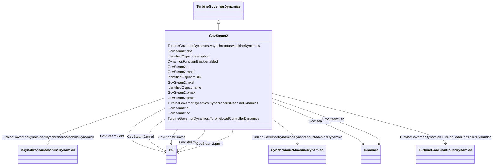

# GovSteam2

_Simplified governor._

**URI**: [cim:GovSteam2](http://iec.ch/TC57/CIM100#GovSteam2) 
**Type**: Class

## Inheritance
* [IdentifiedObject](IdentifiedObject.md)
    * [DynamicsFunctionBlock](DynamicsFunctionBlock.md)
        * [TurbineGovernorDynamics](TurbineGovernorDynamics.md)
            * **GovSteam2**

## Attributes

| Name | URI | Cardinality and Range | Description | Inheritance |
| ---  | --- | --- | --- | --- |
| k | [cim:GovSteam2.k](http://iec.ch/TC57/CIM100#GovSteam2.k) | 1    float  | Governor gain (reciprocal of droop) (<i>K</i>) | direct |
| dbf | [cim:GovSteam2.dbf](http://iec.ch/TC57/CIM100#GovSteam2.dbf) | 1    [PU](PU.md)  | Frequency deadband (<i>DBF</i>) | direct |
| t1 | [cim:GovSteam2.t1](http://iec.ch/TC57/CIM100#GovSteam2.t1) | 1    [Seconds](Seconds.md)  | Governor lag time constant (<i>T</i><i>1</i>) (&gt; 0) | direct |
| t2 | [cim:GovSteam2.t2](http://iec.ch/TC57/CIM100#GovSteam2.t2) | 1    [Seconds](Seconds.md)  | Governor lead time constant (<i>T</i><i>2</i>) (&gt;= 0) | direct |
| pmax | [cim:GovSteam2.pmax](http://iec.ch/TC57/CIM100#GovSteam2.pmax) | 1    [PU](PU.md)  | Maximum fuel flow (<i>P</i><i>MAX</i>) (&gt; GovSteam2 | direct |
| pmin | [cim:GovSteam2.pmin](http://iec.ch/TC57/CIM100#GovSteam2.pmin) | 1    [PU](PU.md)  | Minimum fuel flow (<i>P</i><i>MIN</i>) (&lt; GovSteam2 | direct |
| mxef | [cim:GovSteam2.mxef](http://iec.ch/TC57/CIM100#GovSteam2.mxef) | 1    [PU](PU.md)  | Fuel flow maximum positive error value (<i>MX</i><i>EF</i>) | direct |
| mnef | [cim:GovSteam2.mnef](http://iec.ch/TC57/CIM100#GovSteam2.mnef) | 1    [PU](PU.md)  | Fuel flow maximum negative error value (<i>MN</i><i>EF</i>) | direct |
| SynchronousMachineDynamics | [cim:TurbineGovernorDynamics.SynchronousMachineDynamics](http://iec.ch/TC57/CIM100#TurbineGovernorDynamics.SynchronousMachineDynamics) | 0..1    [SynchronousMachineDynamics](SynchronousMachineDynamics.md)  | Synchronous machine model with which this turbine-governor model is associate... | [TurbineGovernorDynamics](TurbineGovernorDynamics.md) |
| AsynchronousMachineDynamics | [cim:TurbineGovernorDynamics.AsynchronousMachineDynamics](http://iec.ch/TC57/CIM100#TurbineGovernorDynamics.AsynchronousMachineDynamics) | 0..1    [AsynchronousMachineDynamics](AsynchronousMachineDynamics.md)  | Asynchronous machine model with which this turbine-governor model is associat... | [TurbineGovernorDynamics](TurbineGovernorDynamics.md) |
| TurbineLoadControllerDynamics | [cim:TurbineGovernorDynamics.TurbineLoadControllerDynamics](http://iec.ch/TC57/CIM100#TurbineGovernorDynamics.TurbineLoadControllerDynamics) | 0..1    [TurbineLoadControllerDynamics](TurbineLoadControllerDynamics.md)  | Turbine load controller providing input to this turbine-governor | [TurbineGovernorDynamics](TurbineGovernorDynamics.md) |
| enabled | [cim:DynamicsFunctionBlock.enabled](http://iec.ch/TC57/CIM100#DynamicsFunctionBlock.enabled) | 1    boolean  | Function block used indicator | [DynamicsFunctionBlock](DynamicsFunctionBlock.md) |
| description | [cim:IdentifiedObject.description](http://iec.ch/TC57/CIM100#IdentifiedObject.description) | 0..1    string  | The description is a free human readable text describing or naming the object | [IdentifiedObject](IdentifiedObject.md) |
| mRID | [cim:IdentifiedObject.mRID](http://iec.ch/TC57/CIM100#IdentifiedObject.mRID) | 1    string  | Master resource identifier issued by a model authority | [IdentifiedObject](IdentifiedObject.md) |
| name | [cim:IdentifiedObject.name](http://iec.ch/TC57/CIM100#IdentifiedObject.name) | 0..1    string  | The name is any free human readable and possibly non unique text naming the o... | [IdentifiedObject](IdentifiedObject.md) |

## Identifier and Mapping Information

### Schema Source

* from schema: http://iec.ch/TC57/ns/CIM/Dynamics-EU#Package_DynamicsProfile

## Mappings

| Mapping Type | Mapped Value |
| ---  | ---  |
| self | cim:GovSteam2 |
| native | this:GovSteam2 |

