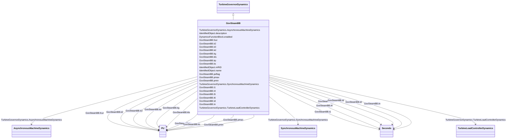

# GovSteamBB

_European governor model._

**URI**: [cim:GovSteamBB](http://iec.ch/TC57/CIM100#GovSteamBB) 
**Type**: Class

## Inheritance
* [IdentifiedObject](IdentifiedObject.md)
    * [DynamicsFunctionBlock](DynamicsFunctionBlock.md)
        * [TurbineGovernorDynamics](TurbineGovernorDynamics.md)
            * **GovSteamBB**

## Attributes

| Name | URI | Cardinality and Range | Description | Inheritance |
| ---  | --- | --- | --- | --- |
| fcut | [cim:GovSteamBB.fcut](http://iec.ch/TC57/CIM100#GovSteamBB.fcut) | 1..1    [PU](PU.md)  | Frequency deadband (<i>f</i><i>cut</i>) (&gt;= 0) | direct |
| ks | [cim:GovSteamBB.ks](http://iec.ch/TC57/CIM100#GovSteamBB.ks) | 1..1    [PU](PU.md)  | Gain (<i>Ks</i>) | direct |
| kls | [cim:GovSteamBB.kls](http://iec.ch/TC57/CIM100#GovSteamBB.kls) | 1..1    [PU](PU.md)  | Gain (<i>Kls</i>) (&gt; 0) | direct |
| kg | [cim:GovSteamBB.kg](http://iec.ch/TC57/CIM100#GovSteamBB.kg) | 1..1    [PU](PU.md)  | Gain (<i>Kg</i>) | direct |
| t1 | [cim:GovSteamBB.t1](http://iec.ch/TC57/CIM100#GovSteamBB.t1) | 1..1    [Seconds](Seconds.md)  | Time constant (<i>T1</i>) | direct |
| kp | [cim:GovSteamBB.kp](http://iec.ch/TC57/CIM100#GovSteamBB.kp) | 1..1    [PU](PU.md)  | Gain (<i>Kp</i>) | direct |
| tn | [cim:GovSteamBB.tn](http://iec.ch/TC57/CIM100#GovSteamBB.tn) | 1..1    [Seconds](Seconds.md)  | Time constant (<i>Tn</i>) (&gt; 0) | direct |
| kd | [cim:GovSteamBB.kd](http://iec.ch/TC57/CIM100#GovSteamBB.kd) | 1..1    [PU](PU.md)  | Gain (<i>Kd</i>) | direct |
| td | [cim:GovSteamBB.td](http://iec.ch/TC57/CIM100#GovSteamBB.td) | 1..1    [Seconds](Seconds.md)  | Time constant (<i>Td</i>) (&gt; 0) | direct |
| pmax | [cim:GovSteamBB.pmax](http://iec.ch/TC57/CIM100#GovSteamBB.pmax) | 1..1    [PU](PU.md)  | High power limit (<i>Pmax</i>) (&gt; GovSteamBB | direct |
| pmin | [cim:GovSteamBB.pmin](http://iec.ch/TC57/CIM100#GovSteamBB.pmin) | 1..1    [PU](PU.md)  | Low power limit (<i>Pmin</i>) (&lt; GovSteamBB | direct |
| t4 | [cim:GovSteamBB.t4](http://iec.ch/TC57/CIM100#GovSteamBB.t4) | 1..1    [Seconds](Seconds.md)  | Time constant (<i>T4</i>) | direct |
| k2 | [cim:GovSteamBB.k2](http://iec.ch/TC57/CIM100#GovSteamBB.k2) | 1..1    [PU](PU.md)  | Gain (<i>K2</i>) | direct |
| t5 | [cim:GovSteamBB.t5](http://iec.ch/TC57/CIM100#GovSteamBB.t5) | 1..1    [Seconds](Seconds.md)  | Time constant (<i>T5</i>) | direct |
| k3 | [cim:GovSteamBB.k3](http://iec.ch/TC57/CIM100#GovSteamBB.k3) | 1..1    [PU](PU.md)  | Gain (<i>K3</i>) | direct |
| t6 | [cim:GovSteamBB.t6](http://iec.ch/TC57/CIM100#GovSteamBB.t6) | 1..1    [Seconds](Seconds.md)  | Time constant (<i>T6</i>) | direct |
| peflag | [cim:GovSteamBB.peflag](http://iec.ch/TC57/CIM100#GovSteamBB.peflag) | 1..1    boolean  | Electric power input selection (Peflag) | direct |
| SynchronousMachineDynamics | [cim:TurbineGovernorDynamics.SynchronousMachineDynamics](http://iec.ch/TC57/CIM100#TurbineGovernorDynamics.SynchronousMachineDynamics) | 0..1    [SynchronousMachineDynamics](SynchronousMachineDynamics.md)  | Synchronous machine model with which this turbine-governor model is associate... | [TurbineGovernorDynamics](TurbineGovernorDynamics.md) |
| AsynchronousMachineDynamics | [cim:TurbineGovernorDynamics.AsynchronousMachineDynamics](http://iec.ch/TC57/CIM100#TurbineGovernorDynamics.AsynchronousMachineDynamics) | 0..1    [AsynchronousMachineDynamics](AsynchronousMachineDynamics.md)  | Asynchronous machine model with which this turbine-governor model is associat... | [TurbineGovernorDynamics](TurbineGovernorDynamics.md) |
| TurbineLoadControllerDynamics | [cim:TurbineGovernorDynamics.TurbineLoadControllerDynamics](http://iec.ch/TC57/CIM100#TurbineGovernorDynamics.TurbineLoadControllerDynamics) | 0..1    [TurbineLoadControllerDynamics](TurbineLoadControllerDynamics.md)  | Turbine load controller providing input to this turbine-governor | [TurbineGovernorDynamics](TurbineGovernorDynamics.md) |
| enabled | [cim:DynamicsFunctionBlock.enabled](http://iec.ch/TC57/CIM100#DynamicsFunctionBlock.enabled) | 1..1    boolean  | Function block used indicator | [DynamicsFunctionBlock](DynamicsFunctionBlock.md) |
| description | [cim:IdentifiedObject.description](http://iec.ch/TC57/CIM100#IdentifiedObject.description) | 0..1    string  | The description is a free human readable text describing or naming the object | [IdentifiedObject](IdentifiedObject.md) |
| mRID | [cim:IdentifiedObject.mRID](http://iec.ch/TC57/CIM100#IdentifiedObject.mRID) | 1..1    string  | Master resource identifier issued by a model authority | [IdentifiedObject](IdentifiedObject.md) |
| name | [cim:IdentifiedObject.name](http://iec.ch/TC57/CIM100#IdentifiedObject.name) | 0..1    string  | The name is any free human readable and possibly non unique text naming the o... | [IdentifiedObject](IdentifiedObject.md) |

## Identifier and Mapping Information

### Schema Source

* from schema: http://iec.ch/TC57/ns/CIM/Dynamics-EU#Package_DynamicsProfile

## Mappings

| Mapping Type | Mapped Value |
| ---  | ---  |
| self | cim:GovSteamBB |
| native | this:GovSteamBB |

