# GovSteamCC

_Cross compound turbine governor.  Unlike tandem compound units, cross compound units are not on the same shaft._

**URI**: [cim:GovSteamCC](http://iec.ch/TC57/CIM100#GovSteamCC) 
**Type**: Class

```mermaid
 classDiagram
    class GovSteamCC
    click GovSteamCC href "../GovSteamCC"
      CrossCompoundTurbineGovernorDynamics <|-- GovSteamCC
        click CrossCompoundTurbineGovernorDynamics href "../CrossCompoundTurbineGovernorDynamics"
      
      GovSteamCC : IdentifiedObject.description
        
      GovSteamCC : GovSteamCC.dhp
        
          GovSteamCC --> PU : GovSteamCC.dhp
          click PU href "../PU"
        
      GovSteamCC : GovSteamCC.dlp
        
          GovSteamCC --> PU : GovSteamCC.dlp
          click PU href "../PU"
        
      GovSteamCC : DynamicsFunctionBlock.enabled
        
      GovSteamCC : GovSteamCC.fhp
        
          GovSteamCC --> PU : GovSteamCC.fhp
          click PU href "../PU"
        
      GovSteamCC : GovSteamCC.flp
        
          GovSteamCC --> PU : GovSteamCC.flp
          click PU href "../PU"
        
      GovSteamCC : CrossCompoundTurbineGovernorDynamics.HighPressureSynchronousMachineDynamics
        
          GovSteamCC --> SynchronousMachineDynamics : CrossCompoundTurbineGovernorDynamics.HighPressureSynchronousMachineDynamics
          click SynchronousMachineDynamics href "../SynchronousMachineDynamics"
        
      GovSteamCC : CrossCompoundTurbineGovernorDynamics.LowPressureSynchronousMachineDynamics
        
          GovSteamCC --> SynchronousMachineDynamics : CrossCompoundTurbineGovernorDynamics.LowPressureSynchronousMachineDynamics
          click SynchronousMachineDynamics href "../SynchronousMachineDynamics"
        
      GovSteamCC : IdentifiedObject.mRID
        
      GovSteamCC : GovSteamCC.mwbase
        
          GovSteamCC --> ActivePower : GovSteamCC.mwbase
          click ActivePower href "../ActivePower"
        
      GovSteamCC : IdentifiedObject.name
        
      GovSteamCC : GovSteamCC.pmaxhp
        
          GovSteamCC --> PU : GovSteamCC.pmaxhp
          click PU href "../PU"
        
      GovSteamCC : GovSteamCC.pmaxlp
        
          GovSteamCC --> PU : GovSteamCC.pmaxlp
          click PU href "../PU"
        
      GovSteamCC : GovSteamCC.rhp
        
          GovSteamCC --> PU : GovSteamCC.rhp
          click PU href "../PU"
        
      GovSteamCC : GovSteamCC.rlp
        
          GovSteamCC --> PU : GovSteamCC.rlp
          click PU href "../PU"
        
      GovSteamCC : GovSteamCC.t1hp
        
          GovSteamCC --> Seconds : GovSteamCC.t1hp
          click Seconds href "../Seconds"
        
      GovSteamCC : GovSteamCC.t1lp
        
          GovSteamCC --> Seconds : GovSteamCC.t1lp
          click Seconds href "../Seconds"
        
      GovSteamCC : GovSteamCC.t3hp
        
          GovSteamCC --> Seconds : GovSteamCC.t3hp
          click Seconds href "../Seconds"
        
      GovSteamCC : GovSteamCC.t3lp
        
          GovSteamCC --> Seconds : GovSteamCC.t3lp
          click Seconds href "../Seconds"
        
      GovSteamCC : GovSteamCC.t4hp
        
          GovSteamCC --> Seconds : GovSteamCC.t4hp
          click Seconds href "../Seconds"
        
      GovSteamCC : GovSteamCC.t4lp
        
          GovSteamCC --> Seconds : GovSteamCC.t4lp
          click Seconds href "../Seconds"
        
      GovSteamCC : GovSteamCC.t5hp
        
          GovSteamCC --> Seconds : GovSteamCC.t5hp
          click Seconds href "../Seconds"
        
      GovSteamCC : GovSteamCC.t5lp
        
          GovSteamCC --> Seconds : GovSteamCC.t5lp
          click Seconds href "../Seconds"
        
      
```

## Inheritance
* [IdentifiedObject](IdentifiedObject.md)
    * [DynamicsFunctionBlock](DynamicsFunctionBlock.md)
        * [CrossCompoundTurbineGovernorDynamics](CrossCompoundTurbineGovernorDynamics.md)
            * **GovSteamCC**

## Attributes

| Name | URI | Cardinality and Range | Description | Inheritance |
| ---  | --- | --- | --- | --- |
| mwbase | [cim:GovSteamCC.mwbase](http://iec.ch/TC57/CIM100#GovSteamCC.mwbase) | 1    [ActivePower](ActivePower.md)  | Base for power values (<i>MWbase</i>) (&gt; 0) | direct |
| pmaxhp | [cim:GovSteamCC.pmaxhp](http://iec.ch/TC57/CIM100#GovSteamCC.pmaxhp) | 1    [PU](PU.md)  | Maximum HP value position (<i>Pmaxhp</i>) | direct |
| rhp | [cim:GovSteamCC.rhp](http://iec.ch/TC57/CIM100#GovSteamCC.rhp) | 1    [PU](PU.md)  | HP governor droop (<i>Rhp</i>) (&gt; 0) | direct |
| t1hp | [cim:GovSteamCC.t1hp](http://iec.ch/TC57/CIM100#GovSteamCC.t1hp) | 1    [Seconds](Seconds.md)  | HP governor time constant (<i>T1hp</i>) (&gt;= 0) | direct |
| t3hp | [cim:GovSteamCC.t3hp](http://iec.ch/TC57/CIM100#GovSteamCC.t3hp) | 1    [Seconds](Seconds.md)  | HP turbine time constant (<i>T3hp</i>) (&gt;= 0) | direct |
| t4hp | [cim:GovSteamCC.t4hp](http://iec.ch/TC57/CIM100#GovSteamCC.t4hp) | 1    [Seconds](Seconds.md)  | HP turbine time constant (<i>T4hp</i>) (&gt;= 0) | direct |
| t5hp | [cim:GovSteamCC.t5hp](http://iec.ch/TC57/CIM100#GovSteamCC.t5hp) | 1    [Seconds](Seconds.md)  | HP reheater time constant (<i>T5hp</i>) (&gt;= 0) | direct |
| fhp | [cim:GovSteamCC.fhp](http://iec.ch/TC57/CIM100#GovSteamCC.fhp) | 1    [PU](PU.md)  | Fraction of HP power ahead of reheater (<i>Fhp</i>) | direct |
| dhp | [cim:GovSteamCC.dhp](http://iec.ch/TC57/CIM100#GovSteamCC.dhp) | 1    [PU](PU.md)  | HP damping factor (<i>Dhp</i>) | direct |
| pmaxlp | [cim:GovSteamCC.pmaxlp](http://iec.ch/TC57/CIM100#GovSteamCC.pmaxlp) | 1    [PU](PU.md)  | Maximum LP value position (<i>Pmaxlp</i>) | direct |
| rlp | [cim:GovSteamCC.rlp](http://iec.ch/TC57/CIM100#GovSteamCC.rlp) | 1    [PU](PU.md)  | LP governor droop (<i>Rlp</i>) (&gt; 0) | direct |
| t1lp | [cim:GovSteamCC.t1lp](http://iec.ch/TC57/CIM100#GovSteamCC.t1lp) | 1    [Seconds](Seconds.md)  | LP governor time constant (<i>T1lp</i>) (&gt;= 0) | direct |
| t3lp | [cim:GovSteamCC.t3lp](http://iec.ch/TC57/CIM100#GovSteamCC.t3lp) | 1    [Seconds](Seconds.md)  | LP turbine time constant (<i>T3lp</i>) (&gt;= 0) | direct |
| t4lp | [cim:GovSteamCC.t4lp](http://iec.ch/TC57/CIM100#GovSteamCC.t4lp) | 1    [Seconds](Seconds.md)  | LP turbine time constant (<i>T4lp</i>) (&gt;= 0) | direct |
| t5lp | [cim:GovSteamCC.t5lp](http://iec.ch/TC57/CIM100#GovSteamCC.t5lp) | 1    [Seconds](Seconds.md)  | LP reheater time constant (<i>T5lp</i>) (&gt;= 0) | direct |
| flp | [cim:GovSteamCC.flp](http://iec.ch/TC57/CIM100#GovSteamCC.flp) | 1    [PU](PU.md)  | Fraction of LP power ahead of reheater (<i>Flp</i>) | direct |
| dlp | [cim:GovSteamCC.dlp](http://iec.ch/TC57/CIM100#GovSteamCC.dlp) | 1    [PU](PU.md)  | LP damping factor (<i>Dlp</i>) | direct |
| HighPressureSynchronousMachineDynamics | [cim:CrossCompoundTurbineGovernorDynamics.HighPressureSynchronousMachineDynamics](http://iec.ch/TC57/CIM100#CrossCompoundTurbineGovernorDynamics.HighPressureSynchronousMachineDynamics) | 1    [SynchronousMachineDynamics](SynchronousMachineDynamics.md)  | High-pressure synchronous machine with which this cross-compound turbine gove... | [CrossCompoundTurbineGovernorDynamics](CrossCompoundTurbineGovernorDynamics.md) |
| LowPressureSynchronousMachineDynamics | [cim:CrossCompoundTurbineGovernorDynamics.LowPressureSynchronousMachineDynamics](http://iec.ch/TC57/CIM100#CrossCompoundTurbineGovernorDynamics.LowPressureSynchronousMachineDynamics) | 1    [SynchronousMachineDynamics](SynchronousMachineDynamics.md)  | Low-pressure synchronous machine with which this cross-compound turbine gover... | [CrossCompoundTurbineGovernorDynamics](CrossCompoundTurbineGovernorDynamics.md) |
| enabled | [cim:DynamicsFunctionBlock.enabled](http://iec.ch/TC57/CIM100#DynamicsFunctionBlock.enabled) | 1    boolean  | Function block used indicator | [DynamicsFunctionBlock](DynamicsFunctionBlock.md) |
| description | [cim:IdentifiedObject.description](http://iec.ch/TC57/CIM100#IdentifiedObject.description) | 0..1    string  | The description is a free human readable text describing or naming the object | [IdentifiedObject](IdentifiedObject.md) |
| mRID | [cim:IdentifiedObject.mRID](http://iec.ch/TC57/CIM100#IdentifiedObject.mRID) | 1    string  | Master resource identifier issued by a model authority | [IdentifiedObject](IdentifiedObject.md) |
| name | [cim:IdentifiedObject.name](http://iec.ch/TC57/CIM100#IdentifiedObject.name) | 0..1    string  | The name is any free human readable and possibly non unique text naming the o... | [IdentifiedObject](IdentifiedObject.md) |

## Identifier and Mapping Information

### Schema Source

* from schema: http://iec.ch/TC57/ns/CIM/Dynamics-EU#Package_DynamicsProfile

## Mappings

| Mapping Type | Mapped Value |
| ---  | ---  |
| self | cim:GovSteamCC |
| native | this:GovSteamCC |

