# GovSteamEU

_Simplified boiler and steam turbine with PID governor._

**URI**: [cim:GovSteamEU](http://iec.ch/TC57/CIM100#GovSteamEU) 
**Type**: Class

```mermaid
 classDiagram
    class GovSteamEU
    click GovSteamEU href "../GovSteamEU"
      TurbineGovernorDynamics <|-- GovSteamEU
        click TurbineGovernorDynamics href "../TurbineGovernorDynamics"
      
      GovSteamEU : TurbineGovernorDynamics.AsynchronousMachineDynamics
        
          GovSteamEU --> AsynchronousMachineDynamics : TurbineGovernorDynamics.AsynchronousMachineDynamics
          click AsynchronousMachineDynamics href "../AsynchronousMachineDynamics"
        
      GovSteamEU : GovSteamEU.chc
        
      GovSteamEU : GovSteamEU.cho
        
      GovSteamEU : GovSteamEU.cic
        
          GovSteamEU --> PU : GovSteamEU.cic
          click PU href "../PU"
        
      GovSteamEU : GovSteamEU.cio
        
          GovSteamEU --> PU : GovSteamEU.cio
          click PU href "../PU"
        
      GovSteamEU : GovSteamEU.db1
        
          GovSteamEU --> PU : GovSteamEU.db1
          click PU href "../PU"
        
      GovSteamEU : GovSteamEU.db2
        
          GovSteamEU --> PU : GovSteamEU.db2
          click PU href "../PU"
        
      GovSteamEU : IdentifiedObject.description
        
      GovSteamEU : DynamicsFunctionBlock.enabled
        
      GovSteamEU : GovSteamEU.hhpmax
        
          GovSteamEU --> PU : GovSteamEU.hhpmax
          click PU href "../PU"
        
      GovSteamEU : GovSteamEU.ke
        
          GovSteamEU --> PU : GovSteamEU.ke
          click PU href "../PU"
        
      GovSteamEU : GovSteamEU.kfcor
        
          GovSteamEU --> PU : GovSteamEU.kfcor
          click PU href "../PU"
        
      GovSteamEU : GovSteamEU.khp
        
          GovSteamEU --> PU : GovSteamEU.khp
          click PU href "../PU"
        
      GovSteamEU : GovSteamEU.klp
        
          GovSteamEU --> PU : GovSteamEU.klp
          click PU href "../PU"
        
      GovSteamEU : GovSteamEU.komegacor
        
          GovSteamEU --> PU : GovSteamEU.komegacor
          click PU href "../PU"
        
      GovSteamEU : IdentifiedObject.mRID
        
      GovSteamEU : GovSteamEU.mwbase
        
          GovSteamEU --> ActivePower : GovSteamEU.mwbase
          click ActivePower href "../ActivePower"
        
      GovSteamEU : IdentifiedObject.name
        
      GovSteamEU : GovSteamEU.pmax
        
          GovSteamEU --> PU : GovSteamEU.pmax
          click PU href "../PU"
        
      GovSteamEU : GovSteamEU.prhmax
        
          GovSteamEU --> PU : GovSteamEU.prhmax
          click PU href "../PU"
        
      GovSteamEU : GovSteamEU.simx
        
          GovSteamEU --> PU : GovSteamEU.simx
          click PU href "../PU"
        
      GovSteamEU : TurbineGovernorDynamics.SynchronousMachineDynamics
        
          GovSteamEU --> SynchronousMachineDynamics : TurbineGovernorDynamics.SynchronousMachineDynamics
          click SynchronousMachineDynamics href "../SynchronousMachineDynamics"
        
      GovSteamEU : GovSteamEU.tb
        
          GovSteamEU --> Seconds : GovSteamEU.tb
          click Seconds href "../Seconds"
        
      GovSteamEU : GovSteamEU.tdp
        
          GovSteamEU --> Seconds : GovSteamEU.tdp
          click Seconds href "../Seconds"
        
      GovSteamEU : GovSteamEU.ten
        
          GovSteamEU --> Seconds : GovSteamEU.ten
          click Seconds href "../Seconds"
        
      GovSteamEU : GovSteamEU.tf
        
          GovSteamEU --> Seconds : GovSteamEU.tf
          click Seconds href "../Seconds"
        
      GovSteamEU : GovSteamEU.tfp
        
          GovSteamEU --> Seconds : GovSteamEU.tfp
          click Seconds href "../Seconds"
        
      GovSteamEU : GovSteamEU.thp
        
          GovSteamEU --> Seconds : GovSteamEU.thp
          click Seconds href "../Seconds"
        
      GovSteamEU : GovSteamEU.tip
        
          GovSteamEU --> Seconds : GovSteamEU.tip
          click Seconds href "../Seconds"
        
      GovSteamEU : GovSteamEU.tlp
        
          GovSteamEU --> Seconds : GovSteamEU.tlp
          click Seconds href "../Seconds"
        
      GovSteamEU : GovSteamEU.tp
        
          GovSteamEU --> Seconds : GovSteamEU.tp
          click Seconds href "../Seconds"
        
      GovSteamEU : GovSteamEU.trh
        
          GovSteamEU --> Seconds : GovSteamEU.trh
          click Seconds href "../Seconds"
        
      GovSteamEU : TurbineGovernorDynamics.TurbineLoadControllerDynamics
        
          GovSteamEU --> TurbineLoadControllerDynamics : TurbineGovernorDynamics.TurbineLoadControllerDynamics
          click TurbineLoadControllerDynamics href "../TurbineLoadControllerDynamics"
        
      GovSteamEU : GovSteamEU.tvhp
        
          GovSteamEU --> Seconds : GovSteamEU.tvhp
          click Seconds href "../Seconds"
        
      GovSteamEU : GovSteamEU.tvip
        
          GovSteamEU --> Seconds : GovSteamEU.tvip
          click Seconds href "../Seconds"
        
      GovSteamEU : GovSteamEU.tw
        
          GovSteamEU --> Seconds : GovSteamEU.tw
          click Seconds href "../Seconds"
        
      GovSteamEU : GovSteamEU.wfmax
        
          GovSteamEU --> PU : GovSteamEU.wfmax
          click PU href "../PU"
        
      GovSteamEU : GovSteamEU.wfmin
        
          GovSteamEU --> PU : GovSteamEU.wfmin
          click PU href "../PU"
        
      GovSteamEU : GovSteamEU.wmax1
        
          GovSteamEU --> PU : GovSteamEU.wmax1
          click PU href "../PU"
        
      GovSteamEU : GovSteamEU.wmax2
        
          GovSteamEU --> PU : GovSteamEU.wmax2
          click PU href "../PU"
        
      GovSteamEU : GovSteamEU.wwmax
        
          GovSteamEU --> PU : GovSteamEU.wwmax
          click PU href "../PU"
        
      GovSteamEU : GovSteamEU.wwmin
        
          GovSteamEU --> PU : GovSteamEU.wwmin
          click PU href "../PU"
        
      
```

## Inheritance
* [IdentifiedObject](IdentifiedObject.md)
    * [DynamicsFunctionBlock](DynamicsFunctionBlock.md)
        * [TurbineGovernorDynamics](TurbineGovernorDynamics.md)
            * **GovSteamEU**

## Attributes

| Name | URI | Cardinality and Range | Description | Inheritance |
| ---  | --- | --- | --- | --- |
| mwbase | [cim:GovSteamEU.mwbase](http://iec.ch/TC57/CIM100#GovSteamEU.mwbase) | 1    [ActivePower](ActivePower.md)  | Base for power values (<i>MWbase</i>) (&gt; 0) | direct |
| tp | [cim:GovSteamEU.tp](http://iec.ch/TC57/CIM100#GovSteamEU.tp) | 1    [Seconds](Seconds.md)  | Power transducer time constant (<i>Tp</i>) (&gt;= 0) | direct |
| ke | [cim:GovSteamEU.ke](http://iec.ch/TC57/CIM100#GovSteamEU.ke) | 1    [PU](PU.md)  | Gain of the power controller (<i>Ke</i>) | direct |
| tip | [cim:GovSteamEU.tip](http://iec.ch/TC57/CIM100#GovSteamEU.tip) | 1    [Seconds](Seconds.md)  | Integral time constant of the power controller (<i>Tip</i>) (&gt;= 0) | direct |
| tdp | [cim:GovSteamEU.tdp](http://iec.ch/TC57/CIM100#GovSteamEU.tdp) | 1    [Seconds](Seconds.md)  | Derivative time constant of the power controller (<i>Tdp</i>) (&gt;= 0) | direct |
| tfp | [cim:GovSteamEU.tfp](http://iec.ch/TC57/CIM100#GovSteamEU.tfp) | 1    [Seconds](Seconds.md)  | Time constant of the power controller (<i>Tfp</i>) (&gt;= 0) | direct |
| tf | [cim:GovSteamEU.tf](http://iec.ch/TC57/CIM100#GovSteamEU.tf) | 1    [Seconds](Seconds.md)  | Frequency transducer time constant (<i>Tf</i>) (&gt;= 0) | direct |
| kfcor | [cim:GovSteamEU.kfcor](http://iec.ch/TC57/CIM100#GovSteamEU.kfcor) | 1    [PU](PU.md)  | Gain of the frequency corrector (<i>Kfcor</i>) | direct |
| db1 | [cim:GovSteamEU.db1](http://iec.ch/TC57/CIM100#GovSteamEU.db1) | 1    [PU](PU.md)  | Deadband of the frequency corrector (<i>db1</i>) | direct |
| wfmax | [cim:GovSteamEU.wfmax](http://iec.ch/TC57/CIM100#GovSteamEU.wfmax) | 1    [PU](PU.md)  | Upper limit for frequency correction (<i>Wfmax</i>) (&gt; GovSteamEU | direct |
| wfmin | [cim:GovSteamEU.wfmin](http://iec.ch/TC57/CIM100#GovSteamEU.wfmin) | 1    [PU](PU.md)  | Lower limit for frequency correction (<i>Wfmin</i>) (&lt; GovSteamEU | direct |
| pmax | [cim:GovSteamEU.pmax](http://iec.ch/TC57/CIM100#GovSteamEU.pmax) | 1    [PU](PU.md)  | Maximal active power of the turbine (<i>Pmax</i>) | direct |
| ten | [cim:GovSteamEU.ten](http://iec.ch/TC57/CIM100#GovSteamEU.ten) | 1    [Seconds](Seconds.md)  | Electro hydraulic transducer (<i>Ten</i>) (&gt;= 0) | direct |
| tw | [cim:GovSteamEU.tw](http://iec.ch/TC57/CIM100#GovSteamEU.tw) | 1    [Seconds](Seconds.md)  | Speed transducer time constant (<i>Tw</i>) (&gt;= 0) | direct |
| komegacor | [cim:GovSteamEU.komegacor](http://iec.ch/TC57/CIM100#GovSteamEU.komegacor) | 1    [PU](PU.md)  | Gain of the speed governor (<i>Kwcor</i>) | direct |
| db2 | [cim:GovSteamEU.db2](http://iec.ch/TC57/CIM100#GovSteamEU.db2) | 1    [PU](PU.md)  | Deadband of the speed governor (<i>db2</i>) | direct |
| wwmax | [cim:GovSteamEU.wwmax](http://iec.ch/TC57/CIM100#GovSteamEU.wwmax) | 1    [PU](PU.md)  | Upper limit for the speed governor (<i>Wwmax</i>) (&gt; GovSteamEU | direct |
| wwmin | [cim:GovSteamEU.wwmin](http://iec.ch/TC57/CIM100#GovSteamEU.wwmin) | 1    [PU](PU.md)  | Lower limit for the speed governor frequency correction (<i>Wwmin</i>) (&lt; ... | direct |
| wmax1 | [cim:GovSteamEU.wmax1](http://iec.ch/TC57/CIM100#GovSteamEU.wmax1) | 1    [PU](PU.md)  | Emergency speed control lower limit (<i>wmax1</i>) | direct |
| wmax2 | [cim:GovSteamEU.wmax2](http://iec.ch/TC57/CIM100#GovSteamEU.wmax2) | 1    [PU](PU.md)  | Emergency speed control upper limit (<i>wmax2</i>) | direct |
| tvhp | [cim:GovSteamEU.tvhp](http://iec.ch/TC57/CIM100#GovSteamEU.tvhp) | 1    [Seconds](Seconds.md)  | Control valves servo time constant (<i>Tvhp</i>) (&gt;= 0) | direct |
| cho | [cim:GovSteamEU.cho](http://iec.ch/TC57/CIM100#GovSteamEU.cho) | 1    float  | Control valves rate opening limit (<i>Cho</i>) | direct |
| chc | [cim:GovSteamEU.chc](http://iec.ch/TC57/CIM100#GovSteamEU.chc) | 1    float  | Control valves rate closing limit (<i>Chc</i>) | direct |
| hhpmax | [cim:GovSteamEU.hhpmax](http://iec.ch/TC57/CIM100#GovSteamEU.hhpmax) | 1    [PU](PU.md)  | Maximum control valve position (<i>Hhpmax</i>) | direct |
| tvip | [cim:GovSteamEU.tvip](http://iec.ch/TC57/CIM100#GovSteamEU.tvip) | 1    [Seconds](Seconds.md)  | Intercept valves servo time constant (<i>Tvip</i>) (&gt;= 0) | direct |
| cio | [cim:GovSteamEU.cio](http://iec.ch/TC57/CIM100#GovSteamEU.cio) | 1    [PU](PU.md)  | Intercept valves rate opening limit (<i>Cio</i>) | direct |
| cic | [cim:GovSteamEU.cic](http://iec.ch/TC57/CIM100#GovSteamEU.cic) | 1    [PU](PU.md)  | Intercept valves rate closing limit (<i>Cic</i>) | direct |
| simx | [cim:GovSteamEU.simx](http://iec.ch/TC57/CIM100#GovSteamEU.simx) | 1    [PU](PU.md)  | Intercept valves transfer limit (<i>Simx</i>) | direct |
| thp | [cim:GovSteamEU.thp](http://iec.ch/TC57/CIM100#GovSteamEU.thp) | 1    [Seconds](Seconds.md)  | High pressure (HP) time constant of the turbine (<i>Thp</i>) (&gt;= 0) | direct |
| trh | [cim:GovSteamEU.trh](http://iec.ch/TC57/CIM100#GovSteamEU.trh) | 1    [Seconds](Seconds.md)  | Reheater  time constant of the turbine (<i>Trh</i>) (&gt;= 0) | direct |
| tlp | [cim:GovSteamEU.tlp](http://iec.ch/TC57/CIM100#GovSteamEU.tlp) | 1    [Seconds](Seconds.md)  | Low pressure (LP) time constant of the turbine (<i>Tlp</i>) (&gt;= 0) | direct |
| prhmax | [cim:GovSteamEU.prhmax](http://iec.ch/TC57/CIM100#GovSteamEU.prhmax) | 1    [PU](PU.md)  | Maximum low pressure limit (<i>Prhmax</i>) | direct |
| khp | [cim:GovSteamEU.khp](http://iec.ch/TC57/CIM100#GovSteamEU.khp) | 1    [PU](PU.md)  | Fraction of total turbine output generated by HP part (<i>Khp</i>) | direct |
| klp | [cim:GovSteamEU.klp](http://iec.ch/TC57/CIM100#GovSteamEU.klp) | 1    [PU](PU.md)  | Fraction of total turbine output generated by HP part (<i>Klp</i>) | direct |
| tb | [cim:GovSteamEU.tb](http://iec.ch/TC57/CIM100#GovSteamEU.tb) | 1    [Seconds](Seconds.md)  | Boiler time constant (<i>Tb</i>) (&gt;= 0) | direct |
| SynchronousMachineDynamics | [cim:TurbineGovernorDynamics.SynchronousMachineDynamics](http://iec.ch/TC57/CIM100#TurbineGovernorDynamics.SynchronousMachineDynamics) | 0..1    [SynchronousMachineDynamics](SynchronousMachineDynamics.md)  | Synchronous machine model with which this turbine-governor model is associate... | [TurbineGovernorDynamics](TurbineGovernorDynamics.md) |
| AsynchronousMachineDynamics | [cim:TurbineGovernorDynamics.AsynchronousMachineDynamics](http://iec.ch/TC57/CIM100#TurbineGovernorDynamics.AsynchronousMachineDynamics) | 0..1    [AsynchronousMachineDynamics](AsynchronousMachineDynamics.md)  | Asynchronous machine model with which this turbine-governor model is associat... | [TurbineGovernorDynamics](TurbineGovernorDynamics.md) |
| TurbineLoadControllerDynamics | [cim:TurbineGovernorDynamics.TurbineLoadControllerDynamics](http://iec.ch/TC57/CIM100#TurbineGovernorDynamics.TurbineLoadControllerDynamics) | 0..1    [TurbineLoadControllerDynamics](TurbineLoadControllerDynamics.md)  | Turbine load controller providing input to this turbine-governor | [TurbineGovernorDynamics](TurbineGovernorDynamics.md) |
| enabled | [cim:DynamicsFunctionBlock.enabled](http://iec.ch/TC57/CIM100#DynamicsFunctionBlock.enabled) | 1    boolean  | Function block used indicator | [DynamicsFunctionBlock](DynamicsFunctionBlock.md) |
| description | [cim:IdentifiedObject.description](http://iec.ch/TC57/CIM100#IdentifiedObject.description) | 0..1    string  | The description is a free human readable text describing or naming the object | [IdentifiedObject](IdentifiedObject.md) |
| mRID | [cim:IdentifiedObject.mRID](http://iec.ch/TC57/CIM100#IdentifiedObject.mRID) | 1    string  | Master resource identifier issued by a model authority | [IdentifiedObject](IdentifiedObject.md) |
| name | [cim:IdentifiedObject.name](http://iec.ch/TC57/CIM100#IdentifiedObject.name) | 0..1    string  | The name is any free human readable and possibly non unique text naming the o... | [IdentifiedObject](IdentifiedObject.md) |

## Identifier and Mapping Information

### Schema Source

* from schema: http://iec.ch/TC57/ns/CIM/Dynamics-EU#Package_DynamicsProfile

## Mappings

| Mapping Type | Mapped Value |
| ---  | ---  |
| self | cim:GovSteamEU |
| native | this:GovSteamEU |

