# GovSteamFV3

_Simplified GovSteamIEEE1 steam turbine governor with Prmax limit and fast valving._

**URI**: [cim:GovSteamFV3](http://iec.ch/TC57/CIM100#GovSteamFV3) 
**Type**: Class

```mermaid
 classDiagram
    class GovSteamFV3
    click GovSteamFV3 href "../GovSteamFV3"
      TurbineGovernorDynamics <|-- GovSteamFV3
        click TurbineGovernorDynamics href "../TurbineGovernorDynamics"
      
      GovSteamFV3 : TurbineGovernorDynamics.AsynchronousMachineDynamics
        
          GovSteamFV3 --> AsynchronousMachineDynamics : TurbineGovernorDynamics.AsynchronousMachineDynamics
          click AsynchronousMachineDynamics href "../AsynchronousMachineDynamics"
        
      GovSteamFV3 : IdentifiedObject.description
        
      GovSteamFV3 : DynamicsFunctionBlock.enabled
        
      GovSteamFV3 : GovSteamFV3.gv1
        
          GovSteamFV3 --> PU : GovSteamFV3.gv1
          click PU href "../PU"
        
      GovSteamFV3 : GovSteamFV3.gv2
        
          GovSteamFV3 --> PU : GovSteamFV3.gv2
          click PU href "../PU"
        
      GovSteamFV3 : GovSteamFV3.gv3
        
          GovSteamFV3 --> PU : GovSteamFV3.gv3
          click PU href "../PU"
        
      GovSteamFV3 : GovSteamFV3.gv4
        
          GovSteamFV3 --> PU : GovSteamFV3.gv4
          click PU href "../PU"
        
      GovSteamFV3 : GovSteamFV3.gv5
        
          GovSteamFV3 --> PU : GovSteamFV3.gv5
          click PU href "../PU"
        
      GovSteamFV3 : GovSteamFV3.gv6
        
          GovSteamFV3 --> PU : GovSteamFV3.gv6
          click PU href "../PU"
        
      GovSteamFV3 : GovSteamFV3.k
        
          GovSteamFV3 --> PU : GovSteamFV3.k
          click PU href "../PU"
        
      GovSteamFV3 : GovSteamFV3.k1
        
          GovSteamFV3 --> PU : GovSteamFV3.k1
          click PU href "../PU"
        
      GovSteamFV3 : GovSteamFV3.k2
        
          GovSteamFV3 --> PU : GovSteamFV3.k2
          click PU href "../PU"
        
      GovSteamFV3 : GovSteamFV3.k3
        
          GovSteamFV3 --> PU : GovSteamFV3.k3
          click PU href "../PU"
        
      GovSteamFV3 : IdentifiedObject.mRID
        
      GovSteamFV3 : GovSteamFV3.mwbase
        
          GovSteamFV3 --> ActivePower : GovSteamFV3.mwbase
          click ActivePower href "../ActivePower"
        
      GovSteamFV3 : IdentifiedObject.name
        
      GovSteamFV3 : GovSteamFV3.pgv1
        
          GovSteamFV3 --> PU : GovSteamFV3.pgv1
          click PU href "../PU"
        
      GovSteamFV3 : GovSteamFV3.pgv2
        
          GovSteamFV3 --> PU : GovSteamFV3.pgv2
          click PU href "../PU"
        
      GovSteamFV3 : GovSteamFV3.pgv3
        
          GovSteamFV3 --> PU : GovSteamFV3.pgv3
          click PU href "../PU"
        
      GovSteamFV3 : GovSteamFV3.pgv4
        
          GovSteamFV3 --> PU : GovSteamFV3.pgv4
          click PU href "../PU"
        
      GovSteamFV3 : GovSteamFV3.pgv5
        
          GovSteamFV3 --> PU : GovSteamFV3.pgv5
          click PU href "../PU"
        
      GovSteamFV3 : GovSteamFV3.pgv6
        
          GovSteamFV3 --> PU : GovSteamFV3.pgv6
          click PU href "../PU"
        
      GovSteamFV3 : GovSteamFV3.pmax
        
          GovSteamFV3 --> PU : GovSteamFV3.pmax
          click PU href "../PU"
        
      GovSteamFV3 : GovSteamFV3.pmin
        
          GovSteamFV3 --> PU : GovSteamFV3.pmin
          click PU href "../PU"
        
      GovSteamFV3 : GovSteamFV3.prmax
        
          GovSteamFV3 --> PU : GovSteamFV3.prmax
          click PU href "../PU"
        
      GovSteamFV3 : TurbineGovernorDynamics.SynchronousMachineDynamics
        
          GovSteamFV3 --> SynchronousMachineDynamics : TurbineGovernorDynamics.SynchronousMachineDynamics
          click SynchronousMachineDynamics href "../SynchronousMachineDynamics"
        
      GovSteamFV3 : GovSteamFV3.t1
        
          GovSteamFV3 --> Seconds : GovSteamFV3.t1
          click Seconds href "../Seconds"
        
      GovSteamFV3 : GovSteamFV3.t2
        
          GovSteamFV3 --> Seconds : GovSteamFV3.t2
          click Seconds href "../Seconds"
        
      GovSteamFV3 : GovSteamFV3.t3
        
          GovSteamFV3 --> Seconds : GovSteamFV3.t3
          click Seconds href "../Seconds"
        
      GovSteamFV3 : GovSteamFV3.t4
        
          GovSteamFV3 --> Seconds : GovSteamFV3.t4
          click Seconds href "../Seconds"
        
      GovSteamFV3 : GovSteamFV3.t5
        
          GovSteamFV3 --> Seconds : GovSteamFV3.t5
          click Seconds href "../Seconds"
        
      GovSteamFV3 : GovSteamFV3.t6
        
          GovSteamFV3 --> Seconds : GovSteamFV3.t6
          click Seconds href "../Seconds"
        
      GovSteamFV3 : GovSteamFV3.ta
        
          GovSteamFV3 --> Seconds : GovSteamFV3.ta
          click Seconds href "../Seconds"
        
      GovSteamFV3 : GovSteamFV3.tb
        
          GovSteamFV3 --> Seconds : GovSteamFV3.tb
          click Seconds href "../Seconds"
        
      GovSteamFV3 : GovSteamFV3.tc
        
          GovSteamFV3 --> Seconds : GovSteamFV3.tc
          click Seconds href "../Seconds"
        
      GovSteamFV3 : TurbineGovernorDynamics.TurbineLoadControllerDynamics
        
          GovSteamFV3 --> TurbineLoadControllerDynamics : TurbineGovernorDynamics.TurbineLoadControllerDynamics
          click TurbineLoadControllerDynamics href "../TurbineLoadControllerDynamics"
        
      GovSteamFV3 : GovSteamFV3.uc
        
      GovSteamFV3 : GovSteamFV3.uo
        
      
```

## Inheritance
* [IdentifiedObject](IdentifiedObject.md)
    * [DynamicsFunctionBlock](DynamicsFunctionBlock.md)
        * [TurbineGovernorDynamics](TurbineGovernorDynamics.md)
            * **GovSteamFV3**

## Attributes

| Name | URI | Cardinality and Range | Description | Inheritance |
| ---  | --- | --- | --- | --- |
| mwbase | [cim:GovSteamFV3.mwbase](http://iec.ch/TC57/CIM100#GovSteamFV3.mwbase) | 1    [ActivePower](ActivePower.md)  | Base for power values (<i>MWbase</i>) (&gt; 0) | direct |
| k | [cim:GovSteamFV3.k](http://iec.ch/TC57/CIM100#GovSteamFV3.k) | 1    [PU](PU.md)  | Governor gain, (reciprocal of droop) (<i>K</i>) | direct |
| t1 | [cim:GovSteamFV3.t1](http://iec.ch/TC57/CIM100#GovSteamFV3.t1) | 1    [Seconds](Seconds.md)  | Governor lead time constant (<i>T1</i>) (&gt;= 0) | direct |
| t2 | [cim:GovSteamFV3.t2](http://iec.ch/TC57/CIM100#GovSteamFV3.t2) | 1    [Seconds](Seconds.md)  | Governor lag time constant (<i>T2</i>) (&gt;= 0) | direct |
| t3 | [cim:GovSteamFV3.t3](http://iec.ch/TC57/CIM100#GovSteamFV3.t3) | 1    [Seconds](Seconds.md)  | Valve positioner time constant (<i>T3</i>) (&gt; 0) | direct |
| uo | [cim:GovSteamFV3.uo](http://iec.ch/TC57/CIM100#GovSteamFV3.uo) | 1    float  | Maximum valve opening velocity (<i>Uo</i>) | direct |
| uc | [cim:GovSteamFV3.uc](http://iec.ch/TC57/CIM100#GovSteamFV3.uc) | 1    float  | Maximum valve closing velocity (<i>Uc</i>) | direct |
| pmax | [cim:GovSteamFV3.pmax](http://iec.ch/TC57/CIM100#GovSteamFV3.pmax) | 1    [PU](PU.md)  | Maximum valve opening, PU of <i>MWbase</i> (<i>Pmax</i>) (&gt; GovSteamFV3 | direct |
| pmin | [cim:GovSteamFV3.pmin](http://iec.ch/TC57/CIM100#GovSteamFV3.pmin) | 1    [PU](PU.md)  | Minimum valve opening, PU of <i>MWbase</i> (<i>Pmin</i>) (&lt; GovSteamFV3 | direct |
| t4 | [cim:GovSteamFV3.t4](http://iec.ch/TC57/CIM100#GovSteamFV3.t4) | 1    [Seconds](Seconds.md)  | Inlet piping/steam bowl time constant (<i>T4</i>) (&gt;= 0) | direct |
| k1 | [cim:GovSteamFV3.k1](http://iec.ch/TC57/CIM100#GovSteamFV3.k1) | 1    [PU](PU.md)  | Fraction of turbine power developed after first boiler pass (<i>K1</i>) | direct |
| t5 | [cim:GovSteamFV3.t5](http://iec.ch/TC57/CIM100#GovSteamFV3.t5) | 1    [Seconds](Seconds.md)  | Time constant of second boiler pass (i | direct |
| k2 | [cim:GovSteamFV3.k2](http://iec.ch/TC57/CIM100#GovSteamFV3.k2) | 1    [PU](PU.md)  | Fraction of turbine power developed after second boiler pass (<i>K2</i>) | direct |
| t6 | [cim:GovSteamFV3.t6](http://iec.ch/TC57/CIM100#GovSteamFV3.t6) | 1    [Seconds](Seconds.md)  | Time constant of crossover or third boiler pass (<i>T6</i>) (&gt;= 0) | direct |
| k3 | [cim:GovSteamFV3.k3](http://iec.ch/TC57/CIM100#GovSteamFV3.k3) | 1    [PU](PU.md)  | Fraction of hp turbine power developed after crossover or third boiler pass (... | direct |
| ta | [cim:GovSteamFV3.ta](http://iec.ch/TC57/CIM100#GovSteamFV3.ta) | 1    [Seconds](Seconds.md)  | Time to close intercept valve (IV) (<i>Ta</i>) (&gt;= 0) | direct |
| tb | [cim:GovSteamFV3.tb](http://iec.ch/TC57/CIM100#GovSteamFV3.tb) | 1    [Seconds](Seconds.md)  | Time until IV starts to reopen (<i>Tb</i>) (&gt;= 0) | direct |
| tc | [cim:GovSteamFV3.tc](http://iec.ch/TC57/CIM100#GovSteamFV3.tc) | 1    [Seconds](Seconds.md)  | Time until IV is fully open (<i>Tc</i>) (&gt;= 0) | direct |
| prmax | [cim:GovSteamFV3.prmax](http://iec.ch/TC57/CIM100#GovSteamFV3.prmax) | 1    [PU](PU.md)  | Max | direct |
| gv1 | [cim:GovSteamFV3.gv1](http://iec.ch/TC57/CIM100#GovSteamFV3.gv1) | 1    [PU](PU.md)  | Nonlinear gain valve position point 1 (<i>GV1</i>) | direct |
| pgv1 | [cim:GovSteamFV3.pgv1](http://iec.ch/TC57/CIM100#GovSteamFV3.pgv1) | 1    [PU](PU.md)  | Nonlinear gain power value point 1 (<i>Pgv1</i>) | direct |
| gv2 | [cim:GovSteamFV3.gv2](http://iec.ch/TC57/CIM100#GovSteamFV3.gv2) | 1    [PU](PU.md)  | Nonlinear gain valve position point 2 (<i>GV2</i>) | direct |
| pgv2 | [cim:GovSteamFV3.pgv2](http://iec.ch/TC57/CIM100#GovSteamFV3.pgv2) | 1    [PU](PU.md)  | Nonlinear gain power value point 2 (<i>Pgv2</i>) | direct |
| gv3 | [cim:GovSteamFV3.gv3](http://iec.ch/TC57/CIM100#GovSteamFV3.gv3) | 1    [PU](PU.md)  | Nonlinear gain valve position point 3 (<i>GV3</i>) | direct |
| pgv3 | [cim:GovSteamFV3.pgv3](http://iec.ch/TC57/CIM100#GovSteamFV3.pgv3) | 1    [PU](PU.md)  | Nonlinear gain power value point 3 (<i>Pgv3</i>) | direct |
| gv4 | [cim:GovSteamFV3.gv4](http://iec.ch/TC57/CIM100#GovSteamFV3.gv4) | 1    [PU](PU.md)  | Nonlinear gain valve position point 4 (<i>GV4</i>) | direct |
| pgv4 | [cim:GovSteamFV3.pgv4](http://iec.ch/TC57/CIM100#GovSteamFV3.pgv4) | 1    [PU](PU.md)  | Nonlinear gain power value point 4 (<i>Pgv4</i>) | direct |
| gv5 | [cim:GovSteamFV3.gv5](http://iec.ch/TC57/CIM100#GovSteamFV3.gv5) | 1    [PU](PU.md)  | Nonlinear gain valve position point 5 (<i>GV5</i>) | direct |
| pgv5 | [cim:GovSteamFV3.pgv5](http://iec.ch/TC57/CIM100#GovSteamFV3.pgv5) | 1    [PU](PU.md)  | Nonlinear gain power value point 5 (<i>Pgv5</i>) | direct |
| gv6 | [cim:GovSteamFV3.gv6](http://iec.ch/TC57/CIM100#GovSteamFV3.gv6) | 1    [PU](PU.md)  | Nonlinear gain valve position point 6 (<i>GV6</i>) | direct |
| pgv6 | [cim:GovSteamFV3.pgv6](http://iec.ch/TC57/CIM100#GovSteamFV3.pgv6) | 1    [PU](PU.md)  | Nonlinear gain power value point 6 (<i>Pgv6</i>) | direct |
| SynchronousMachineDynamics | [cim:TurbineGovernorDynamics.SynchronousMachineDynamics](http://iec.ch/TC57/CIM100#TurbineGovernorDynamics.SynchronousMachineDynamics) | 0..1    [SynchronousMachineDynamics](SynchronousMachineDynamics.md)  | Synchronous machine model with which this turbine-governor model is associate... | [TurbineGovernorDynamics](TurbineGovernorDynamics.md) |
| AsynchronousMachineDynamics | [cim:TurbineGovernorDynamics.AsynchronousMachineDynamics](http://iec.ch/TC57/CIM100#TurbineGovernorDynamics.AsynchronousMachineDynamics) | 0..1    [AsynchronousMachineDynamics](AsynchronousMachineDynamics.md)  | Asynchronous machine model with which this turbine-governor model is associat... | [TurbineGovernorDynamics](TurbineGovernorDynamics.md) |
| TurbineLoadControllerDynamics | [cim:TurbineGovernorDynamics.TurbineLoadControllerDynamics](http://iec.ch/TC57/CIM100#TurbineGovernorDynamics.TurbineLoadControllerDynamics) | 0..1    [TurbineLoadControllerDynamics](TurbineLoadControllerDynamics.md)  | Turbine load controller providing input to this turbine-governor | [TurbineGovernorDynamics](TurbineGovernorDynamics.md) |
| enabled | [cim:DynamicsFunctionBlock.enabled](http://iec.ch/TC57/CIM100#DynamicsFunctionBlock.enabled) | 1    boolean  | Function block used indicator | [DynamicsFunctionBlock](DynamicsFunctionBlock.md) |
| description | [cim:IdentifiedObject.description](http://iec.ch/TC57/CIM100#IdentifiedObject.description) | 0..1    string  | The description is a free human readable text describing or naming the object | [IdentifiedObject](IdentifiedObject.md) |
| mRID | [cim:IdentifiedObject.mRID](http://iec.ch/TC57/CIM100#IdentifiedObject.mRID) | 1    string  | Master resource identifier issued by a model authority | [IdentifiedObject](IdentifiedObject.md) |
| name | [cim:IdentifiedObject.name](http://iec.ch/TC57/CIM100#IdentifiedObject.name) | 0..1    string  | The name is any free human readable and possibly non unique text naming the o... | [IdentifiedObject](IdentifiedObject.md) |

## Identifier and Mapping Information

### Schema Source

* from schema: http://iec.ch/TC57/ns/CIM/Dynamics-EU#Package_DynamicsProfile

## Mappings

| Mapping Type | Mapped Value |
| ---  | ---  |
| self | cim:GovSteamFV3 |
| native | this:GovSteamFV3 |

