# GovSteamFV4

_Detailed electro-hydraulic governor for steam unit._

**URI**: [cim:GovSteamFV4](http://iec.ch/TC57/CIM100#GovSteamFV4) 
**Type**: Class

```mermaid
 classDiagram
    class GovSteamFV4
      TurbineGovernorDynamics <|-- GovSteamFV4
      
      GovSteamFV4 : TurbineGovernorDynamics.AsynchronousMachineDynamics
        
          GovSteamFV4 --> AsynchronousMachineDynamics : TurbineGovernorDynamics.AsynchronousMachineDynamics
        
      GovSteamFV4 : GovSteamFV4.cpsmn
        
          GovSteamFV4 --> PU : GovSteamFV4.cpsmn
        
      GovSteamFV4 : GovSteamFV4.cpsmx
        
          GovSteamFV4 --> PU : GovSteamFV4.cpsmx
        
      GovSteamFV4 : GovSteamFV4.crmn
        
          GovSteamFV4 --> PU : GovSteamFV4.crmn
        
      GovSteamFV4 : GovSteamFV4.crmx
        
          GovSteamFV4 --> PU : GovSteamFV4.crmx
        
      GovSteamFV4 : IdentifiedObject.description
        
      GovSteamFV4 : DynamicsFunctionBlock.enabled
        
      GovSteamFV4 : GovSteamFV4.kdc
        
          GovSteamFV4 --> PU : GovSteamFV4.kdc
        
      GovSteamFV4 : GovSteamFV4.kf1
        
          GovSteamFV4 --> PU : GovSteamFV4.kf1
        
      GovSteamFV4 : GovSteamFV4.kf3
        
          GovSteamFV4 --> PU : GovSteamFV4.kf3
        
      GovSteamFV4 : GovSteamFV4.khp
        
          GovSteamFV4 --> PU : GovSteamFV4.khp
        
      GovSteamFV4 : GovSteamFV4.kic
        
          GovSteamFV4 --> PU : GovSteamFV4.kic
        
      GovSteamFV4 : GovSteamFV4.kip
        
          GovSteamFV4 --> PU : GovSteamFV4.kip
        
      GovSteamFV4 : GovSteamFV4.kit
        
          GovSteamFV4 --> PU : GovSteamFV4.kit
        
      GovSteamFV4 : GovSteamFV4.kmp1
        
          GovSteamFV4 --> PU : GovSteamFV4.kmp1
        
      GovSteamFV4 : GovSteamFV4.kmp2
        
          GovSteamFV4 --> PU : GovSteamFV4.kmp2
        
      GovSteamFV4 : GovSteamFV4.kpc
        
          GovSteamFV4 --> PU : GovSteamFV4.kpc
        
      GovSteamFV4 : GovSteamFV4.kpp
        
          GovSteamFV4 --> PU : GovSteamFV4.kpp
        
      GovSteamFV4 : GovSteamFV4.kpt
        
          GovSteamFV4 --> PU : GovSteamFV4.kpt
        
      GovSteamFV4 : GovSteamFV4.krc
        
          GovSteamFV4 --> PU : GovSteamFV4.krc
        
      GovSteamFV4 : GovSteamFV4.ksh
        
          GovSteamFV4 --> PU : GovSteamFV4.ksh
        
      GovSteamFV4 : GovSteamFV4.lpi
        
          GovSteamFV4 --> PU : GovSteamFV4.lpi
        
      GovSteamFV4 : GovSteamFV4.lps
        
          GovSteamFV4 --> PU : GovSteamFV4.lps
        
      GovSteamFV4 : GovSteamFV4.mnef
        
          GovSteamFV4 --> PU : GovSteamFV4.mnef
        
      GovSteamFV4 : IdentifiedObject.mRID
        
      GovSteamFV4 : GovSteamFV4.mxef
        
          GovSteamFV4 --> PU : GovSteamFV4.mxef
        
      GovSteamFV4 : IdentifiedObject.name
        
      GovSteamFV4 : GovSteamFV4.pr1
        
          GovSteamFV4 --> PU : GovSteamFV4.pr1
        
      GovSteamFV4 : GovSteamFV4.pr2
        
          GovSteamFV4 --> PU : GovSteamFV4.pr2
        
      GovSteamFV4 : GovSteamFV4.psmn
        
          GovSteamFV4 --> PU : GovSteamFV4.psmn
        
      GovSteamFV4 : GovSteamFV4.rsmimn
        
          GovSteamFV4 --> PU : GovSteamFV4.rsmimn
        
      GovSteamFV4 : GovSteamFV4.rsmimx
        
          GovSteamFV4 --> PU : GovSteamFV4.rsmimx
        
      GovSteamFV4 : GovSteamFV4.rvgmn
        
          GovSteamFV4 --> PU : GovSteamFV4.rvgmn
        
      GovSteamFV4 : GovSteamFV4.rvgmx
        
          GovSteamFV4 --> PU : GovSteamFV4.rvgmx
        
      GovSteamFV4 : GovSteamFV4.srmn
        
          GovSteamFV4 --> PU : GovSteamFV4.srmn
        
      GovSteamFV4 : GovSteamFV4.srmx
        
          GovSteamFV4 --> PU : GovSteamFV4.srmx
        
      GovSteamFV4 : GovSteamFV4.srsmp
        
          GovSteamFV4 --> PU : GovSteamFV4.srsmp
        
      GovSteamFV4 : GovSteamFV4.svmn
        
      GovSteamFV4 : GovSteamFV4.svmx
        
      GovSteamFV4 : TurbineGovernorDynamics.SynchronousMachineDynamics
        
          GovSteamFV4 --> SynchronousMachineDynamics : TurbineGovernorDynamics.SynchronousMachineDynamics
        
      GovSteamFV4 : GovSteamFV4.ta
        
          GovSteamFV4 --> Seconds : GovSteamFV4.ta
        
      GovSteamFV4 : GovSteamFV4.tam
        
          GovSteamFV4 --> Seconds : GovSteamFV4.tam
        
      GovSteamFV4 : GovSteamFV4.tc
        
          GovSteamFV4 --> Seconds : GovSteamFV4.tc
        
      GovSteamFV4 : GovSteamFV4.tcm
        
          GovSteamFV4 --> Seconds : GovSteamFV4.tcm
        
      GovSteamFV4 : GovSteamFV4.tdc
        
          GovSteamFV4 --> Seconds : GovSteamFV4.tdc
        
      GovSteamFV4 : GovSteamFV4.tf1
        
          GovSteamFV4 --> Seconds : GovSteamFV4.tf1
        
      GovSteamFV4 : GovSteamFV4.tf2
        
          GovSteamFV4 --> Seconds : GovSteamFV4.tf2
        
      GovSteamFV4 : GovSteamFV4.thp
        
          GovSteamFV4 --> Seconds : GovSteamFV4.thp
        
      GovSteamFV4 : GovSteamFV4.tmp
        
          GovSteamFV4 --> Seconds : GovSteamFV4.tmp
        
      GovSteamFV4 : GovSteamFV4.trh
        
          GovSteamFV4 --> Seconds : GovSteamFV4.trh
        
      GovSteamFV4 : TurbineGovernorDynamics.TurbineLoadControllerDynamics
        
          GovSteamFV4 --> TurbineLoadControllerDynamics : TurbineGovernorDynamics.TurbineLoadControllerDynamics
        
      GovSteamFV4 : GovSteamFV4.tv
        
          GovSteamFV4 --> Seconds : GovSteamFV4.tv
        
      GovSteamFV4 : GovSteamFV4.ty
        
          GovSteamFV4 --> Seconds : GovSteamFV4.ty
        
      GovSteamFV4 : GovSteamFV4.y
        
          GovSteamFV4 --> PU : GovSteamFV4.y
        
      GovSteamFV4 : GovSteamFV4.yhpmn
        
          GovSteamFV4 --> PU : GovSteamFV4.yhpmn
        
      GovSteamFV4 : GovSteamFV4.yhpmx
        
          GovSteamFV4 --> PU : GovSteamFV4.yhpmx
        
      GovSteamFV4 : GovSteamFV4.ympmn
        
          GovSteamFV4 --> PU : GovSteamFV4.ympmn
        
      GovSteamFV4 : GovSteamFV4.ympmx
        
          GovSteamFV4 --> PU : GovSteamFV4.ympmx
        
      
```

## Inheritance
* [IdentifiedObject](IdentifiedObject.md)
    * [DynamicsFunctionBlock](DynamicsFunctionBlock.md)
        * [TurbineGovernorDynamics](TurbineGovernorDynamics.md)
            * **GovSteamFV4**

## Attributes

| Name | URI | Cardinality and Range | Description | Inheritance |
| ---  | --- | --- | --- | --- |
| kf1 | [cim:GovSteamFV4.kf1](http://iec.ch/TC57/CIM100#GovSteamFV4.kf1) | 1..1    [PU](PU.md)  | Frequency bias (reciprocal of droop) (<i>Kf1</i>) | direct |
| kf3 | [cim:GovSteamFV4.kf3](http://iec.ch/TC57/CIM100#GovSteamFV4.kf3) | 1..1    [PU](PU.md)  | Frequency control (reciprocal of droop) (<i>Kf3</i>) | direct |
| lps | [cim:GovSteamFV4.lps](http://iec.ch/TC57/CIM100#GovSteamFV4.lps) | 1..1    [PU](PU.md)  | Maximum positive power error (<i>Lps</i>) | direct |
| lpi | [cim:GovSteamFV4.lpi](http://iec.ch/TC57/CIM100#GovSteamFV4.lpi) | 1..1    [PU](PU.md)  | Maximum negative power error (<i>Lpi</i>) | direct |
| mxef | [cim:GovSteamFV4.mxef](http://iec.ch/TC57/CIM100#GovSteamFV4.mxef) | 1..1    [PU](PU.md)  | Upper limit for frequency correction (<i>MX</i><i>EF</i>) | direct |
| mnef | [cim:GovSteamFV4.mnef](http://iec.ch/TC57/CIM100#GovSteamFV4.mnef) | 1..1    [PU](PU.md)  | Lower limit for frequency correction (<i>MN</i><i>EF</i>) | direct |
| crmx | [cim:GovSteamFV4.crmx](http://iec.ch/TC57/CIM100#GovSteamFV4.crmx) | 1..1    [PU](PU.md)  | Maximum value of regulator set-point (<i>Crmx</i>) | direct |
| crmn | [cim:GovSteamFV4.crmn](http://iec.ch/TC57/CIM100#GovSteamFV4.crmn) | 1..1    [PU](PU.md)  | Minimum value of regulator set-point (<i>Crmn</i>) | direct |
| kpt | [cim:GovSteamFV4.kpt](http://iec.ch/TC57/CIM100#GovSteamFV4.kpt) | 1..1    [PU](PU.md)  | Proportional gain of electro-hydraulic regulator (<i>Kpt</i>) | direct |
| kit | [cim:GovSteamFV4.kit](http://iec.ch/TC57/CIM100#GovSteamFV4.kit) | 1..1    [PU](PU.md)  | Integral gain of electro-hydraulic regulator (<i>Kit</i>) | direct |
| rvgmx | [cim:GovSteamFV4.rvgmx](http://iec.ch/TC57/CIM100#GovSteamFV4.rvgmx) | 1..1    [PU](PU.md)  | Maximum value of integral regulator (<i>Rvgmx</i>) | direct |
| rvgmn | [cim:GovSteamFV4.rvgmn](http://iec.ch/TC57/CIM100#GovSteamFV4.rvgmn) | 1..1    [PU](PU.md)  | Minimum value of integral regulator (<i>Rvgmn</i>) | direct |
| svmx | [cim:GovSteamFV4.svmx](http://iec.ch/TC57/CIM100#GovSteamFV4.svmx) | 1..1    float  | Maximum regulator gate opening velocity (<i>Svmx</i>) | direct |
| svmn | [cim:GovSteamFV4.svmn](http://iec.ch/TC57/CIM100#GovSteamFV4.svmn) | 1..1    float  | Maximum regulator gate closing velocity (<i>Svmn</i>) | direct |
| srmx | [cim:GovSteamFV4.srmx](http://iec.ch/TC57/CIM100#GovSteamFV4.srmx) | 1..1    [PU](PU.md)  | Maximum valve opening (<i>Srmx</i>) | direct |
| srmn | [cim:GovSteamFV4.srmn](http://iec.ch/TC57/CIM100#GovSteamFV4.srmn) | 1..1    [PU](PU.md)  | Minimum valve opening (<i>Srmn</i>) | direct |
| kpp | [cim:GovSteamFV4.kpp](http://iec.ch/TC57/CIM100#GovSteamFV4.kpp) | 1..1    [PU](PU.md)  | Proportional gain of pressure feedback regulator (<i>Kpp</i>) | direct |
| kip | [cim:GovSteamFV4.kip](http://iec.ch/TC57/CIM100#GovSteamFV4.kip) | 1..1    [PU](PU.md)  | Integral gain of pressure feedback regulator (<i>Kip</i>) | direct |
| rsmimx | [cim:GovSteamFV4.rsmimx](http://iec.ch/TC57/CIM100#GovSteamFV4.rsmimx) | 1..1    [PU](PU.md)  | Maximum value of integral regulator (<i>Rsmimx</i>) | direct |
| rsmimn | [cim:GovSteamFV4.rsmimn](http://iec.ch/TC57/CIM100#GovSteamFV4.rsmimn) | 1..1    [PU](PU.md)  | Minimum value of integral regulator (<i>Rsmimn</i>) | direct |
| kmp1 | [cim:GovSteamFV4.kmp1](http://iec.ch/TC57/CIM100#GovSteamFV4.kmp1) | 1..1    [PU](PU.md)  | First gain coefficient of  intercept valves characteristic (<i>Kmp1</i>) | direct |
| kmp2 | [cim:GovSteamFV4.kmp2](http://iec.ch/TC57/CIM100#GovSteamFV4.kmp2) | 1..1    [PU](PU.md)  | Second gain coefficient of intercept valves characteristic (<i>Kmp2</i>) | direct |
| srsmp | [cim:GovSteamFV4.srsmp](http://iec.ch/TC57/CIM100#GovSteamFV4.srsmp) | 1..1    [PU](PU.md)  | Intercept valves characteristic discontinuity point (<i>Srsmp</i>) | direct |
| ta | [cim:GovSteamFV4.ta](http://iec.ch/TC57/CIM100#GovSteamFV4.ta) | 1..1    [Seconds](Seconds.md)  | Control valves rate opening time (<i>Ta</i>) (&gt;= 0) | direct |
| tc | [cim:GovSteamFV4.tc](http://iec.ch/TC57/CIM100#GovSteamFV4.tc) | 1..1    [Seconds](Seconds.md)  | Control valves rate closing time (<i>Tc</i>) (&gt;= 0) | direct |
| ty | [cim:GovSteamFV4.ty](http://iec.ch/TC57/CIM100#GovSteamFV4.ty) | 1..1    [Seconds](Seconds.md)  | Control valves servo time constant (<i>Ty</i>) (&gt;= 0) | direct |
| yhpmx | [cim:GovSteamFV4.yhpmx](http://iec.ch/TC57/CIM100#GovSteamFV4.yhpmx) | 1..1    [PU](PU.md)  | Maximum control valve position (<i>Yhpmx</i>) | direct |
| yhpmn | [cim:GovSteamFV4.yhpmn](http://iec.ch/TC57/CIM100#GovSteamFV4.yhpmn) | 1..1    [PU](PU.md)  | Minimum control valve position (<i>Yhpmn</i>) | direct |
| tam | [cim:GovSteamFV4.tam](http://iec.ch/TC57/CIM100#GovSteamFV4.tam) | 1..1    [Seconds](Seconds.md)  | Intercept valves rate opening time (<i>Tam</i>) (&gt;= 0) | direct |
| tcm | [cim:GovSteamFV4.tcm](http://iec.ch/TC57/CIM100#GovSteamFV4.tcm) | 1..1    [Seconds](Seconds.md)  | Intercept valves rate closing time (<i>Tcm</i>) (&gt;= 0) | direct |
| ympmx | [cim:GovSteamFV4.ympmx](http://iec.ch/TC57/CIM100#GovSteamFV4.ympmx) | 1..1    [PU](PU.md)  | Maximum intercept valve position (<i>Ympmx</i>) | direct |
| ympmn | [cim:GovSteamFV4.ympmn](http://iec.ch/TC57/CIM100#GovSteamFV4.ympmn) | 1..1    [PU](PU.md)  | Minimum intercept valve position (<i>Ympmn</i>) | direct |
| y | [cim:GovSteamFV4.y](http://iec.ch/TC57/CIM100#GovSteamFV4.y) | 1..1    [PU](PU.md)  | Coefficient of linearized equations of turbine (Stodola formulation) (<i>Y</i... | direct |
| thp | [cim:GovSteamFV4.thp](http://iec.ch/TC57/CIM100#GovSteamFV4.thp) | 1..1    [Seconds](Seconds.md)  | High pressure (HP) time constant of the turbine (<i>Thp</i>) (&gt;= 0) | direct |
| trh | [cim:GovSteamFV4.trh](http://iec.ch/TC57/CIM100#GovSteamFV4.trh) | 1..1    [Seconds](Seconds.md)  | Reheater  time constant of the turbine (<i>Trh</i>) (&gt;= 0) | direct |
| tmp | [cim:GovSteamFV4.tmp](http://iec.ch/TC57/CIM100#GovSteamFV4.tmp) | 1..1    [Seconds](Seconds.md)  | Low pressure (LP) time constant of the turbine (<i>Tmp</i>) (&gt;= 0) | direct |
| khp | [cim:GovSteamFV4.khp](http://iec.ch/TC57/CIM100#GovSteamFV4.khp) | 1..1    [PU](PU.md)  | Fraction  of total turbine output generated by HP part (<i>Khp</i>) | direct |
| pr1 | [cim:GovSteamFV4.pr1](http://iec.ch/TC57/CIM100#GovSteamFV4.pr1) | 1..1    [PU](PU.md)  | First value of pressure set point static characteristic (<i>Pr1</i>) | direct |
| pr2 | [cim:GovSteamFV4.pr2](http://iec.ch/TC57/CIM100#GovSteamFV4.pr2) | 1..1    [PU](PU.md)  | Second value of pressure set point static characteristic, corresponding to <i... | direct |
| psmn | [cim:GovSteamFV4.psmn](http://iec.ch/TC57/CIM100#GovSteamFV4.psmn) | 1..1    [PU](PU.md)  | Minimum value of pressure set point static characteristic (<i>Psmn</i>) | direct |
| kpc | [cim:GovSteamFV4.kpc](http://iec.ch/TC57/CIM100#GovSteamFV4.kpc) | 1..1    [PU](PU.md)  | Proportional gain of pressure regulator (<i>Kpc</i>) | direct |
| kic | [cim:GovSteamFV4.kic](http://iec.ch/TC57/CIM100#GovSteamFV4.kic) | 1..1    [PU](PU.md)  | Integral gain of pressure regulator (<i>Kic</i>) | direct |
| kdc | [cim:GovSteamFV4.kdc](http://iec.ch/TC57/CIM100#GovSteamFV4.kdc) | 1..1    [PU](PU.md)  | Derivative gain of pressure regulator (<i>Kdc</i>) | direct |
| tdc | [cim:GovSteamFV4.tdc](http://iec.ch/TC57/CIM100#GovSteamFV4.tdc) | 1..1    [Seconds](Seconds.md)  | Derivative time constant of pressure regulator (<i>Tdc</i>) (&gt;= 0) | direct |
| cpsmx | [cim:GovSteamFV4.cpsmx](http://iec.ch/TC57/CIM100#GovSteamFV4.cpsmx) | 1..1    [PU](PU.md)  | Maximum value of pressure regulator output (<i>Cpsmx</i>) | direct |
| cpsmn | [cim:GovSteamFV4.cpsmn](http://iec.ch/TC57/CIM100#GovSteamFV4.cpsmn) | 1..1    [PU](PU.md)  | Minimum value of pressure regulator output (<i>Cpsmn</i>) | direct |
| krc | [cim:GovSteamFV4.krc](http://iec.ch/TC57/CIM100#GovSteamFV4.krc) | 1..1    [PU](PU.md)  | Maximum variation of fuel flow (<i>Krc</i>) | direct |
| tf1 | [cim:GovSteamFV4.tf1](http://iec.ch/TC57/CIM100#GovSteamFV4.tf1) | 1..1    [Seconds](Seconds.md)  | Time constant of fuel regulation (<i>Tf1</i>) (&gt;= 0) | direct |
| tf2 | [cim:GovSteamFV4.tf2](http://iec.ch/TC57/CIM100#GovSteamFV4.tf2) | 1..1    [Seconds](Seconds.md)  | Time constant of steam chest (<i>Tf2</i>) (&gt;= 0) | direct |
| tv | [cim:GovSteamFV4.tv](http://iec.ch/TC57/CIM100#GovSteamFV4.tv) | 1..1    [Seconds](Seconds.md)  | Boiler time constant (<i>Tv</i>) (&gt;= 0) | direct |
| ksh | [cim:GovSteamFV4.ksh](http://iec.ch/TC57/CIM100#GovSteamFV4.ksh) | 1..1    [PU](PU.md)  | Pressure loss due to flow friction in the boiler tubes (<i>Ksh</i>) | direct |
| SynchronousMachineDynamics | [cim:TurbineGovernorDynamics.SynchronousMachineDynamics](http://iec.ch/TC57/CIM100#TurbineGovernorDynamics.SynchronousMachineDynamics) | 0..1    [SynchronousMachineDynamics](SynchronousMachineDynamics.md)  | Synchronous machine model with which this turbine-governor model is associate... | [TurbineGovernorDynamics](TurbineGovernorDynamics.md) |
| AsynchronousMachineDynamics | [cim:TurbineGovernorDynamics.AsynchronousMachineDynamics](http://iec.ch/TC57/CIM100#TurbineGovernorDynamics.AsynchronousMachineDynamics) | 0..1    [AsynchronousMachineDynamics](AsynchronousMachineDynamics.md)  | Asynchronous machine model with which this turbine-governor model is associat... | [TurbineGovernorDynamics](TurbineGovernorDynamics.md) |
| TurbineLoadControllerDynamics | [cim:TurbineGovernorDynamics.TurbineLoadControllerDynamics](http://iec.ch/TC57/CIM100#TurbineGovernorDynamics.TurbineLoadControllerDynamics) | 0..1    [TurbineLoadControllerDynamics](TurbineLoadControllerDynamics.md)  | Turbine load controller providing input to this turbine-governor | [TurbineGovernorDynamics](TurbineGovernorDynamics.md) |
| enabled | [cim:DynamicsFunctionBlock.enabled](http://iec.ch/TC57/CIM100#DynamicsFunctionBlock.enabled) | 1..1    boolean  | Function block used indicator | [DynamicsFunctionBlock](DynamicsFunctionBlock.md) |
| description | [cim:IdentifiedObject.description](http://iec.ch/TC57/CIM100#IdentifiedObject.description) | 0..1    string  | The description is a free human readable text describing or naming the object | [IdentifiedObject](IdentifiedObject.md) |
| mRID | [cim:IdentifiedObject.mRID](http://iec.ch/TC57/CIM100#IdentifiedObject.mRID) | 1..1    string  | Master resource identifier issued by a model authority | [IdentifiedObject](IdentifiedObject.md) |
| name | [cim:IdentifiedObject.name](http://iec.ch/TC57/CIM100#IdentifiedObject.name) | 0..1    string  | The name is any free human readable and possibly non unique text naming the o... | [IdentifiedObject](IdentifiedObject.md) |

## Identifier and Mapping Information

### Schema Source

* from schema: http://iec.ch/TC57/ns/CIM/Dynamics-EU#Package_DynamicsProfile

## Mappings

| Mapping Type | Mapped Value |
| ---  | ---  |
| self | cim:GovSteamFV4 |
| native | this:GovSteamFV4 |

