# GovSteamSGO

_Simplified steam turbine governor._

**URI**: [cim:GovSteamSGO](http://iec.ch/TC57/CIM100#GovSteamSGO) 
**Type**: Class

```mermaid
 classDiagram
    class GovSteamSGO
    click GovSteamSGO href "../GovSteamSGO"
      TurbineGovernorDynamics <|-- GovSteamSGO
        click TurbineGovernorDynamics href "../TurbineGovernorDynamics"
      
      GovSteamSGO : TurbineGovernorDynamics.AsynchronousMachineDynamics
        
          GovSteamSGO --> AsynchronousMachineDynamics : TurbineGovernorDynamics.AsynchronousMachineDynamics
          click AsynchronousMachineDynamics href "../AsynchronousMachineDynamics"
        
      GovSteamSGO : IdentifiedObject.description
        
      GovSteamSGO : DynamicsFunctionBlock.enabled
        
      GovSteamSGO : GovSteamSGO.k1
        
          GovSteamSGO --> PU : GovSteamSGO.k1
          click PU href "../PU"
        
      GovSteamSGO : GovSteamSGO.k2
        
          GovSteamSGO --> PU : GovSteamSGO.k2
          click PU href "../PU"
        
      GovSteamSGO : GovSteamSGO.k3
        
          GovSteamSGO --> PU : GovSteamSGO.k3
          click PU href "../PU"
        
      GovSteamSGO : IdentifiedObject.mRID
        
      GovSteamSGO : GovSteamSGO.mwbase
        
          GovSteamSGO --> ActivePower : GovSteamSGO.mwbase
          click ActivePower href "../ActivePower"
        
      GovSteamSGO : IdentifiedObject.name
        
      GovSteamSGO : GovSteamSGO.pmax
        
          GovSteamSGO --> PU : GovSteamSGO.pmax
          click PU href "../PU"
        
      GovSteamSGO : GovSteamSGO.pmin
        
          GovSteamSGO --> Seconds : GovSteamSGO.pmin
          click Seconds href "../Seconds"
        
      GovSteamSGO : TurbineGovernorDynamics.SynchronousMachineDynamics
        
          GovSteamSGO --> SynchronousMachineDynamics : TurbineGovernorDynamics.SynchronousMachineDynamics
          click SynchronousMachineDynamics href "../SynchronousMachineDynamics"
        
      GovSteamSGO : GovSteamSGO.t1
        
          GovSteamSGO --> Seconds : GovSteamSGO.t1
          click Seconds href "../Seconds"
        
      GovSteamSGO : GovSteamSGO.t2
        
          GovSteamSGO --> Seconds : GovSteamSGO.t2
          click Seconds href "../Seconds"
        
      GovSteamSGO : GovSteamSGO.t3
        
          GovSteamSGO --> Seconds : GovSteamSGO.t3
          click Seconds href "../Seconds"
        
      GovSteamSGO : GovSteamSGO.t4
        
          GovSteamSGO --> Seconds : GovSteamSGO.t4
          click Seconds href "../Seconds"
        
      GovSteamSGO : GovSteamSGO.t5
        
          GovSteamSGO --> Seconds : GovSteamSGO.t5
          click Seconds href "../Seconds"
        
      GovSteamSGO : GovSteamSGO.t6
        
          GovSteamSGO --> Seconds : GovSteamSGO.t6
          click Seconds href "../Seconds"
        
      GovSteamSGO : TurbineGovernorDynamics.TurbineLoadControllerDynamics
        
          GovSteamSGO --> TurbineLoadControllerDynamics : TurbineGovernorDynamics.TurbineLoadControllerDynamics
          click TurbineLoadControllerDynamics href "../TurbineLoadControllerDynamics"
        
      
```

## Inheritance
* [IdentifiedObject](IdentifiedObject.md)
    * [DynamicsFunctionBlock](DynamicsFunctionBlock.md)
        * [TurbineGovernorDynamics](TurbineGovernorDynamics.md)
            * **GovSteamSGO**

## Attributes

| Name | URI | Cardinality and Range | Description | Inheritance |
| ---  | --- | --- | --- | --- |
| mwbase | [cim:GovSteamSGO.mwbase](http://iec.ch/TC57/CIM100#GovSteamSGO.mwbase) | 1    [ActivePower](ActivePower.md)  | Base for power values (<i>MWbase</i>) (&gt; 0) | direct |
| t1 | [cim:GovSteamSGO.t1](http://iec.ch/TC57/CIM100#GovSteamSGO.t1) | 1    [Seconds](Seconds.md)  | Controller lag (<i>T1</i>) (&gt;= 0) | direct |
| t2 | [cim:GovSteamSGO.t2](http://iec.ch/TC57/CIM100#GovSteamSGO.t2) | 1    [Seconds](Seconds.md)  | Controller lead compensation (<i>T2</i>) (&gt;= 0) | direct |
| t3 | [cim:GovSteamSGO.t3](http://iec.ch/TC57/CIM100#GovSteamSGO.t3) | 1    [Seconds](Seconds.md)  | Governor lag (<i>T3</i>) (&gt; 0) | direct |
| t4 | [cim:GovSteamSGO.t4](http://iec.ch/TC57/CIM100#GovSteamSGO.t4) | 1    [Seconds](Seconds.md)  | Delay due to steam inlet volumes associated with steam chest and inlet piping... | direct |
| t5 | [cim:GovSteamSGO.t5](http://iec.ch/TC57/CIM100#GovSteamSGO.t5) | 1    [Seconds](Seconds.md)  | Reheater delay including hot and cold leads (<i>T5</i>) (&gt;= 0) | direct |
| t6 | [cim:GovSteamSGO.t6](http://iec.ch/TC57/CIM100#GovSteamSGO.t6) | 1    [Seconds](Seconds.md)  | Delay due to IP-LP turbine, crossover pipes and LP end hoods (<i>T6</i>) (&gt... | direct |
| k1 | [cim:GovSteamSGO.k1](http://iec.ch/TC57/CIM100#GovSteamSGO.k1) | 1    [PU](PU.md)  | One / PU regulation (<i>K1</i>) | direct |
| k2 | [cim:GovSteamSGO.k2](http://iec.ch/TC57/CIM100#GovSteamSGO.k2) | 1    [PU](PU.md)  | Fraction (<i>K2</i>) | direct |
| k3 | [cim:GovSteamSGO.k3](http://iec.ch/TC57/CIM100#GovSteamSGO.k3) | 1    [PU](PU.md)  | Fraction (<i>K3</i>) | direct |
| pmax | [cim:GovSteamSGO.pmax](http://iec.ch/TC57/CIM100#GovSteamSGO.pmax) | 1    [PU](PU.md)  | Upper power limit (<i>Pmax</i>) (&gt; GovSteamSGO | direct |
| pmin | [cim:GovSteamSGO.pmin](http://iec.ch/TC57/CIM100#GovSteamSGO.pmin) | 1    [Seconds](Seconds.md)  | Lower power limit (<i>Pmin</i>) (&gt;= 0 and &lt; GovSteamSGO | direct |
| SynchronousMachineDynamics | [cim:TurbineGovernorDynamics.SynchronousMachineDynamics](http://iec.ch/TC57/CIM100#TurbineGovernorDynamics.SynchronousMachineDynamics) | 0..1    [SynchronousMachineDynamics](SynchronousMachineDynamics.md)  | Synchronous machine model with which this turbine-governor model is associate... | [TurbineGovernorDynamics](TurbineGovernorDynamics.md) |
| AsynchronousMachineDynamics | [cim:TurbineGovernorDynamics.AsynchronousMachineDynamics](http://iec.ch/TC57/CIM100#TurbineGovernorDynamics.AsynchronousMachineDynamics) | 0..1    [AsynchronousMachineDynamics](AsynchronousMachineDynamics.md)  | Asynchronous machine model with which this turbine-governor model is associat... | [TurbineGovernorDynamics](TurbineGovernorDynamics.md) |
| TurbineLoadControllerDynamics | [cim:TurbineGovernorDynamics.TurbineLoadControllerDynamics](http://iec.ch/TC57/CIM100#TurbineGovernorDynamics.TurbineLoadControllerDynamics) | 0..1    [TurbineLoadControllerDynamics](TurbineLoadControllerDynamics.md)  | Turbine load controller providing input to this turbine-governor | [TurbineGovernorDynamics](TurbineGovernorDynamics.md) |
| enabled | [cim:DynamicsFunctionBlock.enabled](http://iec.ch/TC57/CIM100#DynamicsFunctionBlock.enabled) | 1    boolean  | Function block used indicator | [DynamicsFunctionBlock](DynamicsFunctionBlock.md) |
| description | [cim:IdentifiedObject.description](http://iec.ch/TC57/CIM100#IdentifiedObject.description) | 0..1    string  | The description is a free human readable text describing or naming the object | [IdentifiedObject](IdentifiedObject.md) |
| mRID | [cim:IdentifiedObject.mRID](http://iec.ch/TC57/CIM100#IdentifiedObject.mRID) | 1    string  | Master resource identifier issued by a model authority | [IdentifiedObject](IdentifiedObject.md) |
| name | [cim:IdentifiedObject.name](http://iec.ch/TC57/CIM100#IdentifiedObject.name) | 0..1    string  | The name is any free human readable and possibly non unique text naming the o... | [IdentifiedObject](IdentifiedObject.md) |

## Identifier and Mapping Information

### Schema Source

* from schema: http://iec.ch/TC57/ns/CIM/Dynamics-EU#Package_DynamicsProfile

## Mappings

| Mapping Type | Mapped Value |
| ---  | ---  |
| self | cim:GovSteamSGO |
| native | this:GovSteamSGO |

