# IdentifiedObject

_This is a root class to provide common identification for all classes needing identification and naming attributes._

**URI**: [cim:IdentifiedObject](http://iec.ch/TC57/CIM100#IdentifiedObject) 
**Type**: Class

```mermaid
 classDiagram
    class IdentifiedObject
    click IdentifiedObject href "../IdentifiedObject"
      IdentifiedObject <|-- ACDCTerminal
        click ACDCTerminal href "../ACDCTerminal"
      IdentifiedObject <|-- PowerSystemResource
        click PowerSystemResource href "../PowerSystemResource"
      IdentifiedObject <|-- RemoteInputSignal
        click RemoteInputSignal href "../RemoteInputSignal"
      IdentifiedObject <|-- DynamicsFunctionBlock
        click DynamicsFunctionBlock href "../DynamicsFunctionBlock"
      IdentifiedObject <|-- GenICompensationForGenJ
        click GenICompensationForGenJ href "../GenICompensationForGenJ"
      IdentifiedObject <|-- WindAeroConstIEC
        click WindAeroConstIEC href "../WindAeroConstIEC"
      IdentifiedObject <|-- WindAeroOneDimIEC
        click WindAeroOneDimIEC href "../WindAeroOneDimIEC"
      IdentifiedObject <|-- WindAeroTwoDimIEC
        click WindAeroTwoDimIEC href "../WindAeroTwoDimIEC"
      IdentifiedObject <|-- WindContCurrLimIEC
        click WindContCurrLimIEC href "../WindContCurrLimIEC"
      IdentifiedObject <|-- WindContPitchAngleIEC
        click WindContPitchAngleIEC href "../WindContPitchAngleIEC"
      IdentifiedObject <|-- WindContPType3IEC
        click WindContPType3IEC href "../WindContPType3IEC"
      IdentifiedObject <|-- WindContPType4aIEC
        click WindContPType4aIEC href "../WindContPType4aIEC"
      IdentifiedObject <|-- WindContPType4bIEC
        click WindContPType4bIEC href "../WindContPType4bIEC"
      IdentifiedObject <|-- WindContQIEC
        click WindContQIEC href "../WindContQIEC"
      IdentifiedObject <|-- WindContQLimIEC
        click WindContQLimIEC href "../WindContQLimIEC"
      IdentifiedObject <|-- WindContQPQULimIEC
        click WindContQPQULimIEC href "../WindContQPQULimIEC"
      IdentifiedObject <|-- WindContRotorRIEC
        click WindContRotorRIEC href "../WindContRotorRIEC"
      IdentifiedObject <|-- WindDynamicsLookupTable
        click WindDynamicsLookupTable href "../WindDynamicsLookupTable"
      IdentifiedObject <|-- WindGenType3IEC
        click WindGenType3IEC href "../WindGenType3IEC"
      IdentifiedObject <|-- WindGenType4IEC
        click WindGenType4IEC href "../WindGenType4IEC"
      IdentifiedObject <|-- WindMechIEC
        click WindMechIEC href "../WindMechIEC"
      IdentifiedObject <|-- WindPitchContPowerIEC
        click WindPitchContPowerIEC href "../WindPitchContPowerIEC"
      IdentifiedObject <|-- WindPlantFreqPcontrolIEC
        click WindPlantFreqPcontrolIEC href "../WindPlantFreqPcontrolIEC"
      IdentifiedObject <|-- WindPlantReactiveControlIEC
        click WindPlantReactiveControlIEC href "../WindPlantReactiveControlIEC"
      IdentifiedObject <|-- WindProtectionIEC
        click WindProtectionIEC href "../WindProtectionIEC"
      IdentifiedObject <|-- WindRefFrameRotIEC
        click WindRefFrameRotIEC href "../WindRefFrameRotIEC"
      IdentifiedObject <|-- LoadDynamics
        click LoadDynamics href "../LoadDynamics"
      IdentifiedObject <|-- LoadStatic
        click LoadStatic href "../LoadStatic"
      IdentifiedObject <|-- LoadMotor
        click LoadMotor href "../LoadMotor"
      
      IdentifiedObject : IdentifiedObject.description
        
      IdentifiedObject : IdentifiedObject.mRID
        
      IdentifiedObject : IdentifiedObject.name
        
      
```

## Inheritance
* **IdentifiedObject**
    * [ACDCTerminal](ACDCTerminal.md)
    * [PowerSystemResource](PowerSystemResource.md)
    * [RemoteInputSignal](RemoteInputSignal.md)
    * [DynamicsFunctionBlock](DynamicsFunctionBlock.md)
    * [GenICompensationForGenJ](GenICompensationForGenJ.md)
    * [WindAeroConstIEC](WindAeroConstIEC.md)
    * [WindAeroOneDimIEC](WindAeroOneDimIEC.md)
    * [WindAeroTwoDimIEC](WindAeroTwoDimIEC.md)
    * [WindContCurrLimIEC](WindContCurrLimIEC.md)
    * [WindContPitchAngleIEC](WindContPitchAngleIEC.md)
    * [WindContPType3IEC](WindContPType3IEC.md)
    * [WindContPType4aIEC](WindContPType4aIEC.md)
    * [WindContPType4bIEC](WindContPType4bIEC.md)
    * [WindContQIEC](WindContQIEC.md)
    * [WindContQLimIEC](WindContQLimIEC.md)
    * [WindContQPQULimIEC](WindContQPQULimIEC.md)
    * [WindContRotorRIEC](WindContRotorRIEC.md)
    * [WindDynamicsLookupTable](WindDynamicsLookupTable.md)
    * [WindGenType3IEC](WindGenType3IEC.md)
    * [WindGenType4IEC](WindGenType4IEC.md)
    * [WindMechIEC](WindMechIEC.md)
    * [WindPitchContPowerIEC](WindPitchContPowerIEC.md)
    * [WindPlantFreqPcontrolIEC](WindPlantFreqPcontrolIEC.md)
    * [WindPlantReactiveControlIEC](WindPlantReactiveControlIEC.md)
    * [WindProtectionIEC](WindProtectionIEC.md)
    * [WindRefFrameRotIEC](WindRefFrameRotIEC.md)
    * [LoadDynamics](LoadDynamics.md)
    * [LoadStatic](LoadStatic.md)
    * [LoadMotor](LoadMotor.md)

## Attributes

| Name | URI | Cardinality and Range | Description | Inheritance |
| ---  | --- | --- | --- | --- |
| description | [cim:IdentifiedObject.description](http://iec.ch/TC57/CIM100#IdentifiedObject.description) | 0..1    string  | The description is a free human readable text describing or naming the object | direct |
| mRID | [cim:IdentifiedObject.mRID](http://iec.ch/TC57/CIM100#IdentifiedObject.mRID) | 1    string  | Master resource identifier issued by a model authority | direct |
| name | [cim:IdentifiedObject.name](http://iec.ch/TC57/CIM100#IdentifiedObject.name) | 0..1    string  | The name is any free human readable and possibly non unique text naming the o... | direct |

## Identifier and Mapping Information

### Schema Source

* from schema: http://iec.ch/TC57/ns/CIM/Dynamics-EU#Package_DynamicsProfile

## Mappings

| Mapping Type | Mapped Value |
| ---  | ---  |
| self | cim:IdentifiedObject |
| native | this:IdentifiedObject |

