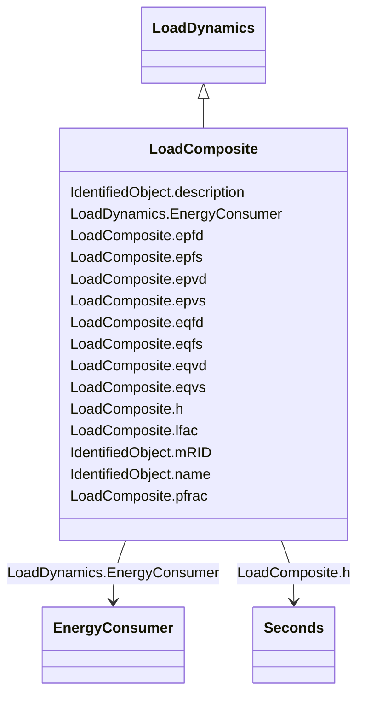

# LoadComposite

_Combined static load and induction motor load effects._

_The dynamics of the motor are simplified by linearizing the induction machine equations._

**URI**: [cim:LoadComposite](http://iec.ch/TC57/CIM100#LoadComposite) 
**Type**: Class

## Inheritance
* [IdentifiedObject](IdentifiedObject.md)
    * [LoadDynamics](LoadDynamics.md)
        * **LoadComposite**

## Attributes

| Name | URI | Cardinality and Range | Description | Inheritance |
| ---  | --- | --- | --- | --- |
| epvs | [cim:LoadComposite.epvs](http://iec.ch/TC57/CIM100#LoadComposite.epvs) | 1..1    float  | Active load-voltage dependence index (static) (<i>Epvs</i>) | direct |
| epfs | [cim:LoadComposite.epfs](http://iec.ch/TC57/CIM100#LoadComposite.epfs) | 1..1    float  | Active load-frequency dependence index (static) (<i>Epfs</i>) | direct |
| eqvs | [cim:LoadComposite.eqvs](http://iec.ch/TC57/CIM100#LoadComposite.eqvs) | 1..1    float  | Reactive load-voltage dependence index (static) (<i>Eqvs</i>) | direct |
| eqfs | [cim:LoadComposite.eqfs](http://iec.ch/TC57/CIM100#LoadComposite.eqfs) | 1..1    float  | Reactive load-frequency dependence index (static) (<i>Eqfs</i>) | direct |
| epvd | [cim:LoadComposite.epvd](http://iec.ch/TC57/CIM100#LoadComposite.epvd) | 1..1    float  | Active load-voltage dependence index (dynamic) (<i>Epvd</i>) | direct |
| epfd | [cim:LoadComposite.epfd](http://iec.ch/TC57/CIM100#LoadComposite.epfd) | 1..1    float  | Active load-frequency dependence index (dynamic) (<i>Epfd</i>) | direct |
| eqvd | [cim:LoadComposite.eqvd](http://iec.ch/TC57/CIM100#LoadComposite.eqvd) | 1..1    float  | Reactive load-voltage dependence index (dynamic) (<i>Eqvd</i>) | direct |
| eqfd | [cim:LoadComposite.eqfd](http://iec.ch/TC57/CIM100#LoadComposite.eqfd) | 1..1    float  | Reactive load-frequency dependence index (dynamic) (<i>Eqfd</i>) | direct |
| lfac | [cim:LoadComposite.lfac](http://iec.ch/TC57/CIM100#LoadComposite.lfac) | 1..1    float  | Loading factor (<i>L</i><i>fac</i>) | direct |
| h | [cim:LoadComposite.h](http://iec.ch/TC57/CIM100#LoadComposite.h) | 1..1    [Seconds](Seconds.md)  | Inertia constant (<i>H</i>) (&gt;= 0) | direct |
| pfrac | [cim:LoadComposite.pfrac](http://iec.ch/TC57/CIM100#LoadComposite.pfrac) | 1..1    float  | Fraction of constant-power load to be represented by this motor model (<i>P</... | direct |
| EnergyConsumer | [cim:LoadDynamics.EnergyConsumer](http://iec.ch/TC57/CIM100#LoadDynamics.EnergyConsumer) | 0..*    [EnergyConsumer](EnergyConsumer.md)  | Energy consumer to which this dynamics load model applies | [LoadDynamics](LoadDynamics.md) |
| description | [cim:IdentifiedObject.description](http://iec.ch/TC57/CIM100#IdentifiedObject.description) | 0..1    string  | The description is a free human readable text describing or naming the object | [IdentifiedObject](IdentifiedObject.md) |
| mRID | [cim:IdentifiedObject.mRID](http://iec.ch/TC57/CIM100#IdentifiedObject.mRID) | 1..1    string  | Master resource identifier issued by a model authority | [IdentifiedObject](IdentifiedObject.md) |
| name | [cim:IdentifiedObject.name](http://iec.ch/TC57/CIM100#IdentifiedObject.name) | 0..1    string  | The name is any free human readable and possibly non unique text naming the o... | [IdentifiedObject](IdentifiedObject.md) |

## Identifier and Mapping Information

### Schema Source

* from schema: http://iec.ch/TC57/ns/CIM/Dynamics-EU#Package_DynamicsProfile

## Mappings

| Mapping Type | Mapped Value |
| ---  | ---  |
| self | cim:LoadComposite |
| native | this:LoadComposite |

