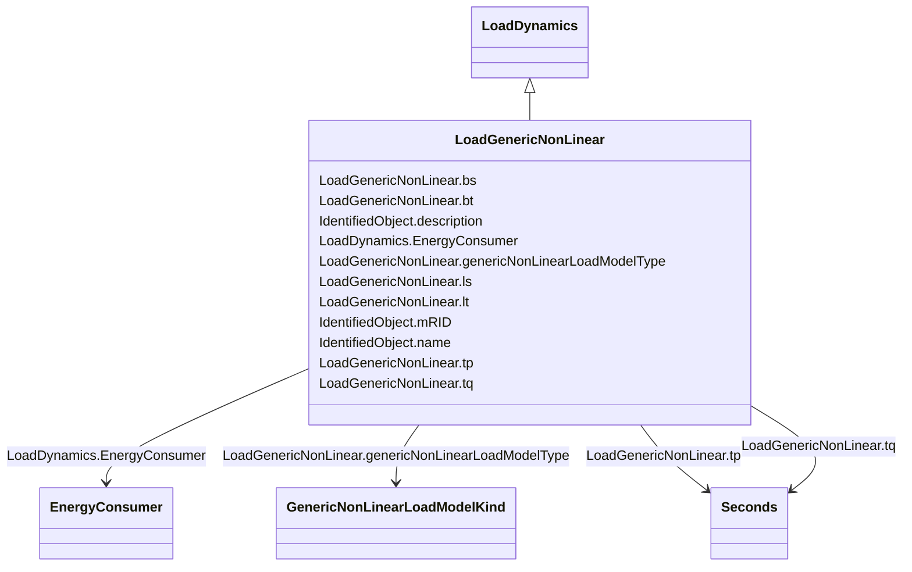

# LoadGenericNonLinear

_Generic non-linear dynamic (GNLD) load. This model can be used in mid-term and long-term voltage stability simulations (i.e., to study voltage collapse), as it can replace a more detailed representation of aggregate load, including induction motors, thermostatically controlled and static loads._

**URI**: [cim:LoadGenericNonLinear](http://iec.ch/TC57/CIM100#LoadGenericNonLinear) 
**Type**: Class

## Inheritance
* [IdentifiedObject](IdentifiedObject.md)
    * [LoadDynamics](LoadDynamics.md)
        * **LoadGenericNonLinear**

## Attributes

| Name | URI | Cardinality and Range | Description | Inheritance |
| ---  | --- | --- | --- | --- |
| genericNonLinearLoadModelType | [cim:LoadGenericNonLinear.genericNonLinearLoadModelType](http://iec.ch/TC57/CIM100#LoadGenericNonLinear.genericNonLinearLoadModelType) | 1..1    [GenericNonLinearLoadModelKind](GenericNonLinearLoadModelKind.md)  | Type of generic non-linear load model | direct |
| tp | [cim:LoadGenericNonLinear.tp](http://iec.ch/TC57/CIM100#LoadGenericNonLinear.tp) | 1..1    [Seconds](Seconds.md)  | Time constant of lag function of active power (<i>T</i><i>P</i>) (... | direct |
| tq | [cim:LoadGenericNonLinear.tq](http://iec.ch/TC57/CIM100#LoadGenericNonLinear.tq) | 1..1    [Seconds](Seconds.md)  | Time constant of lag function of reactive power (<i>T</i><i>Q</i>)... | direct |
| ls | [cim:LoadGenericNonLinear.ls](http://iec.ch/TC57/CIM100#LoadGenericNonLinear.ls) | 1..1    float  | Steady state voltage index for active power (<i>LS</i>) | direct |
| lt | [cim:LoadGenericNonLinear.lt](http://iec.ch/TC57/CIM100#LoadGenericNonLinear.lt) | 1..1    float  | Transient voltage index for active power (<i>LT</i>) | direct |
| bs | [cim:LoadGenericNonLinear.bs](http://iec.ch/TC57/CIM100#LoadGenericNonLinear.bs) | 1..1    float  | Steady state voltage index for reactive power (<i>BS</i>) | direct |
| bt | [cim:LoadGenericNonLinear.bt](http://iec.ch/TC57/CIM100#LoadGenericNonLinear.bt) | 1..1    float  | Transient voltage index for reactive power (<i>BT</i>) | direct |
| EnergyConsumer | [cim:LoadDynamics.EnergyConsumer](http://iec.ch/TC57/CIM100#LoadDynamics.EnergyConsumer) | 0..*    [EnergyConsumer](EnergyConsumer.md)  | Energy consumer to which this dynamics load model applies | [LoadDynamics](LoadDynamics.md) |
| description | [cim:IdentifiedObject.description](http://iec.ch/TC57/CIM100#IdentifiedObject.description) | 0..1    string  | The description is a free human readable text describing or naming the object | [IdentifiedObject](IdentifiedObject.md) |
| mRID | [cim:IdentifiedObject.mRID](http://iec.ch/TC57/CIM100#IdentifiedObject.mRID) | 1..1    string  | Master resource identifier issued by a model authority | [IdentifiedObject](IdentifiedObject.md) |
| name | [cim:IdentifiedObject.name](http://iec.ch/TC57/CIM100#IdentifiedObject.name) | 0..1    string  | The name is any free human readable and possibly non unique text naming the o... | [IdentifiedObject](IdentifiedObject.md) |

## Identifier and Mapping Information

### Schema Source

* from schema: http://iec.ch/TC57/ns/CIM/Dynamics-EU#Package_DynamicsProfile

## Mappings

| Mapping Type | Mapped Value |
| ---  | ---  |
| self | cim:LoadGenericNonLinear |
| native | this:LoadGenericNonLinear |

