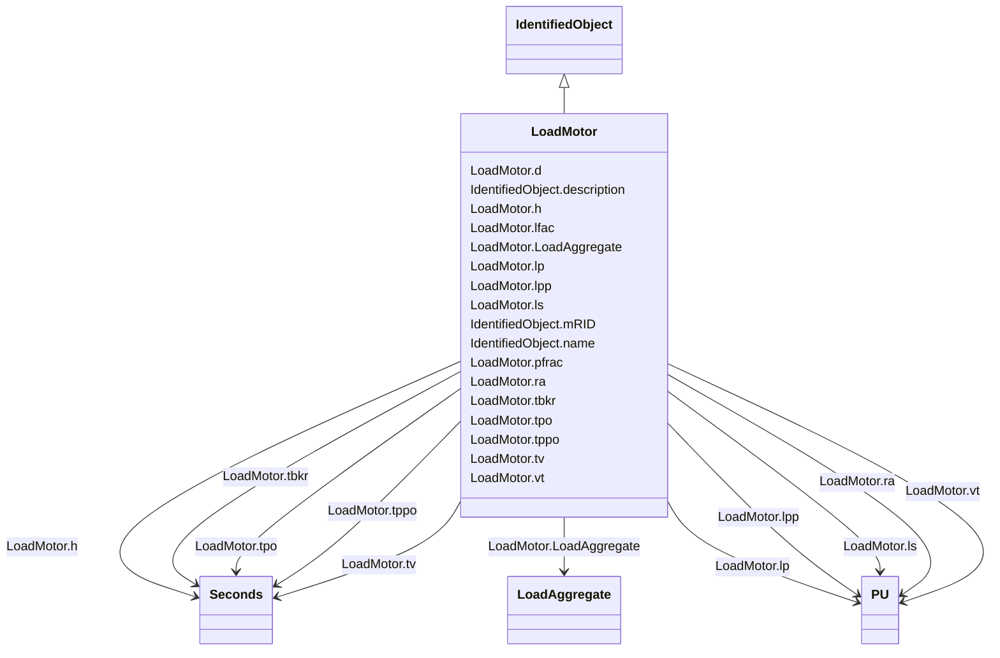

# LoadMotor

_Aggregate induction motor load. This model is used to represent a fraction of an ordinary load as "induction motor load".  It allows a load that is treated as an ordinary constant power in power flow analysis to be represented by an induction motor in dynamic simulation. This model is intended for representation of aggregations of many motors dispersed through a load represented at a high voltage bus but where there is no information on the characteristics of individual motors._

_Either a "one-cage" or "two-cage" model of the induction machine can be modelled. Magnetic saturation is not modelled._

_This model treats a fraction of the constant power part of a load as a motor. During initialisation, the initial power drawn by the motor is set equal to <i>Pfrac</i> times the constant <i>P</i> part of the static load.  The remainder of the load is left as a static load._

_The reactive power demand of the motor is calculated during initialisation as a function of voltage at the load bus. This reactive power demand can be less than or greater than the constant <i>Q</i> component of the load.  If the motor's reactive demand is greater than the constant <i>Q</i> component of the load, the model inserts a shunt capacitor at the terminal of the motor to bring its reactive demand down to equal the constant <i>Q</i> reactive load.  _

_If an induction motor load model and a static load model are both present for a load, the motor <i>Pfrac</i> is assumed to be subtracted from the power flow constant <i>P</i> load before the static load model is applied.  The remainder of the load, if any, is then represented by the static load model._

**URI**: [cim:LoadMotor](http://iec.ch/TC57/CIM100#LoadMotor) 
**Type**: Class

## Inheritance
* [IdentifiedObject](IdentifiedObject.md)
    * **LoadMotor**

## Attributes

| Name | URI | Cardinality and Range | Description | Inheritance |
| ---  | --- | --- | --- | --- |
| LoadAggregate | [cim:LoadMotor.LoadAggregate](http://iec.ch/TC57/CIM100#LoadMotor.LoadAggregate) | 1..1    [LoadAggregate](LoadAggregate.md)  | Aggregate load to which this aggregate motor (dynamic) load belongs | direct |
| pfrac | [cim:LoadMotor.pfrac](http://iec.ch/TC57/CIM100#LoadMotor.pfrac) | 1..1    float  | Fraction of constant-power load to be represented by this motor model (<i>Pfr... | direct |
| lfac | [cim:LoadMotor.lfac](http://iec.ch/TC57/CIM100#LoadMotor.lfac) | 1..1    float  | Loading factor (<i>Lfac</i>) | direct |
| ls | [cim:LoadMotor.ls](http://iec.ch/TC57/CIM100#LoadMotor.ls) | 1..1    [PU](PU.md)  | Synchronous reactance (<i>Ls</i>) | direct |
| lp | [cim:LoadMotor.lp](http://iec.ch/TC57/CIM100#LoadMotor.lp) | 1..1    [PU](PU.md)  | Transient reactance (<i>Lp</i>) | direct |
| lpp | [cim:LoadMotor.lpp](http://iec.ch/TC57/CIM100#LoadMotor.lpp) | 1..1    [PU](PU.md)  | Subtransient reactance (<i>Lpp</i>) | direct |
| ra | [cim:LoadMotor.ra](http://iec.ch/TC57/CIM100#LoadMotor.ra) | 1..1    [PU](PU.md)  | Stator resistance (<i>Ra</i>) | direct |
| tpo | [cim:LoadMotor.tpo](http://iec.ch/TC57/CIM100#LoadMotor.tpo) | 1..1    [Seconds](Seconds.md)  | Transient rotor time constant (<i>Tpo</i>) (&gt;= 0) | direct |
| tppo | [cim:LoadMotor.tppo](http://iec.ch/TC57/CIM100#LoadMotor.tppo) | 1..1    [Seconds](Seconds.md)  | Subtransient rotor time constant (<i>Tppo</i>) (&gt;= 0) | direct |
| h | [cim:LoadMotor.h](http://iec.ch/TC57/CIM100#LoadMotor.h) | 1..1    [Seconds](Seconds.md)  | Inertia constant (<i>H</i>) (&gt;= 0) | direct |
| d | [cim:LoadMotor.d](http://iec.ch/TC57/CIM100#LoadMotor.d) | 1..1    float  | Damping factor (<i>D</i>) | direct |
| vt | [cim:LoadMotor.vt](http://iec.ch/TC57/CIM100#LoadMotor.vt) | 1..1    [PU](PU.md)  | Voltage threshold for tripping (<i>Vt</i>) | direct |
| tv | [cim:LoadMotor.tv](http://iec.ch/TC57/CIM100#LoadMotor.tv) | 1..1    [Seconds](Seconds.md)  | Voltage trip pickup time (<i>Tv</i>) (&gt;= 0) | direct |
| tbkr | [cim:LoadMotor.tbkr](http://iec.ch/TC57/CIM100#LoadMotor.tbkr) | 1..1    [Seconds](Seconds.md)  | Circuit breaker operating time (<i>Tbkr</i>) (&gt;= 0) | direct |
| description | [cim:IdentifiedObject.description](http://iec.ch/TC57/CIM100#IdentifiedObject.description) | 0..1    string  | The description is a free human readable text describing or naming the object | [IdentifiedObject](IdentifiedObject.md) |
| mRID | [cim:IdentifiedObject.mRID](http://iec.ch/TC57/CIM100#IdentifiedObject.mRID) | 1..1    string  | Master resource identifier issued by a model authority | [IdentifiedObject](IdentifiedObject.md) |
| name | [cim:IdentifiedObject.name](http://iec.ch/TC57/CIM100#IdentifiedObject.name) | 0..1    string  | The name is any free human readable and possibly non unique text naming the o... | [IdentifiedObject](IdentifiedObject.md) |

## Usages

| used by | used in | type | used |
| ---  | --- | --- | --- |
| [LoadAggregate](LoadAggregate.md) | LoadMotor | range | [LoadMotor](LoadMotor.md) |

## Identifier and Mapping Information

### Schema Source

* from schema: http://iec.ch/TC57/ns/CIM/Dynamics-EU#Package_DynamicsProfile

## Mappings

| Mapping Type | Mapped Value |
| ---  | ---  |
| self | cim:LoadMotor |
| native | this:LoadMotor |

