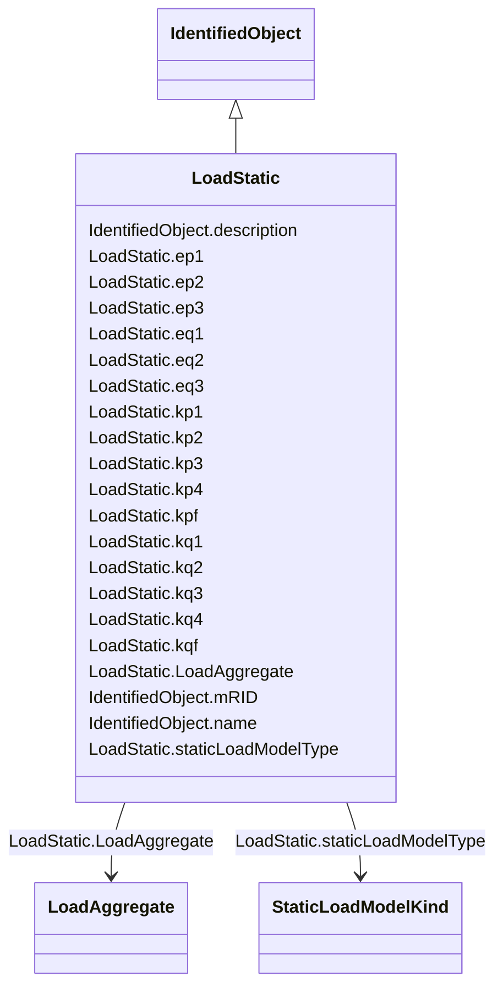

# LoadStatic

_General static load. This model represents the sensitivity of the real and reactive power consumed by the load to the amplitude and frequency of the bus voltage._

**URI**: [cim:LoadStatic](http://iec.ch/TC57/CIM100#LoadStatic) 
**Type**: Class

## Inheritance
* [IdentifiedObject](IdentifiedObject.md)
    * **LoadStatic**

## Attributes

| Name | URI | Cardinality and Range | Description | Inheritance |
| ---  | --- | --- | --- | --- |
| LoadAggregate | [cim:LoadStatic.LoadAggregate](http://iec.ch/TC57/CIM100#LoadStatic.LoadAggregate) | 1..1    [LoadAggregate](LoadAggregate.md)  | Aggregate load to which this aggregate static load belongs | direct |
| staticLoadModelType | [cim:LoadStatic.staticLoadModelType](http://iec.ch/TC57/CIM100#LoadStatic.staticLoadModelType) | 1..1    [StaticLoadModelKind](StaticLoadModelKind.md)  | Type of static load model | direct |
| kp1 | [cim:LoadStatic.kp1](http://iec.ch/TC57/CIM100#LoadStatic.kp1) | 0..1    float  | First term voltage coefficient for active power (<i>K</i><i>p1</i>... | direct |
| kp2 | [cim:LoadStatic.kp2](http://iec.ch/TC57/CIM100#LoadStatic.kp2) | 0..1    float  | Second term voltage coefficient for active power (<i>K</i><i>p2</i... | direct |
| kp3 | [cim:LoadStatic.kp3](http://iec.ch/TC57/CIM100#LoadStatic.kp3) | 0..1    float  | Third term voltage coefficient for active power (<i>K</i><i>p3</i>... | direct |
| kp4 | [cim:LoadStatic.kp4](http://iec.ch/TC57/CIM100#LoadStatic.kp4) | 0..1    float  | Frequency coefficient for active power (<i>K</i><i>p4</i>)  (not =... | direct |
| ep1 | [cim:LoadStatic.ep1](http://iec.ch/TC57/CIM100#LoadStatic.ep1) | 0..1    float  | First term voltage exponent for active power (<i>Ep1</i>) | direct |
| ep2 | [cim:LoadStatic.ep2](http://iec.ch/TC57/CIM100#LoadStatic.ep2) | 0..1    float  | Second term voltage exponent for active power (<i>Ep2</i>) | direct |
| ep3 | [cim:LoadStatic.ep3](http://iec.ch/TC57/CIM100#LoadStatic.ep3) | 0..1    float  | Third term voltage exponent for active power (<i>Ep3</i>) | direct |
| kpf | [cim:LoadStatic.kpf](http://iec.ch/TC57/CIM100#LoadStatic.kpf) | 0..1    float  | Frequency deviation coefficient for active power (<i>K</i><i>pf</i... | direct |
| kq1 | [cim:LoadStatic.kq1](http://iec.ch/TC57/CIM100#LoadStatic.kq1) | 0..1    float  | First term voltage coefficient for reactive power (<i>K</i><i>q1</... | direct |
| kq2 | [cim:LoadStatic.kq2](http://iec.ch/TC57/CIM100#LoadStatic.kq2) | 0..1    float  | Second term voltage coefficient for reactive power (<i>K</i><i>q2<... | direct |
| kq3 | [cim:LoadStatic.kq3](http://iec.ch/TC57/CIM100#LoadStatic.kq3) | 0..1    float  | Third term voltage coefficient for reactive power (<i>K</i><i>q3</... | direct |
| kq4 | [cim:LoadStatic.kq4](http://iec.ch/TC57/CIM100#LoadStatic.kq4) | 0..1    float  | Frequency coefficient for reactive power (<i>K</i><i>q4</i>)  (not... | direct |
| eq1 | [cim:LoadStatic.eq1](http://iec.ch/TC57/CIM100#LoadStatic.eq1) | 0..1    float  | First term voltage exponent for reactive power (<i>Eq1</i>) | direct |
| eq2 | [cim:LoadStatic.eq2](http://iec.ch/TC57/CIM100#LoadStatic.eq2) | 0..1    float  | Second term voltage exponent for reactive power (<i>Eq2</i>) | direct |
| eq3 | [cim:LoadStatic.eq3](http://iec.ch/TC57/CIM100#LoadStatic.eq3) | 0..1    float  | Third term voltage exponent for reactive power (<i>Eq3</i>) | direct |
| kqf | [cim:LoadStatic.kqf](http://iec.ch/TC57/CIM100#LoadStatic.kqf) | 0..1    float  | Frequency deviation coefficient for reactive power (<i>K</i><i>qf<... | direct |
| description | [cim:IdentifiedObject.description](http://iec.ch/TC57/CIM100#IdentifiedObject.description) | 0..1    string  | The description is a free human readable text describing or naming the object | [IdentifiedObject](IdentifiedObject.md) |
| mRID | [cim:IdentifiedObject.mRID](http://iec.ch/TC57/CIM100#IdentifiedObject.mRID) | 1..1    string  | Master resource identifier issued by a model authority | [IdentifiedObject](IdentifiedObject.md) |
| name | [cim:IdentifiedObject.name](http://iec.ch/TC57/CIM100#IdentifiedObject.name) | 0..1    string  | The name is any free human readable and possibly non unique text naming the o... | [IdentifiedObject](IdentifiedObject.md) |

## Usages

| used by | used in | type | used |
| ---  | --- | --- | --- |
| [LoadAggregate](LoadAggregate.md) | LoadStatic | range | [LoadStatic](LoadStatic.md) |

## Identifier and Mapping Information

### Schema Source

* from schema: http://iec.ch/TC57/ns/CIM/Dynamics-EU#Package_DynamicsProfile

## Mappings

| Mapping Type | Mapped Value |
| ---  | ---  |
| self | cim:LoadStatic |
| native | this:LoadStatic |

