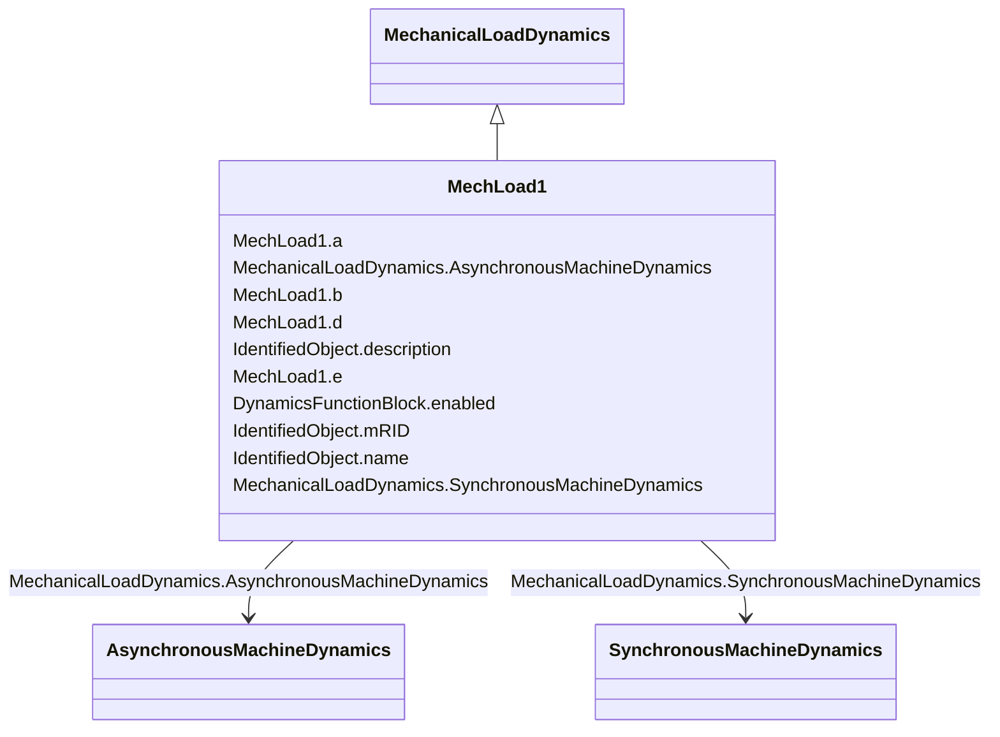

# MechLoad1

_Mechanical load model type 1._

**URI**: [cim:MechLoad1](http://iec.ch/TC57/CIM100#MechLoad1) 
**Type**: Class

## Inheritance
* [IdentifiedObject](IdentifiedObject.md)
    * [DynamicsFunctionBlock](DynamicsFunctionBlock.md)
        * [MechanicalLoadDynamics](MechanicalLoadDynamics.md)
            * **MechLoad1**

## Attributes

| Name | URI | Cardinality and Range | Description | Inheritance |
| ---  | --- | --- | --- | --- |
| a | [cim:MechLoad1.a](http://iec.ch/TC57/CIM100#MechLoad1.a) | 1    float  | Speed squared coefficient (<i>a</i>) | direct |
| b | [cim:MechLoad1.b](http://iec.ch/TC57/CIM100#MechLoad1.b) | 1    float  | Speed coefficient (<i>b</i>) | direct |
| d | [cim:MechLoad1.d](http://iec.ch/TC57/CIM100#MechLoad1.d) | 1    float  | Speed to the exponent coefficient (<i>d</i>) | direct |
| e | [cim:MechLoad1.e](http://iec.ch/TC57/CIM100#MechLoad1.e) | 1    float  | Exponent (<i>e</i>) | direct |
| SynchronousMachineDynamics | [cim:MechanicalLoadDynamics.SynchronousMachineDynamics](http://iec.ch/TC57/CIM100#MechanicalLoadDynamics.SynchronousMachineDynamics) | 0..1    [SynchronousMachineDynamics](SynchronousMachineDynamics.md)  | Synchronous machine model with which this mechanical load model is associated | [MechanicalLoadDynamics](MechanicalLoadDynamics.md) |
| AsynchronousMachineDynamics | [cim:MechanicalLoadDynamics.AsynchronousMachineDynamics](http://iec.ch/TC57/CIM100#MechanicalLoadDynamics.AsynchronousMachineDynamics) | 0..1    [AsynchronousMachineDynamics](AsynchronousMachineDynamics.md)  | Asynchronous machine model with which this mechanical load model is associate... | [MechanicalLoadDynamics](MechanicalLoadDynamics.md) |
| enabled | [cim:DynamicsFunctionBlock.enabled](http://iec.ch/TC57/CIM100#DynamicsFunctionBlock.enabled) | 1    boolean  | Function block used indicator | [DynamicsFunctionBlock](DynamicsFunctionBlock.md) |
| description | [cim:IdentifiedObject.description](http://iec.ch/TC57/CIM100#IdentifiedObject.description) | 0..1    string  | The description is a free human readable text describing or naming the object | [IdentifiedObject](IdentifiedObject.md) |
| mRID | [cim:IdentifiedObject.mRID](http://iec.ch/TC57/CIM100#IdentifiedObject.mRID) | 1    string  | Master resource identifier issued by a model authority | [IdentifiedObject](IdentifiedObject.md) |
| name | [cim:IdentifiedObject.name](http://iec.ch/TC57/CIM100#IdentifiedObject.name) | 0..1    string  | The name is any free human readable and possibly non unique text naming the o... | [IdentifiedObject](IdentifiedObject.md) |

## Identifier and Mapping Information

### Schema Source

* from schema: http://iec.ch/TC57/ns/CIM/Dynamics-EU#Package_DynamicsProfile

## Mappings

| Mapping Type | Mapped Value |
| ---  | ---  |
| self | cim:MechLoad1 |
| native | this:MechLoad1 |

