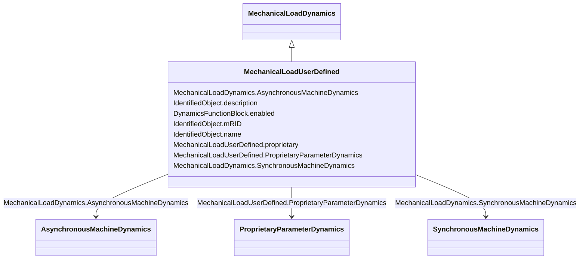

# MechanicalLoadUserDefined

_Mechanical load function block whose dynamic behaviour is described by a user-defined model._

**URI**: [cim:MechanicalLoadUserDefined](http://iec.ch/TC57/CIM100#MechanicalLoadUserDefined) 
**Type**: Class

## Inheritance
* [IdentifiedObject](IdentifiedObject.md)
    * [DynamicsFunctionBlock](DynamicsFunctionBlock.md)
        * [MechanicalLoadDynamics](MechanicalLoadDynamics.md)
            * **MechanicalLoadUserDefined**

## Attributes

| Name | URI | Cardinality and Range | Description | Inheritance |
| ---  | --- | --- | --- | --- |
| proprietary | [cim:MechanicalLoadUserDefined.proprietary](http://iec.ch/TC57/CIM100#MechanicalLoadUserDefined.proprietary) | 1..1    boolean  | Behaviour is based on a proprietary model as opposed to a detailed model | direct |
| ProprietaryParameterDynamics | [cim:MechanicalLoadUserDefined.ProprietaryParameterDynamics](http://iec.ch/TC57/CIM100#MechanicalLoadUserDefined.ProprietaryParameterDynamics) | 0..*    [ProprietaryParameterDynamics](ProprietaryParameterDynamics.md)  | Parameter of this proprietary user-defined model | direct |
| SynchronousMachineDynamics | [cim:MechanicalLoadDynamics.SynchronousMachineDynamics](http://iec.ch/TC57/CIM100#MechanicalLoadDynamics.SynchronousMachineDynamics) | 0..1    [SynchronousMachineDynamics](SynchronousMachineDynamics.md)  | Synchronous machine model with which this mechanical load model is associated | [MechanicalLoadDynamics](MechanicalLoadDynamics.md) |
| AsynchronousMachineDynamics | [cim:MechanicalLoadDynamics.AsynchronousMachineDynamics](http://iec.ch/TC57/CIM100#MechanicalLoadDynamics.AsynchronousMachineDynamics) | 0..1    [AsynchronousMachineDynamics](AsynchronousMachineDynamics.md)  | Asynchronous machine model with which this mechanical load model is associate... | [MechanicalLoadDynamics](MechanicalLoadDynamics.md) |
| enabled | [cim:DynamicsFunctionBlock.enabled](http://iec.ch/TC57/CIM100#DynamicsFunctionBlock.enabled) | 1..1    boolean  | Function block used indicator | [DynamicsFunctionBlock](DynamicsFunctionBlock.md) |
| description | [cim:IdentifiedObject.description](http://iec.ch/TC57/CIM100#IdentifiedObject.description) | 0..1    string  | The description is a free human readable text describing or naming the object | [IdentifiedObject](IdentifiedObject.md) |
| mRID | [cim:IdentifiedObject.mRID](http://iec.ch/TC57/CIM100#IdentifiedObject.mRID) | 1..1    string  | Master resource identifier issued by a model authority | [IdentifiedObject](IdentifiedObject.md) |
| name | [cim:IdentifiedObject.name](http://iec.ch/TC57/CIM100#IdentifiedObject.name) | 0..1    string  | The name is any free human readable and possibly non unique text naming the o... | [IdentifiedObject](IdentifiedObject.md) |

## Usages

| used by | used in | type | used |
| ---  | --- | --- | --- |
| [ProprietaryParameterDynamics](ProprietaryParameterDynamics.md) | MechanicalLoadUserDefined | range | [MechanicalLoadUserDefined](MechanicalLoadUserDefined.md) |

## Identifier and Mapping Information

### Schema Source

* from schema: http://iec.ch/TC57/ns/CIM/Dynamics-EU#Package_DynamicsProfile

## Mappings

| Mapping Type | Mapped Value |
| ---  | ---  |
| self | cim:MechanicalLoadUserDefined |
| native | this:MechanicalLoadUserDefined |

