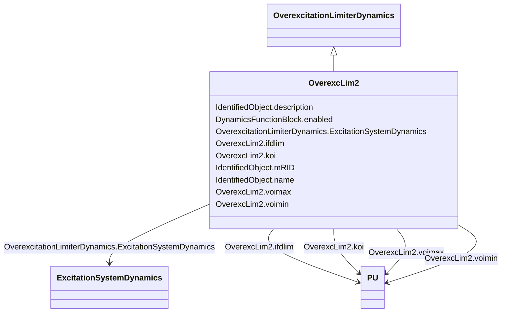

# OverexcLim2

_Different from LimIEEEOEL, LimOEL2 has a fixed pickup threshold and reduces the excitation set-point by means of a non-windup integral regulator._

_<i>Irated</i> is the rated machine excitation current (calculated from nameplate conditions: <i>V</i><i>nom</i>, <i>P</i><i>nom</i>, <i>CosPhi</i><i>nom</i>)._

**URI**: [cim:OverexcLim2](http://iec.ch/TC57/CIM100#OverexcLim2) 
**Type**: Class

## Inheritance
* [IdentifiedObject](IdentifiedObject.md)
    * [DynamicsFunctionBlock](DynamicsFunctionBlock.md)
        * [OverexcitationLimiterDynamics](OverexcitationLimiterDynamics.md)
            * **OverexcLim2**

## Attributes

| Name | URI | Cardinality and Range | Description | Inheritance |
| ---  | --- | --- | --- | --- |
| koi | [cim:OverexcLim2.koi](http://iec.ch/TC57/CIM100#OverexcLim2.koi) | 1    [PU](PU.md)  | Gain Over excitation limiter (<i>K</i><i>OI</i>) | direct |
| voimax | [cim:OverexcLim2.voimax](http://iec.ch/TC57/CIM100#OverexcLim2.voimax) | 1    [PU](PU.md)  | Maximum error signal (<i>V</i><i>OIMAX</i>) (&gt; OverexcLim2 | direct |
| voimin | [cim:OverexcLim2.voimin](http://iec.ch/TC57/CIM100#OverexcLim2.voimin) | 1    [PU](PU.md)  | Minimum error signal (<i>V</i><i>OIMIN</i>) (&lt; OverexcLim2 | direct |
| ifdlim | [cim:OverexcLim2.ifdlim](http://iec.ch/TC57/CIM100#OverexcLim2.ifdlim) | 1    [PU](PU.md)  | Limit value of rated field current (<i>I</i><i>FDLIM</i>) | direct |
| ExcitationSystemDynamics | [cim:OverexcitationLimiterDynamics.ExcitationSystemDynamics](http://iec.ch/TC57/CIM100#OverexcitationLimiterDynamics.ExcitationSystemDynamics) | 1    [ExcitationSystemDynamics](ExcitationSystemDynamics.md)  | Excitation system model with which this overexcitation limiter model is assoc... | [OverexcitationLimiterDynamics](OverexcitationLimiterDynamics.md) |
| enabled | [cim:DynamicsFunctionBlock.enabled](http://iec.ch/TC57/CIM100#DynamicsFunctionBlock.enabled) | 1    boolean  | Function block used indicator | [DynamicsFunctionBlock](DynamicsFunctionBlock.md) |
| description | [cim:IdentifiedObject.description](http://iec.ch/TC57/CIM100#IdentifiedObject.description) | 0..1    string  | The description is a free human readable text describing or naming the object | [IdentifiedObject](IdentifiedObject.md) |
| mRID | [cim:IdentifiedObject.mRID](http://iec.ch/TC57/CIM100#IdentifiedObject.mRID) | 1    string  | Master resource identifier issued by a model authority | [IdentifiedObject](IdentifiedObject.md) |
| name | [cim:IdentifiedObject.name](http://iec.ch/TC57/CIM100#IdentifiedObject.name) | 0..1    string  | The name is any free human readable and possibly non unique text naming the o... | [IdentifiedObject](IdentifiedObject.md) |

## Identifier and Mapping Information

### Schema Source

* from schema: http://iec.ch/TC57/ns/CIM/Dynamics-EU#Package_DynamicsProfile

## Mappings

| Mapping Type | Mapped Value |
| ---  | ---  |
| self | cim:OverexcLim2 |
| native | this:OverexcLim2 |

