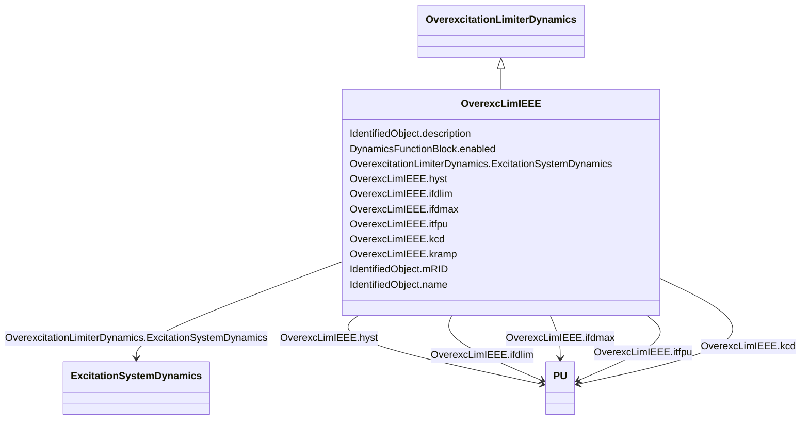

# OverexcLimIEEE

_The over excitation limiter model is intended to represent the significant features of OELs necessary for some large-scale system studies. It is the result of a pragmatic approach to obtain a model that can be widely applied with attainable data from generator owners. An attempt to include all variations in the functionality of OELs and duplicate how they interact with the rest of the excitation systems would likely result in a level of application insufficient for the studies for which they are intended._

_Reference: IEEE OEL 421.5-2005, 9._

**URI**: [cim:OverexcLimIEEE](http://iec.ch/TC57/CIM100#OverexcLimIEEE) 
**Type**: Class

## Inheritance
* [IdentifiedObject](IdentifiedObject.md)
    * [DynamicsFunctionBlock](DynamicsFunctionBlock.md)
        * [OverexcitationLimiterDynamics](OverexcitationLimiterDynamics.md)
            * **OverexcLimIEEE**

## Attributes

| Name | URI | Cardinality and Range | Description | Inheritance |
| ---  | --- | --- | --- | --- |
| itfpu | [cim:OverexcLimIEEE.itfpu](http://iec.ch/TC57/CIM100#OverexcLimIEEE.itfpu) | 1..1    [PU](PU.md)  | OEL timed field current limiter pickup level (<i>I</i><i>TFPU</i>) | direct |
| ifdmax | [cim:OverexcLimIEEE.ifdmax](http://iec.ch/TC57/CIM100#OverexcLimIEEE.ifdmax) | 1..1    [PU](PU.md)  | OEL instantaneous field current limit (<i>I</i><i>FDMAX</i>) | direct |
| ifdlim | [cim:OverexcLimIEEE.ifdlim](http://iec.ch/TC57/CIM100#OverexcLimIEEE.ifdlim) | 1..1    [PU](PU.md)  | OEL timed field current limit (<i>I</i><i>FDLIM</i>) | direct |
| hyst | [cim:OverexcLimIEEE.hyst](http://iec.ch/TC57/CIM100#OverexcLimIEEE.hyst) | 1..1    [PU](PU.md)  | OEL pickup/drop-out hysteresis (<i>HYST</i>) | direct |
| kcd | [cim:OverexcLimIEEE.kcd](http://iec.ch/TC57/CIM100#OverexcLimIEEE.kcd) | 1..1    [PU](PU.md)  | OEL cooldown gain (<i>K</i><i>CD</i>) | direct |
| kramp | [cim:OverexcLimIEEE.kramp](http://iec.ch/TC57/CIM100#OverexcLimIEEE.kramp) | 1..1    float  | OEL ramped limit rate (<i>K</i><i>RAMP</i>) | direct |
| ExcitationSystemDynamics | [cim:OverexcitationLimiterDynamics.ExcitationSystemDynamics](http://iec.ch/TC57/CIM100#OverexcitationLimiterDynamics.ExcitationSystemDynamics) | 1..1    [ExcitationSystemDynamics](ExcitationSystemDynamics.md)  | Excitation system model with which this overexcitation limiter model is assoc... | [OverexcitationLimiterDynamics](OverexcitationLimiterDynamics.md) |
| enabled | [cim:DynamicsFunctionBlock.enabled](http://iec.ch/TC57/CIM100#DynamicsFunctionBlock.enabled) | 1..1    boolean  | Function block used indicator | [DynamicsFunctionBlock](DynamicsFunctionBlock.md) |
| description | [cim:IdentifiedObject.description](http://iec.ch/TC57/CIM100#IdentifiedObject.description) | 0..1    string  | The description is a free human readable text describing or naming the object | [IdentifiedObject](IdentifiedObject.md) |
| mRID | [cim:IdentifiedObject.mRID](http://iec.ch/TC57/CIM100#IdentifiedObject.mRID) | 1..1    string  | Master resource identifier issued by a model authority | [IdentifiedObject](IdentifiedObject.md) |
| name | [cim:IdentifiedObject.name](http://iec.ch/TC57/CIM100#IdentifiedObject.name) | 0..1    string  | The name is any free human readable and possibly non unique text naming the o... | [IdentifiedObject](IdentifiedObject.md) |

## Identifier and Mapping Information

### Schema Source

* from schema: http://iec.ch/TC57/ns/CIM/Dynamics-EU#Package_DynamicsProfile

## Mappings

| Mapping Type | Mapped Value |
| ---  | ---  |
| self | cim:OverexcLimIEEE |
| native | this:OverexcLimIEEE |

