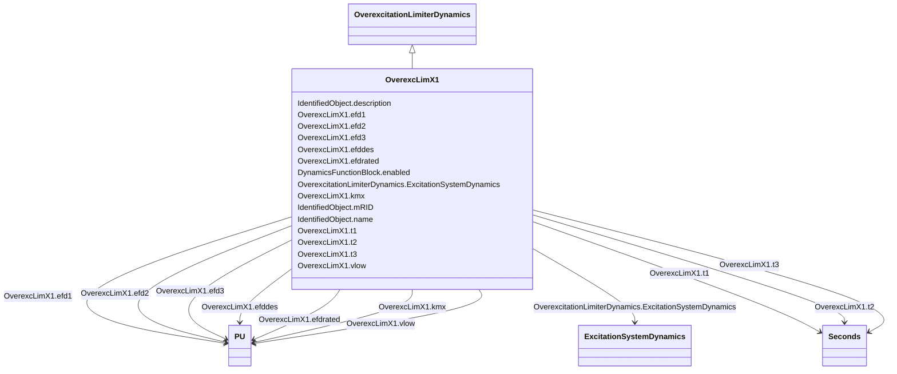

# OverexcLimX1

_Field voltage over excitation limiter._

**URI**: [cim:OverexcLimX1](http://iec.ch/TC57/CIM100#OverexcLimX1) 
**Type**: Class

## Inheritance
* [IdentifiedObject](IdentifiedObject.md)
    * [DynamicsFunctionBlock](DynamicsFunctionBlock.md)
        * [OverexcitationLimiterDynamics](OverexcitationLimiterDynamics.md)
            * **OverexcLimX1**

## Attributes

| Name | URI | Cardinality and Range | Description | Inheritance |
| ---  | --- | --- | --- | --- |
| efdrated | [cim:OverexcLimX1.efdrated](http://iec.ch/TC57/CIM100#OverexcLimX1.efdrated) | 1    [PU](PU.md)  | Rated field voltage (<i>EFD</i><i>RATED</i>) | direct |
| efd1 | [cim:OverexcLimX1.efd1](http://iec.ch/TC57/CIM100#OverexcLimX1.efd1) | 1    [PU](PU.md)  | Low voltage point on the inverse time characteristic (<i>EFD</i><i>1</su... | direct |
| t1 | [cim:OverexcLimX1.t1](http://iec.ch/TC57/CIM100#OverexcLimX1.t1) | 1    [Seconds](Seconds.md)  | Time to trip the exciter at the low voltage point on the inverse time charact... | direct |
| efd2 | [cim:OverexcLimX1.efd2](http://iec.ch/TC57/CIM100#OverexcLimX1.efd2) | 1    [PU](PU.md)  | Mid voltage point on the inverse time characteristic (<i>EFD</i><i>2</su... | direct |
| t2 | [cim:OverexcLimX1.t2](http://iec.ch/TC57/CIM100#OverexcLimX1.t2) | 1    [Seconds](Seconds.md)  | Time to trip the exciter at the mid voltage point on the inverse time charact... | direct |
| efd3 | [cim:OverexcLimX1.efd3](http://iec.ch/TC57/CIM100#OverexcLimX1.efd3) | 1    [PU](PU.md)  | High voltage point on the inverse time characteristic (<i>EFD</i><i>3</s... | direct |
| t3 | [cim:OverexcLimX1.t3](http://iec.ch/TC57/CIM100#OverexcLimX1.t3) | 1    [Seconds](Seconds.md)  | Time to trip the exciter at the high voltage point on the inverse time charac... | direct |
| efddes | [cim:OverexcLimX1.efddes](http://iec.ch/TC57/CIM100#OverexcLimX1.efddes) | 1    [PU](PU.md)  | Desired field voltage (<i>EFD</i><i>DES</i>) | direct |
| kmx | [cim:OverexcLimX1.kmx](http://iec.ch/TC57/CIM100#OverexcLimX1.kmx) | 1    [PU](PU.md)  | Gain (<i>K</i><i>MX</i>) | direct |
| vlow | [cim:OverexcLimX1.vlow](http://iec.ch/TC57/CIM100#OverexcLimX1.vlow) | 1    [PU](PU.md)  | Low voltage limit (<i>V</i><i>LOW</i>) (&gt; 0) | direct |
| ExcitationSystemDynamics | [cim:OverexcitationLimiterDynamics.ExcitationSystemDynamics](http://iec.ch/TC57/CIM100#OverexcitationLimiterDynamics.ExcitationSystemDynamics) | 1    [ExcitationSystemDynamics](ExcitationSystemDynamics.md)  | Excitation system model with which this overexcitation limiter model is assoc... | [OverexcitationLimiterDynamics](OverexcitationLimiterDynamics.md) |
| enabled | [cim:DynamicsFunctionBlock.enabled](http://iec.ch/TC57/CIM100#DynamicsFunctionBlock.enabled) | 1    boolean  | Function block used indicator | [DynamicsFunctionBlock](DynamicsFunctionBlock.md) |
| description | [cim:IdentifiedObject.description](http://iec.ch/TC57/CIM100#IdentifiedObject.description) | 0..1    string  | The description is a free human readable text describing or naming the object | [IdentifiedObject](IdentifiedObject.md) |
| mRID | [cim:IdentifiedObject.mRID](http://iec.ch/TC57/CIM100#IdentifiedObject.mRID) | 1    string  | Master resource identifier issued by a model authority | [IdentifiedObject](IdentifiedObject.md) |
| name | [cim:IdentifiedObject.name](http://iec.ch/TC57/CIM100#IdentifiedObject.name) | 0..1    string  | The name is any free human readable and possibly non unique text naming the o... | [IdentifiedObject](IdentifiedObject.md) |

## Identifier and Mapping Information

### Schema Source

* from schema: http://iec.ch/TC57/ns/CIM/Dynamics-EU#Package_DynamicsProfile

## Mappings

| Mapping Type | Mapped Value |
| ---  | ---  |
| self | cim:OverexcLimX1 |
| native | this:OverexcLimX1 |

