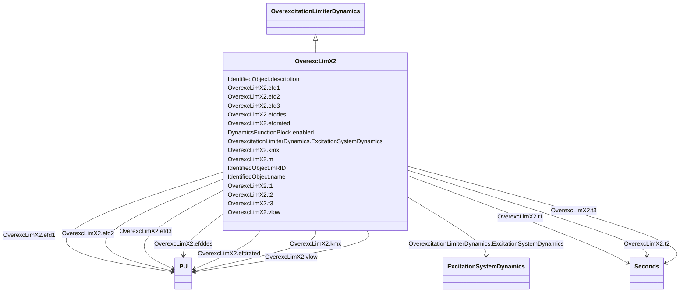

# OverexcLimX2

_Field voltage or current overexcitation limiter designed to protect the generator field of an AC machine with automatic excitation control from overheating due to prolonged overexcitation._

**URI**: [cim:OverexcLimX2](http://iec.ch/TC57/CIM100#OverexcLimX2) 
**Type**: Class

## Inheritance
* [IdentifiedObject](IdentifiedObject.md)
    * [DynamicsFunctionBlock](DynamicsFunctionBlock.md)
        * [OverexcitationLimiterDynamics](OverexcitationLimiterDynamics.md)
            * **OverexcLimX2**

## Attributes

| Name | URI | Cardinality and Range | Description | Inheritance |
| ---  | --- | --- | --- | --- |
| m | [cim:OverexcLimX2.m](http://iec.ch/TC57/CIM100#OverexcLimX2.m) | 1    boolean  | (<i>m</i>) | direct |
| efdrated | [cim:OverexcLimX2.efdrated](http://iec.ch/TC57/CIM100#OverexcLimX2.efdrated) | 1    [PU](PU.md)  | Rated field voltage if m = false or rated field current if m = true (<i>EFD</... | direct |
| efd1 | [cim:OverexcLimX2.efd1](http://iec.ch/TC57/CIM100#OverexcLimX2.efd1) | 1    [PU](PU.md)  | Low voltage or current point on the inverse time characteristic (<i>EFD</i><i... | direct |
| t1 | [cim:OverexcLimX2.t1](http://iec.ch/TC57/CIM100#OverexcLimX2.t1) | 1    [Seconds](Seconds.md)  | Time to trip the exciter at the low voltage or current point on the inverse t... | direct |
| efd2 | [cim:OverexcLimX2.efd2](http://iec.ch/TC57/CIM100#OverexcLimX2.efd2) | 1    [PU](PU.md)  | Mid voltage or current point on the inverse time characteristic (<i>EFD</i><i... | direct |
| t2 | [cim:OverexcLimX2.t2](http://iec.ch/TC57/CIM100#OverexcLimX2.t2) | 1    [Seconds](Seconds.md)  | Time to trip the exciter at the mid voltage or current point on the inverse t... | direct |
| efd3 | [cim:OverexcLimX2.efd3](http://iec.ch/TC57/CIM100#OverexcLimX2.efd3) | 1    [PU](PU.md)  | High voltage or current point on the inverse time characteristic (<i>EFD</i><... | direct |
| t3 | [cim:OverexcLimX2.t3](http://iec.ch/TC57/CIM100#OverexcLimX2.t3) | 1    [Seconds](Seconds.md)  | Time to trip the exciter at the high voltage or current point on the inverse ... | direct |
| efddes | [cim:OverexcLimX2.efddes](http://iec.ch/TC57/CIM100#OverexcLimX2.efddes) | 1    [PU](PU.md)  | Desired field voltage if <i>m</i> = false or desired field current if <i>m </... | direct |
| kmx | [cim:OverexcLimX2.kmx](http://iec.ch/TC57/CIM100#OverexcLimX2.kmx) | 1    [PU](PU.md)  | Gain (<i>K</i><i>MX</i>) | direct |
| vlow | [cim:OverexcLimX2.vlow](http://iec.ch/TC57/CIM100#OverexcLimX2.vlow) | 1    [PU](PU.md)  | Low voltage limit (<i>V</i><i>LOW</i>) (&gt; 0) | direct |
| ExcitationSystemDynamics | [cim:OverexcitationLimiterDynamics.ExcitationSystemDynamics](http://iec.ch/TC57/CIM100#OverexcitationLimiterDynamics.ExcitationSystemDynamics) | 1    [ExcitationSystemDynamics](ExcitationSystemDynamics.md)  | Excitation system model with which this overexcitation limiter model is assoc... | [OverexcitationLimiterDynamics](OverexcitationLimiterDynamics.md) |
| enabled | [cim:DynamicsFunctionBlock.enabled](http://iec.ch/TC57/CIM100#DynamicsFunctionBlock.enabled) | 1    boolean  | Function block used indicator | [DynamicsFunctionBlock](DynamicsFunctionBlock.md) |
| description | [cim:IdentifiedObject.description](http://iec.ch/TC57/CIM100#IdentifiedObject.description) | 0..1    string  | The description is a free human readable text describing or naming the object | [IdentifiedObject](IdentifiedObject.md) |
| mRID | [cim:IdentifiedObject.mRID](http://iec.ch/TC57/CIM100#IdentifiedObject.mRID) | 1    string  | Master resource identifier issued by a model authority | [IdentifiedObject](IdentifiedObject.md) |
| name | [cim:IdentifiedObject.name](http://iec.ch/TC57/CIM100#IdentifiedObject.name) | 0..1    string  | The name is any free human readable and possibly non unique text naming the o... | [IdentifiedObject](IdentifiedObject.md) |

## Identifier and Mapping Information

### Schema Source

* from schema: http://iec.ch/TC57/ns/CIM/Dynamics-EU#Package_DynamicsProfile

## Mappings

| Mapping Type | Mapped Value |
| ---  | ---  |
| self | cim:OverexcLimX2 |
| native | this:OverexcLimX2 |

