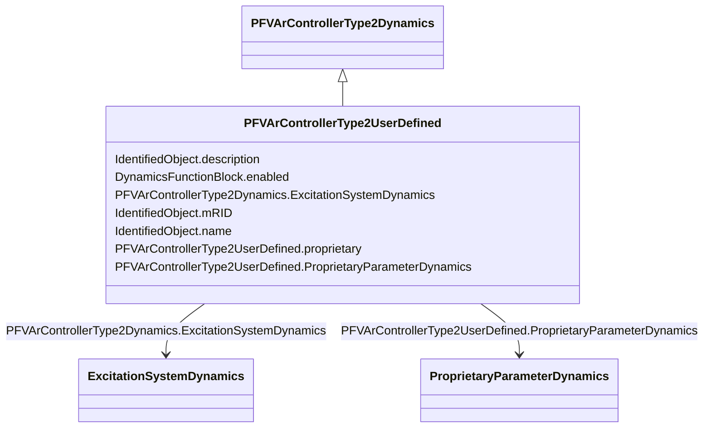

# PFVArControllerType2UserDefined

_Power factor or VAr controller type 2 function block whose dynamic behaviour is described by a user-defined model._

**URI**: [cim:PFVArControllerType2UserDefined](http://iec.ch/TC57/CIM100#PFVArControllerType2UserDefined) 
**Type**: Class

## Inheritance
* [IdentifiedObject](IdentifiedObject.md)
    * [DynamicsFunctionBlock](DynamicsFunctionBlock.md)
        * [PFVArControllerType2Dynamics](PFVArControllerType2Dynamics.md)
            * **PFVArControllerType2UserDefined**

## Attributes

| Name | URI | Cardinality and Range | Description | Inheritance |
| ---  | --- | --- | --- | --- |
| proprietary | [cim:PFVArControllerType2UserDefined.proprietary](http://iec.ch/TC57/CIM100#PFVArControllerType2UserDefined.proprietary) | 1    boolean  | Behaviour is based on a proprietary model as opposed to a detailed model | direct |
| ProprietaryParameterDynamics | [cim:PFVArControllerType2UserDefined.ProprietaryParameterDynamics](http://iec.ch/TC57/CIM100#PFVArControllerType2UserDefined.ProprietaryParameterDynamics) | *    [ProprietaryParameterDynamics](ProprietaryParameterDynamics.md)  | Parameter of this proprietary user-defined model | direct |
| ExcitationSystemDynamics | [cim:PFVArControllerType2Dynamics.ExcitationSystemDynamics](http://iec.ch/TC57/CIM100#PFVArControllerType2Dynamics.ExcitationSystemDynamics) | 1    [ExcitationSystemDynamics](ExcitationSystemDynamics.md)  | Excitation system model with which this power factor or VAr controller type 2... | [PFVArControllerType2Dynamics](PFVArControllerType2Dynamics.md) |
| enabled | [cim:DynamicsFunctionBlock.enabled](http://iec.ch/TC57/CIM100#DynamicsFunctionBlock.enabled) | 1    boolean  | Function block used indicator | [DynamicsFunctionBlock](DynamicsFunctionBlock.md) |
| description | [cim:IdentifiedObject.description](http://iec.ch/TC57/CIM100#IdentifiedObject.description) | 0..1    string  | The description is a free human readable text describing or naming the object | [IdentifiedObject](IdentifiedObject.md) |
| mRID | [cim:IdentifiedObject.mRID](http://iec.ch/TC57/CIM100#IdentifiedObject.mRID) | 1    string  | Master resource identifier issued by a model authority | [IdentifiedObject](IdentifiedObject.md) |
| name | [cim:IdentifiedObject.name](http://iec.ch/TC57/CIM100#IdentifiedObject.name) | 0..1    string  | The name is any free human readable and possibly non unique text naming the o... | [IdentifiedObject](IdentifiedObject.md) |

## Usages

| used by | used in | type | used |
| ---  | --- | --- | --- |
| [ProprietaryParameterDynamics](ProprietaryParameterDynamics.md) | PFVArControllerType2UserDefined | range | [PFVArControllerType2UserDefined](PFVArControllerType2UserDefined.md) |

## Identifier and Mapping Information

### Schema Source

* from schema: http://iec.ch/TC57/ns/CIM/Dynamics-EU#Package_DynamicsProfile

## Mappings

| Mapping Type | Mapped Value |
| ---  | ---  |
| self | cim:PFVArControllerType2UserDefined |
| native | this:PFVArControllerType2UserDefined |

