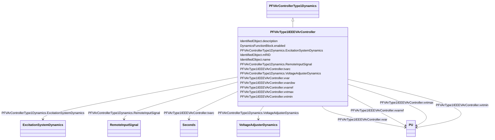

# PFVArType1IEEEVArController

_IEEE VAR controller type 1 which operates by moving the voltage reference directly._

_Reference: IEEE 421.5-2005, 11.3._

**URI**: [cim:PFVArType1IEEEVArController](http://iec.ch/TC57/CIM100#PFVArType1IEEEVArController) 
**Type**: Class

## Inheritance
* [IdentifiedObject](IdentifiedObject.md)
    * [DynamicsFunctionBlock](DynamicsFunctionBlock.md)
        * [PFVArControllerType1Dynamics](PFVArControllerType1Dynamics.md)
            * **PFVArType1IEEEVArController**

## Attributes

| Name | URI | Cardinality and Range | Description | Inheritance |
| ---  | --- | --- | --- | --- |
| tvarc | [cim:PFVArType1IEEEVArController.tvarc](http://iec.ch/TC57/CIM100#PFVArType1IEEEVArController.tvarc) | 1..1    [Seconds](Seconds.md)  | Var controller time delay (<i>T</i><i>VARC</i>) (&gt;= 0) | direct |
| vvar | [cim:PFVArType1IEEEVArController.vvar](http://iec.ch/TC57/CIM100#PFVArType1IEEEVArController.vvar) | 1..1    [PU](PU.md)  | Synchronous machine power factor (<i>V</i><i>VAR</i>) | direct |
| vvarcbw | [cim:PFVArType1IEEEVArController.vvarcbw](http://iec.ch/TC57/CIM100#PFVArType1IEEEVArController.vvarcbw) | 1..1    float  | Var controller deadband (<i>V</i><i>VARC_BW</i>) | direct |
| vvarref | [cim:PFVArType1IEEEVArController.vvarref](http://iec.ch/TC57/CIM100#PFVArType1IEEEVArController.vvarref) | 1..1    [PU](PU.md)  | Var controller reference (<i>V</i><i>VARREF</i>) | direct |
| vvtmax | [cim:PFVArType1IEEEVArController.vvtmax](http://iec.ch/TC57/CIM100#PFVArType1IEEEVArController.vvtmax) | 1..1    [PU](PU.md)  | Maximum machine terminal voltage needed for pf/VAr controller to be enabled (... | direct |
| vvtmin | [cim:PFVArType1IEEEVArController.vvtmin](http://iec.ch/TC57/CIM100#PFVArType1IEEEVArController.vvtmin) | 1..1    [PU](PU.md)  | Minimum machine terminal voltage needed to enable pf/var controller (<i>V</i>... | direct |
| RemoteInputSignal | [cim:PFVArControllerType1Dynamics.RemoteInputSignal](http://iec.ch/TC57/CIM100#PFVArControllerType1Dynamics.RemoteInputSignal) | 0..1    [RemoteInputSignal](RemoteInputSignal.md)  | Remote input signal used by this power factor or VAr controller type 1 model | [PFVArControllerType1Dynamics](PFVArControllerType1Dynamics.md) |
| ExcitationSystemDynamics | [cim:PFVArControllerType1Dynamics.ExcitationSystemDynamics](http://iec.ch/TC57/CIM100#PFVArControllerType1Dynamics.ExcitationSystemDynamics) | 1..1    [ExcitationSystemDynamics](ExcitationSystemDynamics.md)  | Excitation system model with which this power actor or VAr controller type 1 ... | [PFVArControllerType1Dynamics](PFVArControllerType1Dynamics.md) |
| VoltageAdjusterDynamics | [cim:PFVArControllerType1Dynamics.VoltageAdjusterDynamics](http://iec.ch/TC57/CIM100#PFVArControllerType1Dynamics.VoltageAdjusterDynamics) | 0..1    [VoltageAdjusterDynamics](VoltageAdjusterDynamics.md)  | Voltage adjuster model associated with this power factor or VAr controller ty... | [PFVArControllerType1Dynamics](PFVArControllerType1Dynamics.md) |
| enabled | [cim:DynamicsFunctionBlock.enabled](http://iec.ch/TC57/CIM100#DynamicsFunctionBlock.enabled) | 1..1    boolean  | Function block used indicator | [DynamicsFunctionBlock](DynamicsFunctionBlock.md) |
| description | [cim:IdentifiedObject.description](http://iec.ch/TC57/CIM100#IdentifiedObject.description) | 0..1    string  | The description is a free human readable text describing or naming the object | [IdentifiedObject](IdentifiedObject.md) |
| mRID | [cim:IdentifiedObject.mRID](http://iec.ch/TC57/CIM100#IdentifiedObject.mRID) | 1..1    string  | Master resource identifier issued by a model authority | [IdentifiedObject](IdentifiedObject.md) |
| name | [cim:IdentifiedObject.name](http://iec.ch/TC57/CIM100#IdentifiedObject.name) | 0..1    string  | The name is any free human readable and possibly non unique text naming the o... | [IdentifiedObject](IdentifiedObject.md) |

## Identifier and Mapping Information

### Schema Source

* from schema: http://iec.ch/TC57/ns/CIM/Dynamics-EU#Package_DynamicsProfile

## Mappings

| Mapping Type | Mapped Value |
| ---  | ---  |
| self | cim:PFVArType1IEEEVArController |
| native | this:PFVArType1IEEEVArController |

