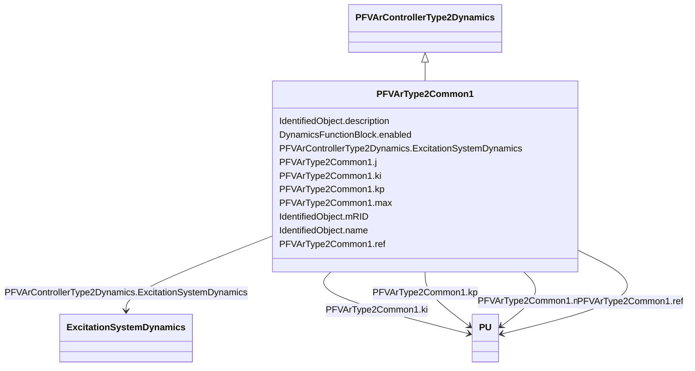

# PFVArType2Common1

_Power factor / reactive power regulator. This model represents the power factor or reactive power controller such as the Basler SCP-250. The controller measures power factor or reactive power (PU on generator rated power) and compares it with the operator's set point._

_[Footnote: Basler SCP-250 is an example of a suitable product available commercially. This information is given for the convenience of users of this document and does not constitute an endorsement by IEC of this product.]_

**URI**: [cim:PFVArType2Common1](http://iec.ch/TC57/CIM100#PFVArType2Common1) 
**Type**: Class

## Inheritance
* [IdentifiedObject](IdentifiedObject.md)
    * [DynamicsFunctionBlock](DynamicsFunctionBlock.md)
        * [PFVArControllerType2Dynamics](PFVArControllerType2Dynamics.md)
            * **PFVArType2Common1**

## Attributes

| Name | URI | Cardinality and Range | Description | Inheritance |
| ---  | --- | --- | --- | --- |
| j | [cim:PFVArType2Common1.j](http://iec.ch/TC57/CIM100#PFVArType2Common1.j) | 1..1    boolean  | Selector (<i>J</i>) | direct |
| kp | [cim:PFVArType2Common1.kp](http://iec.ch/TC57/CIM100#PFVArType2Common1.kp) | 1..1    [PU](PU.md)  | Proportional gain (<i>Kp</i>) | direct |
| ki | [cim:PFVArType2Common1.ki](http://iec.ch/TC57/CIM100#PFVArType2Common1.ki) | 1..1    [PU](PU.md)  | Reset gain (<i>Ki</i>) | direct |
| max | [cim:PFVArType2Common1.max](http://iec.ch/TC57/CIM100#PFVArType2Common1.max) | 1..1    [PU](PU.md)  | Output limit (<i>max</i>) | direct |
| ref | [cim:PFVArType2Common1.ref](http://iec.ch/TC57/CIM100#PFVArType2Common1.ref) | 1..1    [PU](PU.md)  | Reference value of reactive power or power factor (<i>Ref</i>) | direct |
| ExcitationSystemDynamics | [cim:PFVArControllerType2Dynamics.ExcitationSystemDynamics](http://iec.ch/TC57/CIM100#PFVArControllerType2Dynamics.ExcitationSystemDynamics) | 1..1    [ExcitationSystemDynamics](ExcitationSystemDynamics.md)  | Excitation system model with which this power factor or VAr controller type 2... | [PFVArControllerType2Dynamics](PFVArControllerType2Dynamics.md) |
| enabled | [cim:DynamicsFunctionBlock.enabled](http://iec.ch/TC57/CIM100#DynamicsFunctionBlock.enabled) | 1..1    boolean  | Function block used indicator | [DynamicsFunctionBlock](DynamicsFunctionBlock.md) |
| description | [cim:IdentifiedObject.description](http://iec.ch/TC57/CIM100#IdentifiedObject.description) | 0..1    string  | The description is a free human readable text describing or naming the object | [IdentifiedObject](IdentifiedObject.md) |
| mRID | [cim:IdentifiedObject.mRID](http://iec.ch/TC57/CIM100#IdentifiedObject.mRID) | 1..1    string  | Master resource identifier issued by a model authority | [IdentifiedObject](IdentifiedObject.md) |
| name | [cim:IdentifiedObject.name](http://iec.ch/TC57/CIM100#IdentifiedObject.name) | 0..1    string  | The name is any free human readable and possibly non unique text naming the o... | [IdentifiedObject](IdentifiedObject.md) |

## Identifier and Mapping Information

### Schema Source

* from schema: http://iec.ch/TC57/ns/CIM/Dynamics-EU#Package_DynamicsProfile

## Mappings

| Mapping Type | Mapped Value |
| ---  | ---  |
| self | cim:PFVArType2Common1 |
| native | this:PFVArType2Common1 |

