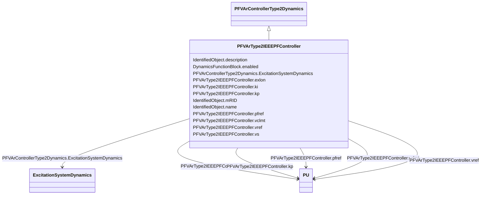

# PFVArType2IEEEPFController

_IEEE PF controller type 2 which is a summing point type controller making up the outside loop of a two-loop system. This controller is implemented as a slow PI type controller. The voltage regulator forms the inner loop and is implemented as a fast controller._

_Reference: IEEE 421.5-2005, 11.4._

**URI**: [cim:PFVArType2IEEEPFController](http://iec.ch/TC57/CIM100#PFVArType2IEEEPFController) 
**Type**: Class

## Inheritance
* [IdentifiedObject](IdentifiedObject.md)
    * [DynamicsFunctionBlock](DynamicsFunctionBlock.md)
        * [PFVArControllerType2Dynamics](PFVArControllerType2Dynamics.md)
            * **PFVArType2IEEEPFController**

## Attributes

| Name | URI | Cardinality and Range | Description | Inheritance |
| ---  | --- | --- | --- | --- |
| pfref | [cim:PFVArType2IEEEPFController.pfref](http://iec.ch/TC57/CIM100#PFVArType2IEEEPFController.pfref) | 1..1    [PU](PU.md)  | Power factor reference (<i>P</i><i>FREF</i>) | direct |
| vref | [cim:PFVArType2IEEEPFController.vref](http://iec.ch/TC57/CIM100#PFVArType2IEEEPFController.vref) | 1..1    [PU](PU.md)  | Voltage regulator reference (<i>V</i><i>REF</i>) | direct |
| vclmt | [cim:PFVArType2IEEEPFController.vclmt](http://iec.ch/TC57/CIM100#PFVArType2IEEEPFController.vclmt) | 1..1    [PU](PU.md)  | Maximum output of the pf controller (<i>V</i><i>CLMT</i>) | direct |
| kp | [cim:PFVArType2IEEEPFController.kp](http://iec.ch/TC57/CIM100#PFVArType2IEEEPFController.kp) | 1..1    [PU](PU.md)  | Proportional gain of the pf controller (<i>K</i><i>P</i>) | direct |
| ki | [cim:PFVArType2IEEEPFController.ki](http://iec.ch/TC57/CIM100#PFVArType2IEEEPFController.ki) | 1..1    [PU](PU.md)  | Integral gain of the pf controller (<i>K</i><i>I</i>) | direct |
| vs | [cim:PFVArType2IEEEPFController.vs](http://iec.ch/TC57/CIM100#PFVArType2IEEEPFController.vs) | 1..1    float  | Generator sensing voltage (<i>V</i><i>S</i>) | direct |
| exlon | [cim:PFVArType2IEEEPFController.exlon](http://iec.ch/TC57/CIM100#PFVArType2IEEEPFController.exlon) | 1..1    boolean  | Overexcitation or under excitation flag (<i>EXLON</i>) | direct |
| ExcitationSystemDynamics | [cim:PFVArControllerType2Dynamics.ExcitationSystemDynamics](http://iec.ch/TC57/CIM100#PFVArControllerType2Dynamics.ExcitationSystemDynamics) | 1..1    [ExcitationSystemDynamics](ExcitationSystemDynamics.md)  | Excitation system model with which this power factor or VAr controller type 2... | [PFVArControllerType2Dynamics](PFVArControllerType2Dynamics.md) |
| enabled | [cim:DynamicsFunctionBlock.enabled](http://iec.ch/TC57/CIM100#DynamicsFunctionBlock.enabled) | 1..1    boolean  | Function block used indicator | [DynamicsFunctionBlock](DynamicsFunctionBlock.md) |
| description | [cim:IdentifiedObject.description](http://iec.ch/TC57/CIM100#IdentifiedObject.description) | 0..1    string  | The description is a free human readable text describing or naming the object | [IdentifiedObject](IdentifiedObject.md) |
| mRID | [cim:IdentifiedObject.mRID](http://iec.ch/TC57/CIM100#IdentifiedObject.mRID) | 1..1    string  | Master resource identifier issued by a model authority | [IdentifiedObject](IdentifiedObject.md) |
| name | [cim:IdentifiedObject.name](http://iec.ch/TC57/CIM100#IdentifiedObject.name) | 0..1    string  | The name is any free human readable and possibly non unique text naming the o... | [IdentifiedObject](IdentifiedObject.md) |

## Identifier and Mapping Information

### Schema Source

* from schema: http://iec.ch/TC57/ns/CIM/Dynamics-EU#Package_DynamicsProfile

## Mappings

| Mapping Type | Mapped Value |
| ---  | ---  |
| self | cim:PFVArType2IEEEPFController |
| native | this:PFVArType2IEEEPFController |

