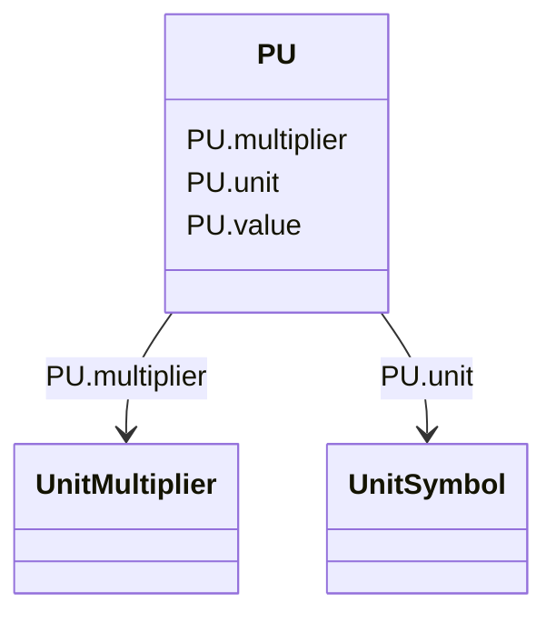

# PU

_Per Unit - a positive or negative value referred to a defined base. Values typically range from -10 to +10._

**URI**: [cim:PU](http://iec.ch/TC57/CIM100#PU) 
**Type**: Class

<!-- no inheritance hierarchy -->

## Attributes

| Name | URI | Cardinality and Range | Description | Inheritance |
| ---  | --- | --- | --- | --- |
| value | [cim:PU.value](http://iec.ch/TC57/CIM100#PU.value) | 0..1    float  |  | direct |
| unit | [cim:PU.unit](http://iec.ch/TC57/CIM100#PU.unit) | 0..1    [UnitSymbol](UnitSymbol.md)  |  | direct |
| multiplier | [cim:PU.multiplier](http://iec.ch/TC57/CIM100#PU.multiplier) | 0..1    [UnitMultiplier](UnitMultiplier.md)  |  | direct |

## Usages

| used by | used in | type | used |
| ---  | --- | --- | --- |
| [RotatingMachineDynamics](RotatingMachineDynamics.md) | statorLeakageReactance | range | [PU](PU.md) |
| [RotatingMachineDynamics](RotatingMachineDynamics.md) | statorResistance | range | [PU](PU.md) |
| [SynchronousMachineUserDefined](SynchronousMachineUserDefined.md) | statorLeakageReactance | range | [PU](PU.md) |
| [SynchronousMachineUserDefined](SynchronousMachineUserDefined.md) | statorResistance | range | [PU](PU.md) |
| [AsynchronousMachineUserDefined](AsynchronousMachineUserDefined.md) | statorLeakageReactance | range | [PU](PU.md) |
| [AsynchronousMachineUserDefined](AsynchronousMachineUserDefined.md) | statorResistance | range | [PU](PU.md) |
| [SynchronousMachineSimplified](SynchronousMachineSimplified.md) | statorLeakageReactance | range | [PU](PU.md) |
| [SynchronousMachineSimplified](SynchronousMachineSimplified.md) | statorResistance | range | [PU](PU.md) |
| [SynchronousMachineDynamics](SynchronousMachineDynamics.md) | statorLeakageReactance | range | [PU](PU.md) |
| [SynchronousMachineDynamics](SynchronousMachineDynamics.md) | statorResistance | range | [PU](PU.md) |
| [SynchronousMachineDetailed](SynchronousMachineDetailed.md) | statorLeakageReactance | range | [PU](PU.md) |
| [SynchronousMachineDetailed](SynchronousMachineDetailed.md) | statorResistance | range | [PU](PU.md) |
| [SynchronousMachineTimeConstantReactance](SynchronousMachineTimeConstantReactance.md) | xDirectSync | range | [PU](PU.md) |
| [SynchronousMachineTimeConstantReactance](SynchronousMachineTimeConstantReactance.md) | xDirectTrans | range | [PU](PU.md) |
| [SynchronousMachineTimeConstantReactance](SynchronousMachineTimeConstantReactance.md) | xDirectSubtrans | range | [PU](PU.md) |
| [SynchronousMachineTimeConstantReactance](SynchronousMachineTimeConstantReactance.md) | xQuadSync | range | [PU](PU.md) |
| [SynchronousMachineTimeConstantReactance](SynchronousMachineTimeConstantReactance.md) | xQuadTrans | range | [PU](PU.md) |
| [SynchronousMachineTimeConstantReactance](SynchronousMachineTimeConstantReactance.md) | xQuadSubtrans | range | [PU](PU.md) |
| [SynchronousMachineTimeConstantReactance](SynchronousMachineTimeConstantReactance.md) | statorLeakageReactance | range | [PU](PU.md) |
| [SynchronousMachineTimeConstantReactance](SynchronousMachineTimeConstantReactance.md) | statorResistance | range | [PU](PU.md) |
| [SynchronousMachineEquivalentCircuit](SynchronousMachineEquivalentCircuit.md) | xad | range | [PU](PU.md) |
| [SynchronousMachineEquivalentCircuit](SynchronousMachineEquivalentCircuit.md) | rfd | range | [PU](PU.md) |
| [SynchronousMachineEquivalentCircuit](SynchronousMachineEquivalentCircuit.md) | xfd | range | [PU](PU.md) |
| [SynchronousMachineEquivalentCircuit](SynchronousMachineEquivalentCircuit.md) | r1d | range | [PU](PU.md) |
| [SynchronousMachineEquivalentCircuit](SynchronousMachineEquivalentCircuit.md) | x1d | range | [PU](PU.md) |
| [SynchronousMachineEquivalentCircuit](SynchronousMachineEquivalentCircuit.md) | xf1d | range | [PU](PU.md) |
| [SynchronousMachineEquivalentCircuit](SynchronousMachineEquivalentCircuit.md) | xaq | range | [PU](PU.md) |
| [SynchronousMachineEquivalentCircuit](SynchronousMachineEquivalentCircuit.md) | r1q | range | [PU](PU.md) |
| [SynchronousMachineEquivalentCircuit](SynchronousMachineEquivalentCircuit.md) | x1q | range | [PU](PU.md) |
| [SynchronousMachineEquivalentCircuit](SynchronousMachineEquivalentCircuit.md) | r2q | range | [PU](PU.md) |
| [SynchronousMachineEquivalentCircuit](SynchronousMachineEquivalentCircuit.md) | x2q | range | [PU](PU.md) |
| [SynchronousMachineEquivalentCircuit](SynchronousMachineEquivalentCircuit.md) | statorLeakageReactance | range | [PU](PU.md) |
| [SynchronousMachineEquivalentCircuit](SynchronousMachineEquivalentCircuit.md) | statorResistance | range | [PU](PU.md) |
| [AsynchronousMachineDynamics](AsynchronousMachineDynamics.md) | statorLeakageReactance | range | [PU](PU.md) |
| [AsynchronousMachineDynamics](AsynchronousMachineDynamics.md) | statorResistance | range | [PU](PU.md) |
| [AsynchronousMachineTimeConstantReactance](AsynchronousMachineTimeConstantReactance.md) | xs | range | [PU](PU.md) |
| [AsynchronousMachineTimeConstantReactance](AsynchronousMachineTimeConstantReactance.md) | xp | range | [PU](PU.md) |
| [AsynchronousMachineTimeConstantReactance](AsynchronousMachineTimeConstantReactance.md) | xpp | range | [PU](PU.md) |
| [AsynchronousMachineTimeConstantReactance](AsynchronousMachineTimeConstantReactance.md) | statorLeakageReactance | range | [PU](PU.md) |
| [AsynchronousMachineTimeConstantReactance](AsynchronousMachineTimeConstantReactance.md) | statorResistance | range | [PU](PU.md) |
| [AsynchronousMachineEquivalentCircuit](AsynchronousMachineEquivalentCircuit.md) | xm | range | [PU](PU.md) |
| [AsynchronousMachineEquivalentCircuit](AsynchronousMachineEquivalentCircuit.md) | rr1 | range | [PU](PU.md) |
| [AsynchronousMachineEquivalentCircuit](AsynchronousMachineEquivalentCircuit.md) | xlr1 | range | [PU](PU.md) |
| [AsynchronousMachineEquivalentCircuit](AsynchronousMachineEquivalentCircuit.md) | rr2 | range | [PU](PU.md) |
| [AsynchronousMachineEquivalentCircuit](AsynchronousMachineEquivalentCircuit.md) | xlr2 | range | [PU](PU.md) |
| [AsynchronousMachineEquivalentCircuit](AsynchronousMachineEquivalentCircuit.md) | statorLeakageReactance | range | [PU](PU.md) |
| [AsynchronousMachineEquivalentCircuit](AsynchronousMachineEquivalentCircuit.md) | statorResistance | range | [PU](PU.md) |
| [GovHydroIEEE0](GovHydroIEEE0.md) | k | range | [PU](PU.md) |
| [GovHydroIEEE0](GovHydroIEEE0.md) | pmax | range | [PU](PU.md) |
| [GovHydroIEEE0](GovHydroIEEE0.md) | pmin | range | [PU](PU.md) |
| [GovHydroIEEE2](GovHydroIEEE2.md) | pmax | range | [PU](PU.md) |
| [GovHydroIEEE2](GovHydroIEEE2.md) | pmin | range | [PU](PU.md) |
| [GovHydroIEEE2](GovHydroIEEE2.md) | rperm | range | [PU](PU.md) |
| [GovHydroIEEE2](GovHydroIEEE2.md) | rtemp | range | [PU](PU.md) |
| [GovHydroIEEE2](GovHydroIEEE2.md) | kturb | range | [PU](PU.md) |
| [GovHydroIEEE2](GovHydroIEEE2.md) | aturb | range | [PU](PU.md) |
| [GovHydroIEEE2](GovHydroIEEE2.md) | bturb | range | [PU](PU.md) |
| [GovHydroIEEE2](GovHydroIEEE2.md) | gv1 | range | [PU](PU.md) |
| [GovHydroIEEE2](GovHydroIEEE2.md) | pgv1 | range | [PU](PU.md) |
| [GovHydroIEEE2](GovHydroIEEE2.md) | gv2 | range | [PU](PU.md) |
| [GovHydroIEEE2](GovHydroIEEE2.md) | pgv2 | range | [PU](PU.md) |
| [GovHydroIEEE2](GovHydroIEEE2.md) | gv3 | range | [PU](PU.md) |
| [GovHydroIEEE2](GovHydroIEEE2.md) | pgv3 | range | [PU](PU.md) |
| [GovHydroIEEE2](GovHydroIEEE2.md) | gv4 | range | [PU](PU.md) |
| [GovHydroIEEE2](GovHydroIEEE2.md) | pgv4 | range | [PU](PU.md) |
| [GovHydroIEEE2](GovHydroIEEE2.md) | gv5 | range | [PU](PU.md) |
| [GovHydroIEEE2](GovHydroIEEE2.md) | pgv5 | range | [PU](PU.md) |
| [GovHydroIEEE2](GovHydroIEEE2.md) | gv6 | range | [PU](PU.md) |
| [GovHydroIEEE2](GovHydroIEEE2.md) | pgv6 | range | [PU](PU.md) |
| [GovSteamIEEE1](GovSteamIEEE1.md) | k | range | [PU](PU.md) |
| [GovSteamIEEE1](GovSteamIEEE1.md) | pmax | range | [PU](PU.md) |
| [GovSteamIEEE1](GovSteamIEEE1.md) | pmin | range | [PU](PU.md) |
| [GovCT1](GovCT1.md) | r | range | [PU](PU.md) |
| [GovCT1](GovCT1.md) | maxerr | range | [PU](PU.md) |
| [GovCT1](GovCT1.md) | minerr | range | [PU](PU.md) |
| [GovCT1](GovCT1.md) | kpgov | range | [PU](PU.md) |
| [GovCT1](GovCT1.md) | kigov | range | [PU](PU.md) |
| [GovCT1](GovCT1.md) | kdgov | range | [PU](PU.md) |
| [GovCT1](GovCT1.md) | vmax | range | [PU](PU.md) |
| [GovCT1](GovCT1.md) | vmin | range | [PU](PU.md) |
| [GovCT1](GovCT1.md) | kturb | range | [PU](PU.md) |
| [GovCT1](GovCT1.md) | wfnl | range | [PU](PU.md) |
| [GovCT1](GovCT1.md) | kpload | range | [PU](PU.md) |
| [GovCT1](GovCT1.md) | kiload | range | [PU](PU.md) |
| [GovCT1](GovCT1.md) | ldref | range | [PU](PU.md) |
| [GovCT1](GovCT1.md) | dm | range | [PU](PU.md) |
| [GovCT1](GovCT1.md) | kimw | range | [PU](PU.md) |
| [GovCT1](GovCT1.md) | ka | range | [PU](PU.md) |
| [GovCT1](GovCT1.md) | db | range | [PU](PU.md) |
| [GovCT1](GovCT1.md) | rup | range | [PU](PU.md) |
| [GovCT1](GovCT1.md) | rdown | range | [PU](PU.md) |
| [GovCT2](GovCT2.md) | r | range | [PU](PU.md) |
| [GovCT2](GovCT2.md) | maxerr | range | [PU](PU.md) |
| [GovCT2](GovCT2.md) | minerr | range | [PU](PU.md) |
| [GovCT2](GovCT2.md) | kpgov | range | [PU](PU.md) |
| [GovCT2](GovCT2.md) | kigov | range | [PU](PU.md) |
| [GovCT2](GovCT2.md) | kdgov | range | [PU](PU.md) |
| [GovCT2](GovCT2.md) | vmax | range | [PU](PU.md) |
| [GovCT2](GovCT2.md) | vmin | range | [PU](PU.md) |
| [GovCT2](GovCT2.md) | kturb | range | [PU](PU.md) |
| [GovCT2](GovCT2.md) | wfnl | range | [PU](PU.md) |
| [GovCT2](GovCT2.md) | kpload | range | [PU](PU.md) |
| [GovCT2](GovCT2.md) | kiload | range | [PU](PU.md) |
| [GovCT2](GovCT2.md) | ldref | range | [PU](PU.md) |
| [GovCT2](GovCT2.md) | dm | range | [PU](PU.md) |
| [GovCT2](GovCT2.md) | kimw | range | [PU](PU.md) |
| [GovCT2](GovCT2.md) | ka | range | [PU](PU.md) |
| [GovCT2](GovCT2.md) | db | range | [PU](PU.md) |
| [GovCT2](GovCT2.md) | rup | range | [PU](PU.md) |
| [GovCT2](GovCT2.md) | rdown | range | [PU](PU.md) |
| [GovCT2](GovCT2.md) | prate | range | [PU](PU.md) |
| [GovCT2](GovCT2.md) | plim1 | range | [PU](PU.md) |
| [GovCT2](GovCT2.md) | plim2 | range | [PU](PU.md) |
| [GovCT2](GovCT2.md) | plim3 | range | [PU](PU.md) |
| [GovCT2](GovCT2.md) | plim4 | range | [PU](PU.md) |
| [GovCT2](GovCT2.md) | plim5 | range | [PU](PU.md) |
| [GovCT2](GovCT2.md) | plim6 | range | [PU](PU.md) |
| [GovCT2](GovCT2.md) | plim7 | range | [PU](PU.md) |
| [GovCT2](GovCT2.md) | plim8 | range | [PU](PU.md) |
| [GovCT2](GovCT2.md) | plim9 | range | [PU](PU.md) |
| [GovCT2](GovCT2.md) | plim10 | range | [PU](PU.md) |
| [GovGAST](GovGAST.md) | r | range | [PU](PU.md) |
| [GovGAST](GovGAST.md) | at | range | [PU](PU.md) |
| [GovGAST](GovGAST.md) | kt | range | [PU](PU.md) |
| [GovGAST](GovGAST.md) | vmax | range | [PU](PU.md) |
| [GovGAST](GovGAST.md) | vmin | range | [PU](PU.md) |
| [GovGAST](GovGAST.md) | dturb | range | [PU](PU.md) |
| [GovGAST1](GovGAST1.md) | r | range | [PU](PU.md) |
| [GovGAST1](GovGAST1.md) | lmax | range | [PU](PU.md) |
| [GovGAST1](GovGAST1.md) | kt | range | [PU](PU.md) |
| [GovGAST1](GovGAST1.md) | vmax | range | [PU](PU.md) |
| [GovGAST1](GovGAST1.md) | vmin | range | [PU](PU.md) |
| [GovGAST1](GovGAST1.md) | fidle | range | [PU](PU.md) |
| [GovGAST1](GovGAST1.md) | loadinc | range | [PU](PU.md) |
| [GovGAST1](GovGAST1.md) | gv1 | range | [PU](PU.md) |
| [GovGAST1](GovGAST1.md) | pgv1 | range | [PU](PU.md) |
| [GovGAST1](GovGAST1.md) | gv2 | range | [PU](PU.md) |
| [GovGAST1](GovGAST1.md) | pgv2 | range | [PU](PU.md) |
| [GovGAST1](GovGAST1.md) | gv3 | range | [PU](PU.md) |
| [GovGAST1](GovGAST1.md) | pgv3 | range | [PU](PU.md) |
| [GovGAST1](GovGAST1.md) | gv4 | range | [PU](PU.md) |
| [GovGAST1](GovGAST1.md) | pgv4 | range | [PU](PU.md) |
| [GovGAST1](GovGAST1.md) | gv5 | range | [PU](PU.md) |
| [GovGAST1](GovGAST1.md) | pgv5 | range | [PU](PU.md) |
| [GovGAST1](GovGAST1.md) | gv6 | range | [PU](PU.md) |
| [GovGAST1](GovGAST1.md) | pgv6 | range | [PU](PU.md) |
| [GovGAST1](GovGAST1.md) | ka | range | [PU](PU.md) |
| [GovGAST2](GovGAST2.md) | w | range | [PU](PU.md) |
| [GovGAST2](GovGAST2.md) | tmax | range | [PU](PU.md) |
| [GovGAST2](GovGAST2.md) | tmin | range | [PU](PU.md) |
| [GovGAST2](GovGAST2.md) | k3 | range | [PU](PU.md) |
| [GovGAST2](GovGAST2.md) | kf | range | [PU](PU.md) |
| [GovGAST2](GovGAST2.md) | k5 | range | [PU](PU.md) |
| [GovGAST2](GovGAST2.md) | k4 | range | [PU](PU.md) |
| [GovGAST2](GovGAST2.md) | af1 | range | [PU](PU.md) |
| [GovGAST2](GovGAST2.md) | bf1 | range | [PU](PU.md) |
| [GovGAST2](GovGAST2.md) | af2 | range | [PU](PU.md) |
| [GovGAST2](GovGAST2.md) | bf2 | range | [PU](PU.md) |
| [GovGAST2](GovGAST2.md) | cf2 | range | [PU](PU.md) |
| [GovGAST2](GovGAST2.md) | k6 | range | [PU](PU.md) |
| [GovGAST3](GovGAST3.md) | bp | range | [PU](PU.md) |
| [GovGAST3](GovGAST3.md) | rcmx | range | [PU](PU.md) |
| [GovGAST3](GovGAST3.md) | rcmn | range | [PU](PU.md) |
| [GovGAST3](GovGAST3.md) | ka | range | [PU](PU.md) |
| [GovGAST3](GovGAST3.md) | mxef | range | [PU](PU.md) |
| [GovGAST3](GovGAST3.md) | mnef | range | [PU](PU.md) |
| [GovGAST4](GovGAST4.md) | bp | range | [PU](PU.md) |
| [GovGAST4](GovGAST4.md) | ktm | range | [PU](PU.md) |
| [GovGAST4](GovGAST4.md) | rymx | range | [PU](PU.md) |
| [GovGAST4](GovGAST4.md) | rymn | range | [PU](PU.md) |
| [GovGAST4](GovGAST4.md) | mxef | range | [PU](PU.md) |
| [GovGAST4](GovGAST4.md) | mnef | range | [PU](PU.md) |
| [GovGASTWD](GovGASTWD.md) | kdroop | range | [PU](PU.md) |
| [GovGASTWD](GovGASTWD.md) | kp | range | [PU](PU.md) |
| [GovGASTWD](GovGASTWD.md) | ki | range | [PU](PU.md) |
| [GovGASTWD](GovGASTWD.md) | kd | range | [PU](PU.md) |
| [GovGASTWD](GovGASTWD.md) | tmax | range | [PU](PU.md) |
| [GovGASTWD](GovGASTWD.md) | tmin | range | [PU](PU.md) |
| [GovGASTWD](GovGASTWD.md) | k3 | range | [PU](PU.md) |
| [GovGASTWD](GovGASTWD.md) | kf | range | [PU](PU.md) |
| [GovGASTWD](GovGASTWD.md) | k5 | range | [PU](PU.md) |
| [GovGASTWD](GovGASTWD.md) | k4 | range | [PU](PU.md) |
| [GovGASTWD](GovGASTWD.md) | af1 | range | [PU](PU.md) |
| [GovGASTWD](GovGASTWD.md) | bf1 | range | [PU](PU.md) |
| [GovGASTWD](GovGASTWD.md) | af2 | range | [PU](PU.md) |
| [GovGASTWD](GovGASTWD.md) | bf2 | range | [PU](PU.md) |
| [GovGASTWD](GovGASTWD.md) | cf2 | range | [PU](PU.md) |
| [GovGASTWD](GovGASTWD.md) | k6 | range | [PU](PU.md) |
| [GovHydro1](GovHydro1.md) | rperm | range | [PU](PU.md) |
| [GovHydro1](GovHydro1.md) | rtemp | range | [PU](PU.md) |
| [GovHydro1](GovHydro1.md) | gmax | range | [PU](PU.md) |
| [GovHydro1](GovHydro1.md) | gmin | range | [PU](PU.md) |
| [GovHydro1](GovHydro1.md) | at | range | [PU](PU.md) |
| [GovHydro1](GovHydro1.md) | dturb | range | [PU](PU.md) |
| [GovHydro1](GovHydro1.md) | qnl | range | [PU](PU.md) |
| [GovHydro1](GovHydro1.md) | hdam | range | [PU](PU.md) |
| [GovHydro2](GovHydro2.md) | pmax | range | [PU](PU.md) |
| [GovHydro2](GovHydro2.md) | pmin | range | [PU](PU.md) |
| [GovHydro2](GovHydro2.md) | rperm | range | [PU](PU.md) |
| [GovHydro2](GovHydro2.md) | rtemp | range | [PU](PU.md) |
| [GovHydro2](GovHydro2.md) | kturb | range | [PU](PU.md) |
| [GovHydro2](GovHydro2.md) | aturb | range | [PU](PU.md) |
| [GovHydro2](GovHydro2.md) | bturb | range | [PU](PU.md) |
| [GovHydro2](GovHydro2.md) | gv1 | range | [PU](PU.md) |
| [GovHydro2](GovHydro2.md) | pgv1 | range | [PU](PU.md) |
| [GovHydro2](GovHydro2.md) | gv2 | range | [PU](PU.md) |
| [GovHydro2](GovHydro2.md) | pgv2 | range | [PU](PU.md) |
| [GovHydro2](GovHydro2.md) | gv3 | range | [PU](PU.md) |
| [GovHydro2](GovHydro2.md) | pgv3 | range | [PU](PU.md) |
| [GovHydro2](GovHydro2.md) | gv4 | range | [PU](PU.md) |
| [GovHydro2](GovHydro2.md) | pgv4 | range | [PU](PU.md) |
| [GovHydro2](GovHydro2.md) | gv5 | range | [PU](PU.md) |
| [GovHydro2](GovHydro2.md) | pgv5 | range | [PU](PU.md) |
| [GovHydro2](GovHydro2.md) | gv6 | range | [PU](PU.md) |
| [GovHydro2](GovHydro2.md) | pgv6 | range | [PU](PU.md) |
| [GovHydro3](GovHydro3.md) | pmax | range | [PU](PU.md) |
| [GovHydro3](GovHydro3.md) | pmin | range | [PU](PU.md) |
| [GovHydro3](GovHydro3.md) | rgate | range | [PU](PU.md) |
| [GovHydro3](GovHydro3.md) | relec | range | [PU](PU.md) |
| [GovHydro3](GovHydro3.md) | k1 | range | [PU](PU.md) |
| [GovHydro3](GovHydro3.md) | k2 | range | [PU](PU.md) |
| [GovHydro3](GovHydro3.md) | ki | range | [PU](PU.md) |
| [GovHydro3](GovHydro3.md) | kg | range | [PU](PU.md) |
| [GovHydro3](GovHydro3.md) | at | range | [PU](PU.md) |
| [GovHydro3](GovHydro3.md) | dturb | range | [PU](PU.md) |
| [GovHydro3](GovHydro3.md) | qnl | range | [PU](PU.md) |
| [GovHydro3](GovHydro3.md) | h0 | range | [PU](PU.md) |
| [GovHydro3](GovHydro3.md) | gv1 | range | [PU](PU.md) |
| [GovHydro3](GovHydro3.md) | pgv1 | range | [PU](PU.md) |
| [GovHydro3](GovHydro3.md) | gv2 | range | [PU](PU.md) |
| [GovHydro3](GovHydro3.md) | pgv2 | range | [PU](PU.md) |
| [GovHydro3](GovHydro3.md) | gv3 | range | [PU](PU.md) |
| [GovHydro3](GovHydro3.md) | pgv3 | range | [PU](PU.md) |
| [GovHydro3](GovHydro3.md) | gv4 | range | [PU](PU.md) |
| [GovHydro3](GovHydro3.md) | pgv4 | range | [PU](PU.md) |
| [GovHydro3](GovHydro3.md) | gv5 | range | [PU](PU.md) |
| [GovHydro3](GovHydro3.md) | pgv5 | range | [PU](PU.md) |
| [GovHydro3](GovHydro3.md) | gv6 | range | [PU](PU.md) |
| [GovHydro3](GovHydro3.md) | pgv6 | range | [PU](PU.md) |
| [GovHydro4](GovHydro4.md) | gmax | range | [PU](PU.md) |
| [GovHydro4](GovHydro4.md) | gmin | range | [PU](PU.md) |
| [GovHydro4](GovHydro4.md) | at | range | [PU](PU.md) |
| [GovHydro4](GovHydro4.md) | dturb | range | [PU](PU.md) |
| [GovHydro4](GovHydro4.md) | hdam | range | [PU](PU.md) |
| [GovHydro4](GovHydro4.md) | qnl | range | [PU](PU.md) |
| [GovHydro4](GovHydro4.md) | gv0 | range | [PU](PU.md) |
| [GovHydro4](GovHydro4.md) | pgv0 | range | [PU](PU.md) |
| [GovHydro4](GovHydro4.md) | gv1 | range | [PU](PU.md) |
| [GovHydro4](GovHydro4.md) | pgv1 | range | [PU](PU.md) |
| [GovHydro4](GovHydro4.md) | gv2 | range | [PU](PU.md) |
| [GovHydro4](GovHydro4.md) | pgv2 | range | [PU](PU.md) |
| [GovHydro4](GovHydro4.md) | gv3 | range | [PU](PU.md) |
| [GovHydro4](GovHydro4.md) | pgv3 | range | [PU](PU.md) |
| [GovHydro4](GovHydro4.md) | gv4 | range | [PU](PU.md) |
| [GovHydro4](GovHydro4.md) | pgv4 | range | [PU](PU.md) |
| [GovHydro4](GovHydro4.md) | gv5 | range | [PU](PU.md) |
| [GovHydro4](GovHydro4.md) | pgv5 | range | [PU](PU.md) |
| [GovHydro4](GovHydro4.md) | bgv0 | range | [PU](PU.md) |
| [GovHydro4](GovHydro4.md) | bgv1 | range | [PU](PU.md) |
| [GovHydro4](GovHydro4.md) | bgv2 | range | [PU](PU.md) |
| [GovHydro4](GovHydro4.md) | bgv3 | range | [PU](PU.md) |
| [GovHydro4](GovHydro4.md) | bgv4 | range | [PU](PU.md) |
| [GovHydro4](GovHydro4.md) | bgv5 | range | [PU](PU.md) |
| [GovHydroDD](GovHydroDD.md) | pmax | range | [PU](PU.md) |
| [GovHydroDD](GovHydroDD.md) | pmin | range | [PU](PU.md) |
| [GovHydroDD](GovHydroDD.md) | r | range | [PU](PU.md) |
| [GovHydroDD](GovHydroDD.md) | k1 | range | [PU](PU.md) |
| [GovHydroDD](GovHydroDD.md) | k2 | range | [PU](PU.md) |
| [GovHydroDD](GovHydroDD.md) | ki | range | [PU](PU.md) |
| [GovHydroDD](GovHydroDD.md) | kg | range | [PU](PU.md) |
| [GovHydroDD](GovHydroDD.md) | aturb | range | [PU](PU.md) |
| [GovHydroDD](GovHydroDD.md) | bturb | range | [PU](PU.md) |
| [GovHydroDD](GovHydroDD.md) | gv1 | range | [PU](PU.md) |
| [GovHydroDD](GovHydroDD.md) | pgv1 | range | [PU](PU.md) |
| [GovHydroDD](GovHydroDD.md) | gv2 | range | [PU](PU.md) |
| [GovHydroDD](GovHydroDD.md) | pgv2 | range | [PU](PU.md) |
| [GovHydroDD](GovHydroDD.md) | gv3 | range | [PU](PU.md) |
| [GovHydroDD](GovHydroDD.md) | pgv3 | range | [PU](PU.md) |
| [GovHydroDD](GovHydroDD.md) | gv4 | range | [PU](PU.md) |
| [GovHydroDD](GovHydroDD.md) | pgv4 | range | [PU](PU.md) |
| [GovHydroDD](GovHydroDD.md) | gv5 | range | [PU](PU.md) |
| [GovHydroDD](GovHydroDD.md) | pgv5 | range | [PU](PU.md) |
| [GovHydroDD](GovHydroDD.md) | gv6 | range | [PU](PU.md) |
| [GovHydroDD](GovHydroDD.md) | pgv6 | range | [PU](PU.md) |
| [GovHydroDD](GovHydroDD.md) | gmax | range | [PU](PU.md) |
| [GovHydroDD](GovHydroDD.md) | gmin | range | [PU](PU.md) |
| [GovHydroFrancis](GovHydroFrancis.md) | am | range | [PU](PU.md) |
| [GovHydroFrancis](GovHydroFrancis.md) | bp | range | [PU](PU.md) |
| [GovHydroFrancis](GovHydroFrancis.md) | etamax | range | [PU](PU.md) |
| [GovHydroFrancis](GovHydroFrancis.md) | kc | range | [PU](PU.md) |
| [GovHydroFrancis](GovHydroFrancis.md) | kg | range | [PU](PU.md) |
| [GovHydroFrancis](GovHydroFrancis.md) | kt | range | [PU](PU.md) |
| [GovHydroFrancis](GovHydroFrancis.md) | qc0 | range | [PU](PU.md) |
| [GovHydroFrancis](GovHydroFrancis.md) | valvmax | range | [PU](PU.md) |
| [GovHydroFrancis](GovHydroFrancis.md) | valvmin | range | [PU](PU.md) |
| [GovHydroPelton](GovHydroPelton.md) | bp | range | [PU](PU.md) |
| [GovHydroPelton](GovHydroPelton.md) | kc | range | [PU](PU.md) |
| [GovHydroPelton](GovHydroPelton.md) | kg | range | [PU](PU.md) |
| [GovHydroPelton](GovHydroPelton.md) | qc0 | range | [PU](PU.md) |
| [GovHydroPelton](GovHydroPelton.md) | valvmax | range | [PU](PU.md) |
| [GovHydroPelton](GovHydroPelton.md) | valvmin | range | [PU](PU.md) |
| [GovHydroPelton](GovHydroPelton.md) | vav | range | [PU](PU.md) |
| [GovHydroPelton](GovHydroPelton.md) | vcv | range | [PU](PU.md) |
| [GovHydroPID](GovHydroPID.md) | pmax | range | [PU](PU.md) |
| [GovHydroPID](GovHydroPID.md) | pmin | range | [PU](PU.md) |
| [GovHydroPID](GovHydroPID.md) | r | range | [PU](PU.md) |
| [GovHydroPID](GovHydroPID.md) | kd | range | [PU](PU.md) |
| [GovHydroPID](GovHydroPID.md) | kp | range | [PU](PU.md) |
| [GovHydroPID](GovHydroPID.md) | ki | range | [PU](PU.md) |
| [GovHydroPID](GovHydroPID.md) | kg | range | [PU](PU.md) |
| [GovHydroPID](GovHydroPID.md) | aturb | range | [PU](PU.md) |
| [GovHydroPID](GovHydroPID.md) | bturb | range | [PU](PU.md) |
| [GovHydroPID](GovHydroPID.md) | gv1 | range | [PU](PU.md) |
| [GovHydroPID](GovHydroPID.md) | pgv1 | range | [PU](PU.md) |
| [GovHydroPID](GovHydroPID.md) | gv2 | range | [PU](PU.md) |
| [GovHydroPID](GovHydroPID.md) | pgv2 | range | [PU](PU.md) |
| [GovHydroPID](GovHydroPID.md) | gv3 | range | [PU](PU.md) |
| [GovHydroPID](GovHydroPID.md) | pgv3 | range | [PU](PU.md) |
| [GovHydroPID](GovHydroPID.md) | gv4 | range | [PU](PU.md) |
| [GovHydroPID](GovHydroPID.md) | pgv4 | range | [PU](PU.md) |
| [GovHydroPID](GovHydroPID.md) | gv5 | range | [PU](PU.md) |
| [GovHydroPID](GovHydroPID.md) | pgv5 | range | [PU](PU.md) |
| [GovHydroPID](GovHydroPID.md) | gv6 | range | [PU](PU.md) |
| [GovHydroPID](GovHydroPID.md) | pgv6 | range | [PU](PU.md) |
| [GovHydroPID2](GovHydroPID2.md) | rperm | range | [PU](PU.md) |
| [GovHydroPID2](GovHydroPID2.md) | kp | range | [PU](PU.md) |
| [GovHydroPID2](GovHydroPID2.md) | kd | range | [PU](PU.md) |
| [GovHydroPID2](GovHydroPID2.md) | gmax | range | [PU](PU.md) |
| [GovHydroPID2](GovHydroPID2.md) | gmin | range | [PU](PU.md) |
| [GovHydroPID2](GovHydroPID2.md) | d | range | [PU](PU.md) |
| [GovHydroPID2](GovHydroPID2.md) | g0 | range | [PU](PU.md) |
| [GovHydroPID2](GovHydroPID2.md) | g1 | range | [PU](PU.md) |
| [GovHydroPID2](GovHydroPID2.md) | p1 | range | [PU](PU.md) |
| [GovHydroPID2](GovHydroPID2.md) | g2 | range | [PU](PU.md) |
| [GovHydroPID2](GovHydroPID2.md) | p2 | range | [PU](PU.md) |
| [GovHydroPID2](GovHydroPID2.md) | p3 | range | [PU](PU.md) |
| [GovHydroPID2](GovHydroPID2.md) | atw | range | [PU](PU.md) |
| [GovHydroR](GovHydroR.md) | pmax | range | [PU](PU.md) |
| [GovHydroR](GovHydroR.md) | pmin | range | [PU](PU.md) |
| [GovHydroR](GovHydroR.md) | r | range | [PU](PU.md) |
| [GovHydroR](GovHydroR.md) | ki | range | [PU](PU.md) |
| [GovHydroR](GovHydroR.md) | kg | range | [PU](PU.md) |
| [GovHydroR](GovHydroR.md) | gmax | range | [PU](PU.md) |
| [GovHydroR](GovHydroR.md) | gmin | range | [PU](PU.md) |
| [GovHydroR](GovHydroR.md) | at | range | [PU](PU.md) |
| [GovHydroR](GovHydroR.md) | dturb | range | [PU](PU.md) |
| [GovHydroR](GovHydroR.md) | qnl | range | [PU](PU.md) |
| [GovHydroR](GovHydroR.md) | h0 | range | [PU](PU.md) |
| [GovHydroR](GovHydroR.md) | gv1 | range | [PU](PU.md) |
| [GovHydroR](GovHydroR.md) | pgv1 | range | [PU](PU.md) |
| [GovHydroR](GovHydroR.md) | gv2 | range | [PU](PU.md) |
| [GovHydroR](GovHydroR.md) | pgv2 | range | [PU](PU.md) |
| [GovHydroR](GovHydroR.md) | gv3 | range | [PU](PU.md) |
| [GovHydroR](GovHydroR.md) | pgv3 | range | [PU](PU.md) |
| [GovHydroR](GovHydroR.md) | gv4 | range | [PU](PU.md) |
| [GovHydroR](GovHydroR.md) | pgv4 | range | [PU](PU.md) |
| [GovHydroR](GovHydroR.md) | gv5 | range | [PU](PU.md) |
| [GovHydroR](GovHydroR.md) | pgv5 | range | [PU](PU.md) |
| [GovHydroR](GovHydroR.md) | gv6 | range | [PU](PU.md) |
| [GovHydroR](GovHydroR.md) | pgv6 | range | [PU](PU.md) |
| [GovHydroWEH](GovHydroWEH.md) | kp | range | [PU](PU.md) |
| [GovHydroWEH](GovHydroWEH.md) | ki | range | [PU](PU.md) |
| [GovHydroWEH](GovHydroWEH.md) | kd | range | [PU](PU.md) |
| [GovHydroWEH](GovHydroWEH.md) | gtmxop | range | [PU](PU.md) |
| [GovHydroWEH](GovHydroWEH.md) | gtmxcl | range | [PU](PU.md) |
| [GovHydroWEH](GovHydroWEH.md) | gmax | range | [PU](PU.md) |
| [GovHydroWEH](GovHydroWEH.md) | gmin | range | [PU](PU.md) |
| [GovHydroWEH](GovHydroWEH.md) | dturb | range | [PU](PU.md) |
| [GovHydroWEH](GovHydroWEH.md) | db | range | [PU](PU.md) |
| [GovHydroWEH](GovHydroWEH.md) | dpv | range | [PU](PU.md) |
| [GovHydroWEH](GovHydroWEH.md) | dicn | range | [PU](PU.md) |
| [GovHydroWEH](GovHydroWEH.md) | gv1 | range | [PU](PU.md) |
| [GovHydroWEH](GovHydroWEH.md) | gv2 | range | [PU](PU.md) |
| [GovHydroWEH](GovHydroWEH.md) | gv3 | range | [PU](PU.md) |
| [GovHydroWEH](GovHydroWEH.md) | gv4 | range | [PU](PU.md) |
| [GovHydroWEH](GovHydroWEH.md) | gv5 | range | [PU](PU.md) |
| [GovHydroWEH](GovHydroWEH.md) | fl1 | range | [PU](PU.md) |
| [GovHydroWEH](GovHydroWEH.md) | fl2 | range | [PU](PU.md) |
| [GovHydroWEH](GovHydroWEH.md) | fl3 | range | [PU](PU.md) |
| [GovHydroWEH](GovHydroWEH.md) | fl4 | range | [PU](PU.md) |
| [GovHydroWEH](GovHydroWEH.md) | fl5 | range | [PU](PU.md) |
| [GovHydroWEH](GovHydroWEH.md) | fp1 | range | [PU](PU.md) |
| [GovHydroWEH](GovHydroWEH.md) | fp2 | range | [PU](PU.md) |
| [GovHydroWEH](GovHydroWEH.md) | fp3 | range | [PU](PU.md) |
| [GovHydroWEH](GovHydroWEH.md) | fp4 | range | [PU](PU.md) |
| [GovHydroWEH](GovHydroWEH.md) | fp5 | range | [PU](PU.md) |
| [GovHydroWEH](GovHydroWEH.md) | fp6 | range | [PU](PU.md) |
| [GovHydroWEH](GovHydroWEH.md) | fp7 | range | [PU](PU.md) |
| [GovHydroWEH](GovHydroWEH.md) | fp8 | range | [PU](PU.md) |
| [GovHydroWEH](GovHydroWEH.md) | fp9 | range | [PU](PU.md) |
| [GovHydroWEH](GovHydroWEH.md) | fp10 | range | [PU](PU.md) |
| [GovHydroWEH](GovHydroWEH.md) | pmss1 | range | [PU](PU.md) |
| [GovHydroWEH](GovHydroWEH.md) | pmss2 | range | [PU](PU.md) |
| [GovHydroWEH](GovHydroWEH.md) | pmss3 | range | [PU](PU.md) |
| [GovHydroWEH](GovHydroWEH.md) | pmss4 | range | [PU](PU.md) |
| [GovHydroWEH](GovHydroWEH.md) | pmss5 | range | [PU](PU.md) |
| [GovHydroWEH](GovHydroWEH.md) | pmss6 | range | [PU](PU.md) |
| [GovHydroWEH](GovHydroWEH.md) | pmss7 | range | [PU](PU.md) |
| [GovHydroWEH](GovHydroWEH.md) | pmss8 | range | [PU](PU.md) |
| [GovHydroWEH](GovHydroWEH.md) | pmss9 | range | [PU](PU.md) |
| [GovHydroWEH](GovHydroWEH.md) | pmss10 | range | [PU](PU.md) |
| [GovHydroWPID](GovHydroWPID.md) | reg | range | [PU](PU.md) |
| [GovHydroWPID](GovHydroWPID.md) | kp | range | [PU](PU.md) |
| [GovHydroWPID](GovHydroWPID.md) | ki | range | [PU](PU.md) |
| [GovHydroWPID](GovHydroWPID.md) | kd | range | [PU](PU.md) |
| [GovHydroWPID](GovHydroWPID.md) | velmax | range | [PU](PU.md) |
| [GovHydroWPID](GovHydroWPID.md) | velmin | range | [PU](PU.md) |
| [GovHydroWPID](GovHydroWPID.md) | gatmax | range | [PU](PU.md) |
| [GovHydroWPID](GovHydroWPID.md) | gatmin | range | [PU](PU.md) |
| [GovHydroWPID](GovHydroWPID.md) | pmax | range | [PU](PU.md) |
| [GovHydroWPID](GovHydroWPID.md) | pmin | range | [PU](PU.md) |
| [GovHydroWPID](GovHydroWPID.md) | d | range | [PU](PU.md) |
| [GovHydroWPID](GovHydroWPID.md) | gv3 | range | [PU](PU.md) |
| [GovHydroWPID](GovHydroWPID.md) | gv1 | range | [PU](PU.md) |
| [GovHydroWPID](GovHydroWPID.md) | pgv1 | range | [PU](PU.md) |
| [GovHydroWPID](GovHydroWPID.md) | gv2 | range | [PU](PU.md) |
| [GovHydroWPID](GovHydroWPID.md) | pgv2 | range | [PU](PU.md) |
| [GovHydroWPID](GovHydroWPID.md) | pgv3 | range | [PU](PU.md) |
| [GovSteam0](GovSteam0.md) | r | range | [PU](PU.md) |
| [GovSteam0](GovSteam0.md) | vmax | range | [PU](PU.md) |
| [GovSteam0](GovSteam0.md) | vmin | range | [PU](PU.md) |
| [GovSteam0](GovSteam0.md) | dt | range | [PU](PU.md) |
| [GovSteam1](GovSteam1.md) | k | range | [PU](PU.md) |
| [GovSteam1](GovSteam1.md) | pmax | range | [PU](PU.md) |
| [GovSteam1](GovSteam1.md) | pmin | range | [PU](PU.md) |
| [GovSteam1](GovSteam1.md) | gv1 | range | [PU](PU.md) |
| [GovSteam1](GovSteam1.md) | pgv1 | range | [PU](PU.md) |
| [GovSteam1](GovSteam1.md) | gv2 | range | [PU](PU.md) |
| [GovSteam1](GovSteam1.md) | pgv2 | range | [PU](PU.md) |
| [GovSteam1](GovSteam1.md) | gv3 | range | [PU](PU.md) |
| [GovSteam1](GovSteam1.md) | pgv3 | range | [PU](PU.md) |
| [GovSteam1](GovSteam1.md) | gv4 | range | [PU](PU.md) |
| [GovSteam1](GovSteam1.md) | pgv4 | range | [PU](PU.md) |
| [GovSteam1](GovSteam1.md) | gv5 | range | [PU](PU.md) |
| [GovSteam1](GovSteam1.md) | pgv5 | range | [PU](PU.md) |
| [GovSteam1](GovSteam1.md) | gv6 | range | [PU](PU.md) |
| [GovSteam1](GovSteam1.md) | pgv6 | range | [PU](PU.md) |
| [GovSteam2](GovSteam2.md) | dbf | range | [PU](PU.md) |
| [GovSteam2](GovSteam2.md) | pmax | range | [PU](PU.md) |
| [GovSteam2](GovSteam2.md) | pmin | range | [PU](PU.md) |
| [GovSteam2](GovSteam2.md) | mxef | range | [PU](PU.md) |
| [GovSteam2](GovSteam2.md) | mnef | range | [PU](PU.md) |
| [GovSteamBB](GovSteamBB.md) | fcut | range | [PU](PU.md) |
| [GovSteamBB](GovSteamBB.md) | ks | range | [PU](PU.md) |
| [GovSteamBB](GovSteamBB.md) | kls | range | [PU](PU.md) |
| [GovSteamBB](GovSteamBB.md) | kg | range | [PU](PU.md) |
| [GovSteamBB](GovSteamBB.md) | kp | range | [PU](PU.md) |
| [GovSteamBB](GovSteamBB.md) | kd | range | [PU](PU.md) |
| [GovSteamBB](GovSteamBB.md) | pmax | range | [PU](PU.md) |
| [GovSteamBB](GovSteamBB.md) | pmin | range | [PU](PU.md) |
| [GovSteamBB](GovSteamBB.md) | k2 | range | [PU](PU.md) |
| [GovSteamBB](GovSteamBB.md) | k3 | range | [PU](PU.md) |
| [GovSteamCC](GovSteamCC.md) | pmaxhp | range | [PU](PU.md) |
| [GovSteamCC](GovSteamCC.md) | rhp | range | [PU](PU.md) |
| [GovSteamCC](GovSteamCC.md) | fhp | range | [PU](PU.md) |
| [GovSteamCC](GovSteamCC.md) | dhp | range | [PU](PU.md) |
| [GovSteamCC](GovSteamCC.md) | pmaxlp | range | [PU](PU.md) |
| [GovSteamCC](GovSteamCC.md) | rlp | range | [PU](PU.md) |
| [GovSteamCC](GovSteamCC.md) | flp | range | [PU](PU.md) |
| [GovSteamCC](GovSteamCC.md) | dlp | range | [PU](PU.md) |
| [GovSteamEU](GovSteamEU.md) | ke | range | [PU](PU.md) |
| [GovSteamEU](GovSteamEU.md) | kfcor | range | [PU](PU.md) |
| [GovSteamEU](GovSteamEU.md) | db1 | range | [PU](PU.md) |
| [GovSteamEU](GovSteamEU.md) | wfmax | range | [PU](PU.md) |
| [GovSteamEU](GovSteamEU.md) | wfmin | range | [PU](PU.md) |
| [GovSteamEU](GovSteamEU.md) | pmax | range | [PU](PU.md) |
| [GovSteamEU](GovSteamEU.md) | komegacor | range | [PU](PU.md) |
| [GovSteamEU](GovSteamEU.md) | db2 | range | [PU](PU.md) |
| [GovSteamEU](GovSteamEU.md) | wwmax | range | [PU](PU.md) |
| [GovSteamEU](GovSteamEU.md) | wwmin | range | [PU](PU.md) |
| [GovSteamEU](GovSteamEU.md) | wmax1 | range | [PU](PU.md) |
| [GovSteamEU](GovSteamEU.md) | wmax2 | range | [PU](PU.md) |
| [GovSteamEU](GovSteamEU.md) | hhpmax | range | [PU](PU.md) |
| [GovSteamEU](GovSteamEU.md) | cio | range | [PU](PU.md) |
| [GovSteamEU](GovSteamEU.md) | cic | range | [PU](PU.md) |
| [GovSteamEU](GovSteamEU.md) | simx | range | [PU](PU.md) |
| [GovSteamEU](GovSteamEU.md) | prhmax | range | [PU](PU.md) |
| [GovSteamEU](GovSteamEU.md) | khp | range | [PU](PU.md) |
| [GovSteamEU](GovSteamEU.md) | klp | range | [PU](PU.md) |
| [GovSteamFV2](GovSteamFV2.md) | vmax | range | [PU](PU.md) |
| [GovSteamFV2](GovSteamFV2.md) | vmin | range | [PU](PU.md) |
| [GovSteamFV2](GovSteamFV2.md) | k | range | [PU](PU.md) |
| [GovSteamFV2](GovSteamFV2.md) | dt | range | [PU](PU.md) |
| [GovSteamFV2](GovSteamFV2.md) | r | range | [PU](PU.md) |
| [GovSteamFV3](GovSteamFV3.md) | k | range | [PU](PU.md) |
| [GovSteamFV3](GovSteamFV3.md) | pmax | range | [PU](PU.md) |
| [GovSteamFV3](GovSteamFV3.md) | pmin | range | [PU](PU.md) |
| [GovSteamFV3](GovSteamFV3.md) | k1 | range | [PU](PU.md) |
| [GovSteamFV3](GovSteamFV3.md) | k2 | range | [PU](PU.md) |
| [GovSteamFV3](GovSteamFV3.md) | k3 | range | [PU](PU.md) |
| [GovSteamFV3](GovSteamFV3.md) | prmax | range | [PU](PU.md) |
| [GovSteamFV3](GovSteamFV3.md) | gv1 | range | [PU](PU.md) |
| [GovSteamFV3](GovSteamFV3.md) | pgv1 | range | [PU](PU.md) |
| [GovSteamFV3](GovSteamFV3.md) | gv2 | range | [PU](PU.md) |
| [GovSteamFV3](GovSteamFV3.md) | pgv2 | range | [PU](PU.md) |
| [GovSteamFV3](GovSteamFV3.md) | gv3 | range | [PU](PU.md) |
| [GovSteamFV3](GovSteamFV3.md) | pgv3 | range | [PU](PU.md) |
| [GovSteamFV3](GovSteamFV3.md) | gv4 | range | [PU](PU.md) |
| [GovSteamFV3](GovSteamFV3.md) | pgv4 | range | [PU](PU.md) |
| [GovSteamFV3](GovSteamFV3.md) | gv5 | range | [PU](PU.md) |
| [GovSteamFV3](GovSteamFV3.md) | pgv5 | range | [PU](PU.md) |
| [GovSteamFV3](GovSteamFV3.md) | gv6 | range | [PU](PU.md) |
| [GovSteamFV3](GovSteamFV3.md) | pgv6 | range | [PU](PU.md) |
| [GovSteamFV4](GovSteamFV4.md) | kf1 | range | [PU](PU.md) |
| [GovSteamFV4](GovSteamFV4.md) | kf3 | range | [PU](PU.md) |
| [GovSteamFV4](GovSteamFV4.md) | lps | range | [PU](PU.md) |
| [GovSteamFV4](GovSteamFV4.md) | lpi | range | [PU](PU.md) |
| [GovSteamFV4](GovSteamFV4.md) | mxef | range | [PU](PU.md) |
| [GovSteamFV4](GovSteamFV4.md) | mnef | range | [PU](PU.md) |
| [GovSteamFV4](GovSteamFV4.md) | crmx | range | [PU](PU.md) |
| [GovSteamFV4](GovSteamFV4.md) | crmn | range | [PU](PU.md) |
| [GovSteamFV4](GovSteamFV4.md) | kpt | range | [PU](PU.md) |
| [GovSteamFV4](GovSteamFV4.md) | kit | range | [PU](PU.md) |
| [GovSteamFV4](GovSteamFV4.md) | rvgmx | range | [PU](PU.md) |
| [GovSteamFV4](GovSteamFV4.md) | rvgmn | range | [PU](PU.md) |
| [GovSteamFV4](GovSteamFV4.md) | srmx | range | [PU](PU.md) |
| [GovSteamFV4](GovSteamFV4.md) | srmn | range | [PU](PU.md) |
| [GovSteamFV4](GovSteamFV4.md) | kpp | range | [PU](PU.md) |
| [GovSteamFV4](GovSteamFV4.md) | kip | range | [PU](PU.md) |
| [GovSteamFV4](GovSteamFV4.md) | rsmimx | range | [PU](PU.md) |
| [GovSteamFV4](GovSteamFV4.md) | rsmimn | range | [PU](PU.md) |
| [GovSteamFV4](GovSteamFV4.md) | kmp1 | range | [PU](PU.md) |
| [GovSteamFV4](GovSteamFV4.md) | kmp2 | range | [PU](PU.md) |
| [GovSteamFV4](GovSteamFV4.md) | srsmp | range | [PU](PU.md) |
| [GovSteamFV4](GovSteamFV4.md) | yhpmx | range | [PU](PU.md) |
| [GovSteamFV4](GovSteamFV4.md) | yhpmn | range | [PU](PU.md) |
| [GovSteamFV4](GovSteamFV4.md) | ympmx | range | [PU](PU.md) |
| [GovSteamFV4](GovSteamFV4.md) | ympmn | range | [PU](PU.md) |
| [GovSteamFV4](GovSteamFV4.md) | y | range | [PU](PU.md) |
| [GovSteamFV4](GovSteamFV4.md) | khp | range | [PU](PU.md) |
| [GovSteamFV4](GovSteamFV4.md) | pr1 | range | [PU](PU.md) |
| [GovSteamFV4](GovSteamFV4.md) | pr2 | range | [PU](PU.md) |
| [GovSteamFV4](GovSteamFV4.md) | psmn | range | [PU](PU.md) |
| [GovSteamFV4](GovSteamFV4.md) | kpc | range | [PU](PU.md) |
| [GovSteamFV4](GovSteamFV4.md) | kic | range | [PU](PU.md) |
| [GovSteamFV4](GovSteamFV4.md) | kdc | range | [PU](PU.md) |
| [GovSteamFV4](GovSteamFV4.md) | cpsmx | range | [PU](PU.md) |
| [GovSteamFV4](GovSteamFV4.md) | cpsmn | range | [PU](PU.md) |
| [GovSteamFV4](GovSteamFV4.md) | krc | range | [PU](PU.md) |
| [GovSteamFV4](GovSteamFV4.md) | ksh | range | [PU](PU.md) |
| [GovSteamSGO](GovSteamSGO.md) | k1 | range | [PU](PU.md) |
| [GovSteamSGO](GovSteamSGO.md) | k2 | range | [PU](PU.md) |
| [GovSteamSGO](GovSteamSGO.md) | k3 | range | [PU](PU.md) |
| [GovSteamSGO](GovSteamSGO.md) | pmax | range | [PU](PU.md) |
| [TurbLCFB1](TurbLCFB1.md) | db | range | [PU](PU.md) |
| [TurbLCFB1](TurbLCFB1.md) | emax | range | [PU](PU.md) |
| [TurbLCFB1](TurbLCFB1.md) | fb | range | [PU](PU.md) |
| [TurbLCFB1](TurbLCFB1.md) | kp | range | [PU](PU.md) |
| [TurbLCFB1](TurbLCFB1.md) | ki | range | [PU](PU.md) |
| [TurbLCFB1](TurbLCFB1.md) | irmax | range | [PU](PU.md) |
| [ExcIEEEAC1A](ExcIEEEAC1A.md) | ka | range | [PU](PU.md) |
| [ExcIEEEAC1A](ExcIEEEAC1A.md) | vamax | range | [PU](PU.md) |
| [ExcIEEEAC1A](ExcIEEEAC1A.md) | vamin | range | [PU](PU.md) |
| [ExcIEEEAC1A](ExcIEEEAC1A.md) | kf | range | [PU](PU.md) |
| [ExcIEEEAC1A](ExcIEEEAC1A.md) | kc | range | [PU](PU.md) |
| [ExcIEEEAC1A](ExcIEEEAC1A.md) | kd | range | [PU](PU.md) |
| [ExcIEEEAC1A](ExcIEEEAC1A.md) | ke | range | [PU](PU.md) |
| [ExcIEEEAC1A](ExcIEEEAC1A.md) | ve1 | range | [PU](PU.md) |
| [ExcIEEEAC1A](ExcIEEEAC1A.md) | ve2 | range | [PU](PU.md) |
| [ExcIEEEAC1A](ExcIEEEAC1A.md) | vrmax | range | [PU](PU.md) |
| [ExcIEEEAC1A](ExcIEEEAC1A.md) | vrmin | range | [PU](PU.md) |
| [ExcIEEEAC2A](ExcIEEEAC2A.md) | ka | range | [PU](PU.md) |
| [ExcIEEEAC2A](ExcIEEEAC2A.md) | vamax | range | [PU](PU.md) |
| [ExcIEEEAC2A](ExcIEEEAC2A.md) | vamin | range | [PU](PU.md) |
| [ExcIEEEAC2A](ExcIEEEAC2A.md) | kb | range | [PU](PU.md) |
| [ExcIEEEAC2A](ExcIEEEAC2A.md) | vrmax | range | [PU](PU.md) |
| [ExcIEEEAC2A](ExcIEEEAC2A.md) | vrmin | range | [PU](PU.md) |
| [ExcIEEEAC2A](ExcIEEEAC2A.md) | vfemax | range | [PU](PU.md) |
| [ExcIEEEAC2A](ExcIEEEAC2A.md) | kh | range | [PU](PU.md) |
| [ExcIEEEAC2A](ExcIEEEAC2A.md) | kf | range | [PU](PU.md) |
| [ExcIEEEAC2A](ExcIEEEAC2A.md) | kc | range | [PU](PU.md) |
| [ExcIEEEAC2A](ExcIEEEAC2A.md) | kd | range | [PU](PU.md) |
| [ExcIEEEAC2A](ExcIEEEAC2A.md) | ke | range | [PU](PU.md) |
| [ExcIEEEAC2A](ExcIEEEAC2A.md) | ve1 | range | [PU](PU.md) |
| [ExcIEEEAC2A](ExcIEEEAC2A.md) | ve2 | range | [PU](PU.md) |
| [ExcIEEEAC3A](ExcIEEEAC3A.md) | ka | range | [PU](PU.md) |
| [ExcIEEEAC3A](ExcIEEEAC3A.md) | vamax | range | [PU](PU.md) |
| [ExcIEEEAC3A](ExcIEEEAC3A.md) | vamin | range | [PU](PU.md) |
| [ExcIEEEAC3A](ExcIEEEAC3A.md) | vemin | range | [PU](PU.md) |
| [ExcIEEEAC3A](ExcIEEEAC3A.md) | kr | range | [PU](PU.md) |
| [ExcIEEEAC3A](ExcIEEEAC3A.md) | kf | range | [PU](PU.md) |
| [ExcIEEEAC3A](ExcIEEEAC3A.md) | kn | range | [PU](PU.md) |
| [ExcIEEEAC3A](ExcIEEEAC3A.md) | efdn | range | [PU](PU.md) |
| [ExcIEEEAC3A](ExcIEEEAC3A.md) | kc | range | [PU](PU.md) |
| [ExcIEEEAC3A](ExcIEEEAC3A.md) | kd | range | [PU](PU.md) |
| [ExcIEEEAC3A](ExcIEEEAC3A.md) | ke | range | [PU](PU.md) |
| [ExcIEEEAC3A](ExcIEEEAC3A.md) | vfemax | range | [PU](PU.md) |
| [ExcIEEEAC3A](ExcIEEEAC3A.md) | ve1 | range | [PU](PU.md) |
| [ExcIEEEAC3A](ExcIEEEAC3A.md) | ve2 | range | [PU](PU.md) |
| [ExcIEEEAC4A](ExcIEEEAC4A.md) | vimax | range | [PU](PU.md) |
| [ExcIEEEAC4A](ExcIEEEAC4A.md) | vimin | range | [PU](PU.md) |
| [ExcIEEEAC4A](ExcIEEEAC4A.md) | ka | range | [PU](PU.md) |
| [ExcIEEEAC4A](ExcIEEEAC4A.md) | vrmax | range | [PU](PU.md) |
| [ExcIEEEAC4A](ExcIEEEAC4A.md) | vrmin | range | [PU](PU.md) |
| [ExcIEEEAC4A](ExcIEEEAC4A.md) | kc | range | [PU](PU.md) |
| [ExcIEEEAC5A](ExcIEEEAC5A.md) | ka | range | [PU](PU.md) |
| [ExcIEEEAC5A](ExcIEEEAC5A.md) | vrmax | range | [PU](PU.md) |
| [ExcIEEEAC5A](ExcIEEEAC5A.md) | vrmin | range | [PU](PU.md) |
| [ExcIEEEAC5A](ExcIEEEAC5A.md) | ke | range | [PU](PU.md) |
| [ExcIEEEAC5A](ExcIEEEAC5A.md) | kf | range | [PU](PU.md) |
| [ExcIEEEAC5A](ExcIEEEAC5A.md) | efd1 | range | [PU](PU.md) |
| [ExcIEEEAC5A](ExcIEEEAC5A.md) | efd2 | range | [PU](PU.md) |
| [ExcIEEEAC6A](ExcIEEEAC6A.md) | ka | range | [PU](PU.md) |
| [ExcIEEEAC6A](ExcIEEEAC6A.md) | vamax | range | [PU](PU.md) |
| [ExcIEEEAC6A](ExcIEEEAC6A.md) | vamin | range | [PU](PU.md) |
| [ExcIEEEAC6A](ExcIEEEAC6A.md) | vrmax | range | [PU](PU.md) |
| [ExcIEEEAC6A](ExcIEEEAC6A.md) | vrmin | range | [PU](PU.md) |
| [ExcIEEEAC6A](ExcIEEEAC6A.md) | kh | range | [PU](PU.md) |
| [ExcIEEEAC6A](ExcIEEEAC6A.md) | vfelim | range | [PU](PU.md) |
| [ExcIEEEAC6A](ExcIEEEAC6A.md) | vhmax | range | [PU](PU.md) |
| [ExcIEEEAC6A](ExcIEEEAC6A.md) | kc | range | [PU](PU.md) |
| [ExcIEEEAC6A](ExcIEEEAC6A.md) | kd | range | [PU](PU.md) |
| [ExcIEEEAC6A](ExcIEEEAC6A.md) | ke | range | [PU](PU.md) |
| [ExcIEEEAC6A](ExcIEEEAC6A.md) | ve1 | range | [PU](PU.md) |
| [ExcIEEEAC6A](ExcIEEEAC6A.md) | ve2 | range | [PU](PU.md) |
| [ExcIEEEAC7B](ExcIEEEAC7B.md) | kpr | range | [PU](PU.md) |
| [ExcIEEEAC7B](ExcIEEEAC7B.md) | kir | range | [PU](PU.md) |
| [ExcIEEEAC7B](ExcIEEEAC7B.md) | kdr | range | [PU](PU.md) |
| [ExcIEEEAC7B](ExcIEEEAC7B.md) | vrmax | range | [PU](PU.md) |
| [ExcIEEEAC7B](ExcIEEEAC7B.md) | vrmin | range | [PU](PU.md) |
| [ExcIEEEAC7B](ExcIEEEAC7B.md) | kpa | range | [PU](PU.md) |
| [ExcIEEEAC7B](ExcIEEEAC7B.md) | kia | range | [PU](PU.md) |
| [ExcIEEEAC7B](ExcIEEEAC7B.md) | vamax | range | [PU](PU.md) |
| [ExcIEEEAC7B](ExcIEEEAC7B.md) | vamin | range | [PU](PU.md) |
| [ExcIEEEAC7B](ExcIEEEAC7B.md) | kp | range | [PU](PU.md) |
| [ExcIEEEAC7B](ExcIEEEAC7B.md) | kl | range | [PU](PU.md) |
| [ExcIEEEAC7B](ExcIEEEAC7B.md) | vfemax | range | [PU](PU.md) |
| [ExcIEEEAC7B](ExcIEEEAC7B.md) | vemin | range | [PU](PU.md) |
| [ExcIEEEAC7B](ExcIEEEAC7B.md) | ke | range | [PU](PU.md) |
| [ExcIEEEAC7B](ExcIEEEAC7B.md) | kc | range | [PU](PU.md) |
| [ExcIEEEAC7B](ExcIEEEAC7B.md) | kd | range | [PU](PU.md) |
| [ExcIEEEAC7B](ExcIEEEAC7B.md) | kf1 | range | [PU](PU.md) |
| [ExcIEEEAC7B](ExcIEEEAC7B.md) | kf2 | range | [PU](PU.md) |
| [ExcIEEEAC7B](ExcIEEEAC7B.md) | kf3 | range | [PU](PU.md) |
| [ExcIEEEAC7B](ExcIEEEAC7B.md) | ve1 | range | [PU](PU.md) |
| [ExcIEEEAC7B](ExcIEEEAC7B.md) | ve2 | range | [PU](PU.md) |
| [ExcIEEEAC8B](ExcIEEEAC8B.md) | kpr | range | [PU](PU.md) |
| [ExcIEEEAC8B](ExcIEEEAC8B.md) | kir | range | [PU](PU.md) |
| [ExcIEEEAC8B](ExcIEEEAC8B.md) | kdr | range | [PU](PU.md) |
| [ExcIEEEAC8B](ExcIEEEAC8B.md) | vrmax | range | [PU](PU.md) |
| [ExcIEEEAC8B](ExcIEEEAC8B.md) | vrmin | range | [PU](PU.md) |
| [ExcIEEEAC8B](ExcIEEEAC8B.md) | ka | range | [PU](PU.md) |
| [ExcIEEEAC8B](ExcIEEEAC8B.md) | vfemax | range | [PU](PU.md) |
| [ExcIEEEAC8B](ExcIEEEAC8B.md) | vemin | range | [PU](PU.md) |
| [ExcIEEEAC8B](ExcIEEEAC8B.md) | ke | range | [PU](PU.md) |
| [ExcIEEEAC8B](ExcIEEEAC8B.md) | kc | range | [PU](PU.md) |
| [ExcIEEEAC8B](ExcIEEEAC8B.md) | kd | range | [PU](PU.md) |
| [ExcIEEEAC8B](ExcIEEEAC8B.md) | ve1 | range | [PU](PU.md) |
| [ExcIEEEAC8B](ExcIEEEAC8B.md) | ve2 | range | [PU](PU.md) |
| [ExcIEEEDC1A](ExcIEEEDC1A.md) | ka | range | [PU](PU.md) |
| [ExcIEEEDC1A](ExcIEEEDC1A.md) | vrmax | range | [PU](PU.md) |
| [ExcIEEEDC1A](ExcIEEEDC1A.md) | vrmin | range | [PU](PU.md) |
| [ExcIEEEDC1A](ExcIEEEDC1A.md) | ke | range | [PU](PU.md) |
| [ExcIEEEDC1A](ExcIEEEDC1A.md) | kf | range | [PU](PU.md) |
| [ExcIEEEDC1A](ExcIEEEDC1A.md) | efd1 | range | [PU](PU.md) |
| [ExcIEEEDC1A](ExcIEEEDC1A.md) | efd2 | range | [PU](PU.md) |
| [ExcIEEEDC2A](ExcIEEEDC2A.md) | efd1 | range | [PU](PU.md) |
| [ExcIEEEDC2A](ExcIEEEDC2A.md) | efd2 | range | [PU](PU.md) |
| [ExcIEEEDC2A](ExcIEEEDC2A.md) | exclim | range | [PU](PU.md) |
| [ExcIEEEDC2A](ExcIEEEDC2A.md) | ka | range | [PU](PU.md) |
| [ExcIEEEDC2A](ExcIEEEDC2A.md) | ke | range | [PU](PU.md) |
| [ExcIEEEDC2A](ExcIEEEDC2A.md) | kf | range | [PU](PU.md) |
| [ExcIEEEDC2A](ExcIEEEDC2A.md) | vrmax | range | [PU](PU.md) |
| [ExcIEEEDC2A](ExcIEEEDC2A.md) | vrmin | range | [PU](PU.md) |
| [ExcIEEEDC3A](ExcIEEEDC3A.md) | kv | range | [PU](PU.md) |
| [ExcIEEEDC3A](ExcIEEEDC3A.md) | vrmax | range | [PU](PU.md) |
| [ExcIEEEDC3A](ExcIEEEDC3A.md) | vrmin | range | [PU](PU.md) |
| [ExcIEEEDC3A](ExcIEEEDC3A.md) | ke | range | [PU](PU.md) |
| [ExcIEEEDC3A](ExcIEEEDC3A.md) | efd1 | range | [PU](PU.md) |
| [ExcIEEEDC3A](ExcIEEEDC3A.md) | efd2 | range | [PU](PU.md) |
| [ExcIEEEDC4B](ExcIEEEDC4B.md) | ka | range | [PU](PU.md) |
| [ExcIEEEDC4B](ExcIEEEDC4B.md) | kp | range | [PU](PU.md) |
| [ExcIEEEDC4B](ExcIEEEDC4B.md) | ki | range | [PU](PU.md) |
| [ExcIEEEDC4B](ExcIEEEDC4B.md) | kd | range | [PU](PU.md) |
| [ExcIEEEDC4B](ExcIEEEDC4B.md) | vrmax | range | [PU](PU.md) |
| [ExcIEEEDC4B](ExcIEEEDC4B.md) | vrmin | range | [PU](PU.md) |
| [ExcIEEEDC4B](ExcIEEEDC4B.md) | ke | range | [PU](PU.md) |
| [ExcIEEEDC4B](ExcIEEEDC4B.md) | kf | range | [PU](PU.md) |
| [ExcIEEEDC4B](ExcIEEEDC4B.md) | efd1 | range | [PU](PU.md) |
| [ExcIEEEDC4B](ExcIEEEDC4B.md) | efd2 | range | [PU](PU.md) |
| [ExcIEEEDC4B](ExcIEEEDC4B.md) | vemin | range | [PU](PU.md) |
| [ExcIEEEST1A](ExcIEEEST1A.md) | ilr | range | [PU](PU.md) |
| [ExcIEEEST1A](ExcIEEEST1A.md) | ka | range | [PU](PU.md) |
| [ExcIEEEST1A](ExcIEEEST1A.md) | kc | range | [PU](PU.md) |
| [ExcIEEEST1A](ExcIEEEST1A.md) | kf | range | [PU](PU.md) |
| [ExcIEEEST1A](ExcIEEEST1A.md) | klr | range | [PU](PU.md) |
| [ExcIEEEST1A](ExcIEEEST1A.md) | vamax | range | [PU](PU.md) |
| [ExcIEEEST1A](ExcIEEEST1A.md) | vamin | range | [PU](PU.md) |
| [ExcIEEEST1A](ExcIEEEST1A.md) | vimax | range | [PU](PU.md) |
| [ExcIEEEST1A](ExcIEEEST1A.md) | vimin | range | [PU](PU.md) |
| [ExcIEEEST1A](ExcIEEEST1A.md) | vrmax | range | [PU](PU.md) |
| [ExcIEEEST1A](ExcIEEEST1A.md) | vrmin | range | [PU](PU.md) |
| [ExcIEEEST2A](ExcIEEEST2A.md) | ka | range | [PU](PU.md) |
| [ExcIEEEST2A](ExcIEEEST2A.md) | vrmax | range | [PU](PU.md) |
| [ExcIEEEST2A](ExcIEEEST2A.md) | vrmin | range | [PU](PU.md) |
| [ExcIEEEST2A](ExcIEEEST2A.md) | ke | range | [PU](PU.md) |
| [ExcIEEEST2A](ExcIEEEST2A.md) | kf | range | [PU](PU.md) |
| [ExcIEEEST2A](ExcIEEEST2A.md) | kp | range | [PU](PU.md) |
| [ExcIEEEST2A](ExcIEEEST2A.md) | ki | range | [PU](PU.md) |
| [ExcIEEEST2A](ExcIEEEST2A.md) | kc | range | [PU](PU.md) |
| [ExcIEEEST2A](ExcIEEEST2A.md) | efdmax | range | [PU](PU.md) |
| [ExcIEEEST3A](ExcIEEEST3A.md) | vimax | range | [PU](PU.md) |
| [ExcIEEEST3A](ExcIEEEST3A.md) | vimin | range | [PU](PU.md) |
| [ExcIEEEST3A](ExcIEEEST3A.md) | ka | range | [PU](PU.md) |
| [ExcIEEEST3A](ExcIEEEST3A.md) | vrmax | range | [PU](PU.md) |
| [ExcIEEEST3A](ExcIEEEST3A.md) | vrmin | range | [PU](PU.md) |
| [ExcIEEEST3A](ExcIEEEST3A.md) | km | range | [PU](PU.md) |
| [ExcIEEEST3A](ExcIEEEST3A.md) | vmmax | range | [PU](PU.md) |
| [ExcIEEEST3A](ExcIEEEST3A.md) | vmmin | range | [PU](PU.md) |
| [ExcIEEEST3A](ExcIEEEST3A.md) | kg | range | [PU](PU.md) |
| [ExcIEEEST3A](ExcIEEEST3A.md) | kp | range | [PU](PU.md) |
| [ExcIEEEST3A](ExcIEEEST3A.md) | ki | range | [PU](PU.md) |
| [ExcIEEEST3A](ExcIEEEST3A.md) | kc | range | [PU](PU.md) |
| [ExcIEEEST3A](ExcIEEEST3A.md) | xl | range | [PU](PU.md) |
| [ExcIEEEST3A](ExcIEEEST3A.md) | vbmax | range | [PU](PU.md) |
| [ExcIEEEST3A](ExcIEEEST3A.md) | vgmax | range | [PU](PU.md) |
| [ExcIEEEST4B](ExcIEEEST4B.md) | kpr | range | [PU](PU.md) |
| [ExcIEEEST4B](ExcIEEEST4B.md) | kir | range | [PU](PU.md) |
| [ExcIEEEST4B](ExcIEEEST4B.md) | vrmax | range | [PU](PU.md) |
| [ExcIEEEST4B](ExcIEEEST4B.md) | vrmin | range | [PU](PU.md) |
| [ExcIEEEST4B](ExcIEEEST4B.md) | kpm | range | [PU](PU.md) |
| [ExcIEEEST4B](ExcIEEEST4B.md) | kim | range | [PU](PU.md) |
| [ExcIEEEST4B](ExcIEEEST4B.md) | vmmax | range | [PU](PU.md) |
| [ExcIEEEST4B](ExcIEEEST4B.md) | vmmin | range | [PU](PU.md) |
| [ExcIEEEST4B](ExcIEEEST4B.md) | kg | range | [PU](PU.md) |
| [ExcIEEEST4B](ExcIEEEST4B.md) | kp | range | [PU](PU.md) |
| [ExcIEEEST4B](ExcIEEEST4B.md) | ki | range | [PU](PU.md) |
| [ExcIEEEST4B](ExcIEEEST4B.md) | kc | range | [PU](PU.md) |
| [ExcIEEEST4B](ExcIEEEST4B.md) | xl | range | [PU](PU.md) |
| [ExcIEEEST4B](ExcIEEEST4B.md) | vbmax | range | [PU](PU.md) |
| [ExcIEEEST5B](ExcIEEEST5B.md) | kr | range | [PU](PU.md) |
| [ExcIEEEST5B](ExcIEEEST5B.md) | kc | range | [PU](PU.md) |
| [ExcIEEEST5B](ExcIEEEST5B.md) | vrmax | range | [PU](PU.md) |
| [ExcIEEEST5B](ExcIEEEST5B.md) | vrmin | range | [PU](PU.md) |
| [ExcIEEEST6B](ExcIEEEST6B.md) | ilr | range | [PU](PU.md) |
| [ExcIEEEST6B](ExcIEEEST6B.md) | kci | range | [PU](PU.md) |
| [ExcIEEEST6B](ExcIEEEST6B.md) | kff | range | [PU](PU.md) |
| [ExcIEEEST6B](ExcIEEEST6B.md) | kg | range | [PU](PU.md) |
| [ExcIEEEST6B](ExcIEEEST6B.md) | kia | range | [PU](PU.md) |
| [ExcIEEEST6B](ExcIEEEST6B.md) | klr | range | [PU](PU.md) |
| [ExcIEEEST6B](ExcIEEEST6B.md) | km | range | [PU](PU.md) |
| [ExcIEEEST6B](ExcIEEEST6B.md) | kpa | range | [PU](PU.md) |
| [ExcIEEEST6B](ExcIEEEST6B.md) | vamax | range | [PU](PU.md) |
| [ExcIEEEST6B](ExcIEEEST6B.md) | vamin | range | [PU](PU.md) |
| [ExcIEEEST6B](ExcIEEEST6B.md) | vrmax | range | [PU](PU.md) |
| [ExcIEEEST6B](ExcIEEEST6B.md) | vrmin | range | [PU](PU.md) |
| [ExcIEEEST7B](ExcIEEEST7B.md) | kh | range | [PU](PU.md) |
| [ExcIEEEST7B](ExcIEEEST7B.md) | kia | range | [PU](PU.md) |
| [ExcIEEEST7B](ExcIEEEST7B.md) | kl | range | [PU](PU.md) |
| [ExcIEEEST7B](ExcIEEEST7B.md) | kpa | range | [PU](PU.md) |
| [ExcIEEEST7B](ExcIEEEST7B.md) | vmax | range | [PU](PU.md) |
| [ExcIEEEST7B](ExcIEEEST7B.md) | vmin | range | [PU](PU.md) |
| [ExcIEEEST7B](ExcIEEEST7B.md) | vrmax | range | [PU](PU.md) |
| [ExcIEEEST7B](ExcIEEEST7B.md) | vrmin | range | [PU](PU.md) |
| [ExcAC1A](ExcAC1A.md) | ka | range | [PU](PU.md) |
| [ExcAC1A](ExcAC1A.md) | vamax | range | [PU](PU.md) |
| [ExcAC1A](ExcAC1A.md) | vamin | range | [PU](PU.md) |
| [ExcAC1A](ExcAC1A.md) | kf | range | [PU](PU.md) |
| [ExcAC1A](ExcAC1A.md) | kf1 | range | [PU](PU.md) |
| [ExcAC1A](ExcAC1A.md) | kf2 | range | [PU](PU.md) |
| [ExcAC1A](ExcAC1A.md) | ks | range | [PU](PU.md) |
| [ExcAC1A](ExcAC1A.md) | kc | range | [PU](PU.md) |
| [ExcAC1A](ExcAC1A.md) | kd | range | [PU](PU.md) |
| [ExcAC1A](ExcAC1A.md) | ke | range | [PU](PU.md) |
| [ExcAC1A](ExcAC1A.md) | ve1 | range | [PU](PU.md) |
| [ExcAC1A](ExcAC1A.md) | ve2 | range | [PU](PU.md) |
| [ExcAC1A](ExcAC1A.md) | vrmax | range | [PU](PU.md) |
| [ExcAC1A](ExcAC1A.md) | vrmin | range | [PU](PU.md) |
| [ExcAC2A](ExcAC2A.md) | ka | range | [PU](PU.md) |
| [ExcAC2A](ExcAC2A.md) | vamax | range | [PU](PU.md) |
| [ExcAC2A](ExcAC2A.md) | vamin | range | [PU](PU.md) |
| [ExcAC2A](ExcAC2A.md) | kb | range | [PU](PU.md) |
| [ExcAC2A](ExcAC2A.md) | kb1 | range | [PU](PU.md) |
| [ExcAC2A](ExcAC2A.md) | vrmax | range | [PU](PU.md) |
| [ExcAC2A](ExcAC2A.md) | vrmin | range | [PU](PU.md) |
| [ExcAC2A](ExcAC2A.md) | vfemax | range | [PU](PU.md) |
| [ExcAC2A](ExcAC2A.md) | kh | range | [PU](PU.md) |
| [ExcAC2A](ExcAC2A.md) | kf | range | [PU](PU.md) |
| [ExcAC2A](ExcAC2A.md) | kl | range | [PU](PU.md) |
| [ExcAC2A](ExcAC2A.md) | vlr | range | [PU](PU.md) |
| [ExcAC2A](ExcAC2A.md) | kl1 | range | [PU](PU.md) |
| [ExcAC2A](ExcAC2A.md) | ks | range | [PU](PU.md) |
| [ExcAC2A](ExcAC2A.md) | kc | range | [PU](PU.md) |
| [ExcAC2A](ExcAC2A.md) | kd | range | [PU](PU.md) |
| [ExcAC2A](ExcAC2A.md) | ke | range | [PU](PU.md) |
| [ExcAC2A](ExcAC2A.md) | ve1 | range | [PU](PU.md) |
| [ExcAC2A](ExcAC2A.md) | ve2 | range | [PU](PU.md) |
| [ExcAC3A](ExcAC3A.md) | ta | range | [PU](PU.md) |
| [ExcAC3A](ExcAC3A.md) | vamax | range | [PU](PU.md) |
| [ExcAC3A](ExcAC3A.md) | vamin | range | [PU](PU.md) |
| [ExcAC3A](ExcAC3A.md) | vemin | range | [PU](PU.md) |
| [ExcAC3A](ExcAC3A.md) | kr | range | [PU](PU.md) |
| [ExcAC3A](ExcAC3A.md) | kf | range | [PU](PU.md) |
| [ExcAC3A](ExcAC3A.md) | kn | range | [PU](PU.md) |
| [ExcAC3A](ExcAC3A.md) | efdn | range | [PU](PU.md) |
| [ExcAC3A](ExcAC3A.md) | kc | range | [PU](PU.md) |
| [ExcAC3A](ExcAC3A.md) | kd | range | [PU](PU.md) |
| [ExcAC3A](ExcAC3A.md) | ke | range | [PU](PU.md) |
| [ExcAC3A](ExcAC3A.md) | klv | range | [PU](PU.md) |
| [ExcAC3A](ExcAC3A.md) | kf1 | range | [PU](PU.md) |
| [ExcAC3A](ExcAC3A.md) | kf2 | range | [PU](PU.md) |
| [ExcAC3A](ExcAC3A.md) | ks | range | [PU](PU.md) |
| [ExcAC3A](ExcAC3A.md) | vfemax | range | [PU](PU.md) |
| [ExcAC3A](ExcAC3A.md) | ve1 | range | [PU](PU.md) |
| [ExcAC3A](ExcAC3A.md) | ve2 | range | [PU](PU.md) |
| [ExcAC3A](ExcAC3A.md) | vlv | range | [PU](PU.md) |
| [ExcAC4A](ExcAC4A.md) | vimax | range | [PU](PU.md) |
| [ExcAC4A](ExcAC4A.md) | vimin | range | [PU](PU.md) |
| [ExcAC4A](ExcAC4A.md) | ka | range | [PU](PU.md) |
| [ExcAC4A](ExcAC4A.md) | vrmax | range | [PU](PU.md) |
| [ExcAC4A](ExcAC4A.md) | vrmin | range | [PU](PU.md) |
| [ExcAC4A](ExcAC4A.md) | kc | range | [PU](PU.md) |
| [ExcAC5A](ExcAC5A.md) | ka | range | [PU](PU.md) |
| [ExcAC5A](ExcAC5A.md) | ks | range | [PU](PU.md) |
| [ExcAC5A](ExcAC5A.md) | vrmax | range | [PU](PU.md) |
| [ExcAC5A](ExcAC5A.md) | vrmin | range | [PU](PU.md) |
| [ExcAC5A](ExcAC5A.md) | ke | range | [PU](PU.md) |
| [ExcAC5A](ExcAC5A.md) | kf | range | [PU](PU.md) |
| [ExcAC5A](ExcAC5A.md) | efd1 | range | [PU](PU.md) |
| [ExcAC5A](ExcAC5A.md) | efd2 | range | [PU](PU.md) |
| [ExcAC6A](ExcAC6A.md) | ka | range | [PU](PU.md) |
| [ExcAC6A](ExcAC6A.md) | ks | range | [PU](PU.md) |
| [ExcAC6A](ExcAC6A.md) | vamax | range | [PU](PU.md) |
| [ExcAC6A](ExcAC6A.md) | vamin | range | [PU](PU.md) |
| [ExcAC6A](ExcAC6A.md) | vrmax | range | [PU](PU.md) |
| [ExcAC6A](ExcAC6A.md) | vrmin | range | [PU](PU.md) |
| [ExcAC6A](ExcAC6A.md) | kh | range | [PU](PU.md) |
| [ExcAC6A](ExcAC6A.md) | vfelim | range | [PU](PU.md) |
| [ExcAC6A](ExcAC6A.md) | vhmax | range | [PU](PU.md) |
| [ExcAC6A](ExcAC6A.md) | kc | range | [PU](PU.md) |
| [ExcAC6A](ExcAC6A.md) | kd | range | [PU](PU.md) |
| [ExcAC6A](ExcAC6A.md) | ke | range | [PU](PU.md) |
| [ExcAC6A](ExcAC6A.md) | ve1 | range | [PU](PU.md) |
| [ExcAC6A](ExcAC6A.md) | ve2 | range | [PU](PU.md) |
| [ExcAC8B](ExcAC8B.md) | ka | range | [PU](PU.md) |
| [ExcAC8B](ExcAC8B.md) | kc | range | [PU](PU.md) |
| [ExcAC8B](ExcAC8B.md) | kd | range | [PU](PU.md) |
| [ExcAC8B](ExcAC8B.md) | kdr | range | [PU](PU.md) |
| [ExcAC8B](ExcAC8B.md) | ke | range | [PU](PU.md) |
| [ExcAC8B](ExcAC8B.md) | kir | range | [PU](PU.md) |
| [ExcAC8B](ExcAC8B.md) | kpr | range | [PU](PU.md) |
| [ExcAC8B](ExcAC8B.md) | ks | range | [PU](PU.md) |
| [ExcAC8B](ExcAC8B.md) | ve1 | range | [PU](PU.md) |
| [ExcAC8B](ExcAC8B.md) | ve2 | range | [PU](PU.md) |
| [ExcAC8B](ExcAC8B.md) | vemin | range | [PU](PU.md) |
| [ExcAC8B](ExcAC8B.md) | vfemax | range | [PU](PU.md) |
| [ExcAC8B](ExcAC8B.md) | vimax | range | [PU](PU.md) |
| [ExcAC8B](ExcAC8B.md) | vimin | range | [PU](PU.md) |
| [ExcAC8B](ExcAC8B.md) | vpidmax | range | [PU](PU.md) |
| [ExcAC8B](ExcAC8B.md) | vpidmin | range | [PU](PU.md) |
| [ExcAC8B](ExcAC8B.md) | vrmax | range | [PU](PU.md) |
| [ExcAC8B](ExcAC8B.md) | vrmin | range | [PU](PU.md) |
| [ExcANS](ExcANS.md) | ifmn | range | [PU](PU.md) |
| [ExcANS](ExcANS.md) | ifmx | range | [PU](PU.md) |
| [ExcANS](ExcANS.md) | vrmn | range | [PU](PU.md) |
| [ExcANS](ExcANS.md) | vrmx | range | [PU](PU.md) |
| [ExcAVR1](ExcAVR1.md) | vrmn | range | [PU](PU.md) |
| [ExcAVR1](ExcAVR1.md) | vrmx | range | [PU](PU.md) |
| [ExcAVR1](ExcAVR1.md) | e1 | range | [PU](PU.md) |
| [ExcAVR1](ExcAVR1.md) | e2 | range | [PU](PU.md) |
| [ExcAVR2](ExcAVR2.md) | vrmn | range | [PU](PU.md) |
| [ExcAVR2](ExcAVR2.md) | vrmx | range | [PU](PU.md) |
| [ExcAVR2](ExcAVR2.md) | e1 | range | [PU](PU.md) |
| [ExcAVR2](ExcAVR2.md) | e2 | range | [PU](PU.md) |
| [ExcAVR3](ExcAVR3.md) | vrmn | range | [PU](PU.md) |
| [ExcAVR3](ExcAVR3.md) | vrmx | range | [PU](PU.md) |
| [ExcAVR3](ExcAVR3.md) | e1 | range | [PU](PU.md) |
| [ExcAVR3](ExcAVR3.md) | e2 | range | [PU](PU.md) |
| [ExcAVR4](ExcAVR4.md) | vrmn | range | [PU](PU.md) |
| [ExcAVR4](ExcAVR4.md) | vrmx | range | [PU](PU.md) |
| [ExcAVR4](ExcAVR4.md) | vfmx | range | [PU](PU.md) |
| [ExcAVR4](ExcAVR4.md) | vfmn | range | [PU](PU.md) |
| [ExcAVR5](ExcAVR5.md) | ka | range | [PU](PU.md) |
| [ExcAVR5](ExcAVR5.md) | rex | range | [PU](PU.md) |
| [ExcAVR7](ExcAVR7.md) | k1 | range | [PU](PU.md) |
| [ExcAVR7](ExcAVR7.md) | a1 | range | [PU](PU.md) |
| [ExcAVR7](ExcAVR7.md) | a2 | range | [PU](PU.md) |
| [ExcAVR7](ExcAVR7.md) | vmax1 | range | [PU](PU.md) |
| [ExcAVR7](ExcAVR7.md) | vmin1 | range | [PU](PU.md) |
| [ExcAVR7](ExcAVR7.md) | k3 | range | [PU](PU.md) |
| [ExcAVR7](ExcAVR7.md) | a3 | range | [PU](PU.md) |
| [ExcAVR7](ExcAVR7.md) | a4 | range | [PU](PU.md) |
| [ExcAVR7](ExcAVR7.md) | vmax3 | range | [PU](PU.md) |
| [ExcAVR7](ExcAVR7.md) | vmin3 | range | [PU](PU.md) |
| [ExcAVR7](ExcAVR7.md) | k5 | range | [PU](PU.md) |
| [ExcAVR7](ExcAVR7.md) | a5 | range | [PU](PU.md) |
| [ExcAVR7](ExcAVR7.md) | a6 | range | [PU](PU.md) |
| [ExcAVR7](ExcAVR7.md) | vmax5 | range | [PU](PU.md) |
| [ExcAVR7](ExcAVR7.md) | vmin5 | range | [PU](PU.md) |
| [ExcBBC](ExcBBC.md) | k | range | [PU](PU.md) |
| [ExcBBC](ExcBBC.md) | vrmin | range | [PU](PU.md) |
| [ExcBBC](ExcBBC.md) | vrmax | range | [PU](PU.md) |
| [ExcBBC](ExcBBC.md) | efdmin | range | [PU](PU.md) |
| [ExcBBC](ExcBBC.md) | efdmax | range | [PU](PU.md) |
| [ExcBBC](ExcBBC.md) | xe | range | [PU](PU.md) |
| [ExcCZ](ExcCZ.md) | kp | range | [PU](PU.md) |
| [ExcCZ](ExcCZ.md) | vrmax | range | [PU](PU.md) |
| [ExcCZ](ExcCZ.md) | vrmin | range | [PU](PU.md) |
| [ExcCZ](ExcCZ.md) | ka | range | [PU](PU.md) |
| [ExcCZ](ExcCZ.md) | ke | range | [PU](PU.md) |
| [ExcCZ](ExcCZ.md) | efdmax | range | [PU](PU.md) |
| [ExcCZ](ExcCZ.md) | efdmin | range | [PU](PU.md) |
| [ExcDC1A](ExcDC1A.md) | ka | range | [PU](PU.md) |
| [ExcDC1A](ExcDC1A.md) | ks | range | [PU](PU.md) |
| [ExcDC1A](ExcDC1A.md) | vrmax | range | [PU](PU.md) |
| [ExcDC1A](ExcDC1A.md) | vrmin | range | [PU](PU.md) |
| [ExcDC1A](ExcDC1A.md) | ke | range | [PU](PU.md) |
| [ExcDC1A](ExcDC1A.md) | kf | range | [PU](PU.md) |
| [ExcDC1A](ExcDC1A.md) | efd1 | range | [PU](PU.md) |
| [ExcDC1A](ExcDC1A.md) | efd2 | range | [PU](PU.md) |
| [ExcDC1A](ExcDC1A.md) | efdmin | range | [PU](PU.md) |
| [ExcDC1A](ExcDC1A.md) | efdmax | range | [PU](PU.md) |
| [ExcDC2A](ExcDC2A.md) | ka | range | [PU](PU.md) |
| [ExcDC2A](ExcDC2A.md) | ks | range | [PU](PU.md) |
| [ExcDC2A](ExcDC2A.md) | vrmax | range | [PU](PU.md) |
| [ExcDC2A](ExcDC2A.md) | vrmin | range | [PU](PU.md) |
| [ExcDC2A](ExcDC2A.md) | ke | range | [PU](PU.md) |
| [ExcDC2A](ExcDC2A.md) | kf | range | [PU](PU.md) |
| [ExcDC2A](ExcDC2A.md) | efd1 | range | [PU](PU.md) |
| [ExcDC2A](ExcDC2A.md) | efd2 | range | [PU](PU.md) |
| [ExcDC3A](ExcDC3A.md) | ks | range | [PU](PU.md) |
| [ExcDC3A](ExcDC3A.md) | kr | range | [PU](PU.md) |
| [ExcDC3A](ExcDC3A.md) | kv | range | [PU](PU.md) |
| [ExcDC3A](ExcDC3A.md) | vrmax | range | [PU](PU.md) |
| [ExcDC3A](ExcDC3A.md) | vrmin | range | [PU](PU.md) |
| [ExcDC3A](ExcDC3A.md) | ke | range | [PU](PU.md) |
| [ExcDC3A](ExcDC3A.md) | efd1 | range | [PU](PU.md) |
| [ExcDC3A](ExcDC3A.md) | efd2 | range | [PU](PU.md) |
| [ExcDC3A](ExcDC3A.md) | efdmax | range | [PU](PU.md) |
| [ExcDC3A](ExcDC3A.md) | efdmin | range | [PU](PU.md) |
| [ExcDC3A1](ExcDC3A1.md) | ka | range | [PU](PU.md) |
| [ExcDC3A1](ExcDC3A1.md) | vrmax | range | [PU](PU.md) |
| [ExcDC3A1](ExcDC3A1.md) | vrmin | range | [PU](PU.md) |
| [ExcDC3A1](ExcDC3A1.md) | kf | range | [PU](PU.md) |
| [ExcDC3A1](ExcDC3A1.md) | kp | range | [PU](PU.md) |
| [ExcDC3A1](ExcDC3A1.md) | ki | range | [PU](PU.md) |
| [ExcDC3A1](ExcDC3A1.md) | vbmax | range | [PU](PU.md) |
| [ExcDC3A1](ExcDC3A1.md) | ke | range | [PU](PU.md) |
| [ExcDC3A1](ExcDC3A1.md) | vb1max | range | [PU](PU.md) |
| [ExcELIN1](ExcELIN1.md) | vpu | range | [PU](PU.md) |
| [ExcELIN1](ExcELIN1.md) | vpi | range | [PU](PU.md) |
| [ExcELIN1](ExcELIN1.md) | vpnf | range | [PU](PU.md) |
| [ExcELIN1](ExcELIN1.md) | dpnf | range | [PU](PU.md) |
| [ExcELIN1](ExcELIN1.md) | efmin | range | [PU](PU.md) |
| [ExcELIN1](ExcELIN1.md) | efmax | range | [PU](PU.md) |
| [ExcELIN1](ExcELIN1.md) | xe | range | [PU](PU.md) |
| [ExcELIN1](ExcELIN1.md) | ks1 | range | [PU](PU.md) |
| [ExcELIN1](ExcELIN1.md) | ks2 | range | [PU](PU.md) |
| [ExcELIN1](ExcELIN1.md) | smax | range | [PU](PU.md) |
| [ExcELIN2](ExcELIN2.md) | k1 | range | [PU](PU.md) |
| [ExcELIN2](ExcELIN2.md) | k1ec | range | [PU](PU.md) |
| [ExcELIN2](ExcELIN2.md) | kd1 | range | [PU](PU.md) |
| [ExcELIN2](ExcELIN2.md) | pid1max | range | [PU](PU.md) |
| [ExcELIN2](ExcELIN2.md) | ti1 | range | [PU](PU.md) |
| [ExcELIN2](ExcELIN2.md) | iefmax2 | range | [PU](PU.md) |
| [ExcELIN2](ExcELIN2.md) | k2 | range | [PU](PU.md) |
| [ExcELIN2](ExcELIN2.md) | ketb | range | [PU](PU.md) |
| [ExcELIN2](ExcELIN2.md) | upmax | range | [PU](PU.md) |
| [ExcELIN2](ExcELIN2.md) | upmin | range | [PU](PU.md) |
| [ExcELIN2](ExcELIN2.md) | xp | range | [PU](PU.md) |
| [ExcELIN2](ExcELIN2.md) | ke2 | range | [PU](PU.md) |
| [ExcELIN2](ExcELIN2.md) | ve1 | range | [PU](PU.md) |
| [ExcELIN2](ExcELIN2.md) | seve1 | range | [PU](PU.md) |
| [ExcELIN2](ExcELIN2.md) | ve2 | range | [PU](PU.md) |
| [ExcELIN2](ExcELIN2.md) | seve2 | range | [PU](PU.md) |
| [ExcELIN2](ExcELIN2.md) | k3 | range | [PU](PU.md) |
| [ExcELIN2](ExcELIN2.md) | k4 | range | [PU](PU.md) |
| [ExcELIN2](ExcELIN2.md) | iefmax | range | [PU](PU.md) |
| [ExcELIN2](ExcELIN2.md) | iefmin | range | [PU](PU.md) |
| [ExcELIN2](ExcELIN2.md) | efdbas | range | [PU](PU.md) |
| [ExcHU](ExcHU.md) | imin | range | [PU](PU.md) |
| [ExcHU](ExcHU.md) | imax | range | [PU](PU.md) |
| [ExcHU](ExcHU.md) | ae | range | [PU](PU.md) |
| [ExcHU](ExcHU.md) | emin | range | [PU](PU.md) |
| [ExcHU](ExcHU.md) | emax | range | [PU](PU.md) |
| [ExcHU](ExcHU.md) | ai | range | [PU](PU.md) |
| [ExcHU](ExcHU.md) | atr | range | [PU](PU.md) |
| [ExcNI](ExcNI.md) | ka | range | [PU](PU.md) |
| [ExcNI](ExcNI.md) | vrmax | range | [PU](PU.md) |
| [ExcNI](ExcNI.md) | vrmin | range | [PU](PU.md) |
| [ExcNI](ExcNI.md) | kf | range | [PU](PU.md) |
| [ExcNI](ExcNI.md) | r | range | [PU](PU.md) |
| [ExcOEX3T](ExcOEX3T.md) | ka | range | [PU](PU.md) |
| [ExcOEX3T](ExcOEX3T.md) | vrmax | range | [PU](PU.md) |
| [ExcOEX3T](ExcOEX3T.md) | vrmin | range | [PU](PU.md) |
| [ExcOEX3T](ExcOEX3T.md) | kf | range | [PU](PU.md) |
| [ExcOEX3T](ExcOEX3T.md) | kc | range | [PU](PU.md) |
| [ExcOEX3T](ExcOEX3T.md) | kd | range | [PU](PU.md) |
| [ExcOEX3T](ExcOEX3T.md) | ke | range | [PU](PU.md) |
| [ExcOEX3T](ExcOEX3T.md) | e1 | range | [PU](PU.md) |
| [ExcOEX3T](ExcOEX3T.md) | see1 | range | [PU](PU.md) |
| [ExcOEX3T](ExcOEX3T.md) | e2 | range | [PU](PU.md) |
| [ExcOEX3T](ExcOEX3T.md) | see2 | range | [PU](PU.md) |
| [ExcPIC](ExcPIC.md) | ka | range | [PU](PU.md) |
| [ExcPIC](ExcPIC.md) | vr1 | range | [PU](PU.md) |
| [ExcPIC](ExcPIC.md) | vr2 | range | [PU](PU.md) |
| [ExcPIC](ExcPIC.md) | vrmax | range | [PU](PU.md) |
| [ExcPIC](ExcPIC.md) | vrmin | range | [PU](PU.md) |
| [ExcPIC](ExcPIC.md) | kf | range | [PU](PU.md) |
| [ExcPIC](ExcPIC.md) | efdmax | range | [PU](PU.md) |
| [ExcPIC](ExcPIC.md) | efdmin | range | [PU](PU.md) |
| [ExcPIC](ExcPIC.md) | ke | range | [PU](PU.md) |
| [ExcPIC](ExcPIC.md) | e1 | range | [PU](PU.md) |
| [ExcPIC](ExcPIC.md) | se1 | range | [PU](PU.md) |
| [ExcPIC](ExcPIC.md) | e2 | range | [PU](PU.md) |
| [ExcPIC](ExcPIC.md) | se2 | range | [PU](PU.md) |
| [ExcPIC](ExcPIC.md) | kp | range | [PU](PU.md) |
| [ExcPIC](ExcPIC.md) | ki | range | [PU](PU.md) |
| [ExcPIC](ExcPIC.md) | kc | range | [PU](PU.md) |
| [ExcREXS](ExcREXS.md) | e1 | range | [PU](PU.md) |
| [ExcREXS](ExcREXS.md) | e2 | range | [PU](PU.md) |
| [ExcREXS](ExcREXS.md) | flimf | range | [PU](PU.md) |
| [ExcREXS](ExcREXS.md) | kc | range | [PU](PU.md) |
| [ExcREXS](ExcREXS.md) | kd | range | [PU](PU.md) |
| [ExcREXS](ExcREXS.md) | ke | range | [PU](PU.md) |
| [ExcREXS](ExcREXS.md) | kefd | range | [PU](PU.md) |
| [ExcREXS](ExcREXS.md) | kh | range | [PU](PU.md) |
| [ExcREXS](ExcREXS.md) | kii | range | [PU](PU.md) |
| [ExcREXS](ExcREXS.md) | kip | range | [PU](PU.md) |
| [ExcREXS](ExcREXS.md) | ks | range | [PU](PU.md) |
| [ExcREXS](ExcREXS.md) | kvi | range | [PU](PU.md) |
| [ExcREXS](ExcREXS.md) | kvp | range | [PU](PU.md) |
| [ExcREXS](ExcREXS.md) | kvphz | range | [PU](PU.md) |
| [ExcREXS](ExcREXS.md) | nvphz | range | [PU](PU.md) |
| [ExcREXS](ExcREXS.md) | se1 | range | [PU](PU.md) |
| [ExcREXS](ExcREXS.md) | se2 | range | [PU](PU.md) |
| [ExcREXS](ExcREXS.md) | vcmax | range | [PU](PU.md) |
| [ExcREXS](ExcREXS.md) | vfmax | range | [PU](PU.md) |
| [ExcREXS](ExcREXS.md) | vfmin | range | [PU](PU.md) |
| [ExcREXS](ExcREXS.md) | vimax | range | [PU](PU.md) |
| [ExcREXS](ExcREXS.md) | vrmax | range | [PU](PU.md) |
| [ExcREXS](ExcREXS.md) | vrmin | range | [PU](PU.md) |
| [ExcREXS](ExcREXS.md) | xc | range | [PU](PU.md) |
| [ExcRQB](ExcRQB.md) | ucmin | range | [PU](PU.md) |
| [ExcRQB](ExcRQB.md) | ucmax | range | [PU](PU.md) |
| [ExcRQB](ExcRQB.md) | lus | range | [PU](PU.md) |
| [ExcRQB](ExcRQB.md) | lsat | range | [PU](PU.md) |
| [ExcSCRX](ExcSCRX.md) | k | range | [PU](PU.md) |
| [ExcSCRX](ExcSCRX.md) | emin | range | [PU](PU.md) |
| [ExcSCRX](ExcSCRX.md) | emax | range | [PU](PU.md) |
| [ExcSEXS](ExcSEXS.md) | k | range | [PU](PU.md) |
| [ExcSEXS](ExcSEXS.md) | emin | range | [PU](PU.md) |
| [ExcSEXS](ExcSEXS.md) | emax | range | [PU](PU.md) |
| [ExcSEXS](ExcSEXS.md) | kc | range | [PU](PU.md) |
| [ExcSEXS](ExcSEXS.md) | efdmin | range | [PU](PU.md) |
| [ExcSEXS](ExcSEXS.md) | efdmax | range | [PU](PU.md) |
| [ExcSK](ExcSK.md) | efdmax | range | [PU](PU.md) |
| [ExcSK](ExcSK.md) | efdmin | range | [PU](PU.md) |
| [ExcSK](ExcSK.md) | emax | range | [PU](PU.md) |
| [ExcSK](ExcSK.md) | emin | range | [PU](PU.md) |
| [ExcSK](ExcSK.md) | k | range | [PU](PU.md) |
| [ExcSK](ExcSK.md) | k1 | range | [PU](PU.md) |
| [ExcSK](ExcSK.md) | k2 | range | [PU](PU.md) |
| [ExcSK](ExcSK.md) | kc | range | [PU](PU.md) |
| [ExcSK](ExcSK.md) | kce | range | [PU](PU.md) |
| [ExcSK](ExcSK.md) | kd | range | [PU](PU.md) |
| [ExcSK](ExcSK.md) | kgob | range | [PU](PU.md) |
| [ExcSK](ExcSK.md) | kp | range | [PU](PU.md) |
| [ExcSK](ExcSK.md) | kqi | range | [PU](PU.md) |
| [ExcSK](ExcSK.md) | kqob | range | [PU](PU.md) |
| [ExcSK](ExcSK.md) | kqp | range | [PU](PU.md) |
| [ExcSK](ExcSK.md) | nq | range | [PU](PU.md) |
| [ExcSK](ExcSK.md) | qz | range | [PU](PU.md) |
| [ExcSK](ExcSK.md) | uimax | range | [PU](PU.md) |
| [ExcSK](ExcSK.md) | uimin | range | [PU](PU.md) |
| [ExcSK](ExcSK.md) | urmax | range | [PU](PU.md) |
| [ExcSK](ExcSK.md) | urmin | range | [PU](PU.md) |
| [ExcSK](ExcSK.md) | vtmax | range | [PU](PU.md) |
| [ExcSK](ExcSK.md) | vtmin | range | [PU](PU.md) |
| [ExcSK](ExcSK.md) | yp | range | [PU](PU.md) |
| [ExcST1A](ExcST1A.md) | vimax | range | [PU](PU.md) |
| [ExcST1A](ExcST1A.md) | vimin | range | [PU](PU.md) |
| [ExcST1A](ExcST1A.md) | ka | range | [PU](PU.md) |
| [ExcST1A](ExcST1A.md) | vrmax | range | [PU](PU.md) |
| [ExcST1A](ExcST1A.md) | vrmin | range | [PU](PU.md) |
| [ExcST1A](ExcST1A.md) | kc | range | [PU](PU.md) |
| [ExcST1A](ExcST1A.md) | kf | range | [PU](PU.md) |
| [ExcST1A](ExcST1A.md) | vamax | range | [PU](PU.md) |
| [ExcST1A](ExcST1A.md) | vamin | range | [PU](PU.md) |
| [ExcST1A](ExcST1A.md) | ilr | range | [PU](PU.md) |
| [ExcST1A](ExcST1A.md) | klr | range | [PU](PU.md) |
| [ExcST1A](ExcST1A.md) | xe | range | [PU](PU.md) |
| [ExcST2A](ExcST2A.md) | ka | range | [PU](PU.md) |
| [ExcST2A](ExcST2A.md) | vrmax | range | [PU](PU.md) |
| [ExcST2A](ExcST2A.md) | vrmin | range | [PU](PU.md) |
| [ExcST2A](ExcST2A.md) | ke | range | [PU](PU.md) |
| [ExcST2A](ExcST2A.md) | kf | range | [PU](PU.md) |
| [ExcST2A](ExcST2A.md) | kp | range | [PU](PU.md) |
| [ExcST2A](ExcST2A.md) | ki | range | [PU](PU.md) |
| [ExcST2A](ExcST2A.md) | kc | range | [PU](PU.md) |
| [ExcST2A](ExcST2A.md) | efdmax | range | [PU](PU.md) |
| [ExcST3A](ExcST3A.md) | vimax | range | [PU](PU.md) |
| [ExcST3A](ExcST3A.md) | vimin | range | [PU](PU.md) |
| [ExcST3A](ExcST3A.md) | kj | range | [PU](PU.md) |
| [ExcST3A](ExcST3A.md) | efdmax | range | [PU](PU.md) |
| [ExcST3A](ExcST3A.md) | km | range | [PU](PU.md) |
| [ExcST3A](ExcST3A.md) | vrmax | range | [PU](PU.md) |
| [ExcST3A](ExcST3A.md) | vrmin | range | [PU](PU.md) |
| [ExcST3A](ExcST3A.md) | kg | range | [PU](PU.md) |
| [ExcST3A](ExcST3A.md) | kp | range | [PU](PU.md) |
| [ExcST3A](ExcST3A.md) | ki | range | [PU](PU.md) |
| [ExcST3A](ExcST3A.md) | kc | range | [PU](PU.md) |
| [ExcST3A](ExcST3A.md) | xl | range | [PU](PU.md) |
| [ExcST3A](ExcST3A.md) | vbmax | range | [PU](PU.md) |
| [ExcST3A](ExcST3A.md) | vgmax | range | [PU](PU.md) |
| [ExcST3A](ExcST3A.md) | ks | range | [PU](PU.md) |
| [ExcST3A](ExcST3A.md) | ks1 | range | [PU](PU.md) |
| [ExcST4B](ExcST4B.md) | kpr | range | [PU](PU.md) |
| [ExcST4B](ExcST4B.md) | kir | range | [PU](PU.md) |
| [ExcST4B](ExcST4B.md) | vrmax | range | [PU](PU.md) |
| [ExcST4B](ExcST4B.md) | vrmin | range | [PU](PU.md) |
| [ExcST4B](ExcST4B.md) | kpm | range | [PU](PU.md) |
| [ExcST4B](ExcST4B.md) | kim | range | [PU](PU.md) |
| [ExcST4B](ExcST4B.md) | vmmax | range | [PU](PU.md) |
| [ExcST4B](ExcST4B.md) | vmmin | range | [PU](PU.md) |
| [ExcST4B](ExcST4B.md) | kg | range | [PU](PU.md) |
| [ExcST4B](ExcST4B.md) | kp | range | [PU](PU.md) |
| [ExcST4B](ExcST4B.md) | ki | range | [PU](PU.md) |
| [ExcST4B](ExcST4B.md) | kc | range | [PU](PU.md) |
| [ExcST4B](ExcST4B.md) | xl | range | [PU](PU.md) |
| [ExcST4B](ExcST4B.md) | vbmax | range | [PU](PU.md) |
| [ExcST4B](ExcST4B.md) | vgmax | range | [PU](PU.md) |
| [ExcST6B](ExcST6B.md) | ilr | range | [PU](PU.md) |
| [ExcST6B](ExcST6B.md) | kcl | range | [PU](PU.md) |
| [ExcST6B](ExcST6B.md) | kff | range | [PU](PU.md) |
| [ExcST6B](ExcST6B.md) | kg | range | [PU](PU.md) |
| [ExcST6B](ExcST6B.md) | kia | range | [PU](PU.md) |
| [ExcST6B](ExcST6B.md) | klr | range | [PU](PU.md) |
| [ExcST6B](ExcST6B.md) | km | range | [PU](PU.md) |
| [ExcST6B](ExcST6B.md) | kpa | range | [PU](PU.md) |
| [ExcST6B](ExcST6B.md) | kvd | range | [PU](PU.md) |
| [ExcST6B](ExcST6B.md) | vamax | range | [PU](PU.md) |
| [ExcST6B](ExcST6B.md) | vamin | range | [PU](PU.md) |
| [ExcST6B](ExcST6B.md) | vimax | range | [PU](PU.md) |
| [ExcST6B](ExcST6B.md) | vimin | range | [PU](PU.md) |
| [ExcST6B](ExcST6B.md) | vrmax | range | [PU](PU.md) |
| [ExcST6B](ExcST6B.md) | vrmin | range | [PU](PU.md) |
| [ExcST6B](ExcST6B.md) | xc | range | [PU](PU.md) |
| [ExcST7B](ExcST7B.md) | kh | range | [PU](PU.md) |
| [ExcST7B](ExcST7B.md) | kia | range | [PU](PU.md) |
| [ExcST7B](ExcST7B.md) | kl | range | [PU](PU.md) |
| [ExcST7B](ExcST7B.md) | kpa | range | [PU](PU.md) |
| [ExcST7B](ExcST7B.md) | vmax | range | [PU](PU.md) |
| [ExcST7B](ExcST7B.md) | vmin | range | [PU](PU.md) |
| [ExcST7B](ExcST7B.md) | vrmax | range | [PU](PU.md) |
| [ExcST7B](ExcST7B.md) | vrmin | range | [PU](PU.md) |
| [OverexcLimIEEE](OverexcLimIEEE.md) | itfpu | range | [PU](PU.md) |
| [OverexcLimIEEE](OverexcLimIEEE.md) | ifdmax | range | [PU](PU.md) |
| [OverexcLimIEEE](OverexcLimIEEE.md) | ifdlim | range | [PU](PU.md) |
| [OverexcLimIEEE](OverexcLimIEEE.md) | hyst | range | [PU](PU.md) |
| [OverexcLimIEEE](OverexcLimIEEE.md) | kcd | range | [PU](PU.md) |
| [OverexcLim2](OverexcLim2.md) | koi | range | [PU](PU.md) |
| [OverexcLim2](OverexcLim2.md) | voimax | range | [PU](PU.md) |
| [OverexcLim2](OverexcLim2.md) | voimin | range | [PU](PU.md) |
| [OverexcLim2](OverexcLim2.md) | ifdlim | range | [PU](PU.md) |
| [OverexcLimX1](OverexcLimX1.md) | efdrated | range | [PU](PU.md) |
| [OverexcLimX1](OverexcLimX1.md) | efd1 | range | [PU](PU.md) |
| [OverexcLimX1](OverexcLimX1.md) | efd2 | range | [PU](PU.md) |
| [OverexcLimX1](OverexcLimX1.md) | efd3 | range | [PU](PU.md) |
| [OverexcLimX1](OverexcLimX1.md) | efddes | range | [PU](PU.md) |
| [OverexcLimX1](OverexcLimX1.md) | kmx | range | [PU](PU.md) |
| [OverexcLimX1](OverexcLimX1.md) | vlow | range | [PU](PU.md) |
| [OverexcLimX2](OverexcLimX2.md) | efdrated | range | [PU](PU.md) |
| [OverexcLimX2](OverexcLimX2.md) | efd1 | range | [PU](PU.md) |
| [OverexcLimX2](OverexcLimX2.md) | efd2 | range | [PU](PU.md) |
| [OverexcLimX2](OverexcLimX2.md) | efd3 | range | [PU](PU.md) |
| [OverexcLimX2](OverexcLimX2.md) | efddes | range | [PU](PU.md) |
| [OverexcLimX2](OverexcLimX2.md) | kmx | range | [PU](PU.md) |
| [OverexcLimX2](OverexcLimX2.md) | vlow | range | [PU](PU.md) |
| [UnderexcLimIEEE1](UnderexcLimIEEE1.md) | kur | range | [PU](PU.md) |
| [UnderexcLimIEEE1](UnderexcLimIEEE1.md) | kuc | range | [PU](PU.md) |
| [UnderexcLimIEEE1](UnderexcLimIEEE1.md) | kuf | range | [PU](PU.md) |
| [UnderexcLimIEEE1](UnderexcLimIEEE1.md) | vurmax | range | [PU](PU.md) |
| [UnderexcLimIEEE1](UnderexcLimIEEE1.md) | vucmax | range | [PU](PU.md) |
| [UnderexcLimIEEE1](UnderexcLimIEEE1.md) | kui | range | [PU](PU.md) |
| [UnderexcLimIEEE1](UnderexcLimIEEE1.md) | kul | range | [PU](PU.md) |
| [UnderexcLimIEEE1](UnderexcLimIEEE1.md) | vuimax | range | [PU](PU.md) |
| [UnderexcLimIEEE1](UnderexcLimIEEE1.md) | vuimin | range | [PU](PU.md) |
| [UnderexcLimIEEE1](UnderexcLimIEEE1.md) | vulmax | range | [PU](PU.md) |
| [UnderexcLimIEEE1](UnderexcLimIEEE1.md) | vulmin | range | [PU](PU.md) |
| [UnderexcLimIEEE2](UnderexcLimIEEE2.md) | kui | range | [PU](PU.md) |
| [UnderexcLimIEEE2](UnderexcLimIEEE2.md) | kul | range | [PU](PU.md) |
| [UnderexcLimIEEE2](UnderexcLimIEEE2.md) | vuimax | range | [PU](PU.md) |
| [UnderexcLimIEEE2](UnderexcLimIEEE2.md) | vuimin | range | [PU](PU.md) |
| [UnderexcLimIEEE2](UnderexcLimIEEE2.md) | kuf | range | [PU](PU.md) |
| [UnderexcLimIEEE2](UnderexcLimIEEE2.md) | kfb | range | [PU](PU.md) |
| [UnderexcLimIEEE2](UnderexcLimIEEE2.md) | vulmax | range | [PU](PU.md) |
| [UnderexcLimIEEE2](UnderexcLimIEEE2.md) | vulmin | range | [PU](PU.md) |
| [UnderexcLimIEEE2](UnderexcLimIEEE2.md) | p0 | range | [PU](PU.md) |
| [UnderexcLimIEEE2](UnderexcLimIEEE2.md) | q0 | range | [PU](PU.md) |
| [UnderexcLimIEEE2](UnderexcLimIEEE2.md) | p1 | range | [PU](PU.md) |
| [UnderexcLimIEEE2](UnderexcLimIEEE2.md) | q1 | range | [PU](PU.md) |
| [UnderexcLimIEEE2](UnderexcLimIEEE2.md) | p2 | range | [PU](PU.md) |
| [UnderexcLimIEEE2](UnderexcLimIEEE2.md) | q2 | range | [PU](PU.md) |
| [UnderexcLimIEEE2](UnderexcLimIEEE2.md) | p3 | range | [PU](PU.md) |
| [UnderexcLimIEEE2](UnderexcLimIEEE2.md) | q3 | range | [PU](PU.md) |
| [UnderexcLimIEEE2](UnderexcLimIEEE2.md) | p4 | range | [PU](PU.md) |
| [UnderexcLimIEEE2](UnderexcLimIEEE2.md) | q4 | range | [PU](PU.md) |
| [UnderexcLimIEEE2](UnderexcLimIEEE2.md) | p5 | range | [PU](PU.md) |
| [UnderexcLimIEEE2](UnderexcLimIEEE2.md) | q5 | range | [PU](PU.md) |
| [UnderexcLimIEEE2](UnderexcLimIEEE2.md) | p6 | range | [PU](PU.md) |
| [UnderexcLimIEEE2](UnderexcLimIEEE2.md) | q6 | range | [PU](PU.md) |
| [UnderexcLimIEEE2](UnderexcLimIEEE2.md) | p7 | range | [PU](PU.md) |
| [UnderexcLimIEEE2](UnderexcLimIEEE2.md) | q7 | range | [PU](PU.md) |
| [UnderexcLimIEEE2](UnderexcLimIEEE2.md) | p8 | range | [PU](PU.md) |
| [UnderexcLimIEEE2](UnderexcLimIEEE2.md) | q8 | range | [PU](PU.md) |
| [UnderexcLimIEEE2](UnderexcLimIEEE2.md) | p9 | range | [PU](PU.md) |
| [UnderexcLimIEEE2](UnderexcLimIEEE2.md) | q9 | range | [PU](PU.md) |
| [UnderexcLimIEEE2](UnderexcLimIEEE2.md) | p10 | range | [PU](PU.md) |
| [UnderexcLimIEEE2](UnderexcLimIEEE2.md) | q10 | range | [PU](PU.md) |
| [UnderexcLim2Simplified](UnderexcLim2Simplified.md) | q0 | range | [PU](PU.md) |
| [UnderexcLim2Simplified](UnderexcLim2Simplified.md) | q1 | range | [PU](PU.md) |
| [UnderexcLim2Simplified](UnderexcLim2Simplified.md) | p0 | range | [PU](PU.md) |
| [UnderexcLim2Simplified](UnderexcLim2Simplified.md) | p1 | range | [PU](PU.md) |
| [UnderexcLim2Simplified](UnderexcLim2Simplified.md) | kui | range | [PU](PU.md) |
| [UnderexcLim2Simplified](UnderexcLim2Simplified.md) | vuimin | range | [PU](PU.md) |
| [UnderexcLim2Simplified](UnderexcLim2Simplified.md) | vuimax | range | [PU](PU.md) |
| [UnderexcLimX1](UnderexcLimX1.md) | kf2 | range | [PU](PU.md) |
| [UnderexcLimX1](UnderexcLimX1.md) | km | range | [PU](PU.md) |
| [UnderexcLimX1](UnderexcLimX1.md) | melmax | range | [PU](PU.md) |
| [UnderexcLimX1](UnderexcLimX1.md) | k | range | [PU](PU.md) |
| [UnderexcLimX2](UnderexcLimX2.md) | kf2 | range | [PU](PU.md) |
| [UnderexcLimX2](UnderexcLimX2.md) | km | range | [PU](PU.md) |
| [UnderexcLimX2](UnderexcLimX2.md) | melmax | range | [PU](PU.md) |
| [UnderexcLimX2](UnderexcLimX2.md) | qo | range | [PU](PU.md) |
| [UnderexcLimX2](UnderexcLimX2.md) | r | range | [PU](PU.md) |
| [PssIEEE1A](PssIEEE1A.md) | a1 | range | [PU](PU.md) |
| [PssIEEE1A](PssIEEE1A.md) | a2 | range | [PU](PU.md) |
| [PssIEEE1A](PssIEEE1A.md) | ks | range | [PU](PU.md) |
| [PssIEEE1A](PssIEEE1A.md) | vrmax | range | [PU](PU.md) |
| [PssIEEE1A](PssIEEE1A.md) | vrmin | range | [PU](PU.md) |
| [PssIEEE2B](PssIEEE2B.md) | vsi1max | range | [PU](PU.md) |
| [PssIEEE2B](PssIEEE2B.md) | vsi1min | range | [PU](PU.md) |
| [PssIEEE2B](PssIEEE2B.md) | vsi2max | range | [PU](PU.md) |
| [PssIEEE2B](PssIEEE2B.md) | vsi2min | range | [PU](PU.md) |
| [PssIEEE2B](PssIEEE2B.md) | ks1 | range | [PU](PU.md) |
| [PssIEEE2B](PssIEEE2B.md) | ks2 | range | [PU](PU.md) |
| [PssIEEE2B](PssIEEE2B.md) | ks3 | range | [PU](PU.md) |
| [PssIEEE2B](PssIEEE2B.md) | vstmax | range | [PU](PU.md) |
| [PssIEEE2B](PssIEEE2B.md) | vstmin | range | [PU](PU.md) |
| [PssIEEE3B](PssIEEE3B.md) | ks1 | range | [PU](PU.md) |
| [PssIEEE3B](PssIEEE3B.md) | ks2 | range | [PU](PU.md) |
| [PssIEEE3B](PssIEEE3B.md) | a1 | range | [PU](PU.md) |
| [PssIEEE3B](PssIEEE3B.md) | a2 | range | [PU](PU.md) |
| [PssIEEE3B](PssIEEE3B.md) | a3 | range | [PU](PU.md) |
| [PssIEEE3B](PssIEEE3B.md) | a4 | range | [PU](PU.md) |
| [PssIEEE3B](PssIEEE3B.md) | a5 | range | [PU](PU.md) |
| [PssIEEE3B](PssIEEE3B.md) | a6 | range | [PU](PU.md) |
| [PssIEEE3B](PssIEEE3B.md) | a7 | range | [PU](PU.md) |
| [PssIEEE3B](PssIEEE3B.md) | a8 | range | [PU](PU.md) |
| [PssIEEE3B](PssIEEE3B.md) | vstmax | range | [PU](PU.md) |
| [PssIEEE3B](PssIEEE3B.md) | vstmin | range | [PU](PU.md) |
| [PssIEEE4B](PssIEEE4B.md) | kh | range | [PU](PU.md) |
| [PssIEEE4B](PssIEEE4B.md) | kh1 | range | [PU](PU.md) |
| [PssIEEE4B](PssIEEE4B.md) | kh11 | range | [PU](PU.md) |
| [PssIEEE4B](PssIEEE4B.md) | kh17 | range | [PU](PU.md) |
| [PssIEEE4B](PssIEEE4B.md) | kh2 | range | [PU](PU.md) |
| [PssIEEE4B](PssIEEE4B.md) | ki | range | [PU](PU.md) |
| [PssIEEE4B](PssIEEE4B.md) | ki1 | range | [PU](PU.md) |
| [PssIEEE4B](PssIEEE4B.md) | ki11 | range | [PU](PU.md) |
| [PssIEEE4B](PssIEEE4B.md) | ki17 | range | [PU](PU.md) |
| [PssIEEE4B](PssIEEE4B.md) | ki2 | range | [PU](PU.md) |
| [PssIEEE4B](PssIEEE4B.md) | kl | range | [PU](PU.md) |
| [PssIEEE4B](PssIEEE4B.md) | kl1 | range | [PU](PU.md) |
| [PssIEEE4B](PssIEEE4B.md) | kl11 | range | [PU](PU.md) |
| [PssIEEE4B](PssIEEE4B.md) | kl17 | range | [PU](PU.md) |
| [PssIEEE4B](PssIEEE4B.md) | kl2 | range | [PU](PU.md) |
| [PssIEEE4B](PssIEEE4B.md) | vhmax | range | [PU](PU.md) |
| [PssIEEE4B](PssIEEE4B.md) | vhmin | range | [PU](PU.md) |
| [PssIEEE4B](PssIEEE4B.md) | vimax | range | [PU](PU.md) |
| [PssIEEE4B](PssIEEE4B.md) | vimin | range | [PU](PU.md) |
| [PssIEEE4B](PssIEEE4B.md) | vlmax | range | [PU](PU.md) |
| [PssIEEE4B](PssIEEE4B.md) | vlmin | range | [PU](PU.md) |
| [PssIEEE4B](PssIEEE4B.md) | vstmax | range | [PU](PU.md) |
| [PssIEEE4B](PssIEEE4B.md) | vstmin | range | [PU](PU.md) |
| [Pss1](Pss1.md) | pmin | range | [PU](PU.md) |
| [Pss1](Pss1.md) | vsmn | range | [PU](PU.md) |
| [Pss1](Pss1.md) | vsmx | range | [PU](PU.md) |
| [Pss1A](Pss1A.md) | a1 | range | [PU](PU.md) |
| [Pss1A](Pss1A.md) | a2 | range | [PU](PU.md) |
| [Pss1A](Pss1A.md) | ks | range | [PU](PU.md) |
| [Pss1A](Pss1A.md) | vrmax | range | [PU](PU.md) |
| [Pss1A](Pss1A.md) | vrmin | range | [PU](PU.md) |
| [Pss1A](Pss1A.md) | vcu | range | [PU](PU.md) |
| [Pss1A](Pss1A.md) | vcl | range | [PU](PU.md) |
| [Pss1A](Pss1A.md) | a3 | range | [PU](PU.md) |
| [Pss1A](Pss1A.md) | a4 | range | [PU](PU.md) |
| [Pss1A](Pss1A.md) | a5 | range | [PU](PU.md) |
| [Pss1A](Pss1A.md) | a6 | range | [PU](PU.md) |
| [Pss1A](Pss1A.md) | a7 | range | [PU](PU.md) |
| [Pss1A](Pss1A.md) | a8 | range | [PU](PU.md) |
| [Pss2B](Pss2B.md) | vsi1max | range | [PU](PU.md) |
| [Pss2B](Pss2B.md) | vsi1min | range | [PU](PU.md) |
| [Pss2B](Pss2B.md) | vsi2max | range | [PU](PU.md) |
| [Pss2B](Pss2B.md) | vsi2min | range | [PU](PU.md) |
| [Pss2B](Pss2B.md) | ks1 | range | [PU](PU.md) |
| [Pss2B](Pss2B.md) | ks2 | range | [PU](PU.md) |
| [Pss2B](Pss2B.md) | ks3 | range | [PU](PU.md) |
| [Pss2B](Pss2B.md) | ks4 | range | [PU](PU.md) |
| [Pss2B](Pss2B.md) | vstmax | range | [PU](PU.md) |
| [Pss2B](Pss2B.md) | vstmin | range | [PU](PU.md) |
| [Pss2ST](Pss2ST.md) | k1 | range | [PU](PU.md) |
| [Pss2ST](Pss2ST.md) | k2 | range | [PU](PU.md) |
| [Pss2ST](Pss2ST.md) | lsmax | range | [PU](PU.md) |
| [Pss2ST](Pss2ST.md) | lsmin | range | [PU](PU.md) |
| [Pss2ST](Pss2ST.md) | vcu | range | [PU](PU.md) |
| [Pss2ST](Pss2ST.md) | vcl | range | [PU](PU.md) |
| [Pss5](Pss5.md) | vsmn | range | [PU](PU.md) |
| [Pss5](Pss5.md) | vsmx | range | [PU](PU.md) |
| [Pss5](Pss5.md) | pmin | range | [PU](PU.md) |
| [Pss5](Pss5.md) | deadband | range | [PU](PU.md) |
| [PssELIN2](PssELIN2.md) | ks1 | range | [PU](PU.md) |
| [PssELIN2](PssELIN2.md) | ks2 | range | [PU](PU.md) |
| [PssELIN2](PssELIN2.md) | ppss | range | [PU](PU.md) |
| [PssELIN2](PssELIN2.md) | apss | range | [PU](PU.md) |
| [PssELIN2](PssELIN2.md) | psslim | range | [PU](PU.md) |
| [PssPTIST1](PssPTIST1.md) | m | range | [PU](PU.md) |
| [PssPTIST1](PssPTIST1.md) | k | range | [PU](PU.md) |
| [PssPTIST3](PssPTIST3.md) | m | range | [PU](PU.md) |
| [PssPTIST3](PssPTIST3.md) | k | range | [PU](PU.md) |
| [PssPTIST3](PssPTIST3.md) | a0 | range | [PU](PU.md) |
| [PssPTIST3](PssPTIST3.md) | a1 | range | [PU](PU.md) |
| [PssPTIST3](PssPTIST3.md) | a2 | range | [PU](PU.md) |
| [PssPTIST3](PssPTIST3.md) | b0 | range | [PU](PU.md) |
| [PssPTIST3](PssPTIST3.md) | b1 | range | [PU](PU.md) |
| [PssPTIST3](PssPTIST3.md) | b2 | range | [PU](PU.md) |
| [PssPTIST3](PssPTIST3.md) | a3 | range | [PU](PU.md) |
| [PssPTIST3](PssPTIST3.md) | a4 | range | [PU](PU.md) |
| [PssPTIST3](PssPTIST3.md) | a5 | range | [PU](PU.md) |
| [PssPTIST3](PssPTIST3.md) | b3 | range | [PU](PU.md) |
| [PssPTIST3](PssPTIST3.md) | b4 | range | [PU](PU.md) |
| [PssPTIST3](PssPTIST3.md) | b5 | range | [PU](PU.md) |
| [PssPTIST3](PssPTIST3.md) | athres | range | [PU](PU.md) |
| [PssPTIST3](PssPTIST3.md) | dl | range | [PU](PU.md) |
| [PssPTIST3](PssPTIST3.md) | al | range | [PU](PU.md) |
| [PssPTIST3](PssPTIST3.md) | lthres | range | [PU](PU.md) |
| [PssPTIST3](PssPTIST3.md) | pmin | range | [PU](PU.md) |
| [PssRQB](PssRQB.md) | sibv | range | [PU](PU.md) |
| [PssSB4](PssSB4.md) | kx | range | [PU](PU.md) |
| [PssSB4](PssSB4.md) | vsmax | range | [PU](PU.md) |
| [PssSB4](PssSB4.md) | vsmin | range | [PU](PU.md) |
| [PssSH](PssSH.md) | k | range | [PU](PU.md) |
| [PssSH](PssSH.md) | k0 | range | [PU](PU.md) |
| [PssSH](PssSH.md) | k1 | range | [PU](PU.md) |
| [PssSH](PssSH.md) | k2 | range | [PU](PU.md) |
| [PssSH](PssSH.md) | k3 | range | [PU](PU.md) |
| [PssSH](PssSH.md) | k4 | range | [PU](PU.md) |
| [PssSH](PssSH.md) | vsmax | range | [PU](PU.md) |
| [PssSH](PssSH.md) | vsmin | range | [PU](PU.md) |
| [PssSK](PssSK.md) | k1 | range | [PU](PU.md) |
| [PssSK](PssSK.md) | k2 | range | [PU](PU.md) |
| [PssSK](PssSK.md) | k3 | range | [PU](PU.md) |
| [PssSK](PssSK.md) | vsmax | range | [PU](PU.md) |
| [PssSK](PssSK.md) | vsmin | range | [PU](PU.md) |
| [PssSTAB2A](PssSTAB2A.md) | k2 | range | [PU](PU.md) |
| [PssSTAB2A](PssSTAB2A.md) | k3 | range | [PU](PU.md) |
| [PssSTAB2A](PssSTAB2A.md) | k4 | range | [PU](PU.md) |
| [PssSTAB2A](PssSTAB2A.md) | k5 | range | [PU](PU.md) |
| [PssSTAB2A](PssSTAB2A.md) | hlim | range | [PU](PU.md) |
| [PssWECC](PssWECC.md) | k1 | range | [PU](PU.md) |
| [PssWECC](PssWECC.md) | k2 | range | [PU](PU.md) |
| [PssWECC](PssWECC.md) | vsmax | range | [PU](PU.md) |
| [PssWECC](PssWECC.md) | vsmin | range | [PU](PU.md) |
| [PssWECC](PssWECC.md) | vcu | range | [PU](PU.md) |
| [PssWECC](PssWECC.md) | vcl | range | [PU](PU.md) |
| [DiscExcContIEEEDEC1A](DiscExcContIEEEDEC1A.md) | vtlmt | range | [PU](PU.md) |
| [DiscExcContIEEEDEC1A](DiscExcContIEEEDEC1A.md) | vomax | range | [PU](PU.md) |
| [DiscExcContIEEEDEC1A](DiscExcContIEEEDEC1A.md) | vomin | range | [PU](PU.md) |
| [DiscExcContIEEEDEC1A](DiscExcContIEEEDEC1A.md) | ketl | range | [PU](PU.md) |
| [DiscExcContIEEEDEC1A](DiscExcContIEEEDEC1A.md) | vtc | range | [PU](PU.md) |
| [DiscExcContIEEEDEC1A](DiscExcContIEEEDEC1A.md) | val | range | [PU](PU.md) |
| [DiscExcContIEEEDEC1A](DiscExcContIEEEDEC1A.md) | esc | range | [PU](PU.md) |
| [DiscExcContIEEEDEC1A](DiscExcContIEEEDEC1A.md) | kan | range | [PU](PU.md) |
| [DiscExcContIEEEDEC1A](DiscExcContIEEEDEC1A.md) | vsmax | range | [PU](PU.md) |
| [DiscExcContIEEEDEC1A](DiscExcContIEEEDEC1A.md) | vsmin | range | [PU](PU.md) |
| [DiscExcContIEEEDEC1A](DiscExcContIEEEDEC1A.md) | vtm | range | [PU](PU.md) |
| [DiscExcContIEEEDEC1A](DiscExcContIEEEDEC1A.md) | vtn | range | [PU](PU.md) |
| [DiscExcContIEEEDEC1A](DiscExcContIEEEDEC1A.md) | vanmax | range | [PU](PU.md) |
| [DiscExcContIEEEDEC2A](DiscExcContIEEEDEC2A.md) | vk | range | [PU](PU.md) |
| [DiscExcContIEEEDEC2A](DiscExcContIEEEDEC2A.md) | vdmin | range | [PU](PU.md) |
| [DiscExcContIEEEDEC2A](DiscExcContIEEEDEC2A.md) | vdmax | range | [PU](PU.md) |
| [DiscExcContIEEEDEC3A](DiscExcContIEEEDEC3A.md) | vtmin | range | [PU](PU.md) |
| [PFVArType1IEEEPFController](PFVArType1IEEEPFController.md) | vitmin | range | [PU](PU.md) |
| [PFVArType1IEEEPFController](PFVArType1IEEEPFController.md) | vpf | range | [PU](PU.md) |
| [PFVArType1IEEEPFController](PFVArType1IEEEPFController.md) | vpfref | range | [PU](PU.md) |
| [PFVArType1IEEEPFController](PFVArType1IEEEPFController.md) | vvtmax | range | [PU](PU.md) |
| [PFVArType1IEEEPFController](PFVArType1IEEEPFController.md) | vvtmin | range | [PU](PU.md) |
| [PFVArType1IEEEVArController](PFVArType1IEEEVArController.md) | vvar | range | [PU](PU.md) |
| [PFVArType1IEEEVArController](PFVArType1IEEEVArController.md) | vvarref | range | [PU](PU.md) |
| [PFVArType1IEEEVArController](PFVArType1IEEEVArController.md) | vvtmax | range | [PU](PU.md) |
| [PFVArType1IEEEVArController](PFVArType1IEEEVArController.md) | vvtmin | range | [PU](PU.md) |
| [VAdjIEEE](VAdjIEEE.md) | vadjmax | range | [PU](PU.md) |
| [VAdjIEEE](VAdjIEEE.md) | vadjmin | range | [PU](PU.md) |
| [PFVArType2IEEEPFController](PFVArType2IEEEPFController.md) | pfref | range | [PU](PU.md) |
| [PFVArType2IEEEPFController](PFVArType2IEEEPFController.md) | vref | range | [PU](PU.md) |
| [PFVArType2IEEEPFController](PFVArType2IEEEPFController.md) | vclmt | range | [PU](PU.md) |
| [PFVArType2IEEEPFController](PFVArType2IEEEPFController.md) | kp | range | [PU](PU.md) |
| [PFVArType2IEEEPFController](PFVArType2IEEEPFController.md) | ki | range | [PU](PU.md) |
| [PFVArType2IEEEVArController](PFVArType2IEEEVArController.md) | qref | range | [PU](PU.md) |
| [PFVArType2IEEEVArController](PFVArType2IEEEVArController.md) | vref | range | [PU](PU.md) |
| [PFVArType2IEEEVArController](PFVArType2IEEEVArController.md) | vclmt | range | [PU](PU.md) |
| [PFVArType2IEEEVArController](PFVArType2IEEEVArController.md) | kp | range | [PU](PU.md) |
| [PFVArType2IEEEVArController](PFVArType2IEEEVArController.md) | ki | range | [PU](PU.md) |
| [PFVArType2Common1](PFVArType2Common1.md) | kp | range | [PU](PU.md) |
| [PFVArType2Common1](PFVArType2Common1.md) | ki | range | [PU](PU.md) |
| [PFVArType2Common1](PFVArType2Common1.md) | max | range | [PU](PU.md) |
| [PFVArType2Common1](PFVArType2Common1.md) | ref | range | [PU](PU.md) |
| [VCompIEEEType1](VCompIEEEType1.md) | rc | range | [PU](PU.md) |
| [VCompIEEEType1](VCompIEEEType1.md) | xc | range | [PU](PU.md) |
| [GenICompensationForGenJ](GenICompensationForGenJ.md) | rcij | range | [PU](PU.md) |
| [GenICompensationForGenJ](GenICompensationForGenJ.md) | xcij | range | [PU](PU.md) |
| [WindAeroTwoDimIEC](WindAeroTwoDimIEC.md) | dpomega | range | [PU](PU.md) |
| [WindAeroTwoDimIEC](WindAeroTwoDimIEC.md) | dptheta | range | [PU](PU.md) |
| [WindAeroTwoDimIEC](WindAeroTwoDimIEC.md) | dpv1 | range | [PU](PU.md) |
| [WindAeroTwoDimIEC](WindAeroTwoDimIEC.md) | omegazero | range | [PU](PU.md) |
| [WindAeroTwoDimIEC](WindAeroTwoDimIEC.md) | pavail | range | [PU](PU.md) |
| [WindContCurrLimIEC](WindContCurrLimIEC.md) | imax | range | [PU](PU.md) |
| [WindContCurrLimIEC](WindContCurrLimIEC.md) | imaxdip | range | [PU](PU.md) |
| [WindContCurrLimIEC](WindContCurrLimIEC.md) | kpqu | range | [PU](PU.md) |
| [WindContCurrLimIEC](WindContCurrLimIEC.md) | upqumax | range | [PU](PU.md) |
| [WindContPitchAngleIEC](WindContPitchAngleIEC.md) | kic | range | [PU](PU.md) |
| [WindContPitchAngleIEC](WindContPitchAngleIEC.md) | kiomega | range | [PU](PU.md) |
| [WindContPitchAngleIEC](WindContPitchAngleIEC.md) | kpc | range | [PU](PU.md) |
| [WindContPitchAngleIEC](WindContPitchAngleIEC.md) | kpomega | range | [PU](PU.md) |
| [WindContPitchAngleIEC](WindContPitchAngleIEC.md) | kpx | range | [PU](PU.md) |
| [WindContPType3IEC](WindContPType3IEC.md) | dpmax | range | [PU](PU.md) |
| [WindContPType3IEC](WindContPType3IEC.md) | dprefmax | range | [PU](PU.md) |
| [WindContPType3IEC](WindContPType3IEC.md) | dprefmin | range | [PU](PU.md) |
| [WindContPType3IEC](WindContPType3IEC.md) | dthetamax | range | [PU](PU.md) |
| [WindContPType3IEC](WindContPType3IEC.md) | dthetamaxuvrt | range | [PU](PU.md) |
| [WindContPType3IEC](WindContPType3IEC.md) | kdtd | range | [PU](PU.md) |
| [WindContPType3IEC](WindContPType3IEC.md) | kip | range | [PU](PU.md) |
| [WindContPType3IEC](WindContPType3IEC.md) | kpp | range | [PU](PU.md) |
| [WindContPType3IEC](WindContPType3IEC.md) | omegaoffset | range | [PU](PU.md) |
| [WindContPType3IEC](WindContPType3IEC.md) | pdtdmax | range | [PU](PU.md) |
| [WindContPType3IEC](WindContPType3IEC.md) | thetaemin | range | [PU](PU.md) |
| [WindContPType3IEC](WindContPType3IEC.md) | thetauscale | range | [PU](PU.md) |
| [WindContPType3IEC](WindContPType3IEC.md) | tpord | range | [PU](PU.md) |
| [WindContPType3IEC](WindContPType3IEC.md) | udvs | range | [PU](PU.md) |
| [WindContPType3IEC](WindContPType3IEC.md) | updip | range | [PU](PU.md) |
| [WindContPType3IEC](WindContPType3IEC.md) | omegadtd | range | [PU](PU.md) |
| [WindContPType4aIEC](WindContPType4aIEC.md) | dpmaxp4a | range | [PU](PU.md) |
| [WindContPType4bIEC](WindContPType4bIEC.md) | dpmaxp4b | range | [PU](PU.md) |
| [WindContQIEC](WindContQIEC.md) | iqh1 | range | [PU](PU.md) |
| [WindContQIEC](WindContQIEC.md) | iqmax | range | [PU](PU.md) |
| [WindContQIEC](WindContQIEC.md) | iqmin | range | [PU](PU.md) |
| [WindContQIEC](WindContQIEC.md) | iqpost | range | [PU](PU.md) |
| [WindContQIEC](WindContQIEC.md) | kiq | range | [PU](PU.md) |
| [WindContQIEC](WindContQIEC.md) | kiu | range | [PU](PU.md) |
| [WindContQIEC](WindContQIEC.md) | kpq | range | [PU](PU.md) |
| [WindContQIEC](WindContQIEC.md) | kpu | range | [PU](PU.md) |
| [WindContQIEC](WindContQIEC.md) | kqv | range | [PU](PU.md) |
| [WindContQIEC](WindContQIEC.md) | rdroop | range | [PU](PU.md) |
| [WindContQIEC](WindContQIEC.md) | udb1 | range | [PU](PU.md) |
| [WindContQIEC](WindContQIEC.md) | udb2 | range | [PU](PU.md) |
| [WindContQIEC](WindContQIEC.md) | umax | range | [PU](PU.md) |
| [WindContQIEC](WindContQIEC.md) | umin | range | [PU](PU.md) |
| [WindContQIEC](WindContQIEC.md) | uqdip | range | [PU](PU.md) |
| [WindContQIEC](WindContQIEC.md) | uref0 | range | [PU](PU.md) |
| [WindContQIEC](WindContQIEC.md) | xdroop | range | [PU](PU.md) |
| [WindContQLimIEC](WindContQLimIEC.md) | qmax | range | [PU](PU.md) |
| [WindContQLimIEC](WindContQLimIEC.md) | qmin | range | [PU](PU.md) |
| [WindContRotorRIEC](WindContRotorRIEC.md) | kirr | range | [PU](PU.md) |
| [WindContRotorRIEC](WindContRotorRIEC.md) | kprr | range | [PU](PU.md) |
| [WindContRotorRIEC](WindContRotorRIEC.md) | rmax | range | [PU](PU.md) |
| [WindContRotorRIEC](WindContRotorRIEC.md) | rmin | range | [PU](PU.md) |
| [WindGenType3aIEC](WindGenType3aIEC.md) | dipmax | range | [PU](PU.md) |
| [WindGenType3aIEC](WindGenType3aIEC.md) | diqmax | range | [PU](PU.md) |
| [WindGenType3aIEC](WindGenType3aIEC.md) | xs | range | [PU](PU.md) |
| [WindGenType3bIEC](WindGenType3bIEC.md) | dipmax | range | [PU](PU.md) |
| [WindGenType3bIEC](WindGenType3bIEC.md) | diqmax | range | [PU](PU.md) |
| [WindGenType3bIEC](WindGenType3bIEC.md) | xs | range | [PU](PU.md) |
| [WindGenType3IEC](WindGenType3IEC.md) | dipmax | range | [PU](PU.md) |
| [WindGenType3IEC](WindGenType3IEC.md) | diqmax | range | [PU](PU.md) |
| [WindGenType3IEC](WindGenType3IEC.md) | xs | range | [PU](PU.md) |
| [WindGenType4IEC](WindGenType4IEC.md) | dipmax | range | [PU](PU.md) |
| [WindGenType4IEC](WindGenType4IEC.md) | diqmin | range | [PU](PU.md) |
| [WindGenType4IEC](WindGenType4IEC.md) | diqmax | range | [PU](PU.md) |
| [WindMechIEC](WindMechIEC.md) | cdrt | range | [PU](PU.md) |
| [WindMechIEC](WindMechIEC.md) | kdrt | range | [PU](PU.md) |
| [WindPitchContPowerIEC](WindPitchContPowerIEC.md) | dpmax | range | [PU](PU.md) |
| [WindPitchContPowerIEC](WindPitchContPowerIEC.md) | dpmin | range | [PU](PU.md) |
| [WindPitchContPowerIEC](WindPitchContPowerIEC.md) | pmin | range | [PU](PU.md) |
| [WindPitchContPowerIEC](WindPitchContPowerIEC.md) | pset | range | [PU](PU.md) |
| [WindPitchContPowerIEC](WindPitchContPowerIEC.md) | uuvrt | range | [PU](PU.md) |
| [WindPlantFreqPcontrolIEC](WindPlantFreqPcontrolIEC.md) | dprefmax | range | [PU](PU.md) |
| [WindPlantFreqPcontrolIEC](WindPlantFreqPcontrolIEC.md) | dprefmin | range | [PU](PU.md) |
| [WindPlantFreqPcontrolIEC](WindPlantFreqPcontrolIEC.md) | dpwprefmax | range | [PU](PU.md) |
| [WindPlantFreqPcontrolIEC](WindPlantFreqPcontrolIEC.md) | dpwprefmin | range | [PU](PU.md) |
| [WindPlantFreqPcontrolIEC](WindPlantFreqPcontrolIEC.md) | prefmax | range | [PU](PU.md) |
| [WindPlantFreqPcontrolIEC](WindPlantFreqPcontrolIEC.md) | prefmin | range | [PU](PU.md) |
| [WindPlantFreqPcontrolIEC](WindPlantFreqPcontrolIEC.md) | kiwppmax | range | [PU](PU.md) |
| [WindPlantFreqPcontrolIEC](WindPlantFreqPcontrolIEC.md) | kiwppmin | range | [PU](PU.md) |
| [WindPlantFreqPcontrolIEC](WindPlantFreqPcontrolIEC.md) | kwppref | range | [PU](PU.md) |
| [WindPlantReactiveControlIEC](WindPlantReactiveControlIEC.md) | dxrefmax | range | [PU](PU.md) |
| [WindPlantReactiveControlIEC](WindPlantReactiveControlIEC.md) | dxrefmin | range | [PU](PU.md) |
| [WindPlantReactiveControlIEC](WindPlantReactiveControlIEC.md) | kiwpxmax | range | [PU](PU.md) |
| [WindPlantReactiveControlIEC](WindPlantReactiveControlIEC.md) | kiwpxmin | range | [PU](PU.md) |
| [WindPlantReactiveControlIEC](WindPlantReactiveControlIEC.md) | kwpqref | range | [PU](PU.md) |
| [WindPlantReactiveControlIEC](WindPlantReactiveControlIEC.md) | kwpqu | range | [PU](PU.md) |
| [WindPlantReactiveControlIEC](WindPlantReactiveControlIEC.md) | uwpqdip | range | [PU](PU.md) |
| [WindPlantReactiveControlIEC](WindPlantReactiveControlIEC.md) | xrefmax | range | [PU](PU.md) |
| [WindPlantReactiveControlIEC](WindPlantReactiveControlIEC.md) | xrefmin | range | [PU](PU.md) |
| [WindProtectionIEC](WindProtectionIEC.md) | dfimax | range | [PU](PU.md) |
| [WindProtectionIEC](WindProtectionIEC.md) | fover | range | [PU](PU.md) |
| [WindProtectionIEC](WindProtectionIEC.md) | funder | range | [PU](PU.md) |
| [WindProtectionIEC](WindProtectionIEC.md) | uover | range | [PU](PU.md) |
| [WindProtectionIEC](WindProtectionIEC.md) | uunder | range | [PU](PU.md) |
| [WindRefFrameRotIEC](WindRefFrameRotIEC.md) | upll1 | range | [PU](PU.md) |
| [WindRefFrameRotIEC](WindRefFrameRotIEC.md) | upll2 | range | [PU](PU.md) |
| [LoadMotor](LoadMotor.md) | ls | range | [PU](PU.md) |
| [LoadMotor](LoadMotor.md) | lp | range | [PU](PU.md) |
| [LoadMotor](LoadMotor.md) | lpp | range | [PU](PU.md) |
| [LoadMotor](LoadMotor.md) | ra | range | [PU](PU.md) |
| [LoadMotor](LoadMotor.md) | vt | range | [PU](PU.md) |

## Identifier and Mapping Information

### Schema Source

* from schema: http://iec.ch/TC57/ns/CIM/Dynamics-EU#Package_DynamicsProfile

## Mappings

| Mapping Type | Mapped Value |
| ---  | ---  |
| self | cim:PU |
| native | this:PU |

