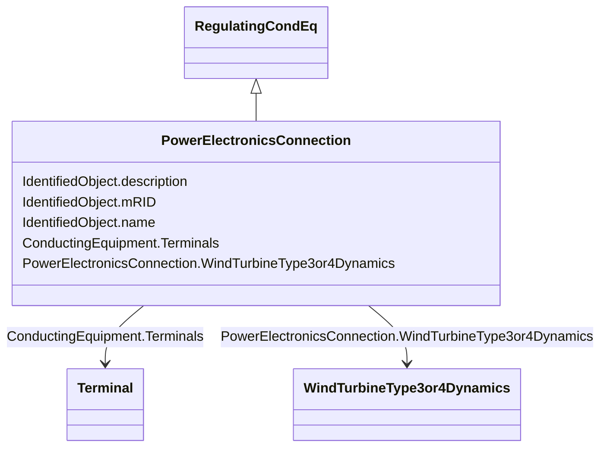

# PowerElectronicsConnection

_A connection to the AC network for energy production or consumption that uses power electronics rather than rotating machines._

**URI**: [cim:PowerElectronicsConnection](http://iec.ch/TC57/CIM100#PowerElectronicsConnection) 
**Type**: Class

## Inheritance
* [IdentifiedObject](IdentifiedObject.md)
    * [PowerSystemResource](PowerSystemResource.md)
        * [Equipment](Equipment.md)
            * [ConductingEquipment](ConductingEquipment.md)
                * [EnergyConnection](EnergyConnection.md)
                    * [RegulatingCondEq](RegulatingCondEq.md)
                        * **PowerElectronicsConnection**

## Attributes

| Name | URI | Cardinality and Range | Description | Inheritance |
| ---  | --- | --- | --- | --- |
| WindTurbineType3or4Dynamics | [cim:PowerElectronicsConnection.WindTurbineType3or4Dynamics](http://iec.ch/TC57/CIM100#PowerElectronicsConnection.WindTurbineType3or4Dynamics) | 0..1    [WindTurbineType3or4Dynamics](WindTurbineType3or4Dynamics.md)  | The wind turbine type 3 or type 4 dynamics model associated with this power e... | direct |
| Terminals | [cim:ConductingEquipment.Terminals](http://iec.ch/TC57/CIM100#ConductingEquipment.Terminals) | *    [Terminal](Terminal.md)  | Conducting equipment have terminals that may be connected to other conducting... | [ConductingEquipment](ConductingEquipment.md) |
| description | [cim:IdentifiedObject.description](http://iec.ch/TC57/CIM100#IdentifiedObject.description) | 0..1    string  | The description is a free human readable text describing or naming the object | [IdentifiedObject](IdentifiedObject.md) |
| mRID | [cim:IdentifiedObject.mRID](http://iec.ch/TC57/CIM100#IdentifiedObject.mRID) | 1    string  | Master resource identifier issued by a model authority | [IdentifiedObject](IdentifiedObject.md) |
| name | [cim:IdentifiedObject.name](http://iec.ch/TC57/CIM100#IdentifiedObject.name) | 0..1    string  | The name is any free human readable and possibly non unique text naming the o... | [IdentifiedObject](IdentifiedObject.md) |

## Usages

| used by | used in | type | used |
| ---  | --- | --- | --- |
| [WindType3or4UserDefined](WindType3or4UserDefined.md) | PowerElectronicsConnection | range | [PowerElectronicsConnection](PowerElectronicsConnection.md) |
| [WindTurbineType3IEC](WindTurbineType3IEC.md) | PowerElectronicsConnection | range | [PowerElectronicsConnection](PowerElectronicsConnection.md) |
| [WindTurbineType3or4Dynamics](WindTurbineType3or4Dynamics.md) | PowerElectronicsConnection | range | [PowerElectronicsConnection](PowerElectronicsConnection.md) |
| [WindTurbineType3or4IEC](WindTurbineType3or4IEC.md) | PowerElectronicsConnection | range | [PowerElectronicsConnection](PowerElectronicsConnection.md) |
| [WindTurbineType4aIEC](WindTurbineType4aIEC.md) | PowerElectronicsConnection | range | [PowerElectronicsConnection](PowerElectronicsConnection.md) |
| [WindTurbineType4bIEC](WindTurbineType4bIEC.md) | PowerElectronicsConnection | range | [PowerElectronicsConnection](PowerElectronicsConnection.md) |
| [WindTurbineType4IEC](WindTurbineType4IEC.md) | PowerElectronicsConnection | range | [PowerElectronicsConnection](PowerElectronicsConnection.md) |

## Identifier and Mapping Information

### Schema Source

* from schema: http://iec.ch/TC57/ns/CIM/Dynamics-EU#Package_DynamicsProfile

## Mappings

| Mapping Type | Mapped Value |
| ---  | ---  |
| self | cim:PowerElectronicsConnection |
| native | this:PowerElectronicsConnection |

