# PowerSystemStabilizerDynamics

_Power system stabilizer function block whose behaviour is described by reference to a standard model or by definition of a user-defined model._

**URI**: [cim:PowerSystemStabilizerDynamics](http://iec.ch/TC57/CIM100#PowerSystemStabilizerDynamics) 
**Type**: Class

```mermaid
 classDiagram
    class PowerSystemStabilizerDynamics
      DynamicsFunctionBlock <|-- PowerSystemStabilizerDynamics
      

      PowerSystemStabilizerDynamics <|-- PowerSystemStabilizerUserDefined
      PowerSystemStabilizerDynamics <|-- PssIEEE1A
      PowerSystemStabilizerDynamics <|-- PssIEEE2B
      PowerSystemStabilizerDynamics <|-- PssIEEE3B
      PowerSystemStabilizerDynamics <|-- PssIEEE4B
      PowerSystemStabilizerDynamics <|-- Pss1
      PowerSystemStabilizerDynamics <|-- Pss1A
      PowerSystemStabilizerDynamics <|-- Pss2B
      PowerSystemStabilizerDynamics <|-- Pss2ST
      PowerSystemStabilizerDynamics <|-- Pss5
      PowerSystemStabilizerDynamics <|-- PssELIN2
      PowerSystemStabilizerDynamics <|-- PssPTIST1
      PowerSystemStabilizerDynamics <|-- PssPTIST3
      PowerSystemStabilizerDynamics <|-- PssRQB
      PowerSystemStabilizerDynamics <|-- PssSB4
      PowerSystemStabilizerDynamics <|-- PssSH
      PowerSystemStabilizerDynamics <|-- PssSK
      PowerSystemStabilizerDynamics <|-- PssSTAB2A
      PowerSystemStabilizerDynamics <|-- PssWECC
      
      
      PowerSystemStabilizerDynamics : IdentifiedObject.description
        
      PowerSystemStabilizerDynamics : DynamicsFunctionBlock.enabled
        
      PowerSystemStabilizerDynamics : PowerSystemStabilizerDynamics.ExcitationSystemDynamics
        
          PowerSystemStabilizerDynamics --> ExcitationSystemDynamics : PowerSystemStabilizerDynamics.ExcitationSystemDynamics
        
      PowerSystemStabilizerDynamics : IdentifiedObject.mRID
        
      PowerSystemStabilizerDynamics : IdentifiedObject.name
        
      PowerSystemStabilizerDynamics : PowerSystemStabilizerDynamics.RemoteInputSignal
        
          PowerSystemStabilizerDynamics --> RemoteInputSignal : PowerSystemStabilizerDynamics.RemoteInputSignal
        
      
```

## Inheritance
* [IdentifiedObject](IdentifiedObject.md)
    * [DynamicsFunctionBlock](DynamicsFunctionBlock.md)
        * **PowerSystemStabilizerDynamics**
            * [PowerSystemStabilizerUserDefined](PowerSystemStabilizerUserDefined.md)
            * [PssIEEE1A](PssIEEE1A.md)
            * [PssIEEE2B](PssIEEE2B.md)
            * [PssIEEE3B](PssIEEE3B.md)
            * [PssIEEE4B](PssIEEE4B.md)
            * [Pss1](Pss1.md)
            * [Pss1A](Pss1A.md)
            * [Pss2B](Pss2B.md)
            * [Pss2ST](Pss2ST.md)
            * [Pss5](Pss5.md)
            * [PssELIN2](PssELIN2.md)
            * [PssPTIST1](PssPTIST1.md)
            * [PssPTIST3](PssPTIST3.md)
            * [PssRQB](PssRQB.md)
            * [PssSB4](PssSB4.md)
            * [PssSH](PssSH.md)
            * [PssSK](PssSK.md)
            * [PssSTAB2A](PssSTAB2A.md)
            * [PssWECC](PssWECC.md)

## Attributes

| Name | URI | Cardinality and Range | Description | Inheritance |
| ---  | --- | --- | --- | --- |
| RemoteInputSignal | [cim:PowerSystemStabilizerDynamics.RemoteInputSignal](http://iec.ch/TC57/CIM100#PowerSystemStabilizerDynamics.RemoteInputSignal) | 0..*    [RemoteInputSignal](RemoteInputSignal.md)  | Remote input signal used by this power system stabilizer model | direct |
| ExcitationSystemDynamics | [cim:PowerSystemStabilizerDynamics.ExcitationSystemDynamics](http://iec.ch/TC57/CIM100#PowerSystemStabilizerDynamics.ExcitationSystemDynamics) | 1..1    [ExcitationSystemDynamics](ExcitationSystemDynamics.md)  | Excitation system model with which this power system stabilizer model is asso... | direct |
| enabled | [cim:DynamicsFunctionBlock.enabled](http://iec.ch/TC57/CIM100#DynamicsFunctionBlock.enabled) | 1..1    boolean  | Function block used indicator | [DynamicsFunctionBlock](DynamicsFunctionBlock.md) |
| description | [cim:IdentifiedObject.description](http://iec.ch/TC57/CIM100#IdentifiedObject.description) | 0..1    string  | The description is a free human readable text describing or naming the object | [IdentifiedObject](IdentifiedObject.md) |
| mRID | [cim:IdentifiedObject.mRID](http://iec.ch/TC57/CIM100#IdentifiedObject.mRID) | 1..1    string  | Master resource identifier issued by a model authority | [IdentifiedObject](IdentifiedObject.md) |
| name | [cim:IdentifiedObject.name](http://iec.ch/TC57/CIM100#IdentifiedObject.name) | 0..1    string  | The name is any free human readable and possibly non unique text naming the o... | [IdentifiedObject](IdentifiedObject.md) |

## Usages

| used by | used in | type | used |
| ---  | --- | --- | --- |
| [RemoteInputSignal](RemoteInputSignal.md) | PowerSystemStabilizerDynamics | range | [PowerSystemStabilizerDynamics](PowerSystemStabilizerDynamics.md) |
| [ExcitationSystemUserDefined](ExcitationSystemUserDefined.md) | PowerSystemStabilizerDynamics | range | [PowerSystemStabilizerDynamics](PowerSystemStabilizerDynamics.md) |
| [ExcitationSystemDynamics](ExcitationSystemDynamics.md) | PowerSystemStabilizerDynamics | range | [PowerSystemStabilizerDynamics](PowerSystemStabilizerDynamics.md) |
| [ExcIEEEAC1A](ExcIEEEAC1A.md) | PowerSystemStabilizerDynamics | range | [PowerSystemStabilizerDynamics](PowerSystemStabilizerDynamics.md) |
| [ExcIEEEAC2A](ExcIEEEAC2A.md) | PowerSystemStabilizerDynamics | range | [PowerSystemStabilizerDynamics](PowerSystemStabilizerDynamics.md) |
| [ExcIEEEAC3A](ExcIEEEAC3A.md) | PowerSystemStabilizerDynamics | range | [PowerSystemStabilizerDynamics](PowerSystemStabilizerDynamics.md) |
| [ExcIEEEAC4A](ExcIEEEAC4A.md) | PowerSystemStabilizerDynamics | range | [PowerSystemStabilizerDynamics](PowerSystemStabilizerDynamics.md) |
| [ExcIEEEAC5A](ExcIEEEAC5A.md) | PowerSystemStabilizerDynamics | range | [PowerSystemStabilizerDynamics](PowerSystemStabilizerDynamics.md) |
| [ExcIEEEAC6A](ExcIEEEAC6A.md) | PowerSystemStabilizerDynamics | range | [PowerSystemStabilizerDynamics](PowerSystemStabilizerDynamics.md) |
| [ExcIEEEAC7B](ExcIEEEAC7B.md) | PowerSystemStabilizerDynamics | range | [PowerSystemStabilizerDynamics](PowerSystemStabilizerDynamics.md) |
| [ExcIEEEAC8B](ExcIEEEAC8B.md) | PowerSystemStabilizerDynamics | range | [PowerSystemStabilizerDynamics](PowerSystemStabilizerDynamics.md) |
| [ExcIEEEDC1A](ExcIEEEDC1A.md) | PowerSystemStabilizerDynamics | range | [PowerSystemStabilizerDynamics](PowerSystemStabilizerDynamics.md) |
| [ExcIEEEDC2A](ExcIEEEDC2A.md) | PowerSystemStabilizerDynamics | range | [PowerSystemStabilizerDynamics](PowerSystemStabilizerDynamics.md) |
| [ExcIEEEDC3A](ExcIEEEDC3A.md) | PowerSystemStabilizerDynamics | range | [PowerSystemStabilizerDynamics](PowerSystemStabilizerDynamics.md) |
| [ExcIEEEDC4B](ExcIEEEDC4B.md) | PowerSystemStabilizerDynamics | range | [PowerSystemStabilizerDynamics](PowerSystemStabilizerDynamics.md) |
| [ExcIEEEST1A](ExcIEEEST1A.md) | PowerSystemStabilizerDynamics | range | [PowerSystemStabilizerDynamics](PowerSystemStabilizerDynamics.md) |
| [ExcIEEEST2A](ExcIEEEST2A.md) | PowerSystemStabilizerDynamics | range | [PowerSystemStabilizerDynamics](PowerSystemStabilizerDynamics.md) |
| [ExcIEEEST3A](ExcIEEEST3A.md) | PowerSystemStabilizerDynamics | range | [PowerSystemStabilizerDynamics](PowerSystemStabilizerDynamics.md) |
| [ExcIEEEST4B](ExcIEEEST4B.md) | PowerSystemStabilizerDynamics | range | [PowerSystemStabilizerDynamics](PowerSystemStabilizerDynamics.md) |
| [ExcIEEEST5B](ExcIEEEST5B.md) | PowerSystemStabilizerDynamics | range | [PowerSystemStabilizerDynamics](PowerSystemStabilizerDynamics.md) |
| [ExcIEEEST6B](ExcIEEEST6B.md) | PowerSystemStabilizerDynamics | range | [PowerSystemStabilizerDynamics](PowerSystemStabilizerDynamics.md) |
| [ExcIEEEST7B](ExcIEEEST7B.md) | PowerSystemStabilizerDynamics | range | [PowerSystemStabilizerDynamics](PowerSystemStabilizerDynamics.md) |
| [ExcAC1A](ExcAC1A.md) | PowerSystemStabilizerDynamics | range | [PowerSystemStabilizerDynamics](PowerSystemStabilizerDynamics.md) |
| [ExcAC2A](ExcAC2A.md) | PowerSystemStabilizerDynamics | range | [PowerSystemStabilizerDynamics](PowerSystemStabilizerDynamics.md) |
| [ExcAC3A](ExcAC3A.md) | PowerSystemStabilizerDynamics | range | [PowerSystemStabilizerDynamics](PowerSystemStabilizerDynamics.md) |
| [ExcAC4A](ExcAC4A.md) | PowerSystemStabilizerDynamics | range | [PowerSystemStabilizerDynamics](PowerSystemStabilizerDynamics.md) |
| [ExcAC5A](ExcAC5A.md) | PowerSystemStabilizerDynamics | range | [PowerSystemStabilizerDynamics](PowerSystemStabilizerDynamics.md) |
| [ExcAC6A](ExcAC6A.md) | PowerSystemStabilizerDynamics | range | [PowerSystemStabilizerDynamics](PowerSystemStabilizerDynamics.md) |
| [ExcAC8B](ExcAC8B.md) | PowerSystemStabilizerDynamics | range | [PowerSystemStabilizerDynamics](PowerSystemStabilizerDynamics.md) |
| [ExcANS](ExcANS.md) | PowerSystemStabilizerDynamics | range | [PowerSystemStabilizerDynamics](PowerSystemStabilizerDynamics.md) |
| [ExcAVR1](ExcAVR1.md) | PowerSystemStabilizerDynamics | range | [PowerSystemStabilizerDynamics](PowerSystemStabilizerDynamics.md) |
| [ExcAVR2](ExcAVR2.md) | PowerSystemStabilizerDynamics | range | [PowerSystemStabilizerDynamics](PowerSystemStabilizerDynamics.md) |
| [ExcAVR3](ExcAVR3.md) | PowerSystemStabilizerDynamics | range | [PowerSystemStabilizerDynamics](PowerSystemStabilizerDynamics.md) |
| [ExcAVR4](ExcAVR4.md) | PowerSystemStabilizerDynamics | range | [PowerSystemStabilizerDynamics](PowerSystemStabilizerDynamics.md) |
| [ExcAVR5](ExcAVR5.md) | PowerSystemStabilizerDynamics | range | [PowerSystemStabilizerDynamics](PowerSystemStabilizerDynamics.md) |
| [ExcAVR7](ExcAVR7.md) | PowerSystemStabilizerDynamics | range | [PowerSystemStabilizerDynamics](PowerSystemStabilizerDynamics.md) |
| [ExcBBC](ExcBBC.md) | PowerSystemStabilizerDynamics | range | [PowerSystemStabilizerDynamics](PowerSystemStabilizerDynamics.md) |
| [ExcCZ](ExcCZ.md) | PowerSystemStabilizerDynamics | range | [PowerSystemStabilizerDynamics](PowerSystemStabilizerDynamics.md) |
| [ExcDC1A](ExcDC1A.md) | PowerSystemStabilizerDynamics | range | [PowerSystemStabilizerDynamics](PowerSystemStabilizerDynamics.md) |
| [ExcDC2A](ExcDC2A.md) | PowerSystemStabilizerDynamics | range | [PowerSystemStabilizerDynamics](PowerSystemStabilizerDynamics.md) |
| [ExcDC3A](ExcDC3A.md) | PowerSystemStabilizerDynamics | range | [PowerSystemStabilizerDynamics](PowerSystemStabilizerDynamics.md) |
| [ExcDC3A1](ExcDC3A1.md) | PowerSystemStabilizerDynamics | range | [PowerSystemStabilizerDynamics](PowerSystemStabilizerDynamics.md) |
| [ExcELIN1](ExcELIN1.md) | PowerSystemStabilizerDynamics | range | [PowerSystemStabilizerDynamics](PowerSystemStabilizerDynamics.md) |
| [ExcELIN2](ExcELIN2.md) | PowerSystemStabilizerDynamics | range | [PowerSystemStabilizerDynamics](PowerSystemStabilizerDynamics.md) |
| [ExcHU](ExcHU.md) | PowerSystemStabilizerDynamics | range | [PowerSystemStabilizerDynamics](PowerSystemStabilizerDynamics.md) |
| [ExcNI](ExcNI.md) | PowerSystemStabilizerDynamics | range | [PowerSystemStabilizerDynamics](PowerSystemStabilizerDynamics.md) |
| [ExcOEX3T](ExcOEX3T.md) | PowerSystemStabilizerDynamics | range | [PowerSystemStabilizerDynamics](PowerSystemStabilizerDynamics.md) |
| [ExcPIC](ExcPIC.md) | PowerSystemStabilizerDynamics | range | [PowerSystemStabilizerDynamics](PowerSystemStabilizerDynamics.md) |
| [ExcREXS](ExcREXS.md) | PowerSystemStabilizerDynamics | range | [PowerSystemStabilizerDynamics](PowerSystemStabilizerDynamics.md) |
| [ExcRQB](ExcRQB.md) | PowerSystemStabilizerDynamics | range | [PowerSystemStabilizerDynamics](PowerSystemStabilizerDynamics.md) |
| [ExcSCRX](ExcSCRX.md) | PowerSystemStabilizerDynamics | range | [PowerSystemStabilizerDynamics](PowerSystemStabilizerDynamics.md) |
| [ExcSEXS](ExcSEXS.md) | PowerSystemStabilizerDynamics | range | [PowerSystemStabilizerDynamics](PowerSystemStabilizerDynamics.md) |
| [ExcSK](ExcSK.md) | PowerSystemStabilizerDynamics | range | [PowerSystemStabilizerDynamics](PowerSystemStabilizerDynamics.md) |
| [ExcST1A](ExcST1A.md) | PowerSystemStabilizerDynamics | range | [PowerSystemStabilizerDynamics](PowerSystemStabilizerDynamics.md) |
| [ExcST2A](ExcST2A.md) | PowerSystemStabilizerDynamics | range | [PowerSystemStabilizerDynamics](PowerSystemStabilizerDynamics.md) |
| [ExcST3A](ExcST3A.md) | PowerSystemStabilizerDynamics | range | [PowerSystemStabilizerDynamics](PowerSystemStabilizerDynamics.md) |
| [ExcST4B](ExcST4B.md) | PowerSystemStabilizerDynamics | range | [PowerSystemStabilizerDynamics](PowerSystemStabilizerDynamics.md) |
| [ExcST6B](ExcST6B.md) | PowerSystemStabilizerDynamics | range | [PowerSystemStabilizerDynamics](PowerSystemStabilizerDynamics.md) |
| [ExcST7B](ExcST7B.md) | PowerSystemStabilizerDynamics | range | [PowerSystemStabilizerDynamics](PowerSystemStabilizerDynamics.md) |

## Identifier and Mapping Information

### Schema Source

* from schema: http://iec.ch/TC57/ns/CIM/Dynamics-EU#Package_DynamicsProfile

## Mappings

| Mapping Type | Mapped Value |
| ---  | ---  |
| self | cim:PowerSystemStabilizerDynamics |
| native | this:PowerSystemStabilizerDynamics |

