# ProprietaryParameterDynamics

_Supports definition of one or more parameters of several different datatypes for use by proprietary user-defined models.  _

_This class does not inherit from IdentifiedObject since it is not intended that a single instance of it be referenced by more than one proprietary user-defined model instance._

**URI**: [cim:ProprietaryParameterDynamics](http://iec.ch/TC57/CIM100#ProprietaryParameterDynamics) 
**Type**: Class

```mermaid
 classDiagram
    class ProprietaryParameterDynamics
    click ProprietaryParameterDynamics href "../ProprietaryParameterDynamics"
      ProprietaryParameterDynamics : ProprietaryParameterDynamics.AsynchronousMachineUserDefined
        
          ProprietaryParameterDynamics --> AsynchronousMachineUserDefined : ProprietaryParameterDynamics.AsynchronousMachineUserDefined
          click AsynchronousMachineUserDefined href "../AsynchronousMachineUserDefined"
        
      ProprietaryParameterDynamics : ProprietaryParameterDynamics.booleanParameterValue
        
      ProprietaryParameterDynamics : ProprietaryParameterDynamics.CSCUserDefined
        
          ProprietaryParameterDynamics --> CSCUserDefined : ProprietaryParameterDynamics.CSCUserDefined
          click CSCUserDefined href "../CSCUserDefined"
        
      ProprietaryParameterDynamics : ProprietaryParameterDynamics.DiscontinuousExcitationControlUserDefined
        
          ProprietaryParameterDynamics --> DiscontinuousExcitationControlUserDefined : ProprietaryParameterDynamics.DiscontinuousExcitationControlUserDefined
          click DiscontinuousExcitationControlUserDefined href "../DiscontinuousExcitationControlUserDefined"
        
      ProprietaryParameterDynamics : ProprietaryParameterDynamics.ExcitationSystemUserDefined
        
          ProprietaryParameterDynamics --> ExcitationSystemUserDefined : ProprietaryParameterDynamics.ExcitationSystemUserDefined
          click ExcitationSystemUserDefined href "../ExcitationSystemUserDefined"
        
      ProprietaryParameterDynamics : ProprietaryParameterDynamics.floatParameterValue
        
      ProprietaryParameterDynamics : ProprietaryParameterDynamics.integerParameterValue
        
      ProprietaryParameterDynamics : ProprietaryParameterDynamics.LoadUserDefined
        
          ProprietaryParameterDynamics --> LoadUserDefined : ProprietaryParameterDynamics.LoadUserDefined
          click LoadUserDefined href "../LoadUserDefined"
        
      ProprietaryParameterDynamics : ProprietaryParameterDynamics.MechanicalLoadUserDefined
        
          ProprietaryParameterDynamics --> MechanicalLoadUserDefined : ProprietaryParameterDynamics.MechanicalLoadUserDefined
          click MechanicalLoadUserDefined href "../MechanicalLoadUserDefined"
        
      ProprietaryParameterDynamics : ProprietaryParameterDynamics.OverexcitationLimiterUserDefined
        
          ProprietaryParameterDynamics --> OverexcitationLimiterUserDefined : ProprietaryParameterDynamics.OverexcitationLimiterUserDefined
          click OverexcitationLimiterUserDefined href "../OverexcitationLimiterUserDefined"
        
      ProprietaryParameterDynamics : ProprietaryParameterDynamics.parameterNumber
        
      ProprietaryParameterDynamics : ProprietaryParameterDynamics.PFVArControllerType1UserDefined
        
          ProprietaryParameterDynamics --> PFVArControllerType1UserDefined : ProprietaryParameterDynamics.PFVArControllerType1UserDefined
          click PFVArControllerType1UserDefined href "../PFVArControllerType1UserDefined"
        
      ProprietaryParameterDynamics : ProprietaryParameterDynamics.PFVArControllerType2UserDefined
        
          ProprietaryParameterDynamics --> PFVArControllerType2UserDefined : ProprietaryParameterDynamics.PFVArControllerType2UserDefined
          click PFVArControllerType2UserDefined href "../PFVArControllerType2UserDefined"
        
      ProprietaryParameterDynamics : ProprietaryParameterDynamics.PowerSystemStabilizerUserDefined
        
          ProprietaryParameterDynamics --> PowerSystemStabilizerUserDefined : ProprietaryParameterDynamics.PowerSystemStabilizerUserDefined
          click PowerSystemStabilizerUserDefined href "../PowerSystemStabilizerUserDefined"
        
      ProprietaryParameterDynamics : ProprietaryParameterDynamics.SVCUserDefined
        
          ProprietaryParameterDynamics --> SVCUserDefined : ProprietaryParameterDynamics.SVCUserDefined
          click SVCUserDefined href "../SVCUserDefined"
        
      ProprietaryParameterDynamics : ProprietaryParameterDynamics.SynchronousMachineUserDefined
        
          ProprietaryParameterDynamics --> SynchronousMachineUserDefined : ProprietaryParameterDynamics.SynchronousMachineUserDefined
          click SynchronousMachineUserDefined href "../SynchronousMachineUserDefined"
        
      ProprietaryParameterDynamics : ProprietaryParameterDynamics.TurbineGovernorUserDefined
        
          ProprietaryParameterDynamics --> TurbineGovernorUserDefined : ProprietaryParameterDynamics.TurbineGovernorUserDefined
          click TurbineGovernorUserDefined href "../TurbineGovernorUserDefined"
        
      ProprietaryParameterDynamics : ProprietaryParameterDynamics.TurbineLoadControllerUserDefined
        
          ProprietaryParameterDynamics --> TurbineLoadControllerUserDefined : ProprietaryParameterDynamics.TurbineLoadControllerUserDefined
          click TurbineLoadControllerUserDefined href "../TurbineLoadControllerUserDefined"
        
      ProprietaryParameterDynamics : ProprietaryParameterDynamics.UnderexcitationLimiterUserDefined
        
          ProprietaryParameterDynamics --> UnderexcitationLimiterUserDefined : ProprietaryParameterDynamics.UnderexcitationLimiterUserDefined
          click UnderexcitationLimiterUserDefined href "../UnderexcitationLimiterUserDefined"
        
      ProprietaryParameterDynamics : ProprietaryParameterDynamics.VoltageAdjusterUserDefined
        
          ProprietaryParameterDynamics --> VoltageAdjusterUserDefined : ProprietaryParameterDynamics.VoltageAdjusterUserDefined
          click VoltageAdjusterUserDefined href "../VoltageAdjusterUserDefined"
        
      ProprietaryParameterDynamics : ProprietaryParameterDynamics.VoltageCompensatorUserDefined
        
          ProprietaryParameterDynamics --> VoltageCompensatorUserDefined : ProprietaryParameterDynamics.VoltageCompensatorUserDefined
          click VoltageCompensatorUserDefined href "../VoltageCompensatorUserDefined"
        
      ProprietaryParameterDynamics : ProprietaryParameterDynamics.VSCUserDefined
        
          ProprietaryParameterDynamics --> VSCUserDefined : ProprietaryParameterDynamics.VSCUserDefined
          click VSCUserDefined href "../VSCUserDefined"
        
      ProprietaryParameterDynamics : ProprietaryParameterDynamics.WindPlantUserDefined
        
          ProprietaryParameterDynamics --> WindPlantUserDefined : ProprietaryParameterDynamics.WindPlantUserDefined
          click WindPlantUserDefined href "../WindPlantUserDefined"
        
      ProprietaryParameterDynamics : ProprietaryParameterDynamics.WindType1or2UserDefined
        
          ProprietaryParameterDynamics --> WindType1or2UserDefined : ProprietaryParameterDynamics.WindType1or2UserDefined
          click WindType1or2UserDefined href "../WindType1or2UserDefined"
        
      ProprietaryParameterDynamics : ProprietaryParameterDynamics.WindType3or4UserDefined
        
          ProprietaryParameterDynamics --> WindType3or4UserDefined : ProprietaryParameterDynamics.WindType3or4UserDefined
          click WindType3or4UserDefined href "../WindType3or4UserDefined"
        
      
```

<!-- no inheritance hierarchy -->

## Attributes

| Name | URI | Cardinality and Range | Description | Inheritance |
| ---  | --- | --- | --- | --- |
| CSCUserDefined | [cim:ProprietaryParameterDynamics.CSCUserDefined](http://iec.ch/TC57/CIM100#ProprietaryParameterDynamics.CSCUserDefined) | 0..1    [CSCUserDefined](CSCUserDefined.md)  | Proprietary user-defined model with which this parameter is associated | direct |
| SVCUserDefined | [cim:ProprietaryParameterDynamics.SVCUserDefined](http://iec.ch/TC57/CIM100#ProprietaryParameterDynamics.SVCUserDefined) | 0..1    [SVCUserDefined](SVCUserDefined.md)  | Proprietary user-defined model with which this parameter is associated | direct |
| VSCUserDefined | [cim:ProprietaryParameterDynamics.VSCUserDefined](http://iec.ch/TC57/CIM100#ProprietaryParameterDynamics.VSCUserDefined) | 0..1    [VSCUserDefined](VSCUserDefined.md)  | Proprietary user-defined model with which this parameter is associated | direct |
| WindPlantUserDefined | [cim:ProprietaryParameterDynamics.WindPlantUserDefined](http://iec.ch/TC57/CIM100#ProprietaryParameterDynamics.WindPlantUserDefined) | 0..1    [WindPlantUserDefined](WindPlantUserDefined.md)  | Proprietary user-defined model with which this parameter is associated | direct |
| WindType1or2UserDefined | [cim:ProprietaryParameterDynamics.WindType1or2UserDefined](http://iec.ch/TC57/CIM100#ProprietaryParameterDynamics.WindType1or2UserDefined) | 0..1    [WindType1or2UserDefined](WindType1or2UserDefined.md)  | Proprietary user-defined model with which this parameter is associated | direct |
| WindType3or4UserDefined | [cim:ProprietaryParameterDynamics.WindType3or4UserDefined](http://iec.ch/TC57/CIM100#ProprietaryParameterDynamics.WindType3or4UserDefined) | 0..1    [WindType3or4UserDefined](WindType3or4UserDefined.md)  | Proprietary user-defined model with which this parameter is associated | direct |
| SynchronousMachineUserDefined | [cim:ProprietaryParameterDynamics.SynchronousMachineUserDefined](http://iec.ch/TC57/CIM100#ProprietaryParameterDynamics.SynchronousMachineUserDefined) | 0..1    [SynchronousMachineUserDefined](SynchronousMachineUserDefined.md)  | Proprietary user-defined model with which this parameter is associated | direct |
| AsynchronousMachineUserDefined | [cim:ProprietaryParameterDynamics.AsynchronousMachineUserDefined](http://iec.ch/TC57/CIM100#ProprietaryParameterDynamics.AsynchronousMachineUserDefined) | 0..1    [AsynchronousMachineUserDefined](AsynchronousMachineUserDefined.md)  | Proprietary user-defined model with which this parameter is associated | direct |
| TurbineGovernorUserDefined | [cim:ProprietaryParameterDynamics.TurbineGovernorUserDefined](http://iec.ch/TC57/CIM100#ProprietaryParameterDynamics.TurbineGovernorUserDefined) | 0..1    [TurbineGovernorUserDefined](TurbineGovernorUserDefined.md)  | Proprietary user-defined model with which this parameter is associated | direct |
| TurbineLoadControllerUserDefined | [cim:ProprietaryParameterDynamics.TurbineLoadControllerUserDefined](http://iec.ch/TC57/CIM100#ProprietaryParameterDynamics.TurbineLoadControllerUserDefined) | 0..1    [TurbineLoadControllerUserDefined](TurbineLoadControllerUserDefined.md)  | Proprietary user-defined model with which this parameter is associated | direct |
| MechanicalLoadUserDefined | [cim:ProprietaryParameterDynamics.MechanicalLoadUserDefined](http://iec.ch/TC57/CIM100#ProprietaryParameterDynamics.MechanicalLoadUserDefined) | 0..1    [MechanicalLoadUserDefined](MechanicalLoadUserDefined.md)  | Proprietary user-defined model with which this parameter is associated | direct |
| ExcitationSystemUserDefined | [cim:ProprietaryParameterDynamics.ExcitationSystemUserDefined](http://iec.ch/TC57/CIM100#ProprietaryParameterDynamics.ExcitationSystemUserDefined) | 0..1    [ExcitationSystemUserDefined](ExcitationSystemUserDefined.md)  | Proprietary user-defined model with which this parameter is associated | direct |
| OverexcitationLimiterUserDefined | [cim:ProprietaryParameterDynamics.OverexcitationLimiterUserDefined](http://iec.ch/TC57/CIM100#ProprietaryParameterDynamics.OverexcitationLimiterUserDefined) | 0..1    [OverexcitationLimiterUserDefined](OverexcitationLimiterUserDefined.md)  | Proprietary user-defined model with which this parameter is associated | direct |
| UnderexcitationLimiterUserDefined | [cim:ProprietaryParameterDynamics.UnderexcitationLimiterUserDefined](http://iec.ch/TC57/CIM100#ProprietaryParameterDynamics.UnderexcitationLimiterUserDefined) | 0..1    [UnderexcitationLimiterUserDefined](UnderexcitationLimiterUserDefined.md)  | Proprietary user-defined model with which this parameter is associated | direct |
| PowerSystemStabilizerUserDefined | [cim:ProprietaryParameterDynamics.PowerSystemStabilizerUserDefined](http://iec.ch/TC57/CIM100#ProprietaryParameterDynamics.PowerSystemStabilizerUserDefined) | 0..1    [PowerSystemStabilizerUserDefined](PowerSystemStabilizerUserDefined.md)  | Proprietary user-defined model with which this parameter is associated | direct |
| DiscontinuousExcitationControlUserDefined | [cim:ProprietaryParameterDynamics.DiscontinuousExcitationControlUserDefined](http://iec.ch/TC57/CIM100#ProprietaryParameterDynamics.DiscontinuousExcitationControlUserDefined) | 0..1    [DiscontinuousExcitationControlUserDefined](DiscontinuousExcitationControlUserDefined.md)  | Proprietary user-defined model with which this parameter is associated | direct |
| PFVArControllerType1UserDefined | [cim:ProprietaryParameterDynamics.PFVArControllerType1UserDefined](http://iec.ch/TC57/CIM100#ProprietaryParameterDynamics.PFVArControllerType1UserDefined) | 0..1    [PFVArControllerType1UserDefined](PFVArControllerType1UserDefined.md)  | Proprietary user-defined model with which this parameter is associated | direct |
| VoltageAdjusterUserDefined | [cim:ProprietaryParameterDynamics.VoltageAdjusterUserDefined](http://iec.ch/TC57/CIM100#ProprietaryParameterDynamics.VoltageAdjusterUserDefined) | 0..1    [VoltageAdjusterUserDefined](VoltageAdjusterUserDefined.md)  | Proprietary user-defined model with which this parameter is associated | direct |
| PFVArControllerType2UserDefined | [cim:ProprietaryParameterDynamics.PFVArControllerType2UserDefined](http://iec.ch/TC57/CIM100#ProprietaryParameterDynamics.PFVArControllerType2UserDefined) | 0..1    [PFVArControllerType2UserDefined](PFVArControllerType2UserDefined.md)  | Proprietary user-defined model with which this parameter is associated | direct |
| VoltageCompensatorUserDefined | [cim:ProprietaryParameterDynamics.VoltageCompensatorUserDefined](http://iec.ch/TC57/CIM100#ProprietaryParameterDynamics.VoltageCompensatorUserDefined) | 0..1    [VoltageCompensatorUserDefined](VoltageCompensatorUserDefined.md)  | Proprietary user-defined model with which this parameter is associated | direct |
| LoadUserDefined | [cim:ProprietaryParameterDynamics.LoadUserDefined](http://iec.ch/TC57/CIM100#ProprietaryParameterDynamics.LoadUserDefined) | 0..1    [LoadUserDefined](LoadUserDefined.md)  | Proprietary user-defined model with which this parameter is associated | direct |
| parameterNumber | [cim:ProprietaryParameterDynamics.parameterNumber](http://iec.ch/TC57/CIM100#ProprietaryParameterDynamics.parameterNumber) | 1    integer  | Sequence number of the parameter among the set of parameters associated with ... | direct |
| booleanParameterValue | [cim:ProprietaryParameterDynamics.booleanParameterValue](http://iec.ch/TC57/CIM100#ProprietaryParameterDynamics.booleanParameterValue) | 0..1    boolean  | Boolean parameter value | direct |
| integerParameterValue | [cim:ProprietaryParameterDynamics.integerParameterValue](http://iec.ch/TC57/CIM100#ProprietaryParameterDynamics.integerParameterValue) | 0..1    integer  | Integer parameter value | direct |
| floatParameterValue | [cim:ProprietaryParameterDynamics.floatParameterValue](http://iec.ch/TC57/CIM100#ProprietaryParameterDynamics.floatParameterValue) | 0..1    float  | Floating point parameter value | direct |

## Usages

| used by | used in | type | used |
| ---  | --- | --- | --- |
| [CSCUserDefined](CSCUserDefined.md) | ProprietaryParameterDynamics | range | [ProprietaryParameterDynamics](ProprietaryParameterDynamics.md) |
| [SVCUserDefined](SVCUserDefined.md) | ProprietaryParameterDynamics | range | [ProprietaryParameterDynamics](ProprietaryParameterDynamics.md) |
| [VSCUserDefined](VSCUserDefined.md) | ProprietaryParameterDynamics | range | [ProprietaryParameterDynamics](ProprietaryParameterDynamics.md) |
| [WindPlantUserDefined](WindPlantUserDefined.md) | ProprietaryParameterDynamics | range | [ProprietaryParameterDynamics](ProprietaryParameterDynamics.md) |
| [WindType1or2UserDefined](WindType1or2UserDefined.md) | ProprietaryParameterDynamics | range | [ProprietaryParameterDynamics](ProprietaryParameterDynamics.md) |
| [WindType3or4UserDefined](WindType3or4UserDefined.md) | ProprietaryParameterDynamics | range | [ProprietaryParameterDynamics](ProprietaryParameterDynamics.md) |
| [SynchronousMachineUserDefined](SynchronousMachineUserDefined.md) | ProprietaryParameterDynamics | range | [ProprietaryParameterDynamics](ProprietaryParameterDynamics.md) |
| [AsynchronousMachineUserDefined](AsynchronousMachineUserDefined.md) | ProprietaryParameterDynamics | range | [ProprietaryParameterDynamics](ProprietaryParameterDynamics.md) |
| [TurbineGovernorUserDefined](TurbineGovernorUserDefined.md) | ProprietaryParameterDynamics | range | [ProprietaryParameterDynamics](ProprietaryParameterDynamics.md) |
| [TurbineLoadControllerUserDefined](TurbineLoadControllerUserDefined.md) | ProprietaryParameterDynamics | range | [ProprietaryParameterDynamics](ProprietaryParameterDynamics.md) |
| [MechanicalLoadUserDefined](MechanicalLoadUserDefined.md) | ProprietaryParameterDynamics | range | [ProprietaryParameterDynamics](ProprietaryParameterDynamics.md) |
| [ExcitationSystemUserDefined](ExcitationSystemUserDefined.md) | ProprietaryParameterDynamics | range | [ProprietaryParameterDynamics](ProprietaryParameterDynamics.md) |
| [OverexcitationLimiterUserDefined](OverexcitationLimiterUserDefined.md) | ProprietaryParameterDynamics | range | [ProprietaryParameterDynamics](ProprietaryParameterDynamics.md) |
| [UnderexcitationLimiterUserDefined](UnderexcitationLimiterUserDefined.md) | ProprietaryParameterDynamics | range | [ProprietaryParameterDynamics](ProprietaryParameterDynamics.md) |
| [PowerSystemStabilizerUserDefined](PowerSystemStabilizerUserDefined.md) | ProprietaryParameterDynamics | range | [ProprietaryParameterDynamics](ProprietaryParameterDynamics.md) |
| [DiscontinuousExcitationControlUserDefined](DiscontinuousExcitationControlUserDefined.md) | ProprietaryParameterDynamics | range | [ProprietaryParameterDynamics](ProprietaryParameterDynamics.md) |
| [PFVArControllerType1UserDefined](PFVArControllerType1UserDefined.md) | ProprietaryParameterDynamics | range | [ProprietaryParameterDynamics](ProprietaryParameterDynamics.md) |
| [VoltageAdjusterUserDefined](VoltageAdjusterUserDefined.md) | ProprietaryParameterDynamics | range | [ProprietaryParameterDynamics](ProprietaryParameterDynamics.md) |
| [PFVArControllerType2UserDefined](PFVArControllerType2UserDefined.md) | ProprietaryParameterDynamics | range | [ProprietaryParameterDynamics](ProprietaryParameterDynamics.md) |
| [VoltageCompensatorUserDefined](VoltageCompensatorUserDefined.md) | ProprietaryParameterDynamics | range | [ProprietaryParameterDynamics](ProprietaryParameterDynamics.md) |
| [LoadUserDefined](LoadUserDefined.md) | ProprietaryParameterDynamics | range | [ProprietaryParameterDynamics](ProprietaryParameterDynamics.md) |

## Identifier and Mapping Information

### Schema Source

* from schema: http://iec.ch/TC57/ns/CIM/Dynamics-EU#Package_DynamicsProfile

## Mappings

| Mapping Type | Mapped Value |
| ---  | ---  |
| self | cim:ProprietaryParameterDynamics |
| native | this:ProprietaryParameterDynamics |

