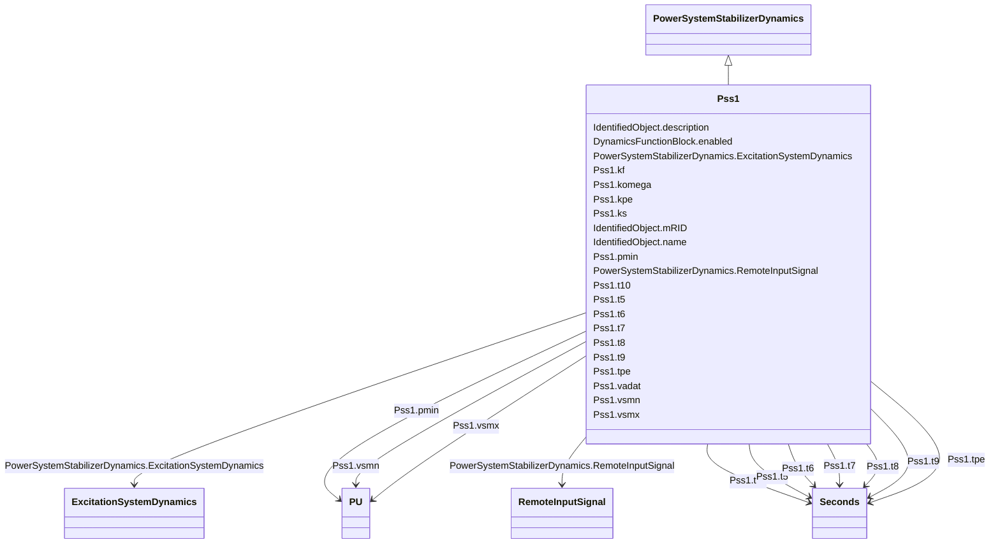

# Pss1

_Italian PSS with three inputs (speed, frequency, power)._

**URI**: [cim:Pss1](http://iec.ch/TC57/CIM100#Pss1) 
**Type**: Class

## Inheritance
* [IdentifiedObject](IdentifiedObject.md)
    * [DynamicsFunctionBlock](DynamicsFunctionBlock.md)
        * [PowerSystemStabilizerDynamics](PowerSystemStabilizerDynamics.md)
            * **Pss1**

## Attributes

| Name | URI | Cardinality and Range | Description | Inheritance |
| ---  | --- | --- | --- | --- |
| komega | [cim:Pss1.komega](http://iec.ch/TC57/CIM100#Pss1.komega) | 1..1    float  | Shaft speed power input gain (<i>K</i><i>omega</i>) | direct |
| kf | [cim:Pss1.kf](http://iec.ch/TC57/CIM100#Pss1.kf) | 1..1    float  | Frequency power input gain (<i>K</i><i>F</i>) | direct |
| kpe | [cim:Pss1.kpe](http://iec.ch/TC57/CIM100#Pss1.kpe) | 1..1    float  | Electric power input gain (<i>K</i><i>PE</i>) | direct |
| pmin | [cim:Pss1.pmin](http://iec.ch/TC57/CIM100#Pss1.pmin) | 1..1    [PU](PU.md)  | Minimum power PSS enabling (<i>Pmin</i>) | direct |
| ks | [cim:Pss1.ks](http://iec.ch/TC57/CIM100#Pss1.ks) | 1..1    float  | PSS gain (<i>Ks</i>) | direct |
| vsmn | [cim:Pss1.vsmn](http://iec.ch/TC57/CIM100#Pss1.vsmn) | 1..1    [PU](PU.md)  | Stabilizer output maximum limit (<i>V</i><i>SMN</i>) | direct |
| vsmx | [cim:Pss1.vsmx](http://iec.ch/TC57/CIM100#Pss1.vsmx) | 1..1    [PU](PU.md)  | Stabilizer output minimum limit (<i>V</i><i>SMX</i>) | direct |
| tpe | [cim:Pss1.tpe](http://iec.ch/TC57/CIM100#Pss1.tpe) | 1..1    [Seconds](Seconds.md)  | Electric power filter time constant (<i>T</i><i>PE</i>) (&gt;= 0) | direct |
| t5 | [cim:Pss1.t5](http://iec.ch/TC57/CIM100#Pss1.t5) | 1..1    [Seconds](Seconds.md)  | Washout (<i>T</i><i>5</i>) (&gt;= 0) | direct |
| t6 | [cim:Pss1.t6](http://iec.ch/TC57/CIM100#Pss1.t6) | 1..1    [Seconds](Seconds.md)  | Filter time constant (<i>T</i><i>6</i>) (&gt;= 0) | direct |
| t7 | [cim:Pss1.t7](http://iec.ch/TC57/CIM100#Pss1.t7) | 1..1    [Seconds](Seconds.md)  | Lead/lag time constant (<i>T</i><i>7</i>) (&gt;= 0) | direct |
| t8 | [cim:Pss1.t8](http://iec.ch/TC57/CIM100#Pss1.t8) | 1..1    [Seconds](Seconds.md)  | Lead/lag time constant (<i>T</i><i>8</i>) (&gt;= 0) | direct |
| t9 | [cim:Pss1.t9](http://iec.ch/TC57/CIM100#Pss1.t9) | 1..1    [Seconds](Seconds.md)  | Lead/lag time constant (<i>T</i><i>9</i>) (&gt;= 0) | direct |
| t10 | [cim:Pss1.t10](http://iec.ch/TC57/CIM100#Pss1.t10) | 1..1    [Seconds](Seconds.md)  | Lead/lag time constant (<i>T</i><i>10</i>) (&gt;= 0) | direct |
| vadat | [cim:Pss1.vadat](http://iec.ch/TC57/CIM100#Pss1.vadat) | 1..1    boolean  | Signal selector (<i>V</i><i>ADAT</i>) | direct |
| RemoteInputSignal | [cim:PowerSystemStabilizerDynamics.RemoteInputSignal](http://iec.ch/TC57/CIM100#PowerSystemStabilizerDynamics.RemoteInputSignal) | 0..*    [RemoteInputSignal](RemoteInputSignal.md)  | Remote input signal used by this power system stabilizer model | [PowerSystemStabilizerDynamics](PowerSystemStabilizerDynamics.md) |
| ExcitationSystemDynamics | [cim:PowerSystemStabilizerDynamics.ExcitationSystemDynamics](http://iec.ch/TC57/CIM100#PowerSystemStabilizerDynamics.ExcitationSystemDynamics) | 1..1    [ExcitationSystemDynamics](ExcitationSystemDynamics.md)  | Excitation system model with which this power system stabilizer model is asso... | [PowerSystemStabilizerDynamics](PowerSystemStabilizerDynamics.md) |
| enabled | [cim:DynamicsFunctionBlock.enabled](http://iec.ch/TC57/CIM100#DynamicsFunctionBlock.enabled) | 1..1    boolean  | Function block used indicator | [DynamicsFunctionBlock](DynamicsFunctionBlock.md) |
| description | [cim:IdentifiedObject.description](http://iec.ch/TC57/CIM100#IdentifiedObject.description) | 0..1    string  | The description is a free human readable text describing or naming the object | [IdentifiedObject](IdentifiedObject.md) |
| mRID | [cim:IdentifiedObject.mRID](http://iec.ch/TC57/CIM100#IdentifiedObject.mRID) | 1..1    string  | Master resource identifier issued by a model authority | [IdentifiedObject](IdentifiedObject.md) |
| name | [cim:IdentifiedObject.name](http://iec.ch/TC57/CIM100#IdentifiedObject.name) | 0..1    string  | The name is any free human readable and possibly non unique text naming the o... | [IdentifiedObject](IdentifiedObject.md) |

## Identifier and Mapping Information

### Schema Source

* from schema: http://iec.ch/TC57/ns/CIM/Dynamics-EU#Package_DynamicsProfile

## Mappings

| Mapping Type | Mapped Value |
| ---  | ---  |
| self | cim:Pss1 |
| native | this:Pss1 |

