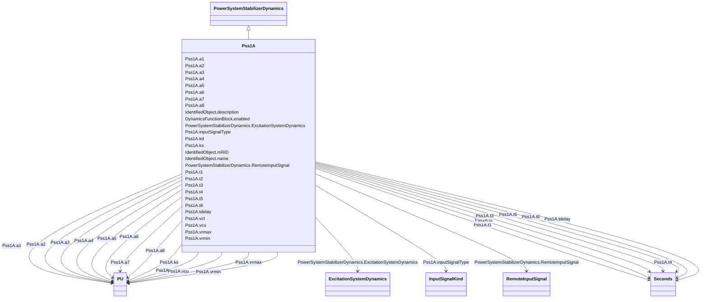

# Pss1A

_Single input power system stabilizer. It is a modified version in order to allow representation of various vendors' implementations on PSS type 1A._

**URI**: [cim:Pss1A](http://iec.ch/TC57/CIM100#Pss1A) 
**Type**: Class

## Inheritance
* [IdentifiedObject](IdentifiedObject.md)
    * [DynamicsFunctionBlock](DynamicsFunctionBlock.md)
        * [PowerSystemStabilizerDynamics](PowerSystemStabilizerDynamics.md)
            * **Pss1A**

## Attributes

| Name | URI | Cardinality and Range | Description | Inheritance |
| ---  | --- | --- | --- | --- |
| inputSignalType | [cim:Pss1A.inputSignalType](http://iec.ch/TC57/CIM100#Pss1A.inputSignalType) | 1..1    [InputSignalKind](InputSignalKind.md)  | Type of input signal (rotorAngularFrequencyDeviation, busFrequencyDeviation, ... | direct |
| a1 | [cim:Pss1A.a1](http://iec.ch/TC57/CIM100#Pss1A.a1) | 1..1    [PU](PU.md)  | Notch filter parameter (<i>A</i><i>1</i>) | direct |
| a2 | [cim:Pss1A.a2](http://iec.ch/TC57/CIM100#Pss1A.a2) | 1..1    [PU](PU.md)  | Notch filter parameter (<i>A</i><i>2</i>) | direct |
| t1 | [cim:Pss1A.t1](http://iec.ch/TC57/CIM100#Pss1A.t1) | 1..1    [Seconds](Seconds.md)  | Lead/lag time constant (<i>T</i><i>1</i>) (&gt;= 0) | direct |
| t2 | [cim:Pss1A.t2](http://iec.ch/TC57/CIM100#Pss1A.t2) | 1..1    [Seconds](Seconds.md)  | Lead/lag time constant (<i>T</i><i>2</i>) (&gt;= 0) | direct |
| t3 | [cim:Pss1A.t3](http://iec.ch/TC57/CIM100#Pss1A.t3) | 1..1    [Seconds](Seconds.md)  | Lead/lag time constant (<i>T</i><i>3</i>) (&gt;= 0) | direct |
| t4 | [cim:Pss1A.t4](http://iec.ch/TC57/CIM100#Pss1A.t4) | 1..1    [Seconds](Seconds.md)  | Lead/lag time constant (<i>T</i><i>4</i>) (&gt;= 0) | direct |
| t5 | [cim:Pss1A.t5](http://iec.ch/TC57/CIM100#Pss1A.t5) | 1..1    [Seconds](Seconds.md)  | Washout time constant (<i>T</i><i>5</i>) (&gt;= 0) | direct |
| t6 | [cim:Pss1A.t6](http://iec.ch/TC57/CIM100#Pss1A.t6) | 1..1    [Seconds](Seconds.md)  | Transducer time constant (<i>T</i><i>6</i>) (&gt;= 0) | direct |
| ks | [cim:Pss1A.ks](http://iec.ch/TC57/CIM100#Pss1A.ks) | 1..1    [PU](PU.md)  | Stabilizer gain (<i>K</i><i>s</i>) | direct |
| vrmax | [cim:Pss1A.vrmax](http://iec.ch/TC57/CIM100#Pss1A.vrmax) | 1..1    [PU](PU.md)  | Maximum stabilizer output (<i>Vrmax</i>) (&gt; Pss1A | direct |
| vrmin | [cim:Pss1A.vrmin](http://iec.ch/TC57/CIM100#Pss1A.vrmin) | 1..1    [PU](PU.md)  | Minimum stabilizer output (<i>Vrmin</i>) (&lt; Pss1A | direct |
| vcu | [cim:Pss1A.vcu](http://iec.ch/TC57/CIM100#Pss1A.vcu) | 1..1    [PU](PU.md)  | Stabilizer input cutoff threshold (<i>Vcu</i>) | direct |
| vcl | [cim:Pss1A.vcl](http://iec.ch/TC57/CIM100#Pss1A.vcl) | 1..1    [PU](PU.md)  | Stabilizer input cutoff threshold (<i>Vcl</i>) | direct |
| a3 | [cim:Pss1A.a3](http://iec.ch/TC57/CIM100#Pss1A.a3) | 1..1    [PU](PU.md)  | Notch filter parameter (<i>A</i><i>3</i>) | direct |
| a4 | [cim:Pss1A.a4](http://iec.ch/TC57/CIM100#Pss1A.a4) | 1..1    [PU](PU.md)  | Notch filter parameter (<i>A</i><i>4</i>) | direct |
| a5 | [cim:Pss1A.a5](http://iec.ch/TC57/CIM100#Pss1A.a5) | 1..1    [PU](PU.md)  | Notch filter parameter (<i>A</i><i>5</i>) | direct |
| a6 | [cim:Pss1A.a6](http://iec.ch/TC57/CIM100#Pss1A.a6) | 1..1    [PU](PU.md)  | Notch filter parameter (<i>A</i><i>6</i>) | direct |
| a7 | [cim:Pss1A.a7](http://iec.ch/TC57/CIM100#Pss1A.a7) | 1..1    [PU](PU.md)  | Notch filter parameter (<i>A</i><i>7</i>) | direct |
| a8 | [cim:Pss1A.a8](http://iec.ch/TC57/CIM100#Pss1A.a8) | 1..1    [PU](PU.md)  | Notch filter parameter (<i>A</i><i>8</i>) | direct |
| kd | [cim:Pss1A.kd](http://iec.ch/TC57/CIM100#Pss1A.kd) | 1..1    boolean  | Selector (<i>Kd</i>) | direct |
| tdelay | [cim:Pss1A.tdelay](http://iec.ch/TC57/CIM100#Pss1A.tdelay) | 1..1    [Seconds](Seconds.md)  | Time constant (<i>Tdelay</i>) (&gt;= 0) | direct |
| RemoteInputSignal | [cim:PowerSystemStabilizerDynamics.RemoteInputSignal](http://iec.ch/TC57/CIM100#PowerSystemStabilizerDynamics.RemoteInputSignal) | 0..*    [RemoteInputSignal](RemoteInputSignal.md)  | Remote input signal used by this power system stabilizer model | [PowerSystemStabilizerDynamics](PowerSystemStabilizerDynamics.md) |
| ExcitationSystemDynamics | [cim:PowerSystemStabilizerDynamics.ExcitationSystemDynamics](http://iec.ch/TC57/CIM100#PowerSystemStabilizerDynamics.ExcitationSystemDynamics) | 1..1    [ExcitationSystemDynamics](ExcitationSystemDynamics.md)  | Excitation system model with which this power system stabilizer model is asso... | [PowerSystemStabilizerDynamics](PowerSystemStabilizerDynamics.md) |
| enabled | [cim:DynamicsFunctionBlock.enabled](http://iec.ch/TC57/CIM100#DynamicsFunctionBlock.enabled) | 1..1    boolean  | Function block used indicator | [DynamicsFunctionBlock](DynamicsFunctionBlock.md) |
| description | [cim:IdentifiedObject.description](http://iec.ch/TC57/CIM100#IdentifiedObject.description) | 0..1    string  | The description is a free human readable text describing or naming the object | [IdentifiedObject](IdentifiedObject.md) |
| mRID | [cim:IdentifiedObject.mRID](http://iec.ch/TC57/CIM100#IdentifiedObject.mRID) | 1..1    string  | Master resource identifier issued by a model authority | [IdentifiedObject](IdentifiedObject.md) |
| name | [cim:IdentifiedObject.name](http://iec.ch/TC57/CIM100#IdentifiedObject.name) | 0..1    string  | The name is any free human readable and possibly non unique text naming the o... | [IdentifiedObject](IdentifiedObject.md) |

## Identifier and Mapping Information

### Schema Source

* from schema: http://iec.ch/TC57/ns/CIM/Dynamics-EU#Package_DynamicsProfile

## Mappings

| Mapping Type | Mapped Value |
| ---  | ---  |
| self | cim:Pss1A |
| native | this:Pss1A |

