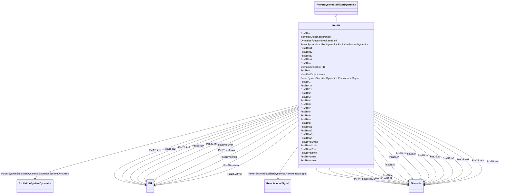

# Pss2B

_Modified IEEE PSS2B.  Extra lead/lag (or rate) block added at end (up to 4 lead/lags total)._

**URI**: [cim:Pss2B](http://iec.ch/TC57/CIM100#Pss2B) 
**Type**: Class

## Inheritance
* [IdentifiedObject](IdentifiedObject.md)
    * [DynamicsFunctionBlock](DynamicsFunctionBlock.md)
        * [PowerSystemStabilizerDynamics](PowerSystemStabilizerDynamics.md)
            * **Pss2B**

## Attributes

| Name | URI | Cardinality and Range | Description | Inheritance |
| ---  | --- | --- | --- | --- |
| vsi1max | [cim:Pss2B.vsi1max](http://iec.ch/TC57/CIM100#Pss2B.vsi1max) | 1..1    [PU](PU.md)  | Input signal #1 maximum limit (<i>Vsi1max</i>) (&gt; Pss2B | direct |
| vsi1min | [cim:Pss2B.vsi1min](http://iec.ch/TC57/CIM100#Pss2B.vsi1min) | 1..1    [PU](PU.md)  | Input signal #1 minimum limit (<i>Vsi1min</i>) (&lt; Pss2B | direct |
| tw1 | [cim:Pss2B.tw1](http://iec.ch/TC57/CIM100#Pss2B.tw1) | 1..1    [Seconds](Seconds.md)  | First washout on signal #1 (<i>T</i><i>w1</i>) (&gt;= 0) | direct |
| tw2 | [cim:Pss2B.tw2](http://iec.ch/TC57/CIM100#Pss2B.tw2) | 1..1    [Seconds](Seconds.md)  | Second washout on signal #1 (<i>T</i><i>w2</i>) (&gt;= 0) | direct |
| vsi2max | [cim:Pss2B.vsi2max](http://iec.ch/TC57/CIM100#Pss2B.vsi2max) | 1..1    [PU](PU.md)  | Input signal #2 maximum limit (<i>Vsi2max</i>) (&gt; Pss2B | direct |
| vsi2min | [cim:Pss2B.vsi2min](http://iec.ch/TC57/CIM100#Pss2B.vsi2min) | 1..1    [PU](PU.md)  | Input signal #2 minimum limit (<i>Vsi2min</i>) (&lt; Pss2B | direct |
| tw3 | [cim:Pss2B.tw3](http://iec.ch/TC57/CIM100#Pss2B.tw3) | 1..1    [Seconds](Seconds.md)  | First washout on signal #2 (<i>T</i><i>w3</i>) (&gt;= 0) | direct |
| tw4 | [cim:Pss2B.tw4](http://iec.ch/TC57/CIM100#Pss2B.tw4) | 1..1    [Seconds](Seconds.md)  | Second washout on signal #2 (<i>T</i><i>w4</i>) (&gt;= 0) | direct |
| t1 | [cim:Pss2B.t1](http://iec.ch/TC57/CIM100#Pss2B.t1) | 1..1    [Seconds](Seconds.md)  | Lead/lag time constant (<i>T</i><i>1</i>) (&gt;= 0) | direct |
| t2 | [cim:Pss2B.t2](http://iec.ch/TC57/CIM100#Pss2B.t2) | 1..1    [Seconds](Seconds.md)  | Lead/lag time constant (<i>T</i><i>2</i>) (&gt;= 0) | direct |
| t3 | [cim:Pss2B.t3](http://iec.ch/TC57/CIM100#Pss2B.t3) | 1..1    [Seconds](Seconds.md)  | Lead/lag time constant (<i>T</i><i>3</i>) (&gt;= 0) | direct |
| t4 | [cim:Pss2B.t4](http://iec.ch/TC57/CIM100#Pss2B.t4) | 1..1    [Seconds](Seconds.md)  | Lead/lag time constant (<i>T</i><i>4</i>) (&gt;= 0) | direct |
| t6 | [cim:Pss2B.t6](http://iec.ch/TC57/CIM100#Pss2B.t6) | 1..1    [Seconds](Seconds.md)  | Time constant on signal #1 (<i>T</i><i>6</i>) (&gt;= 0) | direct |
| t7 | [cim:Pss2B.t7](http://iec.ch/TC57/CIM100#Pss2B.t7) | 1..1    [Seconds](Seconds.md)  | Time constant on signal #2 (<i>T</i><i>7</i>) (&gt;= 0) | direct |
| t8 | [cim:Pss2B.t8](http://iec.ch/TC57/CIM100#Pss2B.t8) | 1..1    [Seconds](Seconds.md)  | Lead of ramp tracking filter (<i>T</i><i>8</i>) (&gt;= 0) | direct |
| t9 | [cim:Pss2B.t9](http://iec.ch/TC57/CIM100#Pss2B.t9) | 1..1    [Seconds](Seconds.md)  | Lag of ramp tracking filter (<i>T</i><i>9</i>) (&gt;= 0) | direct |
| t10 | [cim:Pss2B.t10](http://iec.ch/TC57/CIM100#Pss2B.t10) | 1..1    [Seconds](Seconds.md)  | Lead/lag time constant (<i>T</i><i>10</i>) (&gt;= 0) | direct |
| t11 | [cim:Pss2B.t11](http://iec.ch/TC57/CIM100#Pss2B.t11) | 1..1    [Seconds](Seconds.md)  | Lead/lag time constant (<i>T</i><i>11</i>) (&gt;= 0) | direct |
| ks1 | [cim:Pss2B.ks1](http://iec.ch/TC57/CIM100#Pss2B.ks1) | 1..1    [PU](PU.md)  | Stabilizer gain (<i>Ks1</i>) | direct |
| ks2 | [cim:Pss2B.ks2](http://iec.ch/TC57/CIM100#Pss2B.ks2) | 1..1    [PU](PU.md)  | Gain on signal #2 (<i>Ks2</i>) | direct |
| ks3 | [cim:Pss2B.ks3](http://iec.ch/TC57/CIM100#Pss2B.ks3) | 1..1    [PU](PU.md)  | Gain on signal #2 input before ramp-tracking filter (<i>Ks3</i>) | direct |
| ks4 | [cim:Pss2B.ks4](http://iec.ch/TC57/CIM100#Pss2B.ks4) | 1..1    [PU](PU.md)  | Gain on signal #2 input after ramp-tracking filter (<i>Ks4</i>) | direct |
| n | [cim:Pss2B.n](http://iec.ch/TC57/CIM100#Pss2B.n) | 1..1    integer  | Order of ramp tracking filter (<i>n</i>) | direct |
| m | [cim:Pss2B.m](http://iec.ch/TC57/CIM100#Pss2B.m) | 1..1    integer  | Denominator order of ramp tracking filter (<i>m</i>) | direct |
| vstmax | [cim:Pss2B.vstmax](http://iec.ch/TC57/CIM100#Pss2B.vstmax) | 1..1    [PU](PU.md)  | Stabilizer output maximum limit (<i>Vstmax</i>) (&gt; Pss2B | direct |
| vstmin | [cim:Pss2B.vstmin](http://iec.ch/TC57/CIM100#Pss2B.vstmin) | 1..1    [PU](PU.md)  | Stabilizer output minimum limit (<i>Vstmin</i>) (&lt; Pss2B | direct |
| a | [cim:Pss2B.a](http://iec.ch/TC57/CIM100#Pss2B.a) | 1..1    float  | Numerator constant (<i>a</i>) | direct |
| ta | [cim:Pss2B.ta](http://iec.ch/TC57/CIM100#Pss2B.ta) | 1..1    [Seconds](Seconds.md)  | Lead constant (<i>T</i><i>a</i>) (&gt;= 0) | direct |
| tb | [cim:Pss2B.tb](http://iec.ch/TC57/CIM100#Pss2B.tb) | 1..1    [Seconds](Seconds.md)  | Lag time constant (<i>T</i><i>b</i>) (&gt;= 0) | direct |
| RemoteInputSignal | [cim:PowerSystemStabilizerDynamics.RemoteInputSignal](http://iec.ch/TC57/CIM100#PowerSystemStabilizerDynamics.RemoteInputSignal) | 0..*    [RemoteInputSignal](RemoteInputSignal.md)  | Remote input signal used by this power system stabilizer model | [PowerSystemStabilizerDynamics](PowerSystemStabilizerDynamics.md) |
| ExcitationSystemDynamics | [cim:PowerSystemStabilizerDynamics.ExcitationSystemDynamics](http://iec.ch/TC57/CIM100#PowerSystemStabilizerDynamics.ExcitationSystemDynamics) | 1..1    [ExcitationSystemDynamics](ExcitationSystemDynamics.md)  | Excitation system model with which this power system stabilizer model is asso... | [PowerSystemStabilizerDynamics](PowerSystemStabilizerDynamics.md) |
| enabled | [cim:DynamicsFunctionBlock.enabled](http://iec.ch/TC57/CIM100#DynamicsFunctionBlock.enabled) | 1..1    boolean  | Function block used indicator | [DynamicsFunctionBlock](DynamicsFunctionBlock.md) |
| description | [cim:IdentifiedObject.description](http://iec.ch/TC57/CIM100#IdentifiedObject.description) | 0..1    string  | The description is a free human readable text describing or naming the object | [IdentifiedObject](IdentifiedObject.md) |
| mRID | [cim:IdentifiedObject.mRID](http://iec.ch/TC57/CIM100#IdentifiedObject.mRID) | 1..1    string  | Master resource identifier issued by a model authority | [IdentifiedObject](IdentifiedObject.md) |
| name | [cim:IdentifiedObject.name](http://iec.ch/TC57/CIM100#IdentifiedObject.name) | 0..1    string  | The name is any free human readable and possibly non unique text naming the o... | [IdentifiedObject](IdentifiedObject.md) |

## Identifier and Mapping Information

### Schema Source

* from schema: http://iec.ch/TC57/ns/CIM/Dynamics-EU#Package_DynamicsProfile

## Mappings

| Mapping Type | Mapped Value |
| ---  | ---  |
| self | cim:Pss2B |
| native | this:Pss2B |

