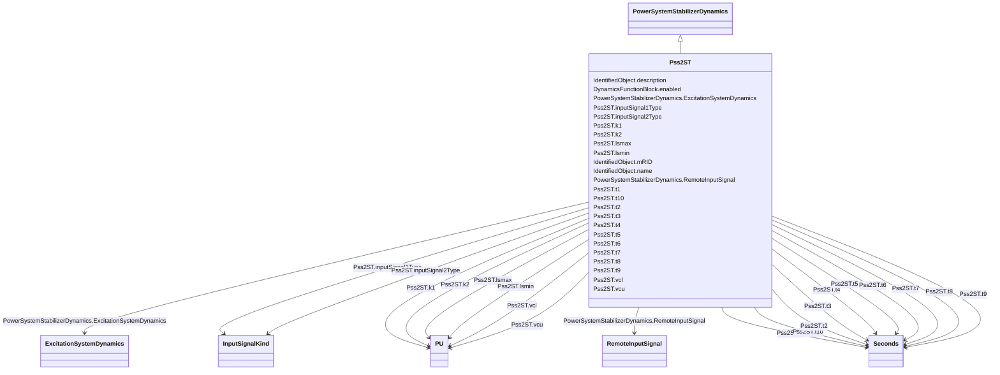

# Pss2ST

_PTI microprocessor-based stabilizer type 1._

**URI**: [cim:Pss2ST](http://iec.ch/TC57/CIM100#Pss2ST) 
**Type**: Class

## Inheritance
* [IdentifiedObject](IdentifiedObject.md)
    * [DynamicsFunctionBlock](DynamicsFunctionBlock.md)
        * [PowerSystemStabilizerDynamics](PowerSystemStabilizerDynamics.md)
            * **Pss2ST**

## Attributes

| Name | URI | Cardinality and Range | Description | Inheritance |
| ---  | --- | --- | --- | --- |
| inputSignal1Type | [cim:Pss2ST.inputSignal1Type](http://iec.ch/TC57/CIM100#Pss2ST.inputSignal1Type) | 1..1    [InputSignalKind](InputSignalKind.md)  | Type of input signal #1 (rotorAngularFrequencyDeviation, busFrequencyDeviatio... | direct |
| inputSignal2Type | [cim:Pss2ST.inputSignal2Type](http://iec.ch/TC57/CIM100#Pss2ST.inputSignal2Type) | 1..1    [InputSignalKind](InputSignalKind.md)  | Type of input signal #2 (rotorAngularFrequencyDeviation, busFrequencyDeviatio... | direct |
| k1 | [cim:Pss2ST.k1](http://iec.ch/TC57/CIM100#Pss2ST.k1) | 1..1    [PU](PU.md)  | Gain (<i>K</i><i>1</i>) | direct |
| k2 | [cim:Pss2ST.k2](http://iec.ch/TC57/CIM100#Pss2ST.k2) | 1..1    [PU](PU.md)  | Gain (<i>K</i><i>2</i>) | direct |
| t1 | [cim:Pss2ST.t1](http://iec.ch/TC57/CIM100#Pss2ST.t1) | 1..1    [Seconds](Seconds.md)  | Time constant (<i>T</i><i>1</i>) (&gt;= 0) | direct |
| t2 | [cim:Pss2ST.t2](http://iec.ch/TC57/CIM100#Pss2ST.t2) | 1..1    [Seconds](Seconds.md)  | Time constant (<i>T</i><i>2</i>) (&gt;= 0) | direct |
| t3 | [cim:Pss2ST.t3](http://iec.ch/TC57/CIM100#Pss2ST.t3) | 1..1    [Seconds](Seconds.md)  | Time constant (<i>T</i><i>3</i>) (&gt;= 0) | direct |
| t4 | [cim:Pss2ST.t4](http://iec.ch/TC57/CIM100#Pss2ST.t4) | 1..1    [Seconds](Seconds.md)  | Time constant (<i>T</i><i>4</i>) (&gt;= 0) | direct |
| t5 | [cim:Pss2ST.t5](http://iec.ch/TC57/CIM100#Pss2ST.t5) | 1..1    [Seconds](Seconds.md)  | Time constant (<i>T</i><i>5</i>) (&gt;= 0) | direct |
| t6 | [cim:Pss2ST.t6](http://iec.ch/TC57/CIM100#Pss2ST.t6) | 1..1    [Seconds](Seconds.md)  | Time constant (<i>T</i><i>6</i>) (&gt;= 0) | direct |
| t7 | [cim:Pss2ST.t7](http://iec.ch/TC57/CIM100#Pss2ST.t7) | 1..1    [Seconds](Seconds.md)  | Time constant (<i>T</i><i>7</i>) (&gt;= 0) | direct |
| t8 | [cim:Pss2ST.t8](http://iec.ch/TC57/CIM100#Pss2ST.t8) | 1..1    [Seconds](Seconds.md)  | Time constant (<i>T</i><i>8</i>) (&gt;= 0) | direct |
| t9 | [cim:Pss2ST.t9](http://iec.ch/TC57/CIM100#Pss2ST.t9) | 1..1    [Seconds](Seconds.md)  | Time constant (<i>T</i><i>9</i>) (&gt;= 0) | direct |
| t10 | [cim:Pss2ST.t10](http://iec.ch/TC57/CIM100#Pss2ST.t10) | 1..1    [Seconds](Seconds.md)  | Time constant (<i>T</i><i>10</i>) (&gt;= 0) | direct |
| lsmax | [cim:Pss2ST.lsmax](http://iec.ch/TC57/CIM100#Pss2ST.lsmax) | 1..1    [PU](PU.md)  | Limiter (<i>L</i><i>SMAX</i>) (&gt; Pss2ST | direct |
| lsmin | [cim:Pss2ST.lsmin](http://iec.ch/TC57/CIM100#Pss2ST.lsmin) | 1..1    [PU](PU.md)  | Limiter (<i>L</i><i>SMIN</i>) (&lt; Pss2ST | direct |
| vcu | [cim:Pss2ST.vcu](http://iec.ch/TC57/CIM100#Pss2ST.vcu) | 1..1    [PU](PU.md)  | Cutoff limiter (<i>V</i><i>CU</i>) | direct |
| vcl | [cim:Pss2ST.vcl](http://iec.ch/TC57/CIM100#Pss2ST.vcl) | 1..1    [PU](PU.md)  | Cutoff limiter (<i>V</i><i>CL</i>) | direct |
| RemoteInputSignal | [cim:PowerSystemStabilizerDynamics.RemoteInputSignal](http://iec.ch/TC57/CIM100#PowerSystemStabilizerDynamics.RemoteInputSignal) | 0..*    [RemoteInputSignal](RemoteInputSignal.md)  | Remote input signal used by this power system stabilizer model | [PowerSystemStabilizerDynamics](PowerSystemStabilizerDynamics.md) |
| ExcitationSystemDynamics | [cim:PowerSystemStabilizerDynamics.ExcitationSystemDynamics](http://iec.ch/TC57/CIM100#PowerSystemStabilizerDynamics.ExcitationSystemDynamics) | 1..1    [ExcitationSystemDynamics](ExcitationSystemDynamics.md)  | Excitation system model with which this power system stabilizer model is asso... | [PowerSystemStabilizerDynamics](PowerSystemStabilizerDynamics.md) |
| enabled | [cim:DynamicsFunctionBlock.enabled](http://iec.ch/TC57/CIM100#DynamicsFunctionBlock.enabled) | 1..1    boolean  | Function block used indicator | [DynamicsFunctionBlock](DynamicsFunctionBlock.md) |
| description | [cim:IdentifiedObject.description](http://iec.ch/TC57/CIM100#IdentifiedObject.description) | 0..1    string  | The description is a free human readable text describing or naming the object | [IdentifiedObject](IdentifiedObject.md) |
| mRID | [cim:IdentifiedObject.mRID](http://iec.ch/TC57/CIM100#IdentifiedObject.mRID) | 1..1    string  | Master resource identifier issued by a model authority | [IdentifiedObject](IdentifiedObject.md) |
| name | [cim:IdentifiedObject.name](http://iec.ch/TC57/CIM100#IdentifiedObject.name) | 0..1    string  | The name is any free human readable and possibly non unique text naming the o... | [IdentifiedObject](IdentifiedObject.md) |

## Identifier and Mapping Information

### Schema Source

* from schema: http://iec.ch/TC57/ns/CIM/Dynamics-EU#Package_DynamicsProfile

## Mappings

| Mapping Type | Mapped Value |
| ---  | ---  |
| self | cim:Pss2ST |
| native | this:Pss2ST |

