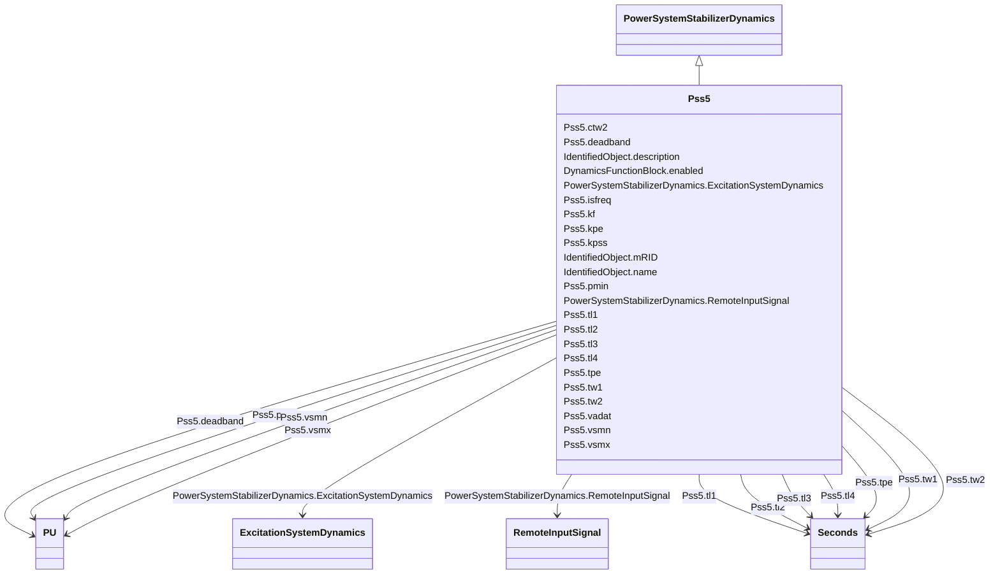

# Pss5

_Detailed Italian PSS._

**URI**: [cim:Pss5](http://iec.ch/TC57/CIM100#Pss5) 
**Type**: Class

## Inheritance
* [IdentifiedObject](IdentifiedObject.md)
    * [DynamicsFunctionBlock](DynamicsFunctionBlock.md)
        * [PowerSystemStabilizerDynamics](PowerSystemStabilizerDynamics.md)
            * **Pss5**

## Attributes

| Name | URI | Cardinality and Range | Description | Inheritance |
| ---  | --- | --- | --- | --- |
| kpe | [cim:Pss5.kpe](http://iec.ch/TC57/CIM100#Pss5.kpe) | 1    float  | Electric power input gain (<i>K</i><i>PE</i>) | direct |
| kf | [cim:Pss5.kf](http://iec.ch/TC57/CIM100#Pss5.kf) | 1    float  | Frequency/shaft speed input gain (<i>K</i><i>F</i>) | direct |
| isfreq | [cim:Pss5.isfreq](http://iec.ch/TC57/CIM100#Pss5.isfreq) | 1    boolean  | Selector for frequency/shaft speed input (<i>isFreq</i>) | direct |
| kpss | [cim:Pss5.kpss](http://iec.ch/TC57/CIM100#Pss5.kpss) | 1    float  | PSS gain (<i>K</i><i>PSS</i>) | direct |
| ctw2 | [cim:Pss5.ctw2](http://iec.ch/TC57/CIM100#Pss5.ctw2) | 1    boolean  | Selector for second washout enabling (<i>C</i><i>TW2</i>) | direct |
| tw1 | [cim:Pss5.tw1](http://iec.ch/TC57/CIM100#Pss5.tw1) | 1    [Seconds](Seconds.md)  | First washout (<i>T</i><i>W1</i>) (&gt;= 0) | direct |
| tw2 | [cim:Pss5.tw2](http://iec.ch/TC57/CIM100#Pss5.tw2) | 1    [Seconds](Seconds.md)  | Second washout (<i>T</i><i>W2</i>) (&gt;= 0) | direct |
| tl1 | [cim:Pss5.tl1](http://iec.ch/TC57/CIM100#Pss5.tl1) | 1    [Seconds](Seconds.md)  | Lead/lag time constant (<i>T</i><i>L1</i>) (&gt;= 0) | direct |
| tl2 | [cim:Pss5.tl2](http://iec.ch/TC57/CIM100#Pss5.tl2) | 1    [Seconds](Seconds.md)  | Lead/lag time constant (<i>T</i><i>L2</i>) (&gt;= 0) | direct |
| tl3 | [cim:Pss5.tl3](http://iec.ch/TC57/CIM100#Pss5.tl3) | 1    [Seconds](Seconds.md)  | Lead/lag time constant (<i>T</i><i>L3</i>) (&gt;= 0) | direct |
| tl4 | [cim:Pss5.tl4](http://iec.ch/TC57/CIM100#Pss5.tl4) | 1    [Seconds](Seconds.md)  | Lead/lag time constant (TL4) (&gt;= 0) | direct |
| vsmn | [cim:Pss5.vsmn](http://iec.ch/TC57/CIM100#Pss5.vsmn) | 1    [PU](PU.md)  | Stabilizer output maximum limit (<i>V</i><i>SMN</i>) | direct |
| vsmx | [cim:Pss5.vsmx](http://iec.ch/TC57/CIM100#Pss5.vsmx) | 1    [PU](PU.md)  | Stabilizer output minimum limit (<i>V</i><i>SMX</i>) | direct |
| tpe | [cim:Pss5.tpe](http://iec.ch/TC57/CIM100#Pss5.tpe) | 1    [Seconds](Seconds.md)  | Electric power filter time constant (<i>T</i><i>PE</i>) (&gt;= 0) | direct |
| pmin | [cim:Pss5.pmin](http://iec.ch/TC57/CIM100#Pss5.pmin) | 1    [PU](PU.md)  | Minimum power PSS enabling (<i>Pmin</i>) | direct |
| deadband | [cim:Pss5.deadband](http://iec.ch/TC57/CIM100#Pss5.deadband) | 1    [PU](PU.md)  | Stabilizer output deadband (<i>DEADBAND</i>) | direct |
| vadat | [cim:Pss5.vadat](http://iec.ch/TC57/CIM100#Pss5.vadat) | 1    boolean  | Signal selector (<i>V</i><i>adAtt</i>) | direct |
| RemoteInputSignal | [cim:PowerSystemStabilizerDynamics.RemoteInputSignal](http://iec.ch/TC57/CIM100#PowerSystemStabilizerDynamics.RemoteInputSignal) | *    [RemoteInputSignal](RemoteInputSignal.md)  | Remote input signal used by this power system stabilizer model | [PowerSystemStabilizerDynamics](PowerSystemStabilizerDynamics.md) |
| ExcitationSystemDynamics | [cim:PowerSystemStabilizerDynamics.ExcitationSystemDynamics](http://iec.ch/TC57/CIM100#PowerSystemStabilizerDynamics.ExcitationSystemDynamics) | 1    [ExcitationSystemDynamics](ExcitationSystemDynamics.md)  | Excitation system model with which this power system stabilizer model is asso... | [PowerSystemStabilizerDynamics](PowerSystemStabilizerDynamics.md) |
| enabled | [cim:DynamicsFunctionBlock.enabled](http://iec.ch/TC57/CIM100#DynamicsFunctionBlock.enabled) | 1    boolean  | Function block used indicator | [DynamicsFunctionBlock](DynamicsFunctionBlock.md) |
| description | [cim:IdentifiedObject.description](http://iec.ch/TC57/CIM100#IdentifiedObject.description) | 0..1    string  | The description is a free human readable text describing or naming the object | [IdentifiedObject](IdentifiedObject.md) |
| mRID | [cim:IdentifiedObject.mRID](http://iec.ch/TC57/CIM100#IdentifiedObject.mRID) | 1    string  | Master resource identifier issued by a model authority | [IdentifiedObject](IdentifiedObject.md) |
| name | [cim:IdentifiedObject.name](http://iec.ch/TC57/CIM100#IdentifiedObject.name) | 0..1    string  | The name is any free human readable and possibly non unique text naming the o... | [IdentifiedObject](IdentifiedObject.md) |

## Identifier and Mapping Information

### Schema Source

* from schema: http://iec.ch/TC57/ns/CIM/Dynamics-EU#Package_DynamicsProfile

## Mappings

| Mapping Type | Mapped Value |
| ---  | ---  |
| self | cim:Pss5 |
| native | this:Pss5 |

