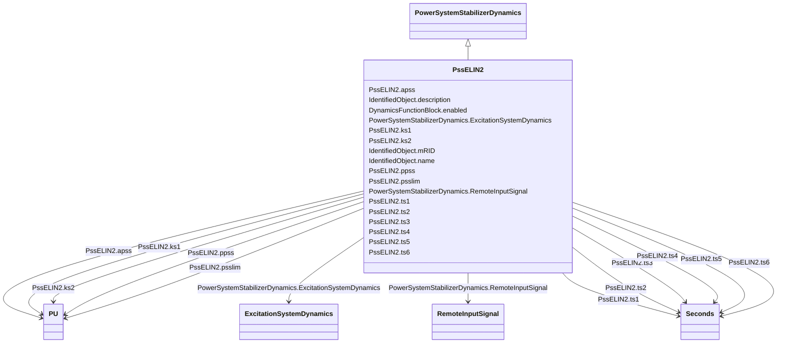

# PssELIN2

_Power system stabilizer typically associated with ExcELIN2 (though PssIEEE2B or Pss2B can also be used)._

**URI**: [cim:PssELIN2](http://iec.ch/TC57/CIM100#PssELIN2) 
**Type**: Class

## Inheritance
* [IdentifiedObject](IdentifiedObject.md)
    * [DynamicsFunctionBlock](DynamicsFunctionBlock.md)
        * [PowerSystemStabilizerDynamics](PowerSystemStabilizerDynamics.md)
            * **PssELIN2**

## Attributes

| Name | URI | Cardinality and Range | Description | Inheritance |
| ---  | --- | --- | --- | --- |
| ts1 | [cim:PssELIN2.ts1](http://iec.ch/TC57/CIM100#PssELIN2.ts1) | 1..1    [Seconds](Seconds.md)  | Time constant (<i>Ts1</i>) (&gt;= 0) | direct |
| ts2 | [cim:PssELIN2.ts2](http://iec.ch/TC57/CIM100#PssELIN2.ts2) | 1..1    [Seconds](Seconds.md)  | Time constant (<i>Ts2</i>) (&gt;= 0) | direct |
| ts3 | [cim:PssELIN2.ts3](http://iec.ch/TC57/CIM100#PssELIN2.ts3) | 1..1    [Seconds](Seconds.md)  | Time constant (<i>Ts3</i>) (&gt;= 0) | direct |
| ts4 | [cim:PssELIN2.ts4](http://iec.ch/TC57/CIM100#PssELIN2.ts4) | 1..1    [Seconds](Seconds.md)  | Time constant (<i>Ts4</i>) (&gt;= 0) | direct |
| ts5 | [cim:PssELIN2.ts5](http://iec.ch/TC57/CIM100#PssELIN2.ts5) | 1..1    [Seconds](Seconds.md)  | Time constant (<i>Ts5</i>) (&gt;= 0) | direct |
| ts6 | [cim:PssELIN2.ts6](http://iec.ch/TC57/CIM100#PssELIN2.ts6) | 1..1    [Seconds](Seconds.md)  | Time constant (<i>Ts6</i>) (&gt;= 0) | direct |
| ks1 | [cim:PssELIN2.ks1](http://iec.ch/TC57/CIM100#PssELIN2.ks1) | 1..1    [PU](PU.md)  | Gain (<i>Ks1</i>) | direct |
| ks2 | [cim:PssELIN2.ks2](http://iec.ch/TC57/CIM100#PssELIN2.ks2) | 1..1    [PU](PU.md)  | Gain (<i>Ks2</i>) | direct |
| ppss | [cim:PssELIN2.ppss](http://iec.ch/TC57/CIM100#PssELIN2.ppss) | 1..1    [PU](PU.md)  | Coefficient (<i>p_PSS</i>) (&gt;= 0 and &lt;= 4) | direct |
| apss | [cim:PssELIN2.apss](http://iec.ch/TC57/CIM100#PssELIN2.apss) | 1..1    [PU](PU.md)  | Coefficient (<i>a_PSS</i>) | direct |
| psslim | [cim:PssELIN2.psslim](http://iec.ch/TC57/CIM100#PssELIN2.psslim) | 1..1    [PU](PU.md)  | PSS limiter (<i>psslim</i>) | direct |
| RemoteInputSignal | [cim:PowerSystemStabilizerDynamics.RemoteInputSignal](http://iec.ch/TC57/CIM100#PowerSystemStabilizerDynamics.RemoteInputSignal) | 0..*    [RemoteInputSignal](RemoteInputSignal.md)  | Remote input signal used by this power system stabilizer model | [PowerSystemStabilizerDynamics](PowerSystemStabilizerDynamics.md) |
| ExcitationSystemDynamics | [cim:PowerSystemStabilizerDynamics.ExcitationSystemDynamics](http://iec.ch/TC57/CIM100#PowerSystemStabilizerDynamics.ExcitationSystemDynamics) | 1..1    [ExcitationSystemDynamics](ExcitationSystemDynamics.md)  | Excitation system model with which this power system stabilizer model is asso... | [PowerSystemStabilizerDynamics](PowerSystemStabilizerDynamics.md) |
| enabled | [cim:DynamicsFunctionBlock.enabled](http://iec.ch/TC57/CIM100#DynamicsFunctionBlock.enabled) | 1..1    boolean  | Function block used indicator | [DynamicsFunctionBlock](DynamicsFunctionBlock.md) |
| description | [cim:IdentifiedObject.description](http://iec.ch/TC57/CIM100#IdentifiedObject.description) | 0..1    string  | The description is a free human readable text describing or naming the object | [IdentifiedObject](IdentifiedObject.md) |
| mRID | [cim:IdentifiedObject.mRID](http://iec.ch/TC57/CIM100#IdentifiedObject.mRID) | 1..1    string  | Master resource identifier issued by a model authority | [IdentifiedObject](IdentifiedObject.md) |
| name | [cim:IdentifiedObject.name](http://iec.ch/TC57/CIM100#IdentifiedObject.name) | 0..1    string  | The name is any free human readable and possibly non unique text naming the o... | [IdentifiedObject](IdentifiedObject.md) |

## Identifier and Mapping Information

### Schema Source

* from schema: http://iec.ch/TC57/ns/CIM/Dynamics-EU#Package_DynamicsProfile

## Mappings

| Mapping Type | Mapped Value |
| ---  | ---  |
| self | cim:PssELIN2 |
| native | this:PssELIN2 |

