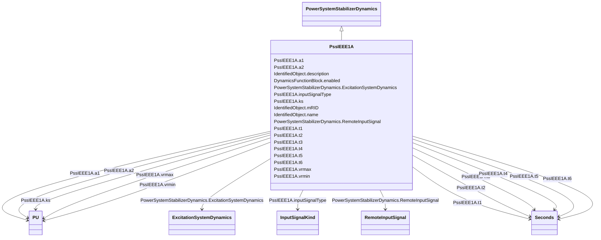

# PssIEEE1A

_IEEE 421.5-2005 type PSS1A power system stabilizer model. PSS1A is the generalized form of a PSS with a single input signal. _

_Reference: IEEE 1A 421.5-2005, 8.1._

**URI**: [cim:PssIEEE1A](http://iec.ch/TC57/CIM100#PssIEEE1A) 
**Type**: Class

## Inheritance
* [IdentifiedObject](IdentifiedObject.md)
    * [DynamicsFunctionBlock](DynamicsFunctionBlock.md)
        * [PowerSystemStabilizerDynamics](PowerSystemStabilizerDynamics.md)
            * **PssIEEE1A**

## Attributes

| Name | URI | Cardinality and Range | Description | Inheritance |
| ---  | --- | --- | --- | --- |
| inputSignalType | [cim:PssIEEE1A.inputSignalType](http://iec.ch/TC57/CIM100#PssIEEE1A.inputSignalType) | 1    [InputSignalKind](InputSignalKind.md)  | Type of input signal (rotorAngularFrequencyDeviation, generatorElectricalPowe... | direct |
| a1 | [cim:PssIEEE1A.a1](http://iec.ch/TC57/CIM100#PssIEEE1A.a1) | 1    [PU](PU.md)  | PSS signal conditioning frequency filter constant (<i>A1</i>) | direct |
| a2 | [cim:PssIEEE1A.a2](http://iec.ch/TC57/CIM100#PssIEEE1A.a2) | 1    [PU](PU.md)  | PSS signal conditioning frequency filter constant (<i>A2</i>) | direct |
| t1 | [cim:PssIEEE1A.t1](http://iec.ch/TC57/CIM100#PssIEEE1A.t1) | 1    [Seconds](Seconds.md)  | Lead/lag time constant (<i>T1</i>) (&gt;= 0) | direct |
| t2 | [cim:PssIEEE1A.t2](http://iec.ch/TC57/CIM100#PssIEEE1A.t2) | 1    [Seconds](Seconds.md)  | Lead/lag time constant (<i>T2</i>) (&gt;= 0) | direct |
| t3 | [cim:PssIEEE1A.t3](http://iec.ch/TC57/CIM100#PssIEEE1A.t3) | 1    [Seconds](Seconds.md)  | Lead/lag time constant (<i>T3</i>) (&gt;= 0) | direct |
| t4 | [cim:PssIEEE1A.t4](http://iec.ch/TC57/CIM100#PssIEEE1A.t4) | 1    [Seconds](Seconds.md)  | Lead/lag time constant (<i>T4</i>) (&gt;= 0) | direct |
| t5 | [cim:PssIEEE1A.t5](http://iec.ch/TC57/CIM100#PssIEEE1A.t5) | 1    [Seconds](Seconds.md)  | Washout time constant (<i>T5</i>) (&gt;= 0) | direct |
| t6 | [cim:PssIEEE1A.t6](http://iec.ch/TC57/CIM100#PssIEEE1A.t6) | 1    [Seconds](Seconds.md)  | Transducer time constant (<i>T6</i>) (&gt;= 0) | direct |
| ks | [cim:PssIEEE1A.ks](http://iec.ch/TC57/CIM100#PssIEEE1A.ks) | 1    [PU](PU.md)  | Stabilizer gain (<i>Ks</i>) | direct |
| vrmax | [cim:PssIEEE1A.vrmax](http://iec.ch/TC57/CIM100#PssIEEE1A.vrmax) | 1    [PU](PU.md)  | Maximum stabilizer output (<i>Vrmax</i>) (&gt; PssIEEE1A | direct |
| vrmin | [cim:PssIEEE1A.vrmin](http://iec.ch/TC57/CIM100#PssIEEE1A.vrmin) | 1    [PU](PU.md)  | Minimum stabilizer output (<i>Vrmin</i>) (&lt; PssIEEE1A | direct |
| RemoteInputSignal | [cim:PowerSystemStabilizerDynamics.RemoteInputSignal](http://iec.ch/TC57/CIM100#PowerSystemStabilizerDynamics.RemoteInputSignal) | *    [RemoteInputSignal](RemoteInputSignal.md)  | Remote input signal used by this power system stabilizer model | [PowerSystemStabilizerDynamics](PowerSystemStabilizerDynamics.md) |
| ExcitationSystemDynamics | [cim:PowerSystemStabilizerDynamics.ExcitationSystemDynamics](http://iec.ch/TC57/CIM100#PowerSystemStabilizerDynamics.ExcitationSystemDynamics) | 1    [ExcitationSystemDynamics](ExcitationSystemDynamics.md)  | Excitation system model with which this power system stabilizer model is asso... | [PowerSystemStabilizerDynamics](PowerSystemStabilizerDynamics.md) |
| enabled | [cim:DynamicsFunctionBlock.enabled](http://iec.ch/TC57/CIM100#DynamicsFunctionBlock.enabled) | 1    boolean  | Function block used indicator | [DynamicsFunctionBlock](DynamicsFunctionBlock.md) |
| description | [cim:IdentifiedObject.description](http://iec.ch/TC57/CIM100#IdentifiedObject.description) | 0..1    string  | The description is a free human readable text describing or naming the object | [IdentifiedObject](IdentifiedObject.md) |
| mRID | [cim:IdentifiedObject.mRID](http://iec.ch/TC57/CIM100#IdentifiedObject.mRID) | 1    string  | Master resource identifier issued by a model authority | [IdentifiedObject](IdentifiedObject.md) |
| name | [cim:IdentifiedObject.name](http://iec.ch/TC57/CIM100#IdentifiedObject.name) | 0..1    string  | The name is any free human readable and possibly non unique text naming the o... | [IdentifiedObject](IdentifiedObject.md) |

## Identifier and Mapping Information

### Schema Source

* from schema: http://iec.ch/TC57/ns/CIM/Dynamics-EU#Package_DynamicsProfile

## Mappings

| Mapping Type | Mapped Value |
| ---  | ---  |
| self | cim:PssIEEE1A |
| native | this:PssIEEE1A |

