# PssIEEE2B

_IEEE 421.5-2005 type PSS2B power system stabilizer model. This stabilizer model is designed to represent a variety of dual-input stabilizers, which normally use combinations of power and speed or frequency to derive the stabilizing signal._

_Reference: IEEE 2B 421.5-2005, 8.2._

**URI**: [cim:PssIEEE2B](http://iec.ch/TC57/CIM100#PssIEEE2B) 
**Type**: Class

```mermaid
 classDiagram
    class PssIEEE2B
    click PssIEEE2B href "../PssIEEE2B"
      PowerSystemStabilizerDynamics <|-- PssIEEE2B
        click PowerSystemStabilizerDynamics href "../PowerSystemStabilizerDynamics"
      
      PssIEEE2B : IdentifiedObject.description
        
      PssIEEE2B : DynamicsFunctionBlock.enabled
        
      PssIEEE2B : PowerSystemStabilizerDynamics.ExcitationSystemDynamics
        
          PssIEEE2B --> ExcitationSystemDynamics : PowerSystemStabilizerDynamics.ExcitationSystemDynamics
          click ExcitationSystemDynamics href "../ExcitationSystemDynamics"
        
      PssIEEE2B : PssIEEE2B.inputSignal1Type
        
          PssIEEE2B --> InputSignalKind : PssIEEE2B.inputSignal1Type
          click InputSignalKind href "../InputSignalKind"
        
      PssIEEE2B : PssIEEE2B.inputSignal2Type
        
          PssIEEE2B --> InputSignalKind : PssIEEE2B.inputSignal2Type
          click InputSignalKind href "../InputSignalKind"
        
      PssIEEE2B : PssIEEE2B.ks1
        
          PssIEEE2B --> PU : PssIEEE2B.ks1
          click PU href "../PU"
        
      PssIEEE2B : PssIEEE2B.ks2
        
          PssIEEE2B --> PU : PssIEEE2B.ks2
          click PU href "../PU"
        
      PssIEEE2B : PssIEEE2B.ks3
        
          PssIEEE2B --> PU : PssIEEE2B.ks3
          click PU href "../PU"
        
      PssIEEE2B : PssIEEE2B.m
        
      PssIEEE2B : IdentifiedObject.mRID
        
      PssIEEE2B : PssIEEE2B.n
        
      PssIEEE2B : IdentifiedObject.name
        
      PssIEEE2B : PowerSystemStabilizerDynamics.RemoteInputSignal
        
          PssIEEE2B --> RemoteInputSignal : PowerSystemStabilizerDynamics.RemoteInputSignal
          click RemoteInputSignal href "../RemoteInputSignal"
        
      PssIEEE2B : PssIEEE2B.t1
        
          PssIEEE2B --> Seconds : PssIEEE2B.t1
          click Seconds href "../Seconds"
        
      PssIEEE2B : PssIEEE2B.t10
        
          PssIEEE2B --> Seconds : PssIEEE2B.t10
          click Seconds href "../Seconds"
        
      PssIEEE2B : PssIEEE2B.t11
        
          PssIEEE2B --> Seconds : PssIEEE2B.t11
          click Seconds href "../Seconds"
        
      PssIEEE2B : PssIEEE2B.t2
        
          PssIEEE2B --> Seconds : PssIEEE2B.t2
          click Seconds href "../Seconds"
        
      PssIEEE2B : PssIEEE2B.t3
        
          PssIEEE2B --> Seconds : PssIEEE2B.t3
          click Seconds href "../Seconds"
        
      PssIEEE2B : PssIEEE2B.t4
        
          PssIEEE2B --> Seconds : PssIEEE2B.t4
          click Seconds href "../Seconds"
        
      PssIEEE2B : PssIEEE2B.t6
        
          PssIEEE2B --> Seconds : PssIEEE2B.t6
          click Seconds href "../Seconds"
        
      PssIEEE2B : PssIEEE2B.t7
        
          PssIEEE2B --> Seconds : PssIEEE2B.t7
          click Seconds href "../Seconds"
        
      PssIEEE2B : PssIEEE2B.t8
        
          PssIEEE2B --> Seconds : PssIEEE2B.t8
          click Seconds href "../Seconds"
        
      PssIEEE2B : PssIEEE2B.t9
        
          PssIEEE2B --> Seconds : PssIEEE2B.t9
          click Seconds href "../Seconds"
        
      PssIEEE2B : PssIEEE2B.tw1
        
          PssIEEE2B --> Seconds : PssIEEE2B.tw1
          click Seconds href "../Seconds"
        
      PssIEEE2B : PssIEEE2B.tw2
        
          PssIEEE2B --> Seconds : PssIEEE2B.tw2
          click Seconds href "../Seconds"
        
      PssIEEE2B : PssIEEE2B.tw3
        
          PssIEEE2B --> Seconds : PssIEEE2B.tw3
          click Seconds href "../Seconds"
        
      PssIEEE2B : PssIEEE2B.tw4
        
          PssIEEE2B --> Seconds : PssIEEE2B.tw4
          click Seconds href "../Seconds"
        
      PssIEEE2B : PssIEEE2B.vsi1max
        
          PssIEEE2B --> PU : PssIEEE2B.vsi1max
          click PU href "../PU"
        
      PssIEEE2B : PssIEEE2B.vsi1min
        
          PssIEEE2B --> PU : PssIEEE2B.vsi1min
          click PU href "../PU"
        
      PssIEEE2B : PssIEEE2B.vsi2max
        
          PssIEEE2B --> PU : PssIEEE2B.vsi2max
          click PU href "../PU"
        
      PssIEEE2B : PssIEEE2B.vsi2min
        
          PssIEEE2B --> PU : PssIEEE2B.vsi2min
          click PU href "../PU"
        
      PssIEEE2B : PssIEEE2B.vstmax
        
          PssIEEE2B --> PU : PssIEEE2B.vstmax
          click PU href "../PU"
        
      PssIEEE2B : PssIEEE2B.vstmin
        
          PssIEEE2B --> PU : PssIEEE2B.vstmin
          click PU href "../PU"
        
      
```

## Inheritance
* [IdentifiedObject](IdentifiedObject.md)
    * [DynamicsFunctionBlock](DynamicsFunctionBlock.md)
        * [PowerSystemStabilizerDynamics](PowerSystemStabilizerDynamics.md)
            * **PssIEEE2B**

## Attributes

| Name | URI | Cardinality and Range | Description | Inheritance |
| ---  | --- | --- | --- | --- |
| inputSignal1Type | [cim:PssIEEE2B.inputSignal1Type](http://iec.ch/TC57/CIM100#PssIEEE2B.inputSignal1Type) | 1    [InputSignalKind](InputSignalKind.md)  | Type of input signal #1 (rotorAngularFrequencyDeviation, busFrequencyDeviatio... | direct |
| inputSignal2Type | [cim:PssIEEE2B.inputSignal2Type](http://iec.ch/TC57/CIM100#PssIEEE2B.inputSignal2Type) | 1    [InputSignalKind](InputSignalKind.md)  | Type of input signal #2 (generatorElectricalPower) | direct |
| vsi1max | [cim:PssIEEE2B.vsi1max](http://iec.ch/TC57/CIM100#PssIEEE2B.vsi1max) | 1    [PU](PU.md)  | Input signal #1 maximum limit (<i>Vsi1max</i>) (&gt; PssIEEE2B | direct |
| vsi1min | [cim:PssIEEE2B.vsi1min](http://iec.ch/TC57/CIM100#PssIEEE2B.vsi1min) | 1    [PU](PU.md)  | Input signal #1 minimum limit (<i>Vsi1min</i>) (&lt; PssIEEE2B | direct |
| tw1 | [cim:PssIEEE2B.tw1](http://iec.ch/TC57/CIM100#PssIEEE2B.tw1) | 1    [Seconds](Seconds.md)  | First washout on signal #1 (<i>Tw1</i>) (&gt;= 0) | direct |
| tw2 | [cim:PssIEEE2B.tw2](http://iec.ch/TC57/CIM100#PssIEEE2B.tw2) | 1    [Seconds](Seconds.md)  | Second washout on signal #1 (<i>Tw2</i>) (&gt;= 0) | direct |
| vsi2max | [cim:PssIEEE2B.vsi2max](http://iec.ch/TC57/CIM100#PssIEEE2B.vsi2max) | 1    [PU](PU.md)  | Input signal #2 maximum limit (<i>Vsi2max</i>) (&gt; PssIEEE2B | direct |
| vsi2min | [cim:PssIEEE2B.vsi2min](http://iec.ch/TC57/CIM100#PssIEEE2B.vsi2min) | 1    [PU](PU.md)  | Input signal #2 minimum limit (<i>Vsi2min</i>) (&lt; PssIEEE2B | direct |
| tw3 | [cim:PssIEEE2B.tw3](http://iec.ch/TC57/CIM100#PssIEEE2B.tw3) | 1    [Seconds](Seconds.md)  | First washout on signal #2 (<i>Tw3</i>) (&gt;= 0) | direct |
| tw4 | [cim:PssIEEE2B.tw4](http://iec.ch/TC57/CIM100#PssIEEE2B.tw4) | 1    [Seconds](Seconds.md)  | Second washout on signal #2 (<i>Tw4</i>) (&gt;= 0) | direct |
| t1 | [cim:PssIEEE2B.t1](http://iec.ch/TC57/CIM100#PssIEEE2B.t1) | 1    [Seconds](Seconds.md)  | Lead/lag time constant (<i>T1</i>) (&gt;= 0) | direct |
| t2 | [cim:PssIEEE2B.t2](http://iec.ch/TC57/CIM100#PssIEEE2B.t2) | 1    [Seconds](Seconds.md)  | Lead/lag time constant (<i>T2</i>) (&gt;= 0) | direct |
| t3 | [cim:PssIEEE2B.t3](http://iec.ch/TC57/CIM100#PssIEEE2B.t3) | 1    [Seconds](Seconds.md)  | Lead/lag time constant (<i>T3</i>) (&gt;= 0) | direct |
| t4 | [cim:PssIEEE2B.t4](http://iec.ch/TC57/CIM100#PssIEEE2B.t4) | 1    [Seconds](Seconds.md)  | Lead/lag time constant (<i>T4</i>) (&gt;= 0) | direct |
| t6 | [cim:PssIEEE2B.t6](http://iec.ch/TC57/CIM100#PssIEEE2B.t6) | 1    [Seconds](Seconds.md)  | Time constant on signal #1 (<i>T6</i>) (&gt;= 0) | direct |
| t7 | [cim:PssIEEE2B.t7](http://iec.ch/TC57/CIM100#PssIEEE2B.t7) | 1    [Seconds](Seconds.md)  | Time constant on signal #2 (<i>T7</i>) (&gt;= 0) | direct |
| t8 | [cim:PssIEEE2B.t8](http://iec.ch/TC57/CIM100#PssIEEE2B.t8) | 1    [Seconds](Seconds.md)  | Lead of ramp tracking filter (<i>T8</i>) (&gt;= 0) | direct |
| t9 | [cim:PssIEEE2B.t9](http://iec.ch/TC57/CIM100#PssIEEE2B.t9) | 1    [Seconds](Seconds.md)  | Lag of ramp tracking filter (<i>T9</i>) (&gt;= 0) | direct |
| t10 | [cim:PssIEEE2B.t10](http://iec.ch/TC57/CIM100#PssIEEE2B.t10) | 1    [Seconds](Seconds.md)  | Lead/lag time constant (<i>T10</i>) (&gt;= 0) | direct |
| t11 | [cim:PssIEEE2B.t11](http://iec.ch/TC57/CIM100#PssIEEE2B.t11) | 1    [Seconds](Seconds.md)  | Lead/lag time constant (<i>T11</i>) (&gt;= 0) | direct |
| ks1 | [cim:PssIEEE2B.ks1](http://iec.ch/TC57/CIM100#PssIEEE2B.ks1) | 1    [PU](PU.md)  | Stabilizer gain (<i>Ks1</i>) | direct |
| ks2 | [cim:PssIEEE2B.ks2](http://iec.ch/TC57/CIM100#PssIEEE2B.ks2) | 1    [PU](PU.md)  | Gain on signal #2 (<i>Ks2</i>) | direct |
| ks3 | [cim:PssIEEE2B.ks3](http://iec.ch/TC57/CIM100#PssIEEE2B.ks3) | 1    [PU](PU.md)  | Gain on signal #2 input before ramp-tracking filter (<i>Ks3</i>) | direct |
| n | [cim:PssIEEE2B.n](http://iec.ch/TC57/CIM100#PssIEEE2B.n) | 1    integer  | Order of ramp tracking filter (<i>N</i>) | direct |
| m | [cim:PssIEEE2B.m](http://iec.ch/TC57/CIM100#PssIEEE2B.m) | 1    integer  | Denominator order of ramp tracking filter (<i>M</i>) | direct |
| vstmax | [cim:PssIEEE2B.vstmax](http://iec.ch/TC57/CIM100#PssIEEE2B.vstmax) | 1    [PU](PU.md)  | Stabilizer output maximum limit (<i>Vstmax</i>) (&gt; PssIEEE2B | direct |
| vstmin | [cim:PssIEEE2B.vstmin](http://iec.ch/TC57/CIM100#PssIEEE2B.vstmin) | 1    [PU](PU.md)  | Stabilizer output minimum limit (<i>Vstmin</i>) (&lt; PssIEEE2B | direct |
| RemoteInputSignal | [cim:PowerSystemStabilizerDynamics.RemoteInputSignal](http://iec.ch/TC57/CIM100#PowerSystemStabilizerDynamics.RemoteInputSignal) | *    [RemoteInputSignal](RemoteInputSignal.md)  | Remote input signal used by this power system stabilizer model | [PowerSystemStabilizerDynamics](PowerSystemStabilizerDynamics.md) |
| ExcitationSystemDynamics | [cim:PowerSystemStabilizerDynamics.ExcitationSystemDynamics](http://iec.ch/TC57/CIM100#PowerSystemStabilizerDynamics.ExcitationSystemDynamics) | 1    [ExcitationSystemDynamics](ExcitationSystemDynamics.md)  | Excitation system model with which this power system stabilizer model is asso... | [PowerSystemStabilizerDynamics](PowerSystemStabilizerDynamics.md) |
| enabled | [cim:DynamicsFunctionBlock.enabled](http://iec.ch/TC57/CIM100#DynamicsFunctionBlock.enabled) | 1    boolean  | Function block used indicator | [DynamicsFunctionBlock](DynamicsFunctionBlock.md) |
| description | [cim:IdentifiedObject.description](http://iec.ch/TC57/CIM100#IdentifiedObject.description) | 0..1    string  | The description is a free human readable text describing or naming the object | [IdentifiedObject](IdentifiedObject.md) |
| mRID | [cim:IdentifiedObject.mRID](http://iec.ch/TC57/CIM100#IdentifiedObject.mRID) | 1    string  | Master resource identifier issued by a model authority | [IdentifiedObject](IdentifiedObject.md) |
| name | [cim:IdentifiedObject.name](http://iec.ch/TC57/CIM100#IdentifiedObject.name) | 0..1    string  | The name is any free human readable and possibly non unique text naming the o... | [IdentifiedObject](IdentifiedObject.md) |

## Identifier and Mapping Information

### Schema Source

* from schema: http://iec.ch/TC57/ns/CIM/Dynamics-EU#Package_DynamicsProfile

## Mappings

| Mapping Type | Mapped Value |
| ---  | ---  |
| self | cim:PssIEEE2B |
| native | this:PssIEEE2B |

