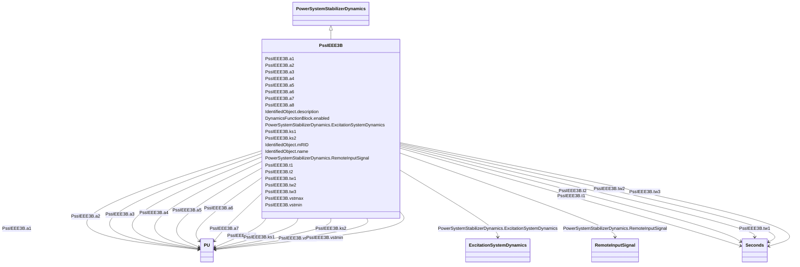

# PssIEEE3B

_IEEE 421.5-2005 type PSS3B power system stabilizer model. The PSS model PSS3B has dual inputs of electrical power and rotor angular frequency deviation. The signals are used to derive an equivalent mechanical power signal._

_This model has 2 input signals. They have the following fixed types (expressed in terms of InputSignalKind values): the first one is of rotorAngleFrequencyDeviation type and the second one is of generatorElectricalPower type._

_Reference: IEEE 3B 421.5-2005, 8.3._

**URI**: [cim:PssIEEE3B](http://iec.ch/TC57/CIM100#PssIEEE3B) 
**Type**: Class

## Inheritance
* [IdentifiedObject](IdentifiedObject.md)
    * [DynamicsFunctionBlock](DynamicsFunctionBlock.md)
        * [PowerSystemStabilizerDynamics](PowerSystemStabilizerDynamics.md)
            * **PssIEEE3B**

## Attributes

| Name | URI | Cardinality and Range | Description | Inheritance |
| ---  | --- | --- | --- | --- |
| t1 | [cim:PssIEEE3B.t1](http://iec.ch/TC57/CIM100#PssIEEE3B.t1) | 1..1    [Seconds](Seconds.md)  | Transducer time constant (<i>T1</i>) (&gt;= 0) | direct |
| t2 | [cim:PssIEEE3B.t2](http://iec.ch/TC57/CIM100#PssIEEE3B.t2) | 1..1    [Seconds](Seconds.md)  | Transducer time constant (<i>T2</i>) (&gt;= 0) | direct |
| tw1 | [cim:PssIEEE3B.tw1](http://iec.ch/TC57/CIM100#PssIEEE3B.tw1) | 1..1    [Seconds](Seconds.md)  | Washout time constant (<i>Tw1</i>) (&gt;= 0) | direct |
| tw2 | [cim:PssIEEE3B.tw2](http://iec.ch/TC57/CIM100#PssIEEE3B.tw2) | 1..1    [Seconds](Seconds.md)  | Washout time constant (<i>Tw2</i>) (&gt;= 0) | direct |
| tw3 | [cim:PssIEEE3B.tw3](http://iec.ch/TC57/CIM100#PssIEEE3B.tw3) | 1..1    [Seconds](Seconds.md)  | Washout time constant (<i>Tw3</i>) (&gt;= 0) | direct |
| ks1 | [cim:PssIEEE3B.ks1](http://iec.ch/TC57/CIM100#PssIEEE3B.ks1) | 1..1    [PU](PU.md)  | Gain on signal # 1 (<i>Ks1</i>) | direct |
| ks2 | [cim:PssIEEE3B.ks2](http://iec.ch/TC57/CIM100#PssIEEE3B.ks2) | 1..1    [PU](PU.md)  | Gain on signal # 2 (<i>Ks2</i>) | direct |
| a1 | [cim:PssIEEE3B.a1](http://iec.ch/TC57/CIM100#PssIEEE3B.a1) | 1..1    [PU](PU.md)  | Notch filter parameter (<i>A1</i>) | direct |
| a2 | [cim:PssIEEE3B.a2](http://iec.ch/TC57/CIM100#PssIEEE3B.a2) | 1..1    [PU](PU.md)  | Notch filter parameter (<i>A2</i>) | direct |
| a3 | [cim:PssIEEE3B.a3](http://iec.ch/TC57/CIM100#PssIEEE3B.a3) | 1..1    [PU](PU.md)  | Notch filter parameter (<i>A3</i>) | direct |
| a4 | [cim:PssIEEE3B.a4](http://iec.ch/TC57/CIM100#PssIEEE3B.a4) | 1..1    [PU](PU.md)  | Notch filter parameter (<i>A4</i>) | direct |
| a5 | [cim:PssIEEE3B.a5](http://iec.ch/TC57/CIM100#PssIEEE3B.a5) | 1..1    [PU](PU.md)  | Notch filter parameter (<i>A5</i>) | direct |
| a6 | [cim:PssIEEE3B.a6](http://iec.ch/TC57/CIM100#PssIEEE3B.a6) | 1..1    [PU](PU.md)  | Notch filter parameter (<i>A6</i>) | direct |
| a7 | [cim:PssIEEE3B.a7](http://iec.ch/TC57/CIM100#PssIEEE3B.a7) | 1..1    [PU](PU.md)  | Notch filter parameter (<i>A7</i>) | direct |
| a8 | [cim:PssIEEE3B.a8](http://iec.ch/TC57/CIM100#PssIEEE3B.a8) | 1..1    [PU](PU.md)  | Notch filter parameter (<i>A8</i>) | direct |
| vstmax | [cim:PssIEEE3B.vstmax](http://iec.ch/TC57/CIM100#PssIEEE3B.vstmax) | 1..1    [PU](PU.md)  | Stabilizer output maximum limit (<i>Vstmax</i>) (&gt; PssIEEE3B | direct |
| vstmin | [cim:PssIEEE3B.vstmin](http://iec.ch/TC57/CIM100#PssIEEE3B.vstmin) | 1..1    [PU](PU.md)  | Stabilizer output minimum limit (<i>Vstmin</i>) (&lt; PssIEEE3B | direct |
| RemoteInputSignal | [cim:PowerSystemStabilizerDynamics.RemoteInputSignal](http://iec.ch/TC57/CIM100#PowerSystemStabilizerDynamics.RemoteInputSignal) | 0..*    [RemoteInputSignal](RemoteInputSignal.md)  | Remote input signal used by this power system stabilizer model | [PowerSystemStabilizerDynamics](PowerSystemStabilizerDynamics.md) |
| ExcitationSystemDynamics | [cim:PowerSystemStabilizerDynamics.ExcitationSystemDynamics](http://iec.ch/TC57/CIM100#PowerSystemStabilizerDynamics.ExcitationSystemDynamics) | 1..1    [ExcitationSystemDynamics](ExcitationSystemDynamics.md)  | Excitation system model with which this power system stabilizer model is asso... | [PowerSystemStabilizerDynamics](PowerSystemStabilizerDynamics.md) |
| enabled | [cim:DynamicsFunctionBlock.enabled](http://iec.ch/TC57/CIM100#DynamicsFunctionBlock.enabled) | 1..1    boolean  | Function block used indicator | [DynamicsFunctionBlock](DynamicsFunctionBlock.md) |
| description | [cim:IdentifiedObject.description](http://iec.ch/TC57/CIM100#IdentifiedObject.description) | 0..1    string  | The description is a free human readable text describing or naming the object | [IdentifiedObject](IdentifiedObject.md) |
| mRID | [cim:IdentifiedObject.mRID](http://iec.ch/TC57/CIM100#IdentifiedObject.mRID) | 1..1    string  | Master resource identifier issued by a model authority | [IdentifiedObject](IdentifiedObject.md) |
| name | [cim:IdentifiedObject.name](http://iec.ch/TC57/CIM100#IdentifiedObject.name) | 0..1    string  | The name is any free human readable and possibly non unique text naming the o... | [IdentifiedObject](IdentifiedObject.md) |

## Identifier and Mapping Information

### Schema Source

* from schema: http://iec.ch/TC57/ns/CIM/Dynamics-EU#Package_DynamicsProfile

## Mappings

| Mapping Type | Mapped Value |
| ---  | ---  |
| self | cim:PssIEEE3B |
| native | this:PssIEEE3B |

